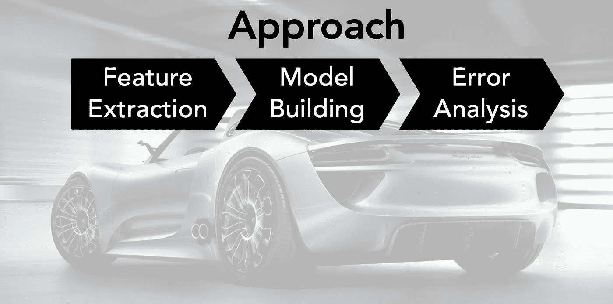
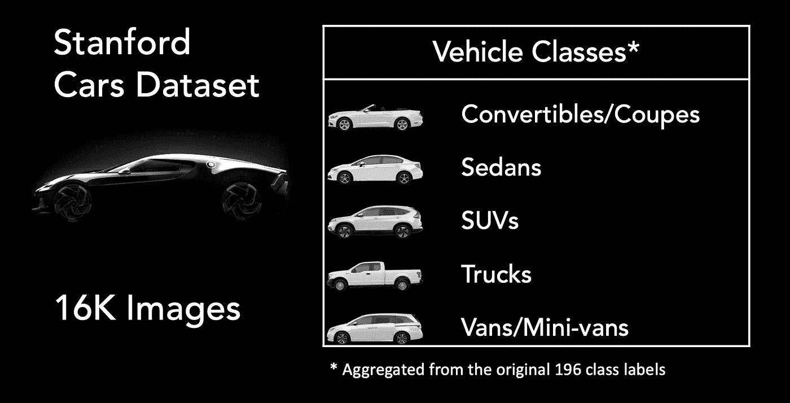
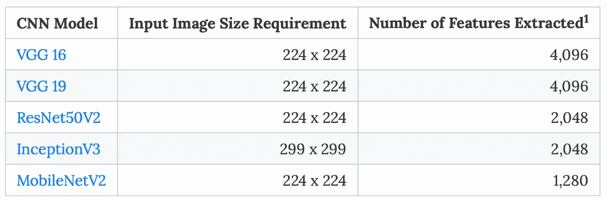
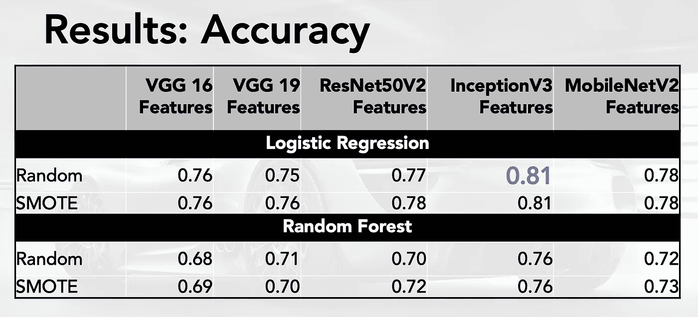
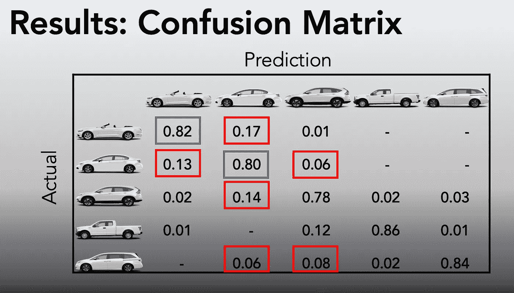
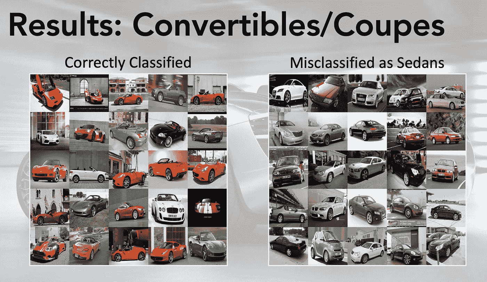
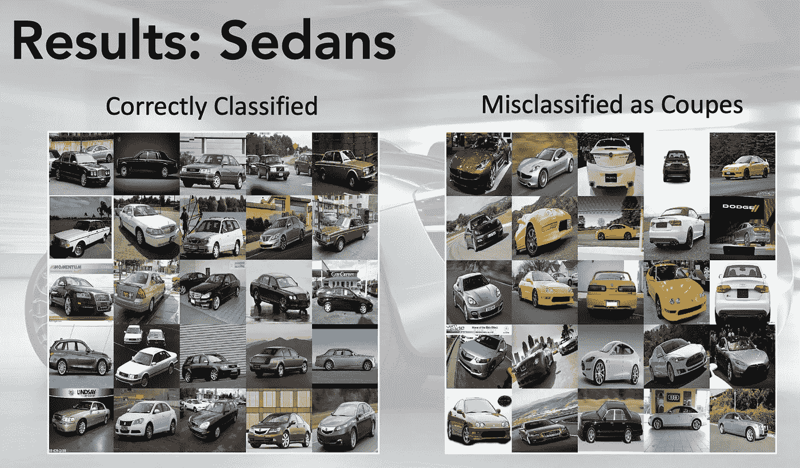

# 利用预训练神经网络提取的特征进行汽车图像分类

> 原文：<https://towardsdatascience.com/classifying-car-images-using-features-extracted-from-pre-trained-neural-networks-39692e445a14?source=collection_archive---------10----------------------->

## 那是克尔维特吗？

[Source](https://www.caricos.com/cars/m/mclaren/2018_mclaren_570s_spider/images/100.html)

# 介绍

根据 Cox Automotive 发布的 [2018 二手车市场报告&展望](https://www.coxautoinc.com/learning-center/2018-ucmro/)显示，去年美国售出 4000 万辆二手车。这约占总销量的 70%。这些销售中的很大一部分已经在购买的各个阶段使用了在线资源:搜索、资格预审、申请和最终购买。汽车购买者的热门网站包括 AutoTrader.com，凯利蓝皮书，Cars.com，Carvana.com。

考克斯汽车公司的报告指出，大多数市场领导者和硅谷的初创公司推测，汽车销售将会把**完全转移到网上零售。这可能是一个极端的猜测，但这些市场领导者对在网上买车时提供更好的用户体验，以及在用户搜索汽车时提供更好的推荐系统感兴趣。像 Craigslist、Shift、易贝汽车等点对点销售平台也对更好的欺诈检测和用户发帖监控感兴趣。**

汽车图像分类系统可以解决这些业务问题:

1.  点对点销售平台上发布的二手车图片的真相——这些图片真的是他们指定的车吗？多张外景图片代表同一辆车吗？
2.  基于用户上传的图像组织网页显示
3.  推荐库存中外观和价格相似的替代汽车

此外，一个简单的汽车分类系统可以帮助识别对自动驾驶汽车的 3D 对象检测很重要的细粒度特征。

# 方法

用于该分析的方法具有三个阶段:特征提取阶段、模型建立阶段和模型评估/误差分析阶段。

*Figure 1: Approach Used for the Analysis*

[斯坦福的汽车图像数据集](https://ai.stanford.edu/~jkrause/cars/car_dataset.html)被用于这项分析。该数据集由总共 16，185 幅图像(列车组+测试)组成，根据汽车的品牌/型号/年份标记了 196 个类别。这些图像有不同的尺寸和分辨率。在此分析中，数据集中的 196 个图像标签被合并为五种车辆类型，如下图所示。尽管这些代表了车辆类型的“粗略”合并，但它们被证明更易于管理，并且足以完成图像分类任务。

*Figure 2: Vehicle Classes Used in the Analysis*

## 特征抽出

每张汽车图像的特征都是从深度学习卷积神经网络(CNN)中提取的，权重是在 [ImageNet](http://image-net.org/index) 数据集上预先训练的。这些 CNN 的创建者免费提供这些权重，建模平台 Keras 提供了对这些网络架构和权重的一站式访问。总体而言，如下图所示，五个 CNN 用于提取特征，并分别用于分类任务，以比较哪个深度学习架构表现最好。提取的特征来自最终 softmax 层之上的第一个完全连接的隐藏层。

*Figure 3: Vehicle Classes Used in the Analysis (*¹ *Features were extracted from the fully connected hidden layer below the final softmax layer)*

## 模型结构

在模型构建阶段执行的第一步是降低所提取特征的维度。这一步有助于将特征的尺寸控制在可管理的范围内，并提高迭代模型构建步骤的速度。使用主成分分析(PCA)进行降维，系统搜索导致使用 500 个特征的降维，这捕获了 5 个 CNN 中大约 85-90%的特征差异。

原始数据集大约有 50–50%的训练测试分割。在此分析中，这些测试被组合在一起，并使用了 80–20%的训练测试分割。建立训练测试集，以保持类别分布。

在这一阶段的过程中采用了许多分类方法。这些包括:逻辑回归、随机森林、具有多项式核的支持向量机、XGBoost 和浅层神经网络(来自 sklearn 的多层感知器分类器)。

合并到五个类别后的数据集具有类别不平衡，货车代表约 6%的数据，而其他极端敞篷车/轿跑车和轿车各代表约 32%的数据。为了解决这种类别不平衡，上述分类方法与过采样技术重复:随机过采样和合成少数过采样技术(SMOTE)。

此外，还对堆叠分类器进行了测试，以查看组合最佳逻辑回归和随机森林模型的结果是否会比单独使用其中任何一个模型产生更好的结果。

## 模型结果和误差分析

为了比较模型性能，考虑了多个指标。但是在几次迭代之后，精确度被认为是评估模型性能的一个足够的度量。选择任何其他指标(比如 F1 分数)都会得出类似的结论。通过检查错误分类的图像并探索这些错误分类中的任何相似性，进行了详细的误差分析。

# 结果

最佳性能模型的结果如下图所示。如下所示，使用从 InceptionV3 中提取的特征的模型通常表现最佳，逻辑回归比随机森林的精确度略高。使用 InceptionV3 特征、L2 正则化逻辑回归和随机过采样技术的模型被选为本次分析的*首选模型*。

*Figure 4: Comparison of Model Accuracy for Select Runs*

首选模型的混淆矩阵如下图所示:

*Figure 5: Confusion Matrix for the Preferred Model(InceptionV3 Features + Logistic Regression)*

除了跟踪模型的准确性之外，还进行了详细的误差分析，以评估模型表现不佳的地方。这种误差分析对于执行类别标签的质量检查(QC 检查)、识别模型“盲点”和未来改进至关重要。

*Figure 6: Error Analysis of Convertibles/Coupes for for Preferred Model*

*Figure 7: Error Analysis of Sedans for the Preferred Model*

如上面的图 6 和图 7 所示，该模型似乎选择颜色作为分类特征。正确识别的敞篷车/轿跑车色彩丰富，而那些被错误分类为轿车的颜色就不那么丰富了。同样，如图 7 所示，被错误归类为敞篷车/双门轿车的轿车比被正确归类的轿车更加丰富多彩。在大多数情况下，这是一个令人鼓舞的结果，因为这将挑选特定汽车品牌/型号的颜色，但颜色的权重高于代表形状和尺寸的特征的权重。

# 结论

上述图像分类分析的主要结论是:

1.  使用预先训练的 CNN 特征建立分类模型的原型是非常有效的，并且比从零开始完全建立深度神经网络更容易。
2.  误差分析是非常有用的，它提供了关于如何使用模型的见解。

# 参考

1.  [斯坦福汽车数据集](https://ai.stanford.edu/~jkrause/cars/car_dataset.html)
2.  [ImageNet 数据集](http://image-net.org/index)
3.  [Keras 预训练模型](https://keras.io/applications/)
4.  [2018 二手车市场报告&展望](https://www.coxautoinc.com/learning-center/2018-ucmro/)

## **GitHub 回购**:

 [## mlBhanuYerra/Metis_prj3

### 此时您不能执行该操作。您已使用另一个标签页或窗口登录。您已在另一个选项卡中注销，或者…

github.com](https://github.com/mlBhanuYerra/Metis_prj3/tree/master/Code) 

**特征提取**:[extract _ features . py](https://github.com/mlBhanuYerra/Metis_prj3/blob/master/Code/extract_features.py)

**模型构建**:[3 _ finalmodelsruns . ipynb](https://github.com/mlBhanuYerra/Metis_prj3/blob/master/Code/3_FinalModelsRuns.ipynb)

**错误分析**:[3 _ Results _ presentation . ipynb](https://github.com/mlBhanuYerra/Metis_prj3/blob/master/Code/3_Results_Presentation.ipynb)

*最初发布于*[*https://mlbhanuyerra . github . io*](https://mlbhanuyerra.github.io/2019-10-31-ClassifyingCarImagesByVehileType/)*。*

GitHub 回购:

[https://github.com/mlBhanuYerra/Metis_prj3/tree/master/Code](https://github.com/mlBhanuYerra/Metis_prj3/tree/master/Code)