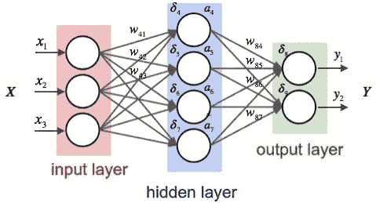
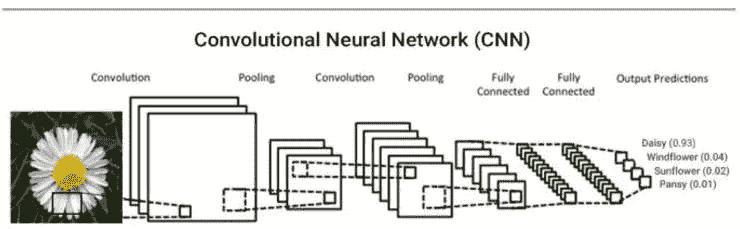
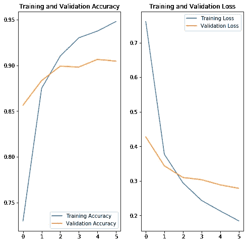
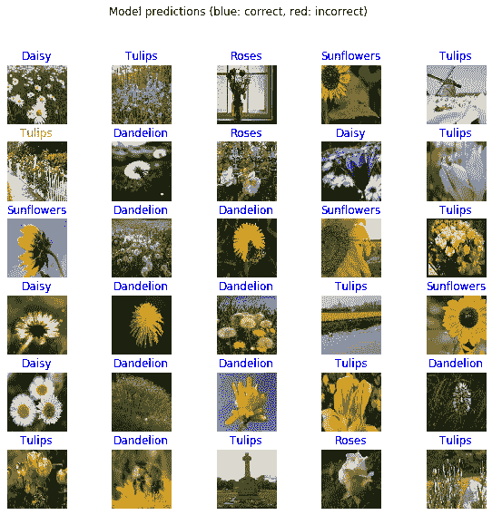

# 教电脑看东西

> 原文：<https://towardsdatascience.com/classifying-flowers-with-cnns-and-transfer-learning-a550bde41b14?source=collection_archive---------40----------------------->

## 基于细胞神经网络和迁移学习的花卉分类


Image Credit: Lachlan Gowen

如果我问你上图是什么类型的花，你可能会知道是向日葵。但是如果我问一台电脑同样的问题呢？如果它回答正确，不是很令人印象深刻吗？值得注意的是，计算机不仅可以被训练分类向日葵，还可以分类许多其他的花。而训练计算机的人甚至不需要知道什么是向日葵！

# **魔法的秘密**:卷积神经网络

为了识别花的类型，我开发了一个卷积神经网络(CNN)，可以对蒲公英、雏菊、郁金香、向日葵和玫瑰进行分类。查看完整的代码[这里](https://colab.research.google.com/drive/1LU5yDNRap83_tpuML_o5q-8_9ziHKkdU)

什么是神经网络？**人工神经网络**模仿人脑的生物神经网络，可以根据过去数据中识别的模式进行预测。这些网络有三种类型的层:提供初始数据的输入层，使用权重和偏差进行计算的隐藏层，以及应用激活函数给出最终结果的输出层。点击阅读关于神经网络[的更深入的描述。](/everything-you-need-to-know-about-neural-networks-and-backpropagation-machine-learning-made-easy-e5285bc2be3a)



A neural network visualized

**卷积神经网络**是一种神经网络，通常包括卷积层和最大池层。卷积就是对构成输入图像的像素集合应用滤镜。这导致激活。这种过滤器的重复应用产生了一种称为特征图的激活图，它本质上告诉计算机关于图像的信息。卷积层之后是最大池层。在 max-pooling 层中，图像上的过滤器检查每个部分中的最大像素值(部分的大小由程序员指定)，然后使用最大像素值创建一个新的更小的图像。这些较小的图像有助于计算机更快地运行模型。查看这个[视频](https://www.youtube.com/watch?v=YRhxdVk_sIs)了解 CNN 更深入的描述



当卷积层和最大池层连接到神经网络的输入和输出层时，该模型能够使用过去的标记数据来预测未来图像包含的内容。现在我们已经了解了 CNN 是什么，让我们来看看建立一个 CNN 的步骤。

# 收集数据

我们可以使用 Python 和 TensorFlow 库对这个项目进行编码。TensorFlow 数据集中已经提供了花卉数据集(包含 5 类花卉的标记图像),因此可以简单地从那里下载。然而，数据集在被传递到模型中之前必须被细化。我们将 70%的数据分成训练集，其余 30%的数据分成验证集。训练集是模型用来拟合分类器参数的一组示例，验证集用于进一步调整这些参数，以便分类器可以对以前没有见过的数据进行处理。由于该数据集的图像大小不同，我们将所有图像的大小调整为标准大小。

# 将学习转移到构建模型

收集数据后，我们可以开始训练我们的模型。**迁移学习**是重用一个已经训练好的模型的部分，改变模型最后一层的过程；最后一层然后在 flowers 数据集上重新训练，以给出我们想要的输出。实施迁移学习是因为它可以提高我们模型的准确性。使用 MobileNet v2 模型并且只改变最后一层使得实际模型的代码非常短。

```
URL = 'https://tfhub.dev/google/tf2preview/mobilenet_v2/feature_vector/4'feature_extractor = hub.KerasLayer(URL, input_shape = (IMAGE_RES, IMAGE_RES, 3))feature_extractor.trainable = Falsemodel = tf.keras.Sequential([feature_extractor, layers.Dense(num_classes, activation='softmax')])
```

# 培训模式

在训练模型之后，我们可以绘制它的准确性和损失，以了解它的表现。图表上的 x 轴表示历元数(模型遍历整个训练集并更新权重的次数)。



The model reaches a 90% accuracy on the validation set!

# 做预测

让我们来看看通过模型运行图像批处理后的结果！



如您所见，由于迁移学习和 CNN 架构的原因，该模型在测试集上表现非常好。

那么这到底有什么用呢？虽然给花分类可能只对植物学家有帮助，但 CNN 可以有拯救生命的**应用，例如从核磁共振成像中检测肺炎，并使无人驾驶汽车成为现实。**

**先别走**！

我是 Roshan，16 岁，对人工智能充满热情，尤其是它在金融方面的应用。如果你喜欢读这篇文章，可以看看我的其他文章，比如[“用人工智能对抗财务欺诈”](/fighting-financial-fraud-with-artificial-intelligence-f2a6bcaf131e)，在那里我描述了我如何使用自动编码器来检测会计分录异常。

通过 LinkedIn[联系我](https://www.linkedin.com/in/roshan-adusumilli-96b104194/)