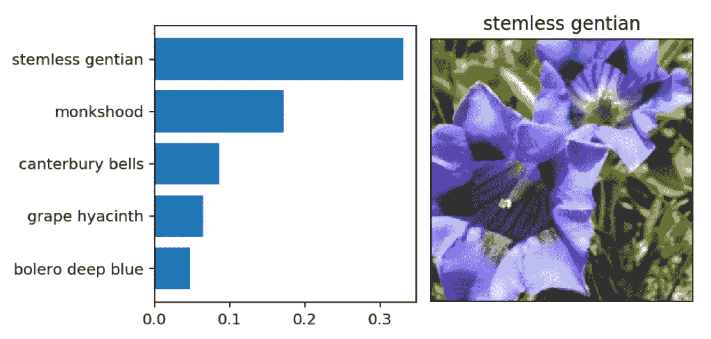

# 基于迁移学习的花卉分类

> 原文：<https://towardsdatascience.com/classifying-flowers-with-transfer-learning-5e17925a1f59?source=collection_archive---------17----------------------->

人工智能在英国花卉分类中的应用

[Dlanor S](https://unsplash.com/@dlanor_s) ([https://unsplash.com/photos/vjDbHCjHlEY](https://unsplash.com/photos/vjDbHCjHlEY))

[**迁移学习**](https://machinelearningmastery.com/transfer-learning-for-deep-learning/) 是一种机器学习技术，旨在使用来自先前训练的模型的知识来帮助改善目标值的预测。有趣的是，之前的分类器可能是用不同的集合训练的，最初是试图解决不同的任务。

在这篇文章中，我将探索一些关于**深度学习**和**迁移学习**的概念，以便预测英国的花卉种类。这篇文章是基于我为毕业于 Udacity 的数据科学家 Nanodegree 而开发的一个项目而创建的，可以通过我的[**GitHub**](https://github.com/GiulioCMSanto/classifying_flowers_with_transfer_learning)**资源库访问该项目。**

## **关于数据的一点点**

**本项目中使用的数据是从牛津大学的视觉几何小组中提取的，可以在此处 访问 [**。**](http://www.robots.ox.ac.uk/~vgg/data/flowers/102/index.html)**

**该数据包含一个关于英国常见花卉类别的 **102 类别**数据集。正如原始资料中所解释的，每一种花的种类由 40 到 258 张图片组成。**

## **深度学习框架**

**深度学习被构建成所谓的神经网络。一个简单的网络基本上由经过加权并通过激活函数的输入组成。这个简单的模式通常被称为**单元**，可以如下图所示显示。**

****

**Neural Network Unit**

**当单元被连接起来创建**层**时，这个模式变得非常强大。**

**激活函数允许网络呈现非线性特性。一些最常见的激活功能是**s 形**、**、**、**整流器(ReLu)** 和**双曲正切。****

****

**Activation Functions ([source](/complete-guide-of-activation-functions-34076e95d044))**

**简单地说，像图中这样的**单元**的输出可以计算为ŷ=σ( **W** ⋅ **x** +b)。这就是所谓的**前馈**传递。该输出是一个预测，可以通过**误差(损失)函数**与真实目标 y 进行比较。向后运行前馈操作**以将计算的误差传播到每个权重的过程被称为**反向传播**。****

## **迁移学习**

**迁移学习是使用为特定任务开发的模型作为不同任务中模型的起点的能力。粗略地说，我们可以使用预训练神经网络的输出作为我们自己网络的特征，我们需要做的就是训练我们自己的层。**

****

****PyTorch** 是基于 Torch 库的开源机器学习库，广泛用于计算机视觉和 NLP(自然语言处理)。**

**PyTorch 附带了 **torchvision** 包，其中包含流行的数据集、模型架构和计算机视觉的常见图像转换。此外，如[文档](https://pytorch.org/docs/stable/torchvision/index.html)中所解释的，**模型子包**包含用于处理不同任务的模型定义，包括:图像分类、逐像素语义分割、对象检测、实例分割、人物关键点检测和视频分类。**

**在这个项目中，我将使用 **vgg11、vgg13** 和 **vgg16** 网络，它们都由 [**非常深的卷积网络组成，用于大规模图像识别。**](https://arxiv.org/abs/1409.1556)**

## **该项目**

**该项目包括训练一个图像分类器来识别不同种类的花。此外，分类器将以应用方式进行转换，这意味着可以在终端中运行代码，用训练模型对给定图像进行预测。你可以关注我的 [**GitHub**](https://github.com/GiulioCMSanto/classifying_flowers_with_transfer_learning) 资源库中的项目。**

**让我们来看一些我们想要预测的花的例子:**

****

**Example of Flowers to be Predicted**

**数据集分为三部分:**训练**、**验证**和**测试**。在这些图像中应用了一些变换，例如**随机缩放**、**裁剪**和**翻转**。这有助于网络泛化，从而提高性能。此外，根据预训练网络的要求，图像被调整为 **224x224** 像素**。你可以在下面看到一个转换的例子。****

**如果我们加载一个预先训练好的 [vgg16](https://pytorch.org/docs/stable/torchvision/models.html) ,我们会看到类似这样的内容:**

****

**请注意，预训练网络被视为**功能**。我们需要做的就是建立我们自己的神经网络，取代预训练模型的*(分类器)*部分。因此，利用我们自己的网络，利用 **vgg16** 提供的*(特征)*部分，利用我们自己的花朵图像，我们可以训练网络的*(分类器)*部分来构建我们的模型。**

## **构建网络**

**将取代预训练网络的*(分类器)*部分的神经网络可以通过一个简单的类轻松完成，如下所示。**

****

**请注意，在这个类中使用了所谓的**辍学**。dropout 的概念非常简单:在神经网络的每次迭代中，我们将随机删除一定比例的节点，这对我们减少过度拟合有很大帮助！**

## **训练网络**

**网络培训将包括以下步骤:**

*   **在网络中执行**前馈通道**并计算 y 的预测值**
*   **预测和真实标签必须插入损失函数中(为此，我将使用 NLLLoss 负对数似然损失)。**
*   **基于损失函数，执行反向传播传递以将误差传播到其他节点。**
*   **通过优化器重新计算权重(为此我将使用 Adam 优化器)。**
*   **计算交叉验证结果(损失和准确度)以监控结果。**
*   **重复整个过程 N 个周期！**

**下面我展示了一个 4 代执行的例子。**

****

**我们可以看到，损失函数降低，而验证数据的准确性显著提高！**

## **保存模型**

**一旦模型被训练，我们需要保存它来进行预测。在此步骤中，必须完成以下步骤:**

*   **保存类到索引的映射，以及类别名称，这样我们可以跟踪预测的花的名称；**
*   **使用关于模型的信息(如网络输入大小)创建模型检查点。网络输出大小(在这种情况下是 102，这是不同花的数量)；隐藏的层；辍学率等等。**

****

## **做预测**

**做预测仍然需要一些编码！**

**我们首先需要以与处理训练数据相同的方式转换每个输入图像，这可以通过特定于该任务的函数来完成:**

****

**最后，这个过程非常简单:一旦我们处理了输入图像，我们就可以加载我们训练过的模型并进行一次**向前传递**。然后，我们从 102 个类中选择最有可能的结果类，并将其索引映射到相应的花。就这些了！预测的示例显示在下面的 top 5 预测中。**

****

**Prediction Example**

**在这种情况下，最有可能的类是**无茎龙胆**！**

## **创建应用程序**

**上述概念在类和函数中被模块化，允许人们通过终端调用模型进行预测。下面显示了如何使用该应用程序的一些示例。**

****训练模型:****

**为了训练模型，应该给出图像的输入路径以及可选参数，例如要使用的预训练模型(vgg11、vgg13 或 vgg16)、是否使用 GPU、期望的学习速率以及隐藏层的大小。**

*   **python train.py '。/花**
*   **python train.py '。/flowers' — save_dir '。/'**
*   **python train.py '。/flowers—arch ' vgg 11 '**
*   **python train.py '。/flowers' -l 0.005 -e 2 -a 'vgg13 '**
*   **python train.py '。/flowers '-l 0.005-e 2-a ' vgg 16 '—GPU**
*   **python train.py '。'/flowers '—learning _ rate 0.01—hidden _ units 2048 1024—epochs 20—GPU**

****预测花朵****

**为了进行预测，应该给出要预测的图像的输入路径和训练模型的路径(检查点)。而且，一个*。json* 文件与每个类(category)对应的花名可以作为参数传递。**

*   **python predict.py。/flowers/test/15/image _ 06351 . jpg ' ' check point . PTH '**
*   **python predict.py。/flowers/test/15/image _ 06351 . jpg ' ' check point . PTH '—category _ names cat _ to _ name . JSON**
*   **python predict.py。/flowers/test/15/image _ 06351 . jpg ' ' check point . PTH '—category _ names cat _ to _ name . JSON—top _ k 3**
*   **python predict.py。/flowers/test/15/image _ 06351 . jpg ' ' check point . PTH '—category _ names cat _ to _ name . JSON—top _ k 5—GPU**

## **结论**

**我们首先描述了什么是迁移学习，以及它与深度学习的关系。然后我们明白，可以使用一个预先训练好的网络，它是为一个特定的目的而制作的，因为**的特点是**用于训练一个不同的神经网络，具有不同的目的。**

**这些概念然后被用来预测在英国发现的不同种类的花。所获得的函数和类被模块化，以便创建能够训练神经网络并对给定输入图像进行预测的完整应用。**