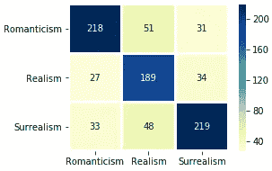
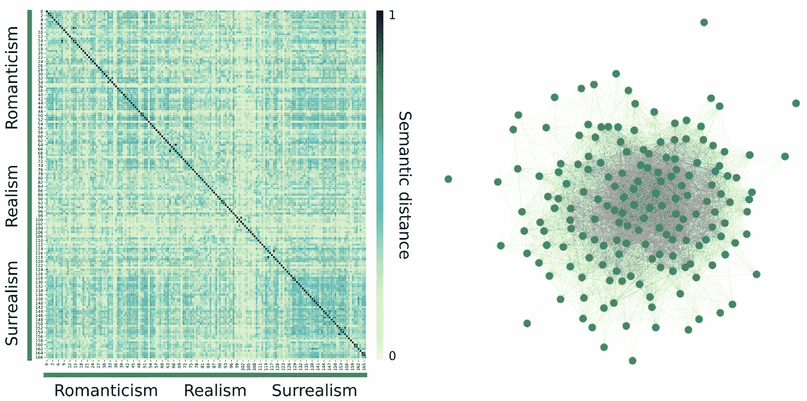

# 通过机器学习分类文学运动

> 原文：<https://towardsdatascience.com/classifying-literary-movements-through-machine-learning-ea49cb4339c1?source=collection_archive---------34----------------------->


Photo by [Dmitrij Paskevic](https://unsplash.com/@zeak)

谁不喜欢图书馆和书架？他们储存知识的对象和所有故事的大门。负责订购书籍的是图书馆员，他们经过多年的培训，知道人们阅读的是什么类型的文本，因此知道在哪里存放它们。传统上来说，这种排序或“分类”是通过字母来完成的，所以图书管理员可以很容易地通过例如埃德加·艾伦**坡**在**下**部分 **P** 来找到书籍。但是，文学运动呢？如果这些图书馆员对作者的名字视而不见，只留下原始文本，他们将被迫仔细阅读每一个文本，以确定文学运动，从而对其进行正确分类。例如，我们知道爱伦坡被认为是一个浪漫主义者(更多关于文学运动[在这里](https://en.wikipedia.org/wiki/List_of_literary_movements))，但我们知道这一点是因为我们被告知如此，因为我们已经学会识别构成*浪漫主义的关键词、语义形式和文学形式。*

在这里，我开始寻求创造(训练)一个 ***图书管理员算法*** ，如果你希望这样称呼它，它可以对来自三个不同文学运动的表现相对较好的文本进行分类:*浪漫主义*、*现实主义*和*超现实主义。*为此，我将使用 Python 3 环境和典型的机器学习库，以及 TensorFlow 的一个不太典型但相当惊人的预训练深度学习算法，该算法可以通过在 16 种不同语言中嵌入的[句子将任何给定的句子编码成数字表示！更令人惊奇的是，这种转换是在没有任何特殊文本处理的情况下完成的，您只需以其原始形式(当然是在任何支持的语言中)使用它，它就会计算各自的嵌入向量。](/use-cases-of-googles-universal-sentence-encoder-in-production-dd5aaab4fc15)

我希望在本文的最后，你会对如何应用这个算法，如何在你自己的项目中使用它，以及如何改进我为你自己的优势而写的所有代码有一个更好的想法。我现在将详细描述方法和结果，抓紧了！

我们需要做的第一件事是从这三个类别中收集一些报价。为此，我选择了 Goodreads，这是一个令人难以置信的网站，在这里你可以搜索到成千上万作者的语录。对于这个分析，我存储了(手动，这里没有使用抓取方法，正常的复制/粘贴)至少三种不同语言的大约 170 个报价，其中英语是绝对最常见的。有些引文是法语的，有些是西班牙语的，极少数是葡萄牙语的。我本可以只用英文引号，但是我想测试一下这种嵌入算法的灵活性。

然后，我创建了三个文件，每个运动一个:浪漫主义. txt、现实主义. txt 和超现实主义. txt，所有文件都包含作者的名字，后跟每个作者的八段引文，每个运动分别有 8、6 和 7 个作者(总共 168 段引文)。我使用了多少作者和引用完全是随意的选择，但是如果你想知道的话，类别或引用的不平衡是故意的。

**你可以在这里找到完整的笔记本和报价文件**[](https://github.com/VictorSaenger/literature-movements)**如果你想亲自尝试的话。**

**对于整个管道，您需要导入这些模块，因此确保安装了它们( **pip 安装包**通常会在大多数情况下起作用):**

```
#Tensorflow , tf-hub and tf-sentencepiece, all needed to calculate #embbedings. Check [this discussion](https://github.com/tensorflow/hub/issues/345) to install compatible versions. #At the time of this writing, a compatible mix of packages is tf #v1.13.1, hub v0.5.0 and sentencepiece v0.1.82.1:import tensorflow as tf
import tensorflow_hub as hub
import tf_sentencepiece#numpy and randomimport numpy as np
import random# sklearn and imblearn packages:from sklearn.neural_network import MLPClassifier
from sklearn.metrics import confusion_matrix, f1_score
from sklearn.preprocessing import StandardScaler
from sklearn.model_selection import StratifiedShuffleSplit
from imblearn.under_sampling import EditedNearestNeighbours#Visualization:
import seaborn as sns
import matplotlib.pyplot as plt
import networkx as nx
```

**然后，第一个预处理步骤当然是加载数据。为此，我使用了以下代码行:**

```
# This loads each file to variables f_X:
f_rom = open(“Romanticism.txt”, “r”)
f_rea = open(“Realism.txt”, “r”)
f_sur = open(“Surrealism.txt”, “r”)#This creates a list of all author names plus their quotes:
list_all_rom = f_rom.readlines()
list_all_rea = f_rea.readlines()
list_all_sur = f_sur.readlines()
```

**其中每个列表都是这样的:**

```
['"Author1","quote1","quote2","quote3"\n', '"Author2..."\n']
```

**然后，我们可以用这个函数合并每个文学运动的所有引用:**

**然后简单地运行这个命令，将它们合并成一个大列表:**

```
merged_list_rom = merge_list(list_all_rom)
merged_list_rea = merge_list(list_all_rea)
merged_list_sur = merge_list(list_all_sur)merged_list_all = merged_list_rom + merged_list_rea + merged_list_sur
```

**在这里， **merged_list_all** 是所有运动(有序)的引用集合，看起来像这样(如果你是一个好的图书管理员，你可能会认出作者，也可能认出某些引用的运动！):**

```
'I have absolutely no pleasure in the stimulants in which I sometimes so madly indulge...',
'Once upon a midnight dreary, while I pondered, weak and weary, Over many a quaint...',
'This is what you shall do; Love the earth and sun and the animals, despise riches, give alms to every...',
...
...
...
'Avec ce coeur débile et blême Quand on est l'ombre de soi-même Comment se pourrait-il comment Comment se ... ,'
... 
x 168
```

**这些引用是我们嵌入分析的输入。现在有趣的部分来了！首先是从 TensorFlow 的 hub 加载我之前谈到的预训练深度神经网络，称为[通用句子编码器多语言](https://tfhub.dev/google/universal-sentence-encoder-multilingual/1) ( [Yan et al .，2019](https://arxiv.org/abs/1907.04307) )并初始化其会话:**

**我建议先下载并保存网络，这样你就不用担心每次重启电脑时都要下载了，因为模型总是保存在/tmp 中(至少在 Linux 中是这样)，如果你这样做了，就可以避免这一步。反正用网速下载也要 1 分钟左右。你可以在这里阅读更多关于如何做这件事的[。](https://medium.com/@xianbao.qian/how-to-run-tf-hub-locally-without-internet-connection-4506b850a915)**

**到目前为止，我们正在准备我们的环境来进行实际的机器学习。第一个*机器学习*代码如下，它计算并存储所有句子嵌入，并计算所有可能引用对的距离([内积](https://www.tutorialspoint.com/numpy/numpy_inner.htm))(当然是在嵌入空间中)。后者以后会派上用场。**

**请注意，此函数使用之前加载的会话，因此请确保它在您的 Python 环境中进行了初始化。然后，我们将合并的报价列表提供给这个函数:**

```
sM_All, e_All = similarity_matrix(merged_list_all)
```

**还要注意的是， **e_all** 是一个维数为 x 512 的数组(这个数字是 TensorFlow 预训练算法使用的默认嵌入向量大小),而 **sM_All** 是我们将在本次分析结束时使用的语义相似度矩阵。因为我们想要做的是对文本进行分类，所以我们缺少了这个难题的一个重要部分，一个类数组。我们知道 **e_All** 中所有栏目的排序，我们知道第一大块是*浪漫主义*，其次是*现实主义*，最后是*超现实主义*(所以，三个乐章)。因此，我们可以确定在 **merge_list_all** 中给出的每个动作有多少报价，因此:**

```
classes = np.asarray([1 for i in range(len(merged_list_rom))] + \
[2 for i in range(len(merged_list_rea))] + [3 for i in range(len(merged_list_sur))])
```

**创建一个类列表，类似于:[1，1，1，1，… 2，2，2，2，…3，3，3]，每个类有正确的实例数。现在我们准备建立一个分类器管道来训练我们的*图书管理员算法*，并做交叉验证来测试它有多好。为此，我编写了这个简单的函数，增加了提供任何分类器作为输入的灵活性:**

**然后，我们定义一个分类器(在这种情况下，我们将使用 sklearn 的多层感知器，您可以尝试其他人，如 SVM、KNN 等。):**

```
clf = MLPClassifier(max_iter=500,activation="tanh")
```

**然后运行该函数:**

```
class_pred, class_test, f1_score = class_pipeline(StandardScaler().fit_transform(e_All),classes,clf)
```

**注意 **e_All** 要先标准化，这是另一个[常见的预处理步骤](https://scikit-learn.org/stable/modules/preprocessing.html)。**

**太好了！现在让我们看看结果！所有 *k* 倍的平均值 F1(我们有一个略微不平衡的类别分布，因此，根据一个众所周知的经验法则，在这些情况下，F1 是一个比精确度更好的性能估计值)为:**

```
>>>print(np.mean(f1_score))>>>0.73
```

**这么小的样本，一个 F1 = 0.73 真的不差！现在让我们来看看混淆矩阵，以便更好地了解正在发生的事情:**

****

**Confusion Matrix for literary movements**

**看起来*现实主义*带来了更多的麻烦。这可能是因为它是最少表示的类，这是机器学习中的一个常见问题。我们可以试着用采样下的**(**超过**采样创建合成数据，所以最好使用我们现有的来自 [imblearn](https://imbalanced-learn.readthedocs.io/en/stable/api.html) 的方法来平衡这些类。现在，我将平衡交叉验证循环之外的类。在实践中，我总是喜欢在验证循环中，并且只在训练集中这样做。为此，只需取消 class_pipeline 中第 6–7 行的注释即可:****

```
#sm = EditedNearestNeighbours()
#[features, class_ground] = sm.fit_resample(features, class_ground)
```

**现在让我们看看结果:**

```
>>>print(np.mean(f1_score))>>>0.78
```

**越来越好！这可能表明一个更大和更平衡的数据集会显示更好的结果！**

**你可能最终会争辩说文学运动是主观定义的，那么为什么这些类会足够强大来显示一致的结果呢？为了测试这一点，我们可以重组类并重新运行管道。简单地做:**

```
random.shuffle(classes)
```

**打乱我们一开始定义的课程顺序。再次运行它(使用混排的类)会抛出 F1 = 0.25，反映出我们最初的类边界(*浪漫主义*、*现实主义* & *超现实主义*)是由文本中存在的真实可测量的特征定义的。有意思！**

**总之，这一切看起来相当好！请记住，**这是用相对较小的样本(总共不到 170 条引文)和四种不同的语言完成的**！这种方法似乎很有前途！你如何改进它？你认为用这种方法还能做什么？**

**我们可以做的最后一个分析是用我们的距离矩阵来查看所有引用之间的语义距离。还记得 **sM_All** 吗？嗯，现在是我们使用它的时候了:**

****

**Semantic similarity between all posible quote pairs. Heatmap represents a symmetric matrix with all semantic similarity values where *very similar quotes are* colored in blue and very different in yellow. Right graph represents a render of this matrix where nodes are quotes and connections portray thresholded (see source code) similarity values. Romanticism highlighted with a turquoise blue line, Realism with green and Surrealism with gray. Final figure tweaked with [Inkscape](https://inkscape.org/).**

**太好了！使用这种方法，您可以直观地看到完整的报价生态系统。正如您所看到的，一些引用对比其他引用对更相似(距离更接近 1)。具体报价呢？有了这些信息，我们可以检查任何给定的引用，哪一个引用在语义形式上是最接近的！对此我们可以用:**

```
#Quote 0 as an example (from Poe):
find_closest(sM_All,merged_list_all,names_mult,0)
```

**其输出为:**

```
‘Edgar_Alan_Poe’,
 ‘I have absolutely no pleasure in the stimulants in which I sometimes so madly indulge. It has not been in the pursuit of pleasure that I have periled life and reputation and reason. It has been the desperate attempt to escape from torturing memories, from a sense of insupportable loneliness and a dread of some strange impending doom.’,
 ‘Georges_Bataille’,
 ‘I enjoyed the innocence of unhappiness and of helplessness; could I blame myself for a sin which attracted me, which flooded me with pleasure precisely to the extent it brought me to despair?’
```

**你觉得这些引文在语义内容上看起来相似吗？对我来说是的！其他语录/作者呢？您可以研究一下代码来找出答案。这部分分析是我打算在未来深入探讨的。**

**提醒:您可以在此查看该项目的完整笔记本[。](https://github.com/VictorSaenger/literature-movements)**

**我希望这个演示能为您提供一些关于如何使用句子嵌入、分类以及文本相似性的呈现和可视化的见解。你可以在任何领域应用这个，不要觉得局限于文学。事实上，可能的应用程序数量相当大，并且支持如此多的语言，这种算法将长期存在。就我个人而言，我非常惊讶在如此小的样本中看到如此高的 F1 分数。最后，这就是机器学习的力量(当然包括深度学习):通过正确的处理步骤，你可以构建算法，完成手头原始数据似乎不可能完成的工作。图书管理员会很高兴有这样的算法的帮助。**

**感谢您的阅读！**