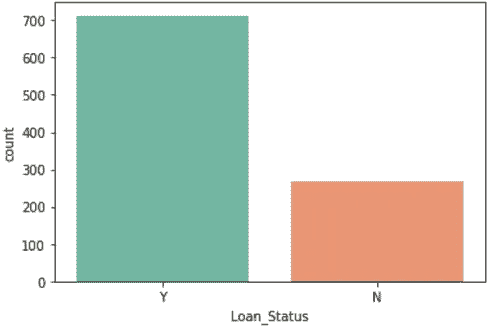

# 根据违约风险对贷款进行分类

> 原文：<https://towardsdatascience.com/classifying-loans-based-on-the-risk-of-defaulting-using-logistic-regression-9bd9c6b44640?source=collection_archive---------9----------------------->

# 简短的介绍

分类是监督学习中的经典问题之一，我们试图训练一个模型来将数据点分类成* *n* *个不同的类别。当我在网上浏览数据集时，我发现了一个包含 1000 名贷款申请人信息的数据集(来自城市和农村地区)。数据表中的一列是贷款是否被批准。我立刻想到了一个主意:

> 如果我们可以建立一个模型，根据申请人的违约风险来预测他或她的贷款是被批准还是被拒绝，会怎么样？

这将是一个普通的分类问题，我们有两个不同的类来分组我们的数据:贷款批准或贷款拒绝。

重要的是不要草率行事，并根据原始数据和未开发的数据开始训练模型。预处理数据不仅有助于我们消除不一致性(缺失值和异常值)，还能让我们对数据有一个全面的了解，进而帮助我们选择模型。

这个端到端的机器学习项目主要基于 Python。我使用了以下库来帮助我实现目标:

1. **Numpy** 进行数学运算。

2.**熊猫**进行数据探索和分析

3.用于数据可视化的 **Matplotlib** 和 **Seaborn**

4. **Scikit-learn** 了解模型培训、交叉验证和评估指标。

# 导入库

让我们事先做好所有必要的进口工作。

```
**import** **numpy** **as** np
np**.**seterr(divide**=**'ignore')
**import** **math**
**import** **pandas** **as** pd
**from** **sklearn.linear_model** **import** LogisticRegression
**from** **sklearn.model_selection** **import** train_test_split
**from** **sklearn.preprocessing** **import** OneHotEncoder
**from** **sklearn** **import** metrics
**import** **matplotlib.pyplot** **as** plt
**import** **seaborn** **as** sns
```

一旦我们有了所有必要的库，我们就可以使用 Pandas 从 CSV 文件中读取数据。

```
data **=** pd**.**read_csv('credit_risk.csv')
```

# 了解功能

在继续进行数据探索之前，我总是喜欢在表面层次上理解我将要处理的特性。这样做将有助于我们把我们做出的任何数学解释用语言表达出来。以下是我们数据集中的要素列表:

1.  **贷款 ID** :银行给贷款请求的 ID。
2.  **性别**:主申请人的性别。
3.  **已婚**:表示主申请人婚姻状况的二元变量。
4.  **家属**:主申请人的家属人数。
5.  **教育**:二元变量，表示主申请人是否高中毕业。
6.  **自雇**:表示个人是否自雇的二元变量。
7.  **申请人收入**:主申请人的收入。
8.  **共同申请人收入**:共同申请人的收入。
9.  **借款金额**:申请人希望借款的金额。
10.  **贷款金额期限**:申请人偿还贷款的期限。
11.  **信用历史**:代表客户有良好历史还是不良历史的二元变量。
12.  **财产区域**:分类变量，表明申请人是来自城市、半城市还是农村地区。
13.  **贷款状态**:表示贷款是被批准还是被拒绝的变量。这将是我们的输出(因变量)。

在所有这些变量中，我选择了性别、申请人收入、贷款金额和房产面积作为要深入研究的变量。重要的是从多个角度看待数据，即独立地和与其他变量相关地看待数据。这指出了变量分布中的任何危险信号，也揭示了它们之间有趣的关系。

# 可视化数据

人类是视觉动物，当我们看到信息时，大多数人会更好地处理信息。因此，在理解我们的数据时，采用可视化的方法比手动处理数百行数据要有效得多。我绘制了可视化图，显示了重要特征的分布以及一些特征之间有趣的关系。我如何决定哪些特性是重要的？我使用了相关矩阵，其中(I，j)处的值表示特征 i 与特征 j 的相关程度。

我们可以使用 seaborn 的热图可视化来帮助我们理解相关矩阵。


The Correlation Matrix for the Dataset

```
sns**.**heatmap(data**.**corr())
```

在我们开始探索我们的特征变量之前，我想看看我们的因变量，即我们试图使用模型预测的变量。下面是一个简单的分类计数图。



A count of the two classes that we are attempting to predict

各阶级之间存在明显的不平衡，这可能是非常危险的！我们的模型最终可能会高度偏向多数类，这对于模型的泛化能力来说并不理想。出于这个原因，我们将执行特征缩放以确保一致性，并确保我们用来构建模型的算法“意识到”这些类是不平衡的。

我也很好奇房产面积和贷款金额是如何共同影响贷款授权的。让我们来看一下贷款金额与批准金额的关系图，该图由物业面积分隔。


A Scatter plot of Loan Amount against the Loan Status, color-coded by the Property Area

如果我们将数据分为批准的和未批准的贷款，并查看这些贷款申请中有多少来自每个物业区域，这将会有所帮助。


A bar plot depicting the number of approved applicants from each property area


A bar plot depicting the number of unapproved applicants from each property area

从表面上看，似乎有更高比例的农村贷款申请被拒绝。我计算了每个房地产领域的贷款批准比率，这些数字证实了我们的假设。

1.  **城市赞成率:0.7368421052631579**
2.  **半市区赞成率:0.7822349570200573**
3.  **农村赞成率:0.6448275862068965**

# 清理数据

既然我们已经直观地探索了数据，以更好地理解我们正在处理的东西，那么是时候预处理我们的数据，以确保我们训练的模型不受任何嘈杂的训练实例的影响(在 ML 的上下文中，术语“训练实例”指的是作为用于训练和测试模型的数据集的一部分的单个数据点。)我将我们的预处理步骤分为以下子步骤:

1.  如有必要，检查并替换缺失的值。
2.  删除不必要的功能。
3.  对分类特征进行编码，以确保它们得到正确的解释。

```
*# Replace the categorical values with the numeric equivalents that we have above*
categoricalFeatures **=** ['Property_Area', 'Gender', 'Married', 'Dependents', 'Education', 'Self_Employed']

*# Iterate through the list of categorical features and one hot encode them.*
**for** feature **in** categoricalFeatures:
    onehot **=** pd**.**get_dummies(data[feature], prefix**=**feature)
    data **=** data**.**drop(feature, axis**=**1)
    data **=** data**.**join(onehot)
```

注意，数据预处理绝不是公式化的，我将要采取的步骤是主观的。

# 训练模型

最后，激动人心的部分！我们已经准备好了我们的数据，我们将把它提供给我们的模型去吞食！我为这个特殊情况选择的算法是逻辑回归。这是一种更简单的监督学习算法，但已被证明在各种情况下非常可靠。

在我们训练模型之前，我们将利用 Scikit-learn 内置的训练-测试分割模块，将我们的数据集随机分割成训练和测试子集。我们将根据 80-20 法则(这看起来是一个任意的、没有科学依据的选择，但众所周知，当涉及到训练模型时，它“正好起作用”)。

让我们从实例化一个逻辑回归对象(我们将使用 scikit-learn 的模块)开始，并以上述方式分割数据集。

```
*# Liblinear is a solver that is effective for relatively smaller datasets.*
lr **=** LogisticRegression(solver**=**'liblinear', class_weight**=**'balanced')
```

请注意，我们指定所讨论的类的权重必须平衡。这确保了类别被适当地加权，从而消除了由类别中的不平衡所产生的任何偏差。如果你对等级是如何加权的感到好奇，[Chris Albon](https://chrisalbon.com/machine_learning/logistic_regression/handling_imbalanced_classes_in_logistic_regression/)的这篇文章提供了一个全面的解释。

在我们传入数据之前，让我们使用 Scikit-learn 的标准缩放器来执行特征缩放。

```
scaler **=** StandardScaler()
data_std **=** scaler**.**fit_transform(data)*# We will follow an 80-20 split pattern for our training and test data*
X_train,X_test,y_train,y_test **=** train_test_split(data, y, test_size**=**0.2, random_state **=** 0)
```

现在我们已经有了所有需要的东西，我们让模型适合训练数据。

```
lr**.**fit(X_train, y_train)
```

# 评估模型的性能

评估算法的性能与理解和实现算法一样重要(如果不是更重要的话)。我对混淆矩阵和分类的三个基本评估标准做了简单而全面的介绍。

混淆矩阵是矩阵错误率的简单表格可视化，广泛用于评估分类算法的性能。矩阵的行代表实例的实际标签，而列代表预测的标签。在我们的例子中，我们有一个 2x2 矩阵，因为我们正在执行二进制分类。概括地说，一个“n 元”分类问题将有一个 nxn 混淆矩阵。

混淆矩阵的 *(m，n)* 条目告诉我们有多少正确标签为类别 *m* 的实例被分类到类别 *n* 中。因此，矩阵的对角线代表正确的分类，其余的代表不正确的分类。在二进制分类中，对角线条目通常被称为**真阳性**和**真阴性**，另外两个是**假阳性**和**假阴性**。

既然模型已经定型，我们将使用从原始数据集中筛选出的测试数据来评估我们的模型对数据的泛化能力。我将评估过程分为以下几个部分:

1.  对模型做出的预测进行矢量化，并构建混淆矩阵。
2.  使用混淆矩阵

```
*# We will compare this vector of predictions to the actual target vector to determine the model performance.*
y_pred **=** lr**.**predict(X_test)

*# Build the confusion matrix.*
confusion_matrix **=** metrics**.**confusion_matrix(y_test, y_pred)
class_names**=**[0,1] *# name of classes*
fig, ax **=** plt**.**subplots()
tick_marks **=** np**.**arange(len(class_names))
plt**.**xticks(tick_marks, class_names)
plt**.**yticks(tick_marks, class_names)

*# The heatmap requires that we pass in a dataframe as the argument*
sns**.**heatmap(pd**.**DataFrame(confusion_matrix), annot**=**True, cmap**=**"YlGnBu", fmt**=**"g")

*# Configure the heatmap parameters*
ax**.**xaxis**.**set_label_position("top")
plt**.**tight_layout()
plt**.**title('Confusion matrix', y**=**1.1)
plt**.**ylabel('Actual label')
plt**.**xlabel('Predicted label')
```


The Confusion Matrix for the Logistic Regression Classifier

乍一看，我们的大部分分类似乎都集中在对角线的词条上。一个极好的开始！回想一下，我们说过矩阵给了我们错误率。但是仅仅从矩阵中很难获得模型性能的具体数值度量。因此，我们使用矩阵中的值来计算三个基本的分类性能度量:**准确度、精确度和召回率**。

Scikit-learn 的内置指标模块让我们可以在一行代码中计算这些指标！

```
*# Print out our performance metrics*
**print**("Accuracy:",metrics**.**accuracy_score(y_test, y_pred))
**print**("Precision:",metrics**.**precision_score(y_test, y_pred, pos_label**=**'Y'))
**print**("Recall:",metrics**.**recall_score(y_test, y_pred, pos_label**=**'Y'))
```

对于我们的模型，指标的值结果是:

1.  **精度:0.8116883116883117**
2.  **精度:0.875**
3.  召回:0.8567196262

一种公认的做法是结合使用精度和召回来衡量分类模型的性能，因为人们可以简单地使用他或她知道会导致正确预测的实例来获得完美的精度分数。换句话说，如果我有一个已知属于正类的训练实例，我会确保模型只将该实例分类到正类中。F1 分数是精确度和召回率的调和和。这是一个衡量模型性能的单一指标，同时考虑了精确度和召回率，从而确保我们不必经历手动解释数字的麻烦。再一次，Scikitl-learn 的度量模块来帮忙了！

```
**print**("F1 Score:",metrics**.**f1_score(y_test, y_pred, pos_label**=**'Y'))
```

**F1 得分:0.8625592417061612**

# 结论

好吧，太棒了！我们成功地训练了一个模型，它可以根据我们掌握的数据预测对贷款申请人的反应。对我们人类来说，大规模地这样做是徒劳的，但分类器的性能向我们展示了这些技术有多么强大。分类只是预测建模工具箱中众多可用技术中的一种。我希望这已经被证明是一个信息丰富和引人入胜的主题介绍。

编码快乐！

# 附录

信用风险数据集:[https://docs . Google . com/spreadsheets/d/1 em 8 nmtoh 5 _ gph VI _ eowbkujdvidtnc 5 ykbfuihjwk-g/edit？usp =共享](https://docs.google.com/spreadsheets/d/1em8nMTOH5_GpHVI_EowBkUjDViDTNc5YKbFUihjwk-g/edit?usp=sharing)