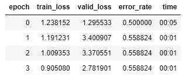

# 利用计算机视觉对妊娠试验结果进行分类

> 原文：<https://towardsdatascience.com/classifying-pregnancy-test-results-99adda4bca4c?source=collection_archive---------0----------------------->

## 我第一次尝试 fast.ai 的《程序员实用深度学习》第二课

我是一名数学助理和有抱负的数据科学家，正在学习 fast.ai 的“程序员实用深度学习”课程(你可以在这里阅读我的第一课[的经验)，第二课，我们将从 Google Images 收集一组图像，以创建和训练一个深度学习模型来对图像进行分类。](/getting-started-with-fast-ai-350914ee65d2)

我开始试着不看讲稿就浏览第二课的笔记本，因为它似乎是由[第一课维基](https://course.fast.ai/videos/?lesson=1)建议的，但是毫无进展。有些人在第二课录制之前就完成了！我想这不是一场比赛，不是最快的也不是退出的理由。一旦我看了讲座，我就很容易明白如何在笔记本上工作，特别是以杰里米的“实验主义者”风格。

首先，我需要决定对哪些类型的图像进行分类。二元分类——其中图像要么是一种东西，要么是不同的东西，而不是完全的其他东西，也不是这两种东西的组合——听起来是一个不错的选择，但因为我需要能够评估模型的表现如何，所以它进行的分类需要是我具有领域专业知识的东西。我有一个纯数学的硕士学位，并考虑做一些涉及数学的事情，但不要想数字识别( [MNIST](http://yann.lecun.com/exdb/mnist/) 做得非常漂亮)和一些远比我准备实现的更复杂的事情之间的任何事情。我也有三个孩子，这两个领域可能是我认为自己有“专长”的领域。所以，跟育儿和二元分类有关…啊哈！

我们认为怀孕测试要么是阳性的，要么是阴性的，但还有两种看起来非常相似的模糊情况:微弱的阳性，和阴性的蒸发线。有很多论坛——比如 PeeOnAStick.com 论坛——都是有丰富经验的人来解释怀孕测试。人们可能希望数字怀孕测试可以消除测试中的这种猜测，但对于早期微弱的阳性反应，数字测试通常会显示“不确定”或“阴性”，直到怀孕几天后激素水平升高时才会显示准确的结果。

这里有一个微弱阳性的例子:

这是一条蒸发线:

蒸发线比上面微弱的阳性要暗，但这是阴性测试！这是一个棘手的问题。下图显示了两者之间的一些差异:

Image credit: ([https://www.momjunction.com/articles/evaporation-line-test_00475745/#gref](https://www.momjunction.com/articles/evaporation-line-test_00475745/#gref))

蒸发线比控制线细，所以这是我们识别它的一种方法。然而，很容易看出人类很难发现这一点，所以我想知道我的模型会有什么机会。最好能知道是否已经建立了一个模型来对这些图像进行分类，这样我就可以将我的模型的准确性与之前发表的模型进行比较，我发现一项研究使用机器学习来[预测妊娠测试的准确性](https://www.periscopedata.com/blog/precision-recall-and-roc-curves-for-pregnancy-tests)，但我没有发现任何使用机器学习来对微弱阳性与蒸发线进行具体分类的研究。

选择了一个项目后，我在谷歌上搜索“微弱阳性妊娠试验”和“妊娠试验蒸发线”，并按照讲座中的说明下载每个项目的图像。txt 文件。讲座视频里也是. txt 文件，但是在笔记本里，找的是. csv，没什么大不了改那个，不过是个东西。

然后还有一件事。我按照 Jeremy 的指示做了，但是得到了下面的错误消息和解释:

好的，这在讲座中没有提到，但是我们在 fastai 库中使用的函数，明确地寻找一个文件名以“urls_”开头的文件。我相应地更改了文件名，一切正常。

查看数据进行得很好，虽然我可以看到有一些图像对于模型来说很难分类，因为要么测试不在焦点上，要么图像中根本没有测试。然而，更糟糕的是:当我搜索蒸发线时出现的许多图像是由人们发布的，他们问结果是蒸发线还是微弱的阳性，事实上，更多的时候是微弱的阳性，所以这些图像将在我的数据集中带有“蒸发线”标签，但实际上应该标记为“微弱阳性”。我预测这将是我的模型不准确的最重要的来源。不过，我现在还不担心这个。我从讲座中了解到，在我们第一次运行模型后，如果需要，我们将进行一些超参数调整和手动数据清理(旁白:这肯定是需要的)。

所以我训练模型，结果如下:

所以我的训练损失是 0.9，验证损失是 2.78，错误率是 0.56。相当可怕，但我会坚持下去。

我仔细检查了处理学习率的笔记本单元格，但是在我清理完数据之前，我不打算进行任何超参数调整，因为我已经知道这会很混乱。

这是第一次运行的“混淆矩阵”:

这表明，在模型预测为蒸发线的测试中，7 个被正确识别，2 个被错误识别为弱阳性。在预测为弱阳性的测试中，13 个被正确识别，12 个被错误识别为蒸发线。因为我知道大部分的蒸发线图片都被发布它们的用户贴错了标签，尽管这或多或少是我所期望看到的。该模型可能比它认为的更准确！

现在我将清理数据。这是第一批:

第一个图像有文字覆盖测试，而第三个图像太小，测试窗口太暗，无法确定分类，我想，所以我删除了这些。我还可以改变图像上的标签，这样我就可以切换那些标记为蒸发线的图像，这些图像应该标记为微弱阳性。然后，我用清理后的数据重新创建数据集群。我并不特别乐观，这将增加模型的准确性，达到讲座中显示的模型所达到的非常高的比率，因为测试以不同的配置显示结果:一些显示 a +当阳性时，而另一些显示单线如果阴性，两条线如果阳性。所以如果模型只是数线，那就不好过了。我们走着瞧。

ImageCleaner 函数为清理后的数据集创建一个 cleaned.csv 文件，我使用该文件创建一个新的 ImageBunch，然后再次训练模型。

我的训练集损失下降了 0.2，验证集损失下降了 1.5，错误率下降了 0.12。让我们看看新的混淆矩阵:

正如我所想的那样，该模型仍然将 12 个微弱的正线分类为蒸发线，并且这些微弱的正线可能如此微弱，以至于我一点也不惊讶它被混淆了。添加不同风格的测试结果显示，模型有甲板堆叠对它。

为了提高准确性，我想我需要得到一组比从谷歌上抓取图像更好的蒸发线图像。我可能还需要为不同的品牌训练不同的模型，但我想看看我是否可以先用一个模型获得相当的准确性(一个模型统治所有的模型？).[怀孕倒计时](https://www.countdowntopregnancy.com/pregnancy-test-gallery/?anon=0&all=0&s=0&dpo=-1&brandid=0&cid=3&fr=0&u=0&b=0)有可以按品牌和结果分类的测试图像。我选择“所有品牌”和“Evap”，得到数百张图片，所以我用新数据重新开始。这些是用户自己标记的，所以有些仍然会被错误标记，但图像质量比我从谷歌图像得到的要好很多。我认为我最初的微弱的正面图像基本上是好的，所以我保留那些。我所知道的唯一获取图片网址的方法。txt 文件是笔记本的做法，但当我这样做时，我得到的只是一个文件类型为“file”的空文件，而不是. txt。我在网上四处查看，发现[这个脚本](https://www.w3resource.com/python-exercises/web-scraping/web-scraping-exercise-8.php)使用 Python 抓取任何网页的图像 URL。好了，现在我们有进展了！<不祥的音乐响起>

该脚本在每张测试照片旁边下载用户头像图像的完整 URL，但出于某种原因，删除了测试图像的前半部分 URL。我意识到，如果我继续使用这种方法，我将不得不删除所有我不想要的图像的 URL，同时修复我想要的图像的 URL。仅仅复制和粘贴我想要的图片的 URL 会更快，但是效率仍然很低。

更糟糕的是，我刚刚意识到怀孕倒计时的照片有一个严重的缺陷。这里有一个例子。你能发现问题吗？

我最近听到一个播客，关于一个深度学习模型，它被训练来发现癌变的皮肤生长，虽然它惊人地准确，但最终研究人员意识到，该模型已经发现，它给定的所有癌变图像都有标尺，而非癌变图像没有标尺，所以它在寻找标尺，而不是癌症。这些蒸发线的照片右上角都有一个“Evap”标签！图像是伟大的，但标签是一个大失望。

但结果是，如果我下载了图片，标签就会消失！我考虑学习如何抓取图像，但是因为我意识到上面每一页上有一半的图像不是我想要的，所以这种方法似乎不太适合这个目的。相反，我在 Chrome 上安装了延续了扩展的[图片下载程序，让我点击我想下载的图片。手动选择每张图片感觉很不雅观，但这恰恰是我以后必须要做的，以消除噪音图像，否则，所以我打算这样做。](https://chrome.google.com/webstore/detail/image-downloader-continue/jfkjbfhcfaoldhgbnkekkoheganchiea?hl=en)

我将图像上传到 evap_lines 文件夹，并再次运行我的模型。

那还是很糟糕。这是学习率查找表:

我尝试将学习率设置在 1e-5 到 1e-4 的范围内:

再次运行:

这是我遇到的最低的训练集损失，验证损失和错误率也有所改善，但还没有接近我们要达到的标准。这是混淆矩阵:

同样，几乎所有的误差都是被归类为蒸发线的微弱正值。提高蒸发线图像的质量很有帮助，但我认为我将限制模型只对一个品牌进行分类，而不是所有品牌，因为结果显示的方式不一致，如上所述。

我选择 ClearBlue Easy，因为这是一个受欢迎的测试(大量图片！)，还因为蓝色染料测试似乎最容易出现蒸发线。我下载了大约 100 张图像，每张都是蒸发线和微弱阳性(“微弱”是我的判断)，然后再次运行这个模型。

这仍然没有很好地工作。我知道我的数据是从用户识别的图像中获得的最好的数据，所以我准备尝试一些超参数调整。我将我的学习率设置在 1e-06 和 1e-04 之间:

好一点了。也许运行更多的纪元？不，我得到了基本相同的结果。

我在这方面太新了，不能肯定地说，但我认为这是非常可能的，错误率低到我可以在没有更好的图像集来源的情况下得到它。我从这个项目中学到了很多——关于在 Jupyter 笔记本、fastai 图书馆工作，如何从网页下载 URL 和图像，等等。—如果我想到了更好的方法，也许我会在某个时候重新开始，但现在我将把这个项目留在这里，然后选择一个不太复杂的分类问题，重新开始。

上篇:[fast . ai 入门](/getting-started-with-fast-ai-350914ee65d2)

第二课(续):[深度学习能比鸽子表现得更好吗？](/can-deep-learning-perform-better-than-pigeons-d37ef1581a2f)

第三课:[一万种行不通的方法](/10-000-ways-that-wont-work-311925525cf0)

第四课:[预测服务员的小费](/predicting-a-waiters-tips-1990342a0d02)

第五课:[但是泡菜去哪里了？](/but-where-does-the-pickle-go-53619676bf5f)

第六课:[每个人都想成为一只猫](/everybody-wants-to-be-a-cat-6dd6190c5d9c)

我是加州大学东湾分校的数学讲师，也是一名有抱负的数据科学家。在 [LinkedIn](https://linkedin.com/in/laura-langdon/) 上和我联系，或者在 [Twitter](https://twitter.com/laura_e_langdon) 上打招呼。