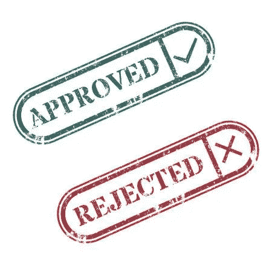

# 使用文本挖掘将产品分类为禁止或批准产品-第一部分

> 原文：<https://towardsdatascience.com/classifying-products-as-banned-or-approved-using-text-mining-5b48d2eb1544?source=collection_archive---------27----------------------->

## 根据文本信息将产品分类为禁止或批准。



Classifying products as Approved or Rejected based on its content.

让我从一些事实开始，这些事实是我在与基于机器学习的问题的有限接触中确立的——“你无法找到最合适的，因为没有最合适的，只是不断尝试——这是关键”和“数据是你最好的投资选择——花大量时间在它上面”。

回到手头的问题上来——**识别 Indiamart 上的“被禁”内容，这是一个每天吸引数百万用户的在线平台**。我所说的“禁止”指的是该国现行法律框架不允许的内容，更重要的是，它是动态的。牛皮制成的夹克是“禁售”产品，而皮革装饰的高级转椅则不是。

在继续之前，让我们先了解一下[印度集市](https://dir.indiamart.com/)中的产品是什么


This is a product. We have over 60 million such products with us.

*注意:我将在文章内容的上下文中使用该产品。这里的产品只不过是对特定项目可用内容的描述。一个产品有一个标题，一个描述，一个你卖的商品的图片，它的价格等等。*

# 理解问题

我们必须根据现有的信息将我们的产品*(新的和现有的)*分为**批准的**或**禁止的**。

> 例如，任何提及麻醉盐的产品都需要标记为“禁用”，并从主流内容中删除。

# 基于“关键词”的挑战

在我们目前的方法中，我们根据关键字匹配将产品标记为禁用或批准，即我们有一个禁用关键字列表，如果该关键字存在于产品名称中，我们将其标记为禁用，否则标记为批准。

这导致某些相关产品被列为被禁产品，尽管它们应该被批准，例如，“猫”出现在我们的被禁关键词列表中，所以像“木制猫礼品”、“猫推土机”等产品被禁，这导致了好内容的损失。

# 解决“猫对猫”的难题


‘Cat’ -the animal and the machine

一个监督的基于文本的分类器为我们发挥了作用，该分类器是使用先前标记的例子训练的。**该分类器的目标是将产品分为“禁止”或“批准”两种标签**。如用于训练的标签

> _ label _ 认可的戴尔无线鼠标黑色
> 
> _ label _ 禁用牛皮黑色夹克

我们向机器输入一组已有的产品，标签为“禁止”或“批准”，让它建立一种关系，这样它就可以预测某个产品应该被接受还是拒绝。然后，一组不同的产品再次被送入机器，系统会询问该产品是被接受还是被拒绝。

这一次，我们能够更好地捕捉产品的意图和背景- **卡特彼勒推土机或卡特彼勒挖掘机没有被“禁止”，而“猫皮衣”被禁止。**

*针对产品的可用描述和规范(在现有的关键字服务中未被考虑)也被用于训练和测试模型。*

# 测试机器:引擎盖下是什么


Process Flow for the Problem

我们使用 fastText 来训练我们的模型。 [fastText](http://fasttext.cc) 是来自**脸书**的开源库，用于高效学习单词表示和句子分类。

*如果您是 fastText 新手，在运行它时遇到问题，请参考本* [*视频教程*](https://youtu.be/nXp5aWWoWeY) *。*

训练数据:具有带标签的数据行的文件。所有产品本质上都有“禁止”或“批准”两个标签中的一个，语料库是针对该产品的所有可用内容。

**训练命令:**

```
*~/fastText/fasttext.exe supervised -input ~/Training_Files/training_file.txt -output ~/Model_path/model.bin -lr 0.5 -epoch 75 -minn 5-thread 4 -wordNgram 2 -lrUpdateRate 100;*
```

*注意:此处使用的超参数是在执行超参数调整后选择的，这使您可以获得有助于提高使用案例准确性的参数。这些可能会因所考虑的数据集而异*

**用 python 训练模型:**

我们也可以使用下面提到的代码在 python 中执行同样的操作，它将创建模型文件(。bin)。

```
$ git clone https://github.com/facebookresearch/fastText.git
$ cd fastText
$ pip install .

import fastText

train_file_name = "training_model.txt"
model_name = "Banned_Model"

classifier = fasttext.train_supervised(str(train_file_name),
                                            str(model_name), label_prefix='__label__',
                                            epoch=75,lr=0.5,word_ngrams=2,minn 5,bucket=200000,dim=100,loss='hs')# To Save the model for further use:
classifier.save_model("Banned_Model.bin")# To Predict the classes/Labels from the above modelmodel = fastText.load_model(model_name+".bin")
Test_String = ['xyz']
Model_Results = model.predict(Test_String,k=1)[0][0][0]
```

**精度和召回率:**

```
P@1    : 0.987
R@1    : 0.987
```

**测试模型:**

```
~/fastText/fasttext.exe predict-prob ~/Model_path/model.bin - 1;
```

您将在输出屏幕上看到类似这样的内容

```
imart@DESKTOP-CFGCP74 ~                                                                                                               
$ fastText/fasttext.exe predict-prob ~/Model_path/model4mo1.bin - 1                                         
deca durabolin nandrolene decatonate bottle                                                                                           
__label__Banned 0.995814
```

采用 k 倍交叉验证对模型进行验证。

**一个有趣的例子:**三星手机不禁售而山寨同行禁售。该模型能发现这种情况吗？让我们测试

```
imart@DESKTOP-CFGCP74 ~                                                                                                               
$ fastText/fasttext.exe predict-prob ~/Model_path/model4mo1.bin/model4mo1.bin - 1                                         
**samsung mobile phone **                                                                                                                 
__label__**Approved** 1.00001                                                                                                             
**samsung clone mobile phone**                                                                                                            
__label__**Banned** 1.00002
```

# 数据清理:主要手段

在机器学习中，**垃圾输入就是垃圾输出**，所以确保在使用数据训练模型之前执行所需的数据操作——这里我们将整个数据转换为小写，删除 XML、HTML 标签，如<李></李>、< ui > < /ui >等。、与用例相关的特殊符号和停用词。

# Images❓产品怎么样


包含大量文本的产品图像。

> **使用 OCR 提取的文本**👉复合维生素 b，含抗氧化剂胶囊，促进能量代谢，支持心脏健康

一些产品上有写有文字的图像。提取这些文本并输入到模型中也有助于我们更好地将产品分类为“禁止”或“批准”。这里使用 OCR( **光学字符识别)**从图像中提取相关数据。

# 什么是 OCR❓

**OCR** 代表**光学字符识别**。使用 OCR，我们可以扫描包含文本的图像和文档，并将它们转换成可以编辑的文档。


image scanning application using OCR

在我们的例子中，OCR 帮助我们从产品图像中提取文本，更重要的是在产品名称、产品描述和规格中没有文本信息的情况下。

**Google Cloud Vision API 和 Tesseract** 可以为此进行探索。

# 前方的路

到目前为止，当我们将结果与人类审计员进行匹配时，该模型对它测试的每 85/100 个产品都是准确的。我能够收集的另一个事实是，现实世界并不像我们倾向于相信的那样容易分类，使用人类总是有必要确定需要人类接触的“灰色区域”。我正在努力减少这些灰色区域，并将很快提出一篇后续文章。进一步阅读请参考本系列第二部分。

[Vikram Varshney](https://medium.com/u/47a096395dd5?source=post_page-----5b48d2eb1544--------------------------------) ， [Ayush Gupta](https://medium.com/u/f3499cb43377?source=post_page-----5b48d2eb1544--------------------------------) 感谢您的持续贡献。