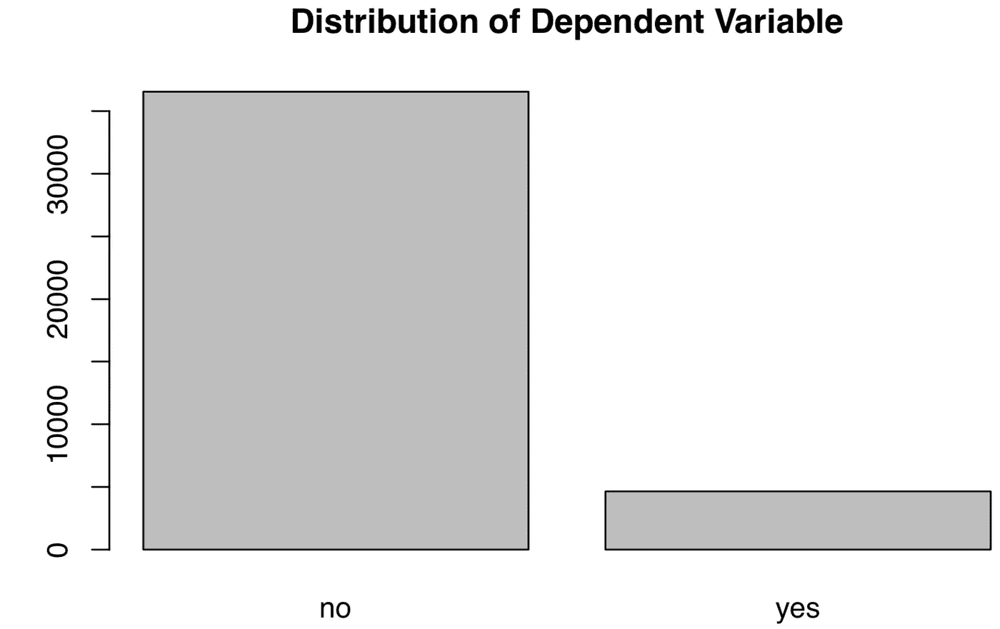
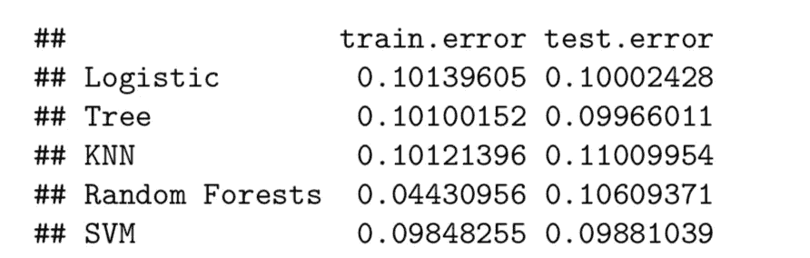
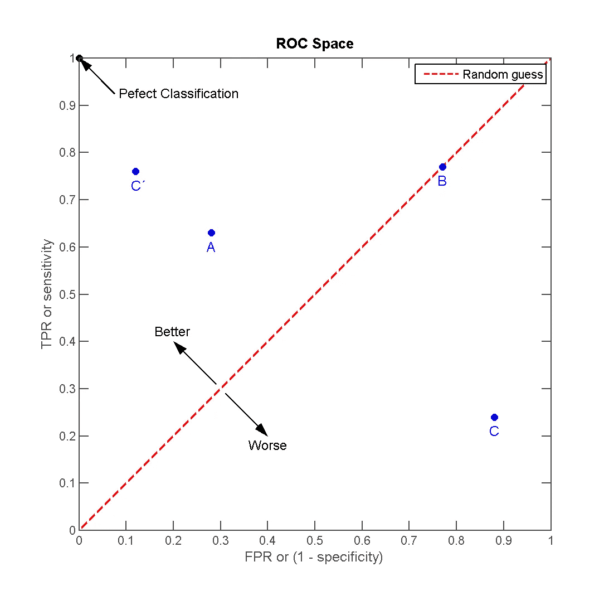
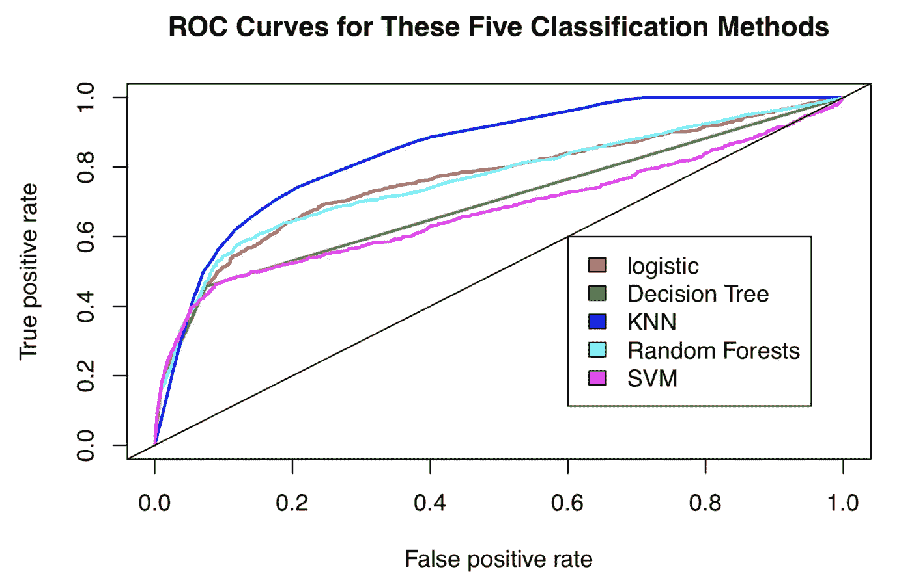
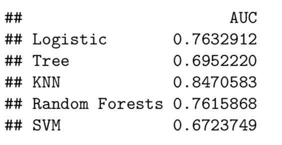

# 使用 5 种机器学习算法对罕见事件进行分类

> 原文：<https://towardsdatascience.com/classifying-rare-events-using-five-machine-learning-techniques-fab464573233?source=collection_archive---------5----------------------->

## 机器学习:监督学习

## 哪一种最适合不平衡数据？有什么权衡吗？


Photo by [Franck V.](https://unsplash.com/@franckinjapan?utm_source=unsplash&utm_medium=referral&utm_content=creditCopyText) on [Unsplash](https://unsplash.com/s/photos/machine-learning?utm_source=unsplash&utm_medium=referral&utm_content=creditCopyText)

*** * * * * *最近更新于 2019 年 12 月 28 日*******

> 机器学习是数据科学的皇冠；
> 
> 监督学习是机器学习皇冠上的宝石。

# 背景

几年前，《哈佛商业评论》发表了一篇文章，标题是“[数据科学家:21 世纪最性感的工作](https://hbr.org/2012/10/data-scientist-the-sexiest-job-of-the-21st-century)自从它发布以来，数据科学或统计部门受到大学生的广泛追捧，数据科学家(书呆子)第一次被称为性感。

对于一些行业，数据科学家已经重塑了公司结构，并将许多决策重新分配给“一线”员工。能够从数据中产生有用的商业见解从未如此容易。

据吴恩达([机器学习向往](https://www.deeplearning.ai/machine-learning-yearning/)，第 9 页)，

> 监督学习算法为行业贡献了大部分价值。

SL 为什么会产生这么大的商业价值，这一点毋庸置疑。银行用它来检测信用卡欺诈，交易员根据模型告诉他们的内容做出购买决定，工厂通过生产线过滤有缺陷的产品(根据吴恩达的说法，这是人工智能和人工智能可以帮助传统公司的一个领域)。

这些业务场景有两个共同的特征:

1.  **二元结果**:欺诈 VS 不欺诈，买 VS 不买，有缺陷 VS 无缺陷。
2.  **不平衡的数据分布**:一个多数群体对一个少数群体。

正如吴恩达最近指出的那样，[小数据](https://info.deeplearning.ai/the-batch-self-driving-cars-that-cant-see-pedestrians-evolutionary-algorithms-fish-recognition-fighting-fraud-?utm_campaign=The%20Batch&utm_source=hs_email&utm_medium=email&utm_content=79686634&_hsenc=p2ANqtz-8JYm57kQehRZzewKP7GRcg1KzCEiTzMaPaYmA1fKuzs_IU9AoooG7ABIqqRLuOubgAU8r8pBVED-l1D6mOoCjVrF6lYw&_hsmi=79686634)、[健壮性](https://info.deeplearning.ai/the-batch-deepmind-masters-starcraft-2-ai-attacks-on-amazon-a-career-in-robot-management-banks-embrace-bots-1?utm_campaign=The%20Batch&utm_source=hs_email&utm_medium=email&utm_content=79686634&_hsenc=p2ANqtz-8JYm57kQehRZzewKP7GRcg1KzCEiTzMaPaYmA1fKuzs_IU9AoooG7ABIqqRLuOubgAU8r8pBVED-l1D6mOoCjVrF6lYw&_hsmi=79686634)和[人为因素](https://blog.deeplearning.ai/blog/the-batch-google-achieves-quantum-supremacy-amazon-aims-to-sway-lawmakers-ai-predicts-basketball-plays-face-detector-preserves-privacy-problems-beyond-bounding-box?utm_campaign=The%20Batch&utm_source=hs_email&utm_medium=email&utm_content=80323254&_hsenc=p2ANqtz-_88W5PvaNASb06SH_AW1uzL2ETjfCivTbmXc7m87jMcF4rrMG42U9qp7EATDPRM-rxHm0biLE3yMyHebUyR-pMaLZm2A&_hsmi=80323254)是人工智能项目成功的三大障碍。在一定程度上，我们的具有一个少数群体的罕见事件问题也是一个小数据问题:**ML 算法从多数群体学习更多，可能容易对小数据群体进行错误分类。**

以下是价值百万的问题:

> 对于这些罕见事件，哪种 ML 方法表现更好？
> 
> 什么指标？
> 
> 权衡？

在这篇文章中，我们试图通过将 5 ML 方法应用于一个真实的数据集来回答这些问题。

*完整描述及原始数据集，请查看原始* [*数据集*](https://archive.ics.uci.edu/ml/datasets/bank+marketing)*；完整的 R 代码请查看我的*[*Github*](https://github.com/LeihuaYe/Machine-Learning-Classification-for-Imbalanced-Data)*。*

# 商业问题

葡萄牙的一家银行实施了一项新银行服务(定期存款)的营销策略，并想知道哪些类型的客户订购了该服务。因此，银行可以调整其营销策略，并在未来瞄准特定人群。数据科学家已经与销售和营销团队合作，提出统计解决方案来识别未来的用户。

# r 实现

下面是模型选择和 R 实现的管道。

## **1。导入、数据清理和探索性数据分析**

让我们加载并清理原始数据集。

```
####load the dataset
banking=read.csv(“bank-additional-full.csv”,sep =”;”,header=T)##check for missing data and make sure no missing data
banking[!complete.cases(banking),]#re-code qualitative (factor) variables into numeric
banking$job= recode(banking$job, “‘admin.’=1;’blue-collar’=2;’entrepreneur’=3;’housemaid’=4;’management’=5;’retired’=6;’self-employed’=7;’services’=8;’student’=9;’technician’=10;’unemployed’=11;’unknown’=12”)#recode variable again
banking$marital = recode(banking$marital, “‘divorced’=1;’married’=2;’single’=3;’unknown’=4”)banking$education = recode(banking$education, “‘basic.4y’=1;’basic.6y’=2;’basic.9y’=3;’high.school’=4;’illiterate’=5;’professional.course’=6;’university.degree’=7;’unknown’=8”)banking$default = recode(banking$default, “‘no’=1;’yes’=2;’unknown’=3”)banking$housing = recode(banking$housing, “‘no’=1;’yes’=2;’unknown’=3”)banking$loan = recode(banking$loan, “‘no’=1;’yes’=2;’unknown’=3”)
banking$contact = recode(banking$loan, “‘cellular’=1;’telephone’=2;”)banking$month = recode(banking$month, “‘mar’=1;’apr’=2;’may’=3;’jun’=4;’jul’=5;’aug’=6;’sep’=7;’oct’=8;’nov’=9;’dec’=10”)banking$day_of_week = recode(banking$day_of_week, “‘mon’=1;’tue’=2;’wed’=3;’thu’=4;’fri’=5;”)banking$poutcome = recode(banking$poutcome, “‘failure’=1;’nonexistent’=2;’success’=3;”)#remove variable “pdays”, b/c it has no variation
banking$pdays=NULL #remove variable “pdays”, b/c itis collinear with the DV
banking$duration=NULL
```

清理原始数据似乎很繁琐，因为我们必须重新编码缺失的变量，并将定性变量转换为定量变量。在现实世界中，清理数据需要更多的时间。**有句话说“数据科学家 80%的时间用来清理数据，20%的时间用来建立模型。”**

接下来，让我们探索我们的结果变量的分布。

```
#EDA of the DV
plot(banking$y,main="Plot 1: Distribution of Dependent Variable")
```



可以看出，因变量(服务订购)的分布并不均匀，其中“否”多于“是”。**这种不平衡的分布应该发出一些警告信号，因为数据分布会影响最终的统计模型**。使用从多数案例发展而来的模型，很容易将少数案例错误分类。

## **2。数据分割**

接下来，让我们将数据集分成两部分:训练集和测试集。根据经验，我们坚持 80-20 的划分:80%作为训练集，20%作为测试集。对于时间序列数据，我们基于 90%的数据训练模型，剩下的 10%作为测试数据集。

```
#split the dataset into training and test sets randomly 
set.seed(1)#set seed so as to generate the same value each time we run the code#create an index to split the data: 80% training and 20% test
index = round(nrow(banking)*0.2,digits=0)#sample randomly throughout the dataset and keep the total number equal to the value of index
test.indices = sample(1:nrow(banking), index)#80% training set
banking.train=banking[-test.indices,] #20% test set
banking.test=banking[test.indices,] #Select the training set except the DV
YTrain = banking.train$y
XTrain = banking.train %>% select(-y)# Select the test set except the DV
YTest = banking.test$y
XTest = banking.test %>% select(-y)
```

这里，让我们创建一个空的跟踪记录。

```
records = matrix(NA, nrow=5, ncol=2) 
colnames(records) <- c(“train.error”,”test.error”)
rownames(records) <- c(“Logistic”,”Tree”,”KNN”,”Random Forests”,”SVM”)
```

## **3。火车模型**

在本节中，我们定义了一个新函数( **calc_error_rate** )，并将其应用于计算每个 ML 模型的训练和测试误差。

```
calc_error_rate <- function(predicted.value, true.value)
                    {return(mean(true.value!=predicted.value))}
```

该函数计算预测标签不等于真实值时的比率。

## **#1 逻辑回归模型**

关于 logistic 模型的简介，请查看我的其他帖子: [**机器学习 101**](/machine-learning-101-predicting-drug-use-using-logistic-regression-in-r-769be90eb03d) 和 [**机器学习 102**](/machine-learning-102-logistic-regression-with-polynomial-features-98a208688c17) 。

让我们拟合一个逻辑模型，其中包括除结果变量之外的所有其他变量。由于结果是二进制的，我们将模型设置为二项分布(“家庭=二项”)。

```
glm.fit = glm(y ~ age+factor(job)+factor(marital)+factor(education)+factor(default)+factor(housing)+factor(loan)+factor(contact)+factor(month)+factor(day_of_week)+campaign+previous+factor(poutcome)+emp.var.rate+cons.price.idx+cons.conf.idx+euribor3m+nr.employed, data=banking.train, **family=binomial**)
```

下一步是获得列车误差。我们将类型设置为 response，因为我们预测结果的类型并采用多数规则:如果先验概率超过或等于 0.5，我们预测结果为 yes 否则，答案是否定的

```
prob.training = predict(glm.fit,**type=”response”**)banking.train_glm = banking.train %>% #select all rows of the train
 mutate(predicted.value=as.factor(ifelse(prob.training<=0.5, “no”, “yes”))) **#create a new variable using mutate and set a majority rule using ifelse**# get the training error
logit_traing_error <-  calc_error_rate(predicted.value=banking.train_glm$predicted.value,  true.value=YTrain)# get the test error of the logistic model
prob.test = predict(glm.fit,banking.test,type=”response”)banking.test_glm = banking.test %>% # select rows
 mutate(predicted.value2=as.factor(ifelse(prob.test<=0.5, “no”, “yes”))) # set ruleslogit_test_error <- calc_error_rate(predicted.value=banking.test_glm$predicted.value2, true.value=YTest)# write down the training and test errors of the logistic model 
records[1,] <- c(logit_traing_error,logit_test_error)#write into the first row
```

## **#2 决策树**

对于 DT，我们遵循交叉验证，并确定拆分的最佳节点。关于 DT 的快速介绍，请参考 [Prashant Gupta](https://medium.com/u/a84d0e60277a?source=post_page-----fab464573233--------------------------------) 的帖子([链接](/decision-trees-in-machine-learning-641b9c4e8052))。

```
# finding the best nodes
# the total number of rows
nobs = nrow(banking.train)#build a DT model; 
#please refer to this document ([here](https://www.datacamp.com/community/tutorials/decision-trees-R)) for constructing a DT model
bank_tree = tree(y~., data= banking.train,na.action = na.pass,
 control = tree.control(nobs , mincut =2, minsize = 10, mindev = 1e-3))#cross validation to prune the tree
set.seed(3)
cv = cv.tree(bank_tree,FUN=prune.misclass, K=10)
cv#identify the best cv
best.size.cv = cv$size[which.min(cv$dev)]
best.size.cv#best = 3bank_tree.pruned<-prune.misclass(bank_tree, best=3)
summary(bank_tree.pruned)
```

交叉验证的最佳规模是 3。

```
# Training and test errors of bank_tree.pruned
pred_train = predict(bank_tree.pruned, banking.train, type=”class”)
pred_test = predict(bank_tree.pruned, banking.test, type=”class”)# training error
DT_training_error <- calc_error_rate(predicted.value=pred_train, true.value=YTrain)# test error
DT_test_error <- calc_error_rate(predicted.value=pred_test, true.value=YTest)# write down the errors
records[2,] <- c(DT_training_error,DT_test_error)
```

## **# 3k-最近邻居**

作为一种非参数方法，KNN 不需要任何分布的先验知识。简而言之，KNN 为感兴趣的单元分配 k 个最近邻。

要快速开始，请查看我在 KNN 的帖子:[**R 中 K 近邻初学者指南:从零到英雄。**](/beginners-guide-to-k-nearest-neighbors-in-r-from-zero-to-hero-d92cd4074bdb) 关于交叉验证和 do.chunk 函数的详细解释，请重定向到我的[帖子](/beginners-guide-to-k-nearest-neighbors-in-r-from-zero-to-hero-d92cd4074bdb)。

使用交叉验证，我们发现当 k=20 时交叉验证误差最小。

```
nfold = 10
set.seed(1)# cut() divides the range into several intervals
folds = seq.int(nrow(banking.train)) %>%
     cut(breaks = nfold, labels=FALSE) %>%  
     sampledo.chunk <- function(chunkid, folddef, Xdat, Ydat, k){ 
     train = (folddef!=chunkid)# training indexXtr = Xdat[train,] # training set by the indexYtr = Ydat[train] # true label in training setXvl = Xdat[!train,] # test setYvl = Ydat[!train] # true label in test setpredYtr = knn(train = Xtr, test = Xtr, cl = Ytr, k = k) # predict training labelspredYvl = knn(train = Xtr, test = Xvl, cl = Ytr, k = k) # predict test labelsdata.frame(fold =chunkid, # k folds 
train.error = calc_error_rate(predYtr, Ytr),#training error per fold 
 val.error = calc_error_rate(predYvl, Yvl)) # test error per fold
 }# set error.folds to save validation errors
error.folds=NULL# create a sequence of data with an interval of 10
kvec = c(1, seq(10, 50, length.out=5))set.seed(1)for (j in kvec){
 tmp = ldply(1:nfold, do.chunk, # apply do.function to each fold
 folddef=folds, Xdat=XTrain, Ydat=YTrain, k=j) # required arguments
 tmp$neighbors = j # track each value of neighbors
 error.folds = rbind(error.folds, tmp) # combine the results 
 }**#melt() in the package reshape2 melts wide-format data into long-format data** errors = melt(error.folds, id.vars=c(“fold”,”neighbors”), value.name= “error”)
```

然后，让我们找到使验证误差最小化的最佳 k 数。

```
val.error.means = errors %>%
 filter(variable== “val.error” ) %>%
 group_by(neighbors, variable) %>%
 summarise_each(funs(mean), error) %>%
 ungroup() %>%
 filter(error==min(error))#the best number of neighbors =20
numneighbor = max(val.error.means$neighbors)
numneighbor## [20]
```

按照同样的步骤，我们会发现训练和测试错误。

```
#training error
set.seed(20)
pred.YTtrain = knn(train=XTrain, test=XTrain, cl=YTrain, k=20)
knn_traing_error <- calc_error_rate(predicted.value=pred.YTtrain, true.value=YTrain)#test error =0.095set.seed(20)
pred.YTest = knn(train=XTrain, test=XTest, cl=YTrain, k=20)
knn_test_error <- calc_error_rate(predicted.value=pred.YTest, true.value=YTest)records[3,] <- c(knn_traing_error,knn_test_error)
```

## **#4 随机森林**

我们遵循构建随机森林模型的标准步骤。由[饶彤彤](https://medium.com/u/840a3210fbe7?source=post_page-----fab464573233--------------------------------)撰写的 RF ( [链接](/understanding-random-forest-58381e0602d2))快速介绍。

```
# build a RF model with default settings 
set.seed(1)
RF_banking_train = randomForest(y ~ ., data=banking.train, importance=TRUE)# predicting outcome classes using training and test sets

pred_train_RF = predict(RF_banking_train, banking.train, type=”class”)pred_test_RF = predict(RF_banking_train, banking.test, type=”class”)# training error
RF_training_error <- calc_error_rate(predicted.value=pred_train_RF, true.value=YTrain)# test error
RF_test_error <- calc_error_rate(predicted.value=pred_test_RF, true.value=YTest)records[4,] <- c(RF_training_error,RF_test_error)
```

## **#5 支持向量机**

同样，我们遵循构建 SVM 的标准步骤。一个好的方法介绍，请参考[罗希斯甘地](https://medium.com/u/8f4e7f7a57e3?source=post_page-----fab464573233--------------------------------)的帖子([链接](/support-vector-machine-introduction-to-machine-learning-algorithms-934a444fca47))。

```
set.seed(1)
tune.out=tune(svm, y ~., data=banking.train,
kernel=”radial”,ranges=list(cost=c(0.1,1,10)))# find the best parameters
summary(tune.out)$best.parameters# the best model
best_model = tune.out$best.modelsvm_fit=svm(y~., data=banking.train,kernel=”radial”,gamma=0.05555556,cost=1,probability=TRUE)# using training/test sets to predict outcome classes
svm_best_train = predict(svm_fit,banking.train,type=”class”)
svm_best_test = predict(svm_fit,banking.test,type=”class”)# training error
svm_training_error <- calc_error_rate(predicted.value=svm_best_train, true.value=YTrain)# test error
svm_test_error <- calc_error_rate(predicted.value=svm_best_test, true.value=YTest)records[5,] <- c(svm_training_error,svm_test_error)
```

## 4.模型度量

我们按照模型选择程序构建了所有的 ML 模型，并获得了它们的训练和测试误差。在本节中，我们将使用一些模型指标来选择最佳模型。

## **4.1 训练/测试错误**

有可能利用训练/测试误差找到最佳模型吗？

现在，让我们检查结果。

```
records
```



这里，随机森林具有最小的训练误差，尽管与其他方法具有相似的测试误差。您可能已经注意到，训练和测试误差非常接近，很难判断哪一个明显胜出。

此外，分类精度，无论是训练误差还是测试误差，都不应该成为高度不平衡数据集的衡量标准。这是因为数据集是由大多数案例支配的，即使是随机的猜测也有 50%的机会猜对(50%的准确率)。更糟糕的是，一个高度精确的模型可能会严重地惩罚少数情况。出于这个原因，让我们检查另一个指标 ROC 曲线。

## **4.2** 接收机工作特性(ROC)曲线

ROC 是一种图形表示，显示分类模型在所有分类阈值下的表现。我们更喜欢比其他分类器更快接近 1 的分类器。

ROC 曲线在同一图表中不同阈值处绘制了两个参数—真阳性率和假阳性率:

> TPR(召回)= TP/(TP+FN)
> 
> FPR = FP/(TN+FP)



[Indon](https://commons.wikimedia.org/wiki/File:ROC_space-2.png)

在很大程度上，ROC 曲线不仅衡量分类精度的水平，而且在 TPR 和 FPR 之间达到了良好的平衡。这对于罕见事件来说是非常可取的，因为我们也希望在多数和少数情况之间达到平衡。

```
# load the library
library(ROCR)#creating a tracking record
Area_Under_the_Curve = matrix(NA, nrow=5, ncol=1)
colnames(Area_Under_the_Curve) <- c(“AUC”) 
rownames(Area_Under_the_Curve) <- c(“Logistic”,”Tree”,”KNN”,”Random Forests”,”SVM”)########### logistic regression ###########
# ROC
prob_test <- predict(glm.fit,banking.test,type=”response”)
pred_logit<- prediction(prob_test,banking.test$y)
performance_logit <- performance(pred_logit,measure = “tpr”, x.measure=”fpr”)########### Decision Tree ###########
# ROC
pred_DT<-predict(bank_tree.pruned, banking.test,type=”vector”)
pred_DT <- prediction(pred_DT[,2],banking.test$y)
performance_DT <- performance(pred_DT,measure = “tpr”,x.measure= “fpr”)########### KNN ########### 
# ROC
knn_model = knn(train=XTrain, test=XTrain, cl=YTrain, k=20,prob=TRUE)prob <- attr(knn_model, “prob”)
prob <- 2*ifelse(knn_model == “-1”, prob,1-prob) — 1
pred_knn <- prediction(prob, YTrain)
performance_knn <- performance(pred_knn, “tpr”, “fpr”)########### Random Forests ###########
# ROC
pred_RF<-predict(RF_banking_train, banking.test,type=”prob”)
pred_class_RF <- prediction(pred_RF[,2],banking.test$y)
performance_RF <- performance(pred_class_RF,measure = “tpr”,x.measure= “fpr”)########### SVM ########### 
# ROC
svm_fit_prob = predict(svm_fit,type=”prob”,newdata=banking.test,probability=TRUE)
svm_fit_prob_ROCR = prediction(attr(svm_fit_prob,”probabilities”)[,2],banking.test$y==”yes”)
performance_svm <- performance(svm_fit_prob_ROCR, “tpr”,”fpr”)
```

让我们画出 ROC 曲线。

我们画一条线来表示随机分配的机会。我们的分类器应该比随机猜测表现得更好，对吗？

```
#logit
plot(performance_logit,col=2,lwd=2,main=”ROC Curves for These Five Classification Methods”)legend(0.6, 0.6, c(‘logistic’, ‘Decision Tree’, ‘KNN’,’Random Forests’,’SVM’), 2:6)#decision tree
plot(performance_DT,col=3,lwd=2,add=TRUE)#knn
plot(performance_knn,col=4,lwd=2,add=TRUE)#RF
plot(performance_RF,col=5,lwd=2,add=TRUE)# SVM
plot(performance_svm,col=6,lwd=2,add=TRUE)abline(0,1)
```



ROC

我们这里有一个赢家。

根据 ROC 曲线，KNN(蓝色的)高于所有其他方法。

## 4.3 曲线下面积(AUC)

顾名思义，AUC 就是 ROC 曲线下的面积。它是直观 AUC 曲线的算术表示。AUC 提供分类器如何跨越可能的分类阈值的综合结果。

```
########### Logit ########### 
auc_logit = performance(pred_logit, “auc”)[@y](http://twitter.com/y).values
Area_Under_the_Curve[1,] <-c(as.numeric(auc_logit))########### Decision Tree ###########
auc_dt = performance(pred_DT,”auc”)[@y](http://twitter.com/y).values
Area_Under_the_Curve[2,] <- c(as.numeric(auc_dt))########### KNN ###########
auc_knn <- performance(pred_knn,”auc”)[@y](http://twitter.com/y).values
Area_Under_the_Curve[3,] <- c(as.numeric(auc_knn))########### Random Forests ###########
auc_RF = performance(pred_class_RF,”auc”)[@y](http://twitter.com/y).values
Area_Under_the_Curve[4,] <- c(as.numeric(auc_RF))########### SVM ########### 
auc_svm<-performance(svm_fit_prob_ROCR,”auc”)[@y](http://twitter.com/y).values[[1]]
Area_Under_the_Curve[5,] <- c(as.numeric(auc_svm))
```

让我们检查一下 AUC 值。

```
Area_Under_the_Curve
```



此外，KNN 的 AUC 值最大(0.847)。

# 结论

在这篇文章中，我们发现 KNN，一个非参数分类器，比它的参数分类器表现更好。就度量标准而言，对于罕见事件，选择 ROC 曲线比选择分类准确度更合理。

*Medium 最近进化出了自己的* [*作家伙伴计划*](https://blog.medium.com/evolving-the-partner-program-2613708f9f3c) *，支持像我这样的普通作家。如果你还不是订户，通过下面的链接注册，我会收到一部分会员费。*

[](https://leihua-ye.medium.com/membership) [## 阅读叶雷华博士研究员(以及其他成千上万的媒体作家)的每一个故事

### 作为一个媒体会员，你的会员费的一部分会给你阅读的作家，你可以完全接触到每一个故事…

leihua-ye.medium.com](https://leihua-ye.medium.com/membership) 

# 喜欢读这本书吗？

> 请在 [LinkedIn](https://www.linkedin.com/in/leihuaye/) 和 [Youtube](https://www.youtube.com/channel/UCBBu2nqs6iZPyNSgMjXUGPg) 上找到我。
> 
> 还有，看看我其他关于人工智能和机器学习的帖子。