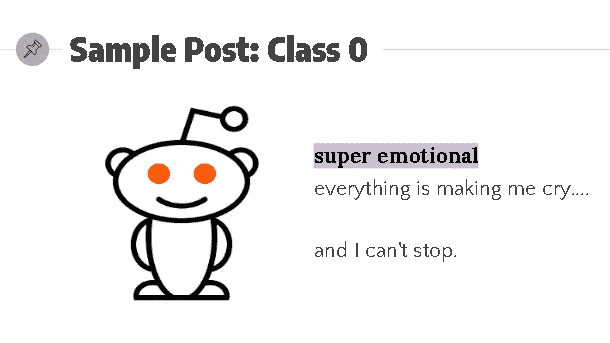
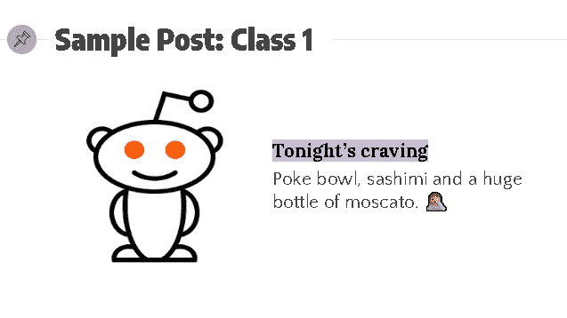
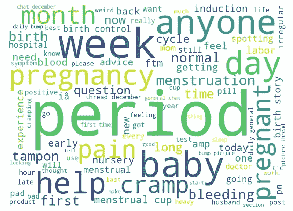

# 用自然语言处理和机器学习对 Reddit 帖子进行分类

> 原文：<https://towardsdatascience.com/classifying-reddit-posts-with-natural-language-processing-and-machine-learning-695f9a576ecb?source=collection_archive---------17----------------------->

## 探索文本转换和分类建模过程。

Photo by [Kevin Ku](https://unsplash.com/@ikukevk?utm_source=medium&utm_medium=referral) on [Unsplash](https://unsplash.com?utm_source=medium&utm_medium=referral)

在我的上一篇文章中，我向你展示了我使用机器学习来预测房价的数据科学过程(如下)。

 [## 使用机器学习来预测房价

### 在这篇文章中，我将向你展示我使用机器学习来预测房价的数据科学过程。之前…

towardsdatascience.com](/using-machine-learning-to-predict-home-prices-d5d534e42d38) 

在这篇文章中，我将带你经历相同的过程，但使用自然语言处理(NLP)和分类建模来分类 Reddit 帖子，从 [r/BabyBumps](https://www.reddit.com/r/BabyBumps) 和[r/月经](https://www.reddit.com/r/menstruation)。在我开始之前，让我们回顾一下数据科学流程(如下所述),然后是一个有趣的破冰者！

*   定义问题
*   收集和清理数据
*   探索数据
*   对数据建模
*   评估模型
*   回答问题

# 破冰者！

你能猜到这些帖子(如下图)来自哪个子网站吗？你的选择是**r/baby pumps**和**r/月经**。在评论中分享你的猜想吧！

# 定义问题

正如你可能已经猜到的，我的任务是使用机器学习来做你刚才试图做的事情！换句话说，**创建一个分类模型，可以区分一篇文章属于两个子条目中的哪一个**。

这个问题的假设是，一个心怀不满的 Reddit 后端开发人员进入每篇帖子，用“(̿̿ĺ̯̿̿̿̿)".因此，在重新分配每个帖子的子编辑字段之前，任何子编辑链接都不会填充帖子。

你可能已经收集到了，r/BabyBumps 和 r/月经中的帖子肯定会有很多交叉。例如，想象一下女性在任一渠道谈论对食物的渴望、痉挛或情绪波动。我喜欢挑战，所以我特意挑选了两个密切相关的子编辑，因为我想看看我如何利用自然语言处理和机器学习来准确地将帖子重新分类到它们各自的子编辑中。

**破冰者的答案可以在下一节最后一句找到，但是继续读下去，看看你是不是比我构建的算法更聪明！*

# 收集和清理数据

我的数据获取过程包括使用`requests`库循环通过请求，使用 Reddit 的 API 提取数据，这非常简单。要获得来自/r/月经的帖子，我只需添加。json 到 url 的末尾。Reddit 只为每个请求提供 25 个帖子，而我想要 1000 个，所以我重复了 40 次这个过程。我还在循环末尾使用了`time.sleep()`函数，以允许请求之间有一秒钟的间隔。

我的 for 循环输出了一个嵌套的 json 字典列表，我对其进行了索引，以提取我想要的功能，*帖子文本*和*标题*，同时将它们添加到两个 Pandas 数据帧中，一个用于 r/baby bump 相关的帖子，另一个用于 r/月经相关的帖子。

在我的文章进入各自的数据框架后，我检查了重复值和空值，这两种情况都发生了。对于重复的值，我通过使用`drop_duplicates()` 函数将其删除。空值只出现在我的 *Post* *Text* 列中，当 Reddit 用户决定只使用标题字段时就会出现这种情况。我决定不删除空值，因为我不想在我的 *Title* 专长的附随行中丢失有价值的信息，所以我用唯一的任意文本填充空值。

在清理和连接我的数据之后，我的最终数据帧包含 1818 个文档(行)和 3 个特征(列)。第三个特性是我的目标，其中类 1 (r/BabyBumps)的类平衡为 54%，类 0(r/月经)的类平衡为 46%——*破冰回答！*

# 探索数据

我创建了一个单词云，因为它们很有趣，而且我们正在处理文本数据！

这个词云包含来自两个子编辑的 100 个词。我生成它是为了直观地了解单词的频率(越大/越粗的单词频率越高)以及它们在子编辑中的共性如何影响我的模型；或者，如果像“月经杯”这样的词/短语出现频率中等，并且很可能只出现在或主要出现在 r/月经帖子中，它可能会对我的模型有利。

# 对数据建模

我通过创建我的 *X* 和 *y* 并将我的数据分成训练集和测试集来开始我的建模过程。然后，我继续我的特征工程过程，为我的*文章文本*和*标题*特征实例化两个 CountVectorizers。CountVectorizer 将文本文档(文本数据行)的集合转换为令牌计数的矩阵。我传递给它们的超参数是:

*   stop_words='english' ( *帖子正文* & *标题*)
*   strip_accents='ascii' ( *帖子正文* & *标题*)
*   ngram_range=(1，6)，min_df=.03 ( *Post Text* )
*   ngram_range=(1，3)，min_df=.01 ( *Title* )

停用字词删除英语中经常出现的字词。去除重音符号删除重音符号并执行其他字符规范化。Min_df 忽略文档频率严格低于给定阈值的术语。

一个 n-gram 就是一排 n 个单词组成的字符串。例如，如果您有一个包含“我爱我的猫”字样的文本文档—将 n-gram 范围设置为(1，2)将产生:“我爱|爱我的|我的猫”。拥有 n-gram 范围有助于为模型提供更多关于我输入的文本的上下文。

我假设将 *Title* 特性设置为(1，4)的 n 元语法范围将会清除噪声，并且通过添加更多的上下文对我的模型更有帮助。我仍然设置了一个温和的 min_df 来帮助清除任何额外的噪音。我对我的*帖子文本*特性做了类似的假设，尽管我给了它一个更高的 n-gram 范围，因为帖子文本往往更长。

这产生了 393 个特征，我把它们输入到下面列出的两个模型中。我构建了四个函数来运行每一对模型，grid 搜索了几个超参数，以找到最适合我的最终模型的超参数。

*   逻辑回归

差异在于*惩罚*和*解算器*参数。“newton-cg”、“lbfgs”和“sag”解算器仅处理 L2 惩罚(山脊正则化)，而“liblinear”和“saga”处理 L1(套索正则化)。

*   决策树和随机森林

这两个模型的差异是*标准*参数。一个被设置为“基尼”(基尼不纯)，而另一个被设置为“熵”(信息增益)。

*   多项式朴素贝叶斯

变量的差异是 *fit_prior* 参数，它决定是否学习类先验概率。如果为假，将使用统一的先验。一个设置为真，而另一个设置为假。

# 评估模型

我的第二个多项式朴素贝叶斯模型表现最好。最佳参数为 alpha = 0，fit_prior=False。在训练数据上的准确率为 92.4%，在未见过的数据上的准确率为 92.2%。这意味着我们的模型是轻微的，可能是不合理的过度拟合。这也意味着我们 92.2%的帖子会被我们的模型准确分类。

# 回答问题

考虑到收集的数据量很小，使用的特征量也很少，多项式朴素贝叶斯模型是最突出的。它很好地处理了看不见的数据，平衡了偏差和方差之间的权衡，是八个模型中最好的，所以我会用它来对 reddit 帖子进行重新分类。

然而，如果给我更多的时间和数据来回答这个问题，我会推荐两件事:1)花更多的时间在当前的功能上(例如设计一个单词长度功能)和 2)探索新的功能(例如 upvotes 或 post comments)。

查看一下 [**我的代码**](https://github.com/traintestbritt/classifying_reddit_posts/tree/master/notebooks) (出于可读性和组织性的目的，我将其分成 3 个 Jupyter 笔记本——收集、清理/探索和建模)和 [**我的演示文稿**](https://docs.google.com/presentation/d/1S3R8KSKmX8M_uOtiXYiAQbVpRUHqMC8QfxfBW7Zx18k/edit?usp=sharing) 。一如既往，请评论反馈和问题。感谢阅读！