# 用机器学习对社会流动性进行分类

> 原文：<https://towardsdatascience.com/classifying-social-mobility-with-machine-learning-fe6abcf0dcb2?source=collection_archive---------16----------------------->

## 使用管道和网格搜索交叉验证的 Python 中从头到尾的监督机器学习分类练习


Photo by [Hannah Morgan](https://unsplash.com/@hannahmorgan7?utm_source=medium&utm_medium=referral) on [Unsplash](https://unsplash.com?utm_source=medium&utm_medium=referral)

这篇博文将通过使用管道和网格搜索交叉验证，带您完成 Python 中的机器学习分类练习。作为一名数据科学家，我对数据如何帮助解决经济、社会和政治不平等问题深感兴趣，因此我决定使用一些基于社会的数据来解决这个分类问题。

我们正在创建的模型将采用特征(如收入水平、教育、种族构成等。)作为特征，尝试根据在这些位置长大的儿童的向上社会流动性，对美国各地的数千个人口普查区域进行分类。这种分类可能有助于确定低收入家庭的机会领域，并有助于为公共政策和资源分配提供信息。

我们将使用由哈佛大学研究人员和政策分析师组成的小组 [Opportunity Insights](https://opportunityinsights.org/data/) 提供的数据。我使用的数据来自两个不同的数据集，来自他们名为[机遇图谱:描绘社会流动性的童年根源](https://opportunityinsights.org/paper/the-opportunity-atlas/)的项目——我强烈建议对这个话题感兴趣的人查看一下。

在我们的机器学习过程中，我们将清理数据，进行一些特征工程，然后使用管道来找到最佳类型的监督模型。然后，我们将再次使用管道和网格搜索交叉验证来微调我们模型的超参数，以改进它。最后，我们将访问我们的模型的评分和结果，同时在看不见的数据上测试它。

开始吧！


Photo by [Andrew Wulf](https://unsplash.com/@andreuuuw?utm_source=medium&utm_medium=referral) on [Unsplash](https://unsplash.com?utm_source=medium&utm_medium=referral)

# 1.准备数据

我们所有的数据科学家都知道，数据在大多数情况下是一种混乱的东西！

我们的第一步是加载和清理数据，然后用一些特征工程为建模做准备。这往往是数据科学过程中最耗时的步骤，但是在您认为您的数据已经可以进行建模之前，应该进行良好的探索性数据分析。至少，您会希望查看每个列的内容和数据类型，检查任何空值和异常值，查看数据分布，并检查特性之间的相关性。对于大多数机器学习模型**来说，标准化**也是至关重要的(我发现[对标准化的这种](https://medium.com/@swethalakshmanan14/how-when-and-why-should-you-normalize-standardize-rescale-your-data-3f083def38ff)解释非常清晰和有用)。但是，在我们的流程中，我们将进一步将这一步骤纳入我们的管道中。

在我们的练习中，我们还将把这些特性连接到另一个数据框架，在那里我们将通过一些特性工程来计算我们的目标变量。

作为我的第一步，我喜欢在笔记本的开头加载所有我需要的库。我们将使用 Pandas、Matplotlib 和 Seaborn 进行一些可视化，并严重依赖于几个非常有用的 Scikit-Learn 库，它们涵盖了我们大多数的机器学习需求。

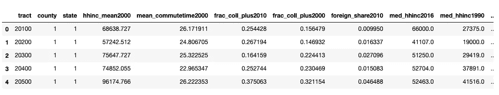

Dataframe downloaded from [Opportunity Insights](https://opportunityinsights.org/data/)

对于一个机器学习项目，我们有一个合理大小的数据集，超过 74K 行和 38 列，大部分是数字。所有栏目的完整描述可在人口普查区域的[社区特征的自述文件中找到，但大部分是自我解释的。让我们看看所有的列。我们可以使用`df.info()`一次查看数据类型和空值，但是我喜欢用`df.dtypes`分别检查数据类型，然后用一个简单的计算检查每一列中 nan 的百分比:](https://opportunityinsights.org/data/)


每一行都由人口普查区域、县和州标识，因此为了使标识符唯一，我们将把这三者组合成一个唯一的“ID”列。我们还将选择删除 nan 百分比高的列。

然后，我们想看看我们的数字数据的主要统计。因为我们有 38 列，如果我简单地调用`df.describe()`，熊猫不会显示所有的列。有几种方法可以解决这个问题，并能够可视化所有列的统计信息，但我个人认为最简单的方法是简单地分割 dataframe 并调用 describe 方法两次(或更多次)。

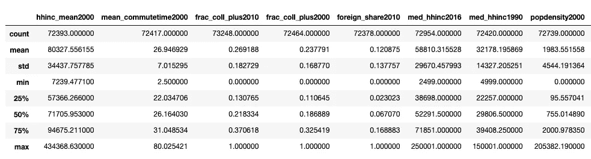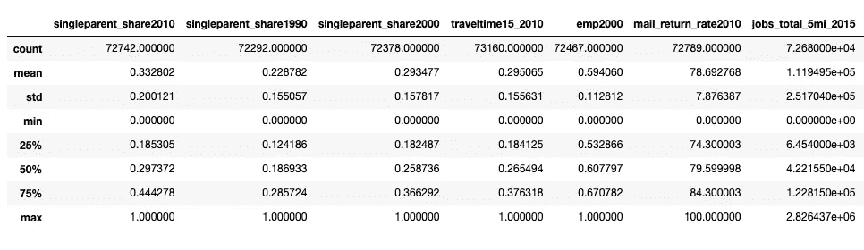

最后，在深入特性工程之前，我将通过调用`df.hist()`来看一下总体分布。

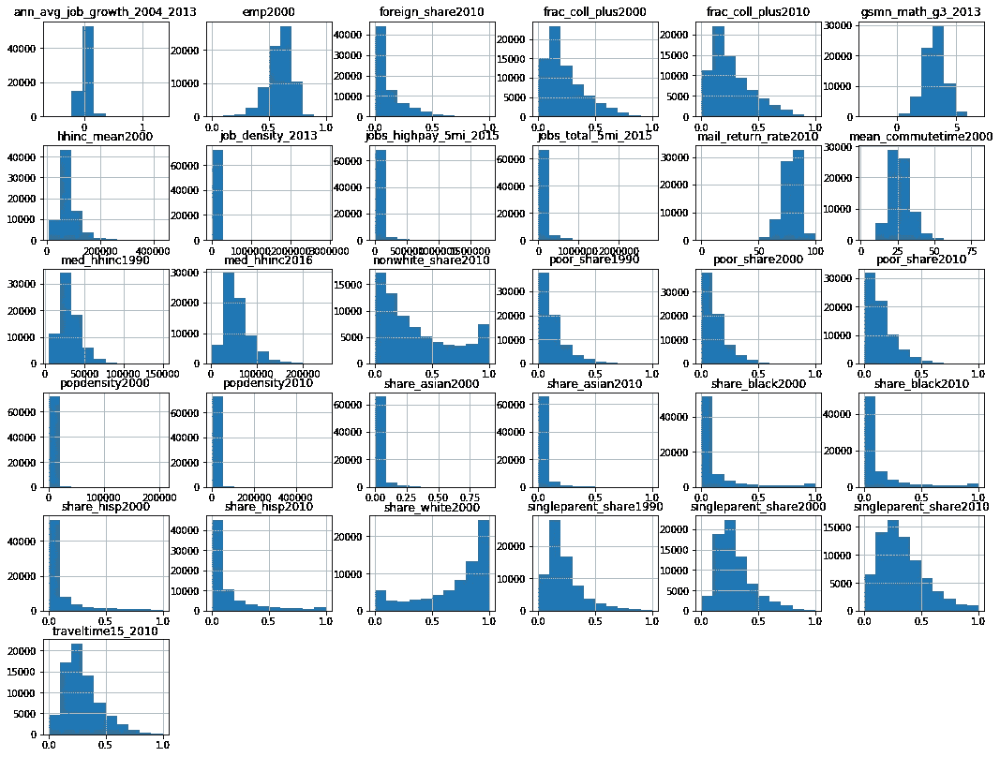

就规模而言，各列之间存在明显的差异，但如前所述，扩展将包括在我们的管道中。我们也没有任何分类特征，因此我将在我们的特征中执行的唯一工程是获取我们多年来测量的数据，这些数据不是基于份额的，并计算它们的百分比方差/变化，因为这在分析区域特征时对我们更有意义(这些年来区域是否有所改善，用什么方法来衡量？).

现在，我们将引入目标变量的数据。鉴于这是一个非常大的文件，我们将只加载数据集中必要的列[按人口普查区域、种族、性别和父母收入百分比](https://opportunityinsights.org/data/)列出的所有结果。为了计算社会流动性，我们将按人口普查区域使用父母和子女的收入等级列，然后当父母和子女的收入差等于或小于零时，将它们标记为 0，当收入等级差为正时，将它们标记为 1(意味着向上的社会流动性)。在这之后，我将合并两个数据帧，通过惟一 ID 列匹配区域。

在我们的一些列中仍然有高达 3.6%的空值，但是因为每一行都代表美国的一个特定地理区域，所以我没有删除它们，而是用列中值替换它们。

最后，我们将看看相关性，以及我们的目标结果的平衡。

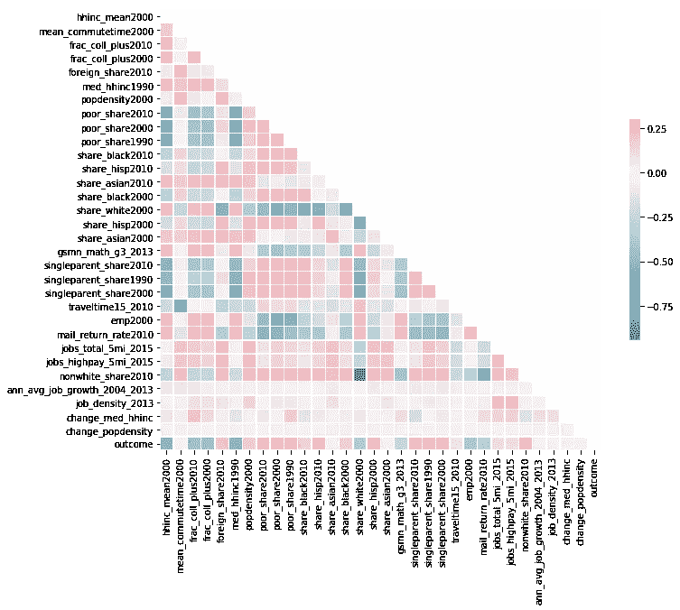

Seaborn correlation matrix

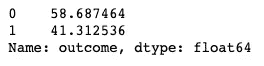

我们的目标足够平衡，所以在分割数据之前，我们不需要做任何平衡方法。

**将数据分为训练集、验证集和测试集**

总是有必要将数据分成定型集和测试集，以便您可以使用一部分数据来定型模型，一部分数据来测试模型。我还喜欢将训练集进一步分为训练和验证，这样我就可以在微调模型时使用验证数据，而只在我觉得我的模型达到最佳状态后才保留看不见的测试数据。

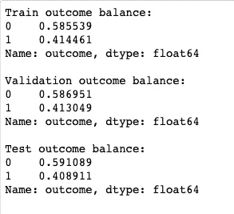

Checking percentage of outcomes in each dataset

太好了，我们现在有三个结果平衡的数据集可以训练了！


Photo by [Markus Spiske](https://unsplash.com/@markusspiske?utm_source=medium&utm_medium=referral) on [Unsplash](https://unsplash.com?utm_source=medium&utm_medium=referral)

# 2.拟合、评估和调整模型

我们正在研究一个有监督的二元分类问题，因此我们可以使用几种不同类型的模型来得到我们的结果。我们也没有太大的数据集，这在处理成本方面释放了一些约束。因为我们有这样的自由，没有太多的计算需求，我们将通过几个不同类型的模型，看看他们的表现如何。

## 选择模型

我将创建一个管道，并为几种不同类型的模型运行一个普通模型，以查看每种模型如何处理我们的数据。我的管道将缩放数据，并在一个循环中训练每个模型。然后，我们将使用验证数据集来检查每个模型的总体准确性，以进行比较，并决定哪一个模型能够以最少的调整为我们的数据提供最佳结果。

这是我们的结果:

```
KNeighborsClassifier(algorithm='auto', leaf_size=30, metric='minkowski',
           metric_params=None, n_jobs=None, n_neighbors=5, p=2,
           weights='uniform')
model score: 0.8420469083155651
----------------
SVC(C=1.0, cache_size=200, class_weight=None, coef0=0.0,
  decision_function_shape='ovr', degree=3, gamma='auto_deprecated',
  kernel='rbf', max_iter=-1, probability=False, random_state=None,
  shrinking=True, tol=0.001, verbose=False)
model score: 0.8640511727078891
----------------
LinearSVC(C=1.0, class_weight=None, dual=True, fit_intercept=True,
     intercept_scaling=1, loss='squared_hinge', max_iter=1000,
     multi_class='ovr', penalty='l2', random_state=None, tol=0.0001,
     verbose=0)
model score: 0.8436673773987207
----------------
NuSVC(cache_size=200, class_weight=None, coef0=0.0,
   decision_function_shape='ovr', degree=3, gamma='auto_deprecated',
   kernel='rbf', max_iter=-1, nu=0.5, probability=False, random_state=None,
   shrinking=True, tol=0.001, verbose=False)
model score: 0.8354797441364605
----------------
DecisionTreeClassifier(class_weight=None, criterion='gini', max_depth=None,
            max_features=None, max_leaf_nodes=None,
            min_impurity_decrease=0.0, min_impurity_split=None,
            min_samples_leaf=1, min_samples_split=2,
            min_weight_fraction_leaf=0.0, presort=False, random_state=None,
            splitter='best')
model score: 0.8001705756929638
----------------
RandomForestClassifier(bootstrap=True, class_weight=None, criterion='gini',
            max_depth=None, max_features='auto', max_leaf_nodes=None,
            min_impurity_decrease=0.0, min_impurity_split=None,
            min_samples_leaf=1, min_samples_split=2,
            min_weight_fraction_leaf=0.0, n_estimators=10, n_jobs=None,
            oob_score=False, random_state=None, verbose=0,
            warm_start=False)
model score: 0.8484434968017057
----------------
AdaBoostClassifier(algorithm='SAMME.R', base_estimator=None,
          learning_rate=1.0, n_estimators=50, random_state=None)
model score: 0.8504904051172708
----------------
GradientBoostingClassifier(criterion='friedman_mse', init=None,
              learning_rate=0.1, loss='deviance', max_depth=3,
              max_features=None, max_leaf_nodes=None,
              min_impurity_decrease=0.0, min_impurity_split=None,
              min_samples_leaf=1, min_samples_split=2,
              min_weight_fraction_leaf=0.0, n_estimators=100,
              n_iter_no_change=None, presort='auto', random_state=None,
              subsample=1.0, tol=0.0001, validation_fraction=0.1,
              verbose=0, warm_start=False)
model score: 0.8581663113006397
----------------
XGBClassifier(base_score=0.5, booster='gbtree', colsample_bylevel=1,
       colsample_bytree=1, gamma=0, learning_rate=0.1, max_delta_step=0,
       max_depth=3, min_child_weight=1, missing=None, n_estimators=100,
       n_jobs=1, nthread=None, objective='binary:logistic', random_state=0,
       reg_alpha=0, reg_lambda=1, scale_pos_weight=1, seed=None,
       silent=True, subsample=1)
model score: 0.8575692963752666
----------------
```

我们的结果表明，我们可能会将非线性支持向量机视为分类问题的最佳模型。


Photo by [Scott Webb](https://unsplash.com/@scottwebb?utm_source=medium&utm_medium=referral) on [Unsplash](https://unsplash.com?utm_source=medium&utm_medium=referral)

## **通过管道和 CV 网格搜索进行超参数调谐**

现在，让我们尝试通过对超参数进行一些调整来改善我们的模型结果。我现在想在这个模型上运行另一个管道，进行网格搜索和交叉验证，以测试 C 和 gamma 参数的一些值，并找到为我们的模型提供最佳结果的值。

我计时是因为这样的网格搜索需要一段时间来适应。在我的机器上，大约需要 36 分钟。例如，如果您需要重新启动内核，您可以做一件事来避免再次运行这样的长网格搜索，那就是保存它，然后重新加载它:

我们现在可以访问用`grid_svm.best_params_`找到的最佳参数。在我们的模型中，最佳值是`C: 10, gamma: 0.01`。

## 评估模型

让我们用这些最佳参数来检查我们的模型的准确性分数，包括训练数据和验证数据。

对于训练数据，我们得到 0.8749173721133549 的分数，对于验证数据，我们得到 0.8622601279317698 的分数。这表明我们的模型没有过度拟合，并且我们的模型分类准确率略高于 86%。

我们还可以通过查看精确度、召回率和 F1 分数来进一步分析模型的性能。一个简单的方法是打印分类报告。我们也可以打印混淆矩阵来查看我们的真和假阳性和阴性的实际数字。

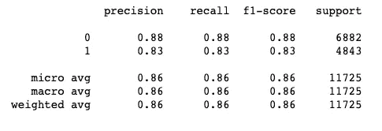

Classification report from validation data

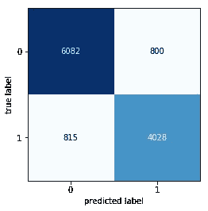

Confusion matrix from validation data

在这个图中，我们可以看到深蓝色的真正的负面和浅蓝色的真正的正面。浅色表示我们的分类模型出错的标签。这是绝对值，显示了我们的准确度、精确度、召回率和 F1 分数用于生成其值的数字。

在所有的超参数调整之后，我们还可以使用看不见的测试数据来确认我们的模型的性能。将分数与测试数据进行比较，我们得到一个`0.8638782751091703`的准确度分数。这是我们的分类报告和测试数据的混淆矩阵:

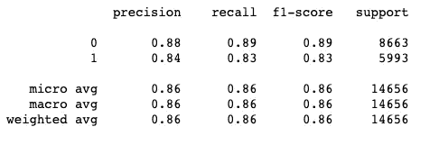

Classification report from test data

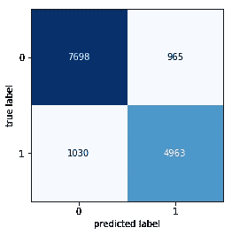

Confusion matrix from test data

我们有类似的结果，所以我们可以确认我们的模型的性能。

当我们在处理一个社会项目时，由于人类和社会条件的复杂性，预计我们的模型将无法以近乎完美的精度预测/分类社会流动性。这意味着，除了他们成长环境的构成，许多不同的因素影响着孩子的结果。在社交领域，最大的挑战之一是能够收集正确的数据。例如，在孩子上学的过程中有一个激励性的老师，可能会产生相关的影响，甚至有助于预测积极的结果，但这几乎不可能用统计数据来衡量。

考虑到挑战和制约因素，我们认为我们的模型在正确分类方面仍然做得相当好，并且除了其他资源之外，还可以有助于识别社会流动性的机遇和挑战。

我希望这个过程对任何学习监督机器学习以及如何使用管道和网格搜索的人有所帮助！请留下您的评论，并在此使用完整的笔记本[随时查看存储库。](https://github.com/gioamorim80/Social-Mobility-Classification-Machine-Learning/blob/master/Classfication%20-%20Module%205%20Final%20Project.ipynb)