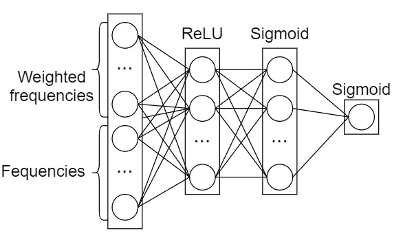

# 基于统计文本分析和机器学习的空间组织命名实体分类

> 原文：<https://towardsdatascience.com/classifying-spacys-org-named-entities-with-statistical-text-analysis-and-machine-learning-7e99ed7a58c3?source=collection_archive---------24----------------------->


# 介绍

最近，我们用 **spaCy** 标记了许多文本，以便提取组织名称。我们面临一个问题:许多用 spaCy 标记的实体根本不是有效的组织名称。实际上，这并不是**空间**本身的问题:所有提取的实体，乍一看，确实像组织名称。如果我们更多地训练**空间**模型，效果会更好。然而，这种方法需要一个大语料库的适当标记的数据，其中还应包括一个适当的背景。因此，我们需要一个更简单的解决方案来过滤掉错误的数据。

我们决定尝试解决这个问题的方法是基于简单的考虑:如果我们查看文本，可能会有一些在组织名称旁边使用更频繁的单词列表。比如像 *corporation，ltd，co，Llc，foundation，group，*等词汇。我们需要的是:
a)足够大的单词列表以获得更好的数据质量
b)确保这些单词确实出现在现实世界中

# 收集单词统计信息

为了测试我们的假设，我们收集了一些单独单词的使用频率，以及一些人工标注的公司名称。这里我们应该提到，我们实际上尝试了两种方法。第一个是直接计算一个特定的词在一个特定的命名实体中被提及的次数。然而，在我们用这种数据建立了模型之后，事实证明这种模型的表现并不好。它勉强超过了 50%的准确率阈值，召回率下降了近 40%。所以我们修改了这种方法，它确实显示了更好的结果。


Statistics collecting schema

为了改进我们的方法，我们考虑了单词之间的距离。我们是这样做的:我们仍然收集一个词的频率，但我们也收集这个词的加权频率(权重)。重量的定义如下:


Word weight from distance calculation formula

其中 *dist* 是以单词和命名实体之间的单词数度量的整数距离， **α** —参数，增加或降低单词在更高距离上的权重损失速度。在试验了一小组例子后，我们选择 **α** 为 15。

因此，如果一个词经常接近一个命名实体，它的加权频率就会相对较高，反之则较低。我们还决定忽略距离命名实体超过 30 个单词的单词，因为它们不太可能与该命名实体相关。下面是 Python 中的代码，我们用它收集了所有独立单词的统计数据。它可以稍微改进，但我们认为它对于一次性使用已经足够好了。

```
**import** re
**import** numpy **as** np**from** bs4 **import** BeautifulSoup
**from** IPython **import** display**def** **dist_weight**(x, alpha = 15):
    """you may choose different alpha and see what happens. 
    """
    **return** np.exp(-(x ** 2) / alpha)word_re = re.compile("(?:^|[\-\\|\,\.\(\)]|\s+)([a-zA-Z][a-zA-Z]+)") #regex for finding words in text**def** **append_words_stats**(words_stats, text, ne):
    words = [(text[match.span(1)[0] : match.span(1)[1]].lower(),
              match.span(1)[0],
              match.span(1)[1],
              idx) **for** idx, match **in** enumerate(word_re.finditer(text))] # find all words in text and their position

    **for** ne_match **in** re.finditer(ne[0].lower(), text.lower()): # for all positions of named entity in text
        ne_start = ne_match.span(0)[0]
        ne_word_num = **None** # There were cases when named entity was present in a text but was not a word in terms of the above regex.
       # Since we are not interested in absolute precision, we decided to bypass this case with such a simple way

        **for** word **in** words: 
            **if** word[1] <= ne_start < word[2]:
                ne_word_num = word[3]
                **break**

        **if** ne_word_num:        
            **for** word **in** words:
                dist = abs(ne_word_num - word[3])
                **if** dist > 30:
                    **continue**

                **if** word[0] **not** **in** words_stats:
                    words_stats[word[0]] = {
                        'org' : 0,
                        'org_f' : 0,
                        'non_org' : 0,
                        'non_org_f' : 0,
                    } ne_type = ("non_" **if** ne[1] == 0 **else** "") + "org"
                words_stats[word[0]][ne_type] += dist_weight(dist)
                words_stats[word[0]][ne_type + "_f"] += 1

words_stats = {}**for** idx, filename **in** enumerate(filenames):
    **with** open(filename, "r", encoding = 'utf-8') **as** file:
        soup = BeautifulSoup(file.read())

        **for** p **in** soup.find_all("p"):
            **for** ne **in** nes:
                **if** ne[0].lower() **in** p.text.lower():
                    append_words_stats(words_stats, p.text, ne)
```

注意，这里的`nes`是一个双元素元组列表，其中第一个元素是一个命名实体文本本身，第二个元素是一个二进制值，表示一个命名实体是否是一个组织名称(我们手工标记了它们)。`filenames` 是我们在搜索每个命名实体时保存的文件列表。

处理完所有文件后，我们将收集的统计数据转换成 pandas *DataFrame —* `words_stats_df`(参见下面的代码)。然后我们创建了两个新列，分别是 1000 次使用的单词的平均权重，以及组织和非组织的名称。然后，对于每个单词，我们计算一个值`words_stats_df[“ir”]` ——我们的好奇率。好奇率显示了某个词平均有多少次更接近组织，而不是非组织。当然，很多数据包含零，所以在计算新列时`inf` 或零会出现。为此，我们将计算值传递给一个带偏移量的 sigmoid 函数。因此，如果某个单词几乎同样可能与组织和非组织的名称一起使用，则其好奇率将接近 0.5。有趣的单词是那些好奇率接近 1 或 0 的单词。

```
**import** pandas **as** pdwords_stats_df = pd.DataFrame\
.from_dict(words_stats,
           orient = "index",
           columns = [
                       'org', 'org_f',
                       'non_org', 'non_org_f',
                     ])\
.reset_index()\
.rename(str, columns = {'index' : 'word'})words_stats_df["org_n"] = (words_stats_df["org"] / words_stats_df["org_f"]) * 1000                  
words_stats_df["non_org_n"] = (words_stats_df["non_org"] / words_stats_df["non_org_f"]) * 1000**def** **sigmoid**(x, alpha = 1, offset = 0):
    **return** 1 / (1 + np.exp(-alpha * (x - offset)))words_stats_df["ir"] = ((words_stats_df["org"] * words_stats_df["non_org_f"]) / \
                       (words_stats_df["org_f"] * words_stats_df["non_org"]))   \
                       .apply(**lambda** x: sigmoid(x, 5, 1))words_stats_df.sort_values("ir", ascending = **False**, inplace = **True**)
```

如果我们看一下收集的数据，我们可以看到:


Collected statistics example

(为了更好地分析，我们收集了一些额外的统计数据)

这里有一些进步:我们可以看到，像*子公司、合并、公司、法律、有限公司、*等词真的在列表的顶部。这意味着，我们正朝着正确的方向前进。现在，有了这些数据，我们需要选择一个经常与组织名称一起使用的单词列表。一个小注意:这个列表应该是一个不带偏见的单词列表，例如，不能与公司的产品或活动有任何关系。否则，这些话将与其他组织不一致。

在简单浏览了这个数据集之后，我们选择了一个包含 100 个我们认为是组织特征的单词的列表，以及一个包含 26 个我们认为是非组织特征的单词的列表:

```
orgs_selected_words = [
    'merger', 'conglomerate', 'corp', 'subsidiary', 'corporation', 'stock', 'founder', 'merged', 'acquired', 'subsidiaries', 'legal', 'exchange' , 'ltd', 'group', 'co', 'largest', 'renamed', 'revenues', 'supplier', 'venture', 'member', 'interest', 'owns', 'property', 'country', 'inc', 'firm', 'industries', 'division', 'partnership', 'shares', 'owned', 'operations', 'name', 'investment', 'facilities', 'changed', 'manufactured', 'general', 'revenue', 'ownership', 'management', 'cash', 'meeting', 'ranked', 'separated', 'shareholder', 'interests', 'affiliates', 'engaged', 'parent', 'reserved', 'rights', 'patents', 'capitalization', 'enlarge', 'complaining', 'alleged', 'proceed', 'anticipates', 'mergers', 'acquirer', 'wholly', 'demerged', 'merge', 'handing', 'european',  'nasdaq', 'german', 'purchased', 'france', 'biggest', 'investments', 'commission', 'europe', 'managed', 'assets', 'fund', 'senior', 'deal', 'funds', 'traded', 'acquisitions', 'charges', 'subsequent', 'wealth', 'hired', 'leverage', 'journal', 'early', 'bank', 'working', 'ordered', 'world', 'employee', 'contact', 'share', 'firms', 'shortage', 'founded',    
]non_orgs_selected_words = [
    'consumer', 'home', 'buy', 'testing', 'reports', 'offering', 'offer', 'offers', 'special', 'reality', 'followed', 'failed', 'businesses', 'community', 'school', 'purchases', 'complex', 'detailed', 'buying', 'newer', 'events', 'enabled', 'alternative', 'advance', 'upcoming', 'releases',
]selected_words = orgs_selected_words + non_orgs_selected_words
```

# 收集训练\测试数据

现在我们有了一个选择单词的列表，我们需要为我们的最终模型收集训练和测试数据。这里有一些代码样本，也是用 Python 写的，我们用来收集数据。

为数据采集准备数据帧:

```
ws_df = pd.DataFrame()ws_df["ne_id"] = 0.
ws_df["is_org"] = 0.**for** selected_word **in** selected_words:
    ws_df[selected_word + "_w"] = 0.
    ws_df[selected_word + "_f"] = 0.**for** ne **in** nes:
    ws_df.loc[ne[2]] = 0
    ws_df.at[ne[2], "is_org"] = ne[1]ws_df["org_id"] = ws_df.index
```

这里的`nes` 是一个由三个元素组成的元组列表:第一个和第二个元素是相同的，与上面的`nes`相同，第三个元素是一个惟一的命名实体 id。

我们修改了第一个代码片段中的代码来收集数据，所以这里是唯一改变的地方:

```
**def** **append_selected_words_stats**(ws_df, text, selected_words, ne):
    words = [(text[match.span(1)[0] : match.span(1)[1]].lower(),
              match.span(1)[0],
              match.span(1)[1],
              idx,
              1 **if** text[match.span(1)[0] : match.span(1)[1]].lower() **in** selected_words **else** 0)
             **for** idx, match **in** enumerate(word_re.finditer(text))]

    # ...................

                    **if** dist > 30:
                        **continue**

                    ws_df.at[ne[2], word[0] + "_w"] += dist_weight(dist)
                    ws_df.at[ne[2], word[0] + "_f"] += 1**def** **collect_words_stats**(ws_df, filenames, nes):
    # ....................
                        append_selected_words_stats(ws_df, p.text, selected_words, ne) collect_words_stats(ws_df, train_filenames, nes)
```

收集数据后，我们将它标准化为各种类型的统计数据:

```
**def** **preprocess_ws**(ws_df):
    **for** stat_type **in** ["w", "f"]:
        stat_type_cols = [selected_word + "_" + stat_type **for** selected_word **in** selected_words] s = ws_df[stat_type_cols].sum(axis = 1) **for** stat_type_col **in** stat_type_cols:
            ws_df[stat_type_col] /= s

        ws_df.fillna(0, inplace = **True**)

    print(ws_df.values.shape)preprocess_ws(ws_df)
```

并分成训练\测试:

```
**from** sklearn.model_selection **import** train_test_splittrain_nes, test_nes = train_test_split(nes, test_size = 0.25)train_nes = [ne[2] **for** ne **in** train_nes]
test_nes  = [ne[2] **for** ne **in** test_nes]train_ws_df = ws_df[ws_df["ne_id"].isin(train_nes)]
test_ws_df = ws_df[ws_df["ne_id"].isin(test_nes)]
```

# 设计模型



Neural Network Architecture

实际上，在尝试机器学习方法之前，我们已经尝试了一个简单的带有手动权重计算的二元回归模型(使用线性回归分析公式)。但是这个模型没有给出任何好的结果，所以我们决定尝试一个更复杂的模型——神经网络。

首先，我们为模型准备了数据:

```
**from** sklearn.preprocessing **import** OneHotEncodercols_order = [selected_word + "_w" **for** selected_word **in** selected_words] + \
             [selected_word + "_f" **for** selected_word **in** selected_words]x_train = train_ws_df[cols_order].values
x_test  = test_ws_df[cols_order].valuesenc = OneHotEncoder()
enc.fit(train_ws_df["is_org"].values.reshape((-1, 1)))
y_train = enc.transform(train_ws_df["is_org"].values.reshape((-1, 1))).toarray()enc = OneHotEncoder()
enc.fit(test_ws_df["is_org"].values.reshape((-1, 1)))
y_test = enc.transform(test_ws_df["is_org"].values.reshape((-1, 1))).toarray()
```

然后，我们设计了模型(我们用一个`*SGD*` 优化器和一个`binary_crossentropy` 损失函数来编译它):

```
**from** keras.models **import** Model
**from** keras.layers **import** Input, Denseinput = Input((x_train.shape[1],))x = inputx = Dense(100, activation = 'relu')(x)
x = Dense(75, activation = 'sigmoid')(x)output = Dense(1, activation = 'sigmoid')(x)model = Model([input], [output])model.summary()"""
_________________________________________________________________
Layer (type)                 Output Shape              Param #   
=================================================================
input_1 (InputLayer)         (None, 252)               0         
_________________________________________________________________
dense_1 (Dense)              (None, 100)               25300     
_________________________________________________________________
dense_2 (Dense)              (None, 75)                7575      
_________________________________________________________________
dense_3 (Dense)              (None, 1)                 76        
=================================================================
Total params: 32,951
Trainable params: 32,951
Non-trainable params: 0
_________________________________________________________________
"""
```

事实上，我们尝试了一些模型架构。但是，从训练结果来看，测试数据存在某种阈值，模型无法通过。我们选择了过度配合最少的架构。


在训练模型时，我们发现了一件有趣的事情:无论架构如何，模型都不会以恒定的学习速率收敛。只有当我们先用低学习率训练它几个时期(时期 1-100)，然后用高学习率训练它几个时期(时期 100-200)，再用低学习率训练它(时期 200-300)时，它才会收敛。如果我们从一开始就保持一个恒定的低或高的学习率，模型的准确性是稳定的，并不比随机猜测好。

# 分析结果

可能有几个主要的原因导致我们没有达到模型的任何真正高的精度或召回值。下面是对数据和结果进行简要分析后得出的结论:

1.  精选单词小词典。在一些组织中，所选的单词只被使用了几次，而这个单词本身却和其他组织名称一起被频繁使用。因此，一本更大的精选词汇词典可能会有所帮助。它还必须包括更多的非组织通用词。
2.  我们只关注美国的组织。这就是为什么我们只使用英语单词和搜索词。然而，有一些组织(几乎占总数的 7%)在他们的名字周围没有任何被选中的单词。这是因为这些组织返回的页面大多不是英文的。因此，这一因素可以通过扩大语言范围，翻译选定的单词或在其他语言中使用不同的单词来消除。
3.  更多带标签的数据。我们只标记了大约 1600 条记录，其中大约 750 条是组织名称。包括如何在文本摘要中呈现组织名称的各种方式，这个数量可能不足以实现高模型质量。
4.  不平衡的数据集。我们希望选择与组织的活动和产品没有直接关系的词。然而，这似乎不是我们最好的决定。例如，我们随机选择了一家主要从事银行和投资的大公司。因此，我们需要包含一些与此活动相关的词，以便从我们的模型中获得更好的结果。
5.  总体数据更多。这一点值得怀疑，因为我们从大约 5.5GBs 的 HTML 页面中收集了 train\test 数据，这似乎很多。但是由于默认情况下 Bing 返回的搜索结果的数量，每个命名实体只有 8 个 HTML 页面。

尽管如此，对于非组织的较低召回的代价(在测试中接近 70%，这很可能通过解决上述问题来提高)，我们得到了 75%的准确率。这比我们在没有机器学习模型(47%的准确率)的情况下仅使用这种方法所能实现的要好得多。

# 结论

模型的结果表明，所描述的方法可以应用于命名实体分类或过滤。当模型实现或命名实体标记不能处理像 HTML 页面这样的复杂情况时，这可能是有用的，在 HTML 页面中，不是所有的命名实体都有适当的文本上下文。

# 承认

我要感谢我的同事们[安迪·博西](https://www.linkedin.com/in/andybosyi/)、[米科拉·科兹连科](https://www.linkedin.com/in/mykola-kozlenko/)、[维亚奇·博西](https://www.linkedin.com/in/viach-b/)和[亚历克斯·西姆基夫](https://www.linkedin.com/in/oleksiy-simkiv/)富有成效的讨论、合作和有益的建议，以及整个 [MindCraft.ai](http://mindcraft.ai/) 团队的持续支持。