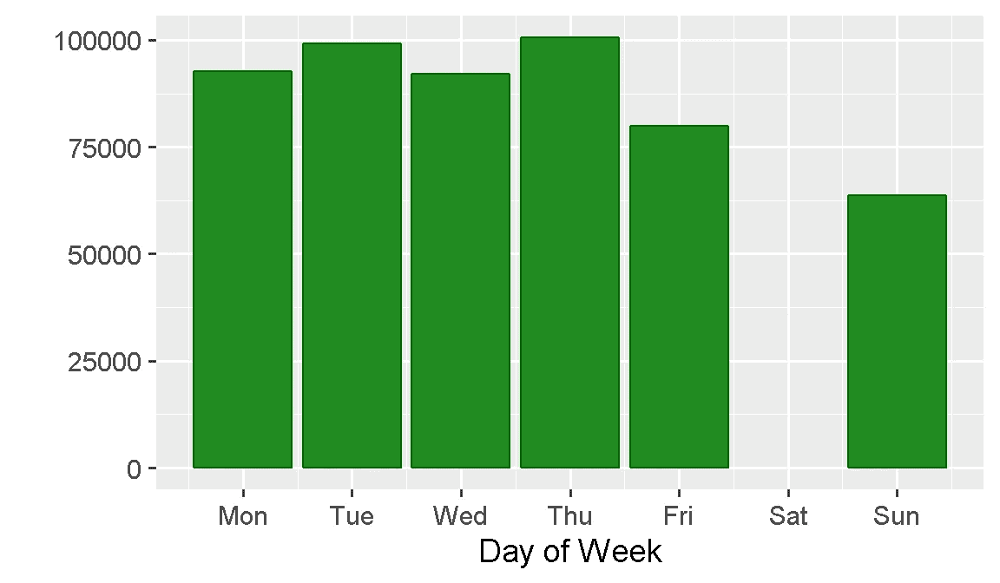
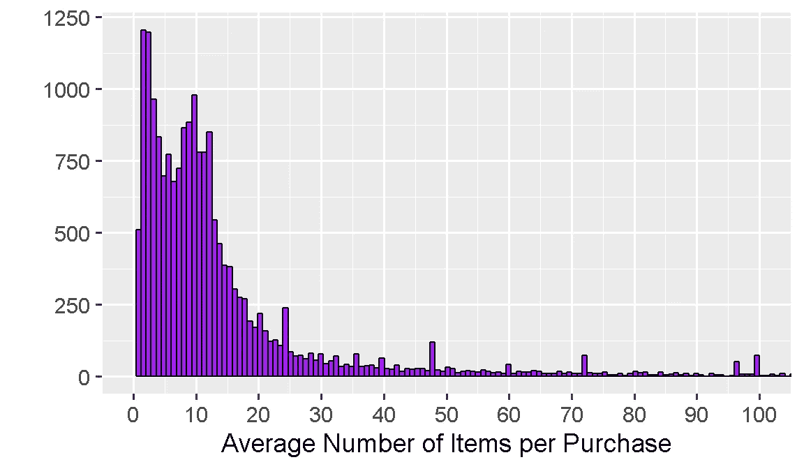

# 清理复杂的数据集，以便使用推荐算法进行建模

> 原文：<https://towardsdatascience.com/clean-a-complex-dataset-for-modelling-with-recommendation-algorithms-c977f7ba28b1?source=collection_archive---------6----------------------->

## 我对购物篮分析的看法——第 1 部分，共 3 部分


Photo by [Tina Bosse](https://unsplash.com/photos/WSw-taiyZPk?utm_source=unsplash&utm_medium=referral&utm_content=creditCopyText) on [Unsplash](https://unsplash.com/?utm_source=unsplash&utm_medium=referral&utm_content=creditCopyText)

## O 远景

最近我想学习一些新的东西，并挑战自己进行端到端的**市场篮子分析**。为了继续挑战自己，我决定将我的努力成果展示给数据科学界。还有什么论坛比我最喜欢的数据科学博客更适合我的**第一个**系列帖子呢！

这是**三个岗位**中的**第一个**，排列如下:

> ***第 1 部分*** *:探索并清理适合用推荐算法建模的数据集* ***第 2 部分*** *:用* ***推荐器应用各种产品推荐模型 lab*******R 包******第 3 部分****

## *介绍*

***购物篮分析**或 MBA [(也称为亲和力分析)](https://en.wikipedia.org/wiki/Affinity_analysis)是一套数据挖掘和数据分析技术，用于了解客户的购物行为，并揭示他们购买的产品之间的关系。通过分析零售购物篮构成、交易数据或浏览历史等，这些方法可用于向客户推荐他们可能感兴趣的商品。这种推荐可以提高客户忠诚度，通过帮助客户更快地找到相关产品来提高转化率，并通过建议额外的项目或服务来促进交叉销售和向上销售。*

*推荐系统广泛应用于多个行业。在线零售商**亚马逊**使用这些方法向他们的客户推荐其他人经常一起购买的产品(“买了这件商品的客户也买了……”)。自 2015 年以来，每周一娱乐公司 Spotify 都会根据用户的消费历史，向他们的用户推荐 30 首他们从未听过的歌曲。2009 年，**网飞**举办了一场著名的竞赛[(Netflix 奖)](http://www.netflixprize.com)，向改进电影推荐系统预测的团队颁发了 100 万美元的大奖。*

*购物篮分析还可应用于以下领域:*

*   *晋升: MBA 可能会给出如何安排晋升日程的提示。当两件商品(比如手电筒&电池)经常一起购买时，零售商可能会决定只促销一件商品来促进另一件的销售。*
*   ***店铺设计:**店铺布局可以设计成将经常同时购买的商品(如牛奶&麦片、洗发水&护发素、肉类&蔬菜等)放置在一起。)*
*   ***忠诚度计划:**当一名顾客在一段时间内不活跃时，系统会提示他/她重新参与基于其购买历史的定制优惠活动。*

# *数据*

*这个项目的数据来自 [**UCI 机器学习知识库**](http://archive.ics.uci.edu/ml/index.php) ，这是一个大型数据集的在线档案，包括各种各样的数据类型、分析任务和应用领域。*

*在这个项目中，我使用的是 [**在线零售**](http://archive.ics.uci.edu/ml/datasets/online+retail) 数据集，由伦敦南岸大学工程学院于 2015 年捐赠给 UCI。该数据集包含一家总部位于英国的注册在线零售公司在 2010 年 12 月 1 日至 2011 年 12 月 9 日之间发生的交易。该公司主要销售独特的全场合礼品，他们的许多客户是批发商。*

*我选择这个特殊的数据集是因为它的"*现实生活*"性质，这在我在*描述*字段中找到的许多手动输入的注释和调整代码中有所体现。甚至还有公司员工留下的个人评论，他们可能每天都在使用这个数据库。*

*有理由假设数据集直接来自公司的数据库，几乎没有改动。根据经验，这与分析师最有可能从他们要进行分析的客户那里接收数据的状态是一致的。*

# *数据准备*

```
*# Importing R libraries
library(data.table)           
library(readxl)               
library(tidyverse)
library(lubridate)
library(skimr)                
library(knitr)                
library(treemap)*
```

## *加载和检查数据*

```
*# import raw data file and trim leading and trailing whitespaces
retail <- read_excel("../00_Data/Online Retail.xlsx", 
                        trim_ws = TRUE)*
```

*该数据集由分布在 8 个变量中的 540，000 多个观察值组成。几个*描述*和几个*客户 id*丢失，还有一些奇怪的负数*数量*和*单价*值得调查。同样值得注意的是 *InvoiceDate* 是 POSIXct 格式，从中可以提取购买日期和时间的信息。*

```
*# First glance at the data
retail %>%  skim()
## Skim summary statistics
##  n obs: 541909 
##  n variables: 8 
## 
## -- Variable type:character ------------------
##     variable missing complete      n min max empty n_unique
##      Country       0   541909 541909   3  20     0       38
##  Description    1454   540455 541909   1  35     0     4211
##    InvoiceNo       0   541909 541909   6   7     0    25900
##    StockCode       0   541909 541909   1  12     0     4070
## 
## -- Variable type:numeric --------------------
##    variable missing complete      n     mean      sd        p0      p25
##  CustomerID  135080   406829 541909 15287.69 1713.6   12346    13953   
##    Quantity       0   541909 541909     9.55  218.08 -80995        1   
##   UnitPrice       0   541909 541909     4.61   96.76 -11062.06     1.25
##       p50      p75  p100
##  15152    16791    18287
##      3       10    80995
##      2.08     4.13 38970
## 
## -- Variable type:POSIXct --------------------
##     variable missing complete      n        min        max     median
##  InvoiceDate       0   541909 541909 2010-12-01 2011-12-09 2011-07-19
##  n_unique
##     23260*
```

## *取消*

*非常方便的 [**属性信息**](http://archive.ics.uci.edu/ml/datasets/online+retail) 告诉我们，如果 *InvoiceNo* 以字母‘C’开头，则表示取消*

```
*retail %>% 
  filter(grepl("C", retail$InvoiceNo)) %>% 
  summarise(Total = n())## # A tibble: 1 x 1
##   Total
##   <int>
## 1  9288*
```

*分析不需要取消，因此可以删除它们*

```
*retail  <- retail %>% 
  filter(!grepl("C", retail$InvoiceNo))# CHECK: total row count - 532,621*
```

## *负数量*

*当按非正的*数量*过滤时，*描述*显示类似于一系列手动输入的注释(如“扔掉”、“卖不出去”、“损坏”、“损坏？”).鉴于*单价*也被全部设置为零，可以安全地假设这些是调整代码。*

```
*retail %>% 
  filter(Quantity <= 0) %>% 
  group_by(Description, UnitPrice) %>% 
  summarise(count =n()) %>%
  arrange(desc(count)) %>% 
  ungroup()## # A tibble: 139 x 3
##    Description            UnitPrice count
##    <chr>                      <dbl> <int>
##  1 <NA>                           0   862
##  2 check                          0   120
##  3 damages                        0    45
##  4 damaged                        0    42
##  5 ?                              0    41
##  6 sold as set on dotcom          0    20
##  7 Damaged                        0    14
##  8 thrown away                    0     9
##  9 Unsaleable, destroyed.         0     9
## 10 ??                             0     7
## # ... with 129 more rows*
```

*如果这是一个真实的项目，我通常会和提供数据的人一起检查这个假设。在这种情况下，我将简单地删除所有数量为非正的行。*

```
*retail  <- retail %>% 
  filter(Quantity > 0)# CHECK: total row count - 531,285*
```

## *非产品库存代码*

*将我的注意力转向*股票代码*，我注意到一些与产品无关的代码(“邮资”、“银行费用”、“礼券”等)。).*

```
*# Non-product related codes
stc <- c('AMAZONFEE', 'BANK CHARGES', 'C2', 'DCGSSBOY',     'DCGSSGIRL', 'DOT', 'gift_0001_', 'PADS', 'POST')retail %>%  
  filter(grepl(paste(stc, collapse="|"), StockCode))  %>% 
  group_by(StockCode, Description) %>% 
  summarise(count =n()) %>%
  arrange(desc(count)) %>% 
  ungroup()## # A tibble: 19 x 3
##    StockCode    Description                        count
##    <chr>        <chr>                              <int>
##  1 POST         POSTAGE                             1126
##  2 DOT          DOTCOM POSTAGE                       708
##  3 C2           CARRIAGE                             141
##  4 DCGSSGIRL    GIRLS PARTY BAG                       13
##  5 BANK CHARGES Bank Charges                          12
##  6 DCGSSBOY     BOYS PARTY BAG                        11
##  7 gift_0001_20 Dotcomgiftshop Gift Voucher £20.00     9
##  8 gift_0001_10 Dotcomgiftshop Gift Voucher £10.00     8
##  9 gift_0001_30 Dotcomgiftshop Gift Voucher £30.00     7
## 10 gift_0001_50 Dotcomgiftshop Gift Voucher £50.00     4
## 11 PADS         PADS TO MATCH ALL CUSHIONS             4
## 12 POST         <NA>                                   4
## 13 gift_0001_40 Dotcomgiftshop Gift Voucher £40.00     3
## 14 AMAZONFEE    AMAZON FEE                             2
## 15 C2           <NA>                                   1
## 16 DOT          <NA>                                   1
## 17 gift_0001_10 <NA>                                   1
## 18 gift_0001_20 to push order througha s stock was     1
## 19 gift_0001_30 <NA>                                   1*
```

*这些都可以去掉。*

```
*retail <- filter(retail, 
                 !grepl(paste(stc, collapse="|"), StockCode))# CHECK: total row count - 529,228*
```

## *描述*

*现在关注*描述*字段，有另外 50 个手动输入的注释需要删除。在一个案例中，一名员工甚至向他们的一名同事发泄他们的不满(“艾伦·霍奇不能管理这个部分”)，包括拼写错误等等！*

```
*# Additional adjustment codes to remove
descr <- c( "check", "check?", "?", "??", "damaged", "found", 
            "adjustment", "Amazon", "AMAZON", "amazon adjust", 
"Amazon Adjustment", "amazon sales", "Found", "FOUND",
"found box", "Found by jackie ","Found in w/hse","dotcom", 
"dotcom adjust", "allocate stock for dotcom orders ta", "FBA", "Dotcomgiftshop Gift Voucher £100.00", "on cargo order",
"wrongly sold (22719) barcode", "wrongly marked 23343",
"dotcomstock", "rcvd be air temp fix for dotcom sit", 
"Manual", "John Lewis", "had been put aside", 
"for online retail orders", "taig adjust", "amazon", 
"incorrectly credited C550456 see 47", "returned", 
"wrongly coded 20713", "came coded as 20713", 
"add stock to allocate online orders", "Adjust bad debt", 
"alan hodge cant mamage this section", "website fixed",
"did  a credit  and did not tick ret", "michel oops",
"incorrectly credited C550456 see 47", "mailout", "test",
"Sale error",  "Lighthouse Trading zero invc incorr", "SAMPLES",
"Marked as 23343", "wrongly coded 23343","Adjustment", 
"rcvd be air temp fix for dotcom sit", "Had been put aside." )*
```

*过滤掉不需要的条目。*

```
*retail <- retail %>% 
  filter(!Description %in% descr)# CHECK: total row count - 528,732*
```

*最后但同样重要的是，在*描述*中还有大约 600 个 NAs。*

```
*sum(is.na(retail$Description))
## [1] 584*
```

*鉴于它们的数量很少(约占总数的 0.1%)，我将只删除它们。*

```
*retail <- retail %>% 
  filter(!is.na(Description))# CHECK: total row count - 528,148*
```

## *客户 ID*

*在 *CustomerID* 中仍然有大量的 NAs，我将保持原样。*

```
*retail$CustomerID %>%  
  skim()
## 
## Skim summary statistics
## 
## -- Variable type:numeric --------------------
##  variable missing complete      n    mean      sd    p0   p25   p50   p75
##         .  131778   396370 528148 15301.6 1709.98 12346 13975 15159 16803
##   p100
##  18287*
```

*正如我将在**第二篇文章**中讨论的，为了进行分析，我需要以**用户项目**的格式来安排数据，其中*“用户”*可以是客户，也可以是订单。鉴于*订单*几乎是*客户*的 5 倍，我将在分析中使用`InvoiceNo`来表示订单，这将产生更丰富的信息集。*

```
*sapply(retail[ ,c('InvoiceNo','CustomerID')], 
               function(x) length(unique(x)))##  InvoiceNo CustomerID 
##      19792       4336*
```

## *最后润色*

*有几件家务事要处理，我准备走了！*

```
*retail <- retail %>%
# Setting 'Description' and 'Country' as factors
  mutate(Description = as.factor(Description)) %>%
  mutate(Country = as.factor(Country)) %>% 
# Changing 'InvoiceNo' type to numeric
  mutate(InvoiceNo = as.numeric(InvoiceNo)) %>% 
# Extracting 'Date' and 'Time' from 'InvoiceDate'
  mutate(Date = as.Date(InvoiceDate)) %>% 
  mutate(Time = as.factor(format(InvoiceDate,"%H:%M:%S")))glimpse(retail)
## Observations: 528,148
## Variables: 10
## $ InvoiceNo   <dbl> 536365, 536365, 536365, 536365, 536365,... 
## $ StockCode   <chr> "85123A", "71053", "84406B", "84029G",... 
## $ Description <fct> WHITE HANGING HEART T-LIGHT HOLDER,...
## $ Quantity    <dbl> 6, 6, 8, 6, 6, 2, 6, 6, 6, 32, 6, 6, 8,... 
## $ InvoiceDate <dttm> 2010-12-01 08:26:00, 2010-12-01 08:26:00,. 
## $ UnitPrice   <dbl> 2.55, 3.39, 2.75, 3.39, 3.39, 7.65, ... 
## $ CustomerID  <dbl> 17850, 17850, 17850, 17850, 17850, ... 
## $ Country     <fct> United Kingdom, United Kingdom, ...
## $ Date        <date> 2010-12-01, 2010-12-01, 2010-12-01,... 
## $ Time        <fct> 08:26:00, 08:26:00, 08:26:00, 08:26:00, ...*
```

# *探索数据集*

*我现在准备看看数据集的不同特性。*

## *人们更经常购买什么物品？*

```
*retail %>% 
  group_by(Description) %>% 
  summarize(count = n()) %>% 
  top_n(10, wt = count) %>%
  arrange(desc(count)) %>% 
  ggplot(aes(x = reorder(Description, count), y = count))+
  geom_bar(stat = "identity", fill = "royalblue", colour = "blue") +
  labs(x = "", y = "Top 10 Best Sellers", title = "Most Ordered Products") +
  coord_flip() +
  theme_grey(base_size = 12)*
```

*心形茶灯座是最受欢迎的单品。*

**

*销量最高的 10 种产品约占公司总销量的 3%*

```
*retail %>% 
  group_by(Description) %>% 
  summarize(count = n()) %>% 
  mutate(pct=(count/sum(count))*100) %>% 
  arrange(desc(pct)) %>% 
  ungroup() %>% 
  top_n(10, wt=pct)## # A tibble: 10 x 3
##    Description                        count   pct
##    <fct>                              <int> <dbl>
##  1 WHITE HANGING HEART T-LIGHT HOLDER  2327 0.441
##  2 JUMBO BAG RED RETROSPOT             2115 0.400
##  3 REGENCY CAKESTAND 3 TIER            2019 0.382
##  4 PARTY BUNTING                       1707 0.323
##  5 LUNCH BAG RED RETROSPOT             1594 0.302
##  6 ASSORTED COLOUR BIRD ORNAMENT       1489 0.282
##  7 SET OF 3 CAKE TINS PANTRY DESIGN    1399 0.265
##  8 PACK OF 72 RETROSPOT CAKE CASES     1370 0.259
##  9 LUNCH BAG  BLACK SKULL.             1328 0.251
## 10 NATURAL SLATE HEART CHALKBOARD      1263 0.239*
```

## *人们通常在一天中的什么时候购买？*

```
*retail %>% 
  ggplot(aes(hour(hms(Time)))) + 
  geom_histogram(stat = "count",fill = "#E69F00", colour = "red") +
  labs(x = "Hour of Day", y = "") +
  theme_grey(base_size = 12)*
```

*午餐时间是网上购物的首选时间，大多数订单发生在中午 12 点至下午 3 点之间。*

**

## *人们更经常在一周的哪一天购买？*

```
*retail %>% 
  ggplot(aes(wday(Date, 
                  week_start = getOption("lubridate.week.start", 1)))) + 
  geom_histogram(stat = "count" , fill = "forest green", colour = "dark green") +
  labs(x = "Day of Week", y = "") +
  scale_x_continuous(breaks = c(1,2,3,4,5,6,7),
                     labels = c("Mon", "Tue", "Wed", "Thu", "Fri", "Sat", "Sun")) +
  theme_grey(base_size = 14)*
```

*周四是订单高峰，周六没有订单处理。*

**

## *每位顾客购买多少件商品？*

```
*retail %>% 
  group_by(InvoiceNo) %>% 
  summarise(n = mean(Quantity)) %>%
  ggplot(aes(x=n)) +
  geom_histogram(bins = 100000,fill = "purple",colour = "black") + 
  coord_cartesian(xlim=c(0,100)) +
  scale_x_continuous(breaks=seq(0,100,10)) +
  labs(x = "Average Number of Items per Purchase", y = "") +
  theme_grey(base_size = 14)*
```

*大多数顾客通常会购买 2 到 15 件商品，高峰期是 2。*

**

## *每份订单的平均价值是多少？*

```
*retail %>% 
  mutate(Value = UnitPrice * Quantity) %>% 
  group_by(InvoiceNo) %>% 
  summarise(n = mean(Value)) %>%
  ggplot(aes(x=n)) +
  geom_histogram(bins = 200000, fill="firebrick3", colour = "sandybrown") + 
  coord_cartesian(xlim=c(0,100)) +
  scale_x_continuous(breaks=seq(0,100,10)) +
  labs(x = "Average Value per Purchase", y = "") + 
  theme_grey(base_size = 14)*
```

*大部分订单的价值低于 20，分布显示双峰，一个在 6，另一个更明显，在 17。*

**

## *他们向哪些国家出售商品？*

```
*treemap(retail,
        index      = c("Country"),
        vSize      = "Quantity",
        title      = "",
        palette    = "Set2",
        border.col = "grey40")*
```

*六分之五的订单来自英国。*

**

# *评论*

*项目的数据准备和可视化部分到此结束。到目前为止，我已经展示了如何处理一个“真实生活”的数据集来清理它，去掉不需要的元素，改变变量类型，并从现有的变量中创建新的变量。总之，我已经删除了*取消*，删除了负的*数量*和*单价*，删除了*描述*中的 NAs，并创建了两个新变量*日期*和*时间*。总共丢弃了 13，761 行(大约是初始计数的 2.5%)，数据集现在有 528，148 个观察值。*

## *代码库*

*完整的 R 代码可以在[我的 GitHub 档案](https://github.com/DiegoUsaiUK/Market_Basket_Analysis)中找到:*

## *参考*

*   *有关推荐的实验室包，请参见:[https://cran.r-project.org/package=recommenderlab](https://cran.r-project.org/package=recommenderlab)*
*   *有关推荐者实验室包简介，请参见:[https://cran . r-project . org/web/packages/re commender lab/vignettes/re commender lab . pdf](https://cran.r-project.org/web/packages/recommenderlab/vignettes/recommenderlab.pdf)*

**原载于 2019 年 3 月 13 日*[*https://diegousai . io*](https://diegousai.io/2019/03/market-basket-analysis-part-1-of-3/)*。**