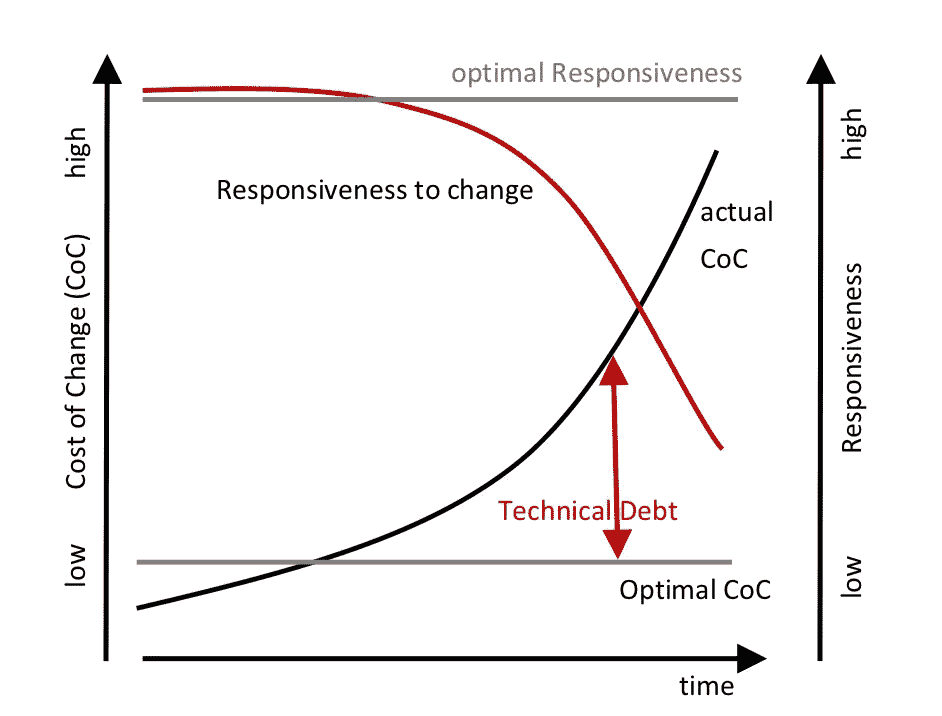
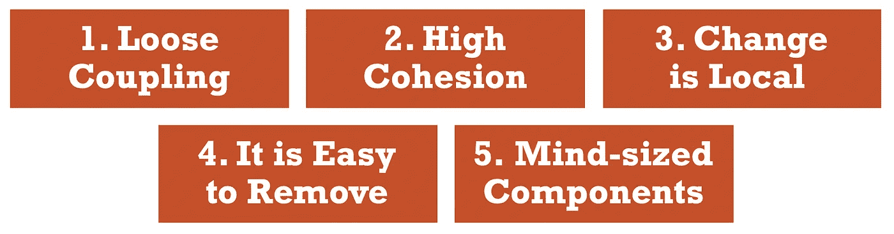
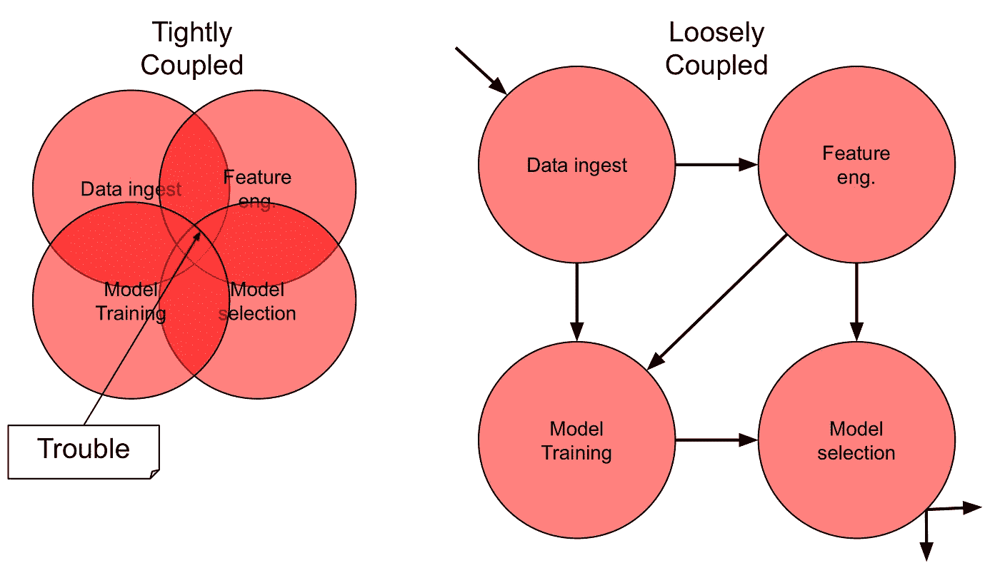
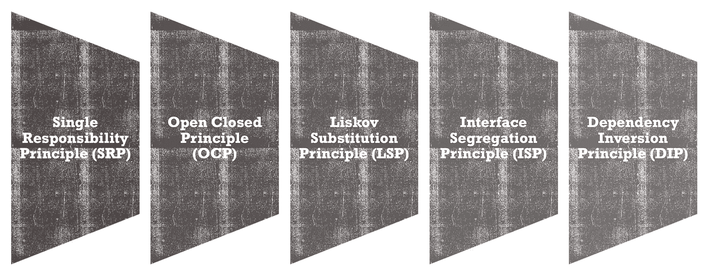
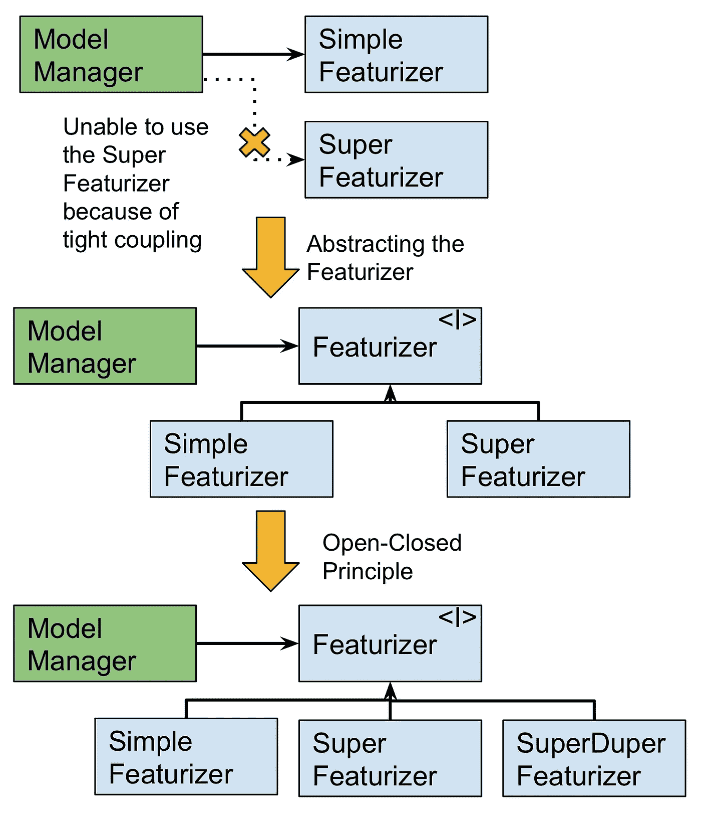
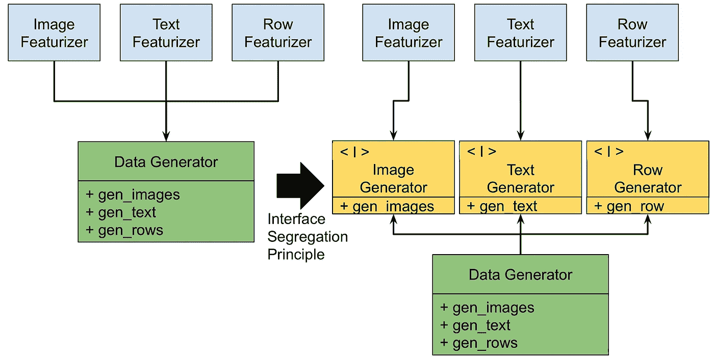
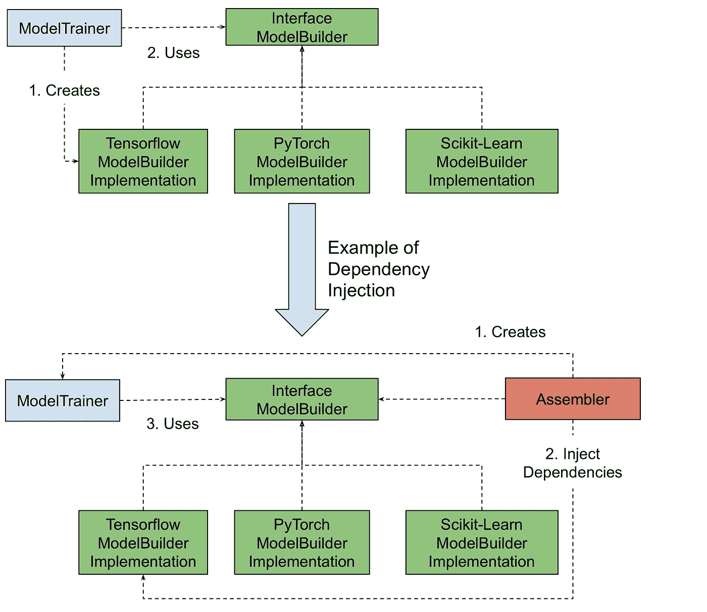
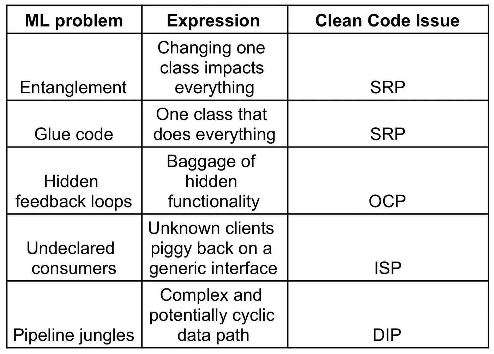

# 干净的机器学习代码

> 原文：<https://towardsdatascience.com/clean-machine-learning-code-bd32bd0e9212?source=collection_archive---------18----------------------->

## 面向 ML 工艺的实用软件工程原理

# 为什么我们应该关心干净的机器学习代码(CMLC)？

> 查看我最新的(正在编写的)关于这个主题的书，其中有代码示例、深入的讨论等等！[https://leanpub.com/cleanmachinelearningcode](https://leanpub.com/cleanmachinelearningcode)

机器学习(ML)管道毕竟是软件管道。它们充满了不必要的复杂性和重复。这是混合了厚厚的不透明性，刚性和粘性的设计。随着这些问题的出现，ML 故障正以前所未有的速度变得越来越重要。我们已经看到自动驾驶汽车在亚利桑那州撞上行人。我们了解了大规模翻译系统的性别偏见。我们看到了简单的面具如何侵入智能手机的面部识别系统。我们听说过其他“聪明”的系统做出了错误的决定(比如骑士资本)。现在是时候更多地谈论我们在机器学习工艺方面的责任了。

作为一个全球数据科学社区，我们建立的自主系统可能是昂贵的，危险的，甚至是致命的。除此之外，这种 5 到 10 年历史的老工艺缺乏经验。截至 2019 年，美国 40%的数据科学家的经验不足 5 年。作为一个社区，我们正在经历 ML 开发和使用的热潮。这就像 21 世纪初以前的软件工程繁荣一样。这种扩展通过一系列的构造、抽象、框架和工作流表现出来。众多的集成挑战让我们想起了老的软件问题。ML 软件工程实践中出现的一些问题是新的。但是大多数软件工程问题都带有历史的味道。回到软件工程的早期可以帮助解决今天的 ML 问题。

跟随干净代码方法的脚步，我们可以看到直接的相似之处。**我们构建的所有 ML 软件终究是软件。**将原原则中的“软件”替换为“机器学习组件”很有意思。它给老把戏带来了新的变化。

所以首先，干净的机器学习代码有什么好处？这里至少有两个。如果你对这些好处感兴趣，请继续阅读:

> 1.干净的代码降低了机器学习管道的变更成本。
> 
> 2.干净的代码可以提高对机器学习管道变化的最佳响应能力。

Clean Machine Learning Code driving motivation. Image from [1].

熟悉 Clean Code/Architecture 书籍的读者会注意到一件事。我是从那些文本中推断出来的。这是为了揭示 ML 和传统软件工程中的横切关注点。请去买书支持原作者。现在我们已经解决了这个问题，接下来是干净的机器学习代码的主要“改编”原则。

# 原则和华夫饼

我们真的不需要原则、规则、约束和华夫饼干机。嗯，也许是华夫饼机。但是接下来的几点是我们可以用来推广干净代码的抽象原则。这些技术有时似乎过于极端。然而，它们比多作者模型管道更容易理解。再加上 5 个不同的团队成员，每个人都有 10 个假设。让我们看看这些组件级的原则是什么，以及它们如何有益于实践。

## 1.松耦合

当两个机器学习组件中的至少一个使用另一个时，这两个机器学习组件是耦合的。这些 ML 组件相互了解得越少，它们之间的耦合就越松散。与强耦合组件相比，与其环境松散耦合的 ML 组件更容易被更改或替换。

## 2.高内聚力

内聚性是整体的机器学习元素属于一起的程度。想想花生酱和果冻。单个机器学习类中的方法和字段，以及 ML 组件的类，应该具有高内聚性。ML 类和 ML 组件中的高内聚导致更简单、更容易理解的机器学习代码结构和设计。这类似于单一责任原则，但在组件级别。出于同样的原因同时发生变化的事物应该归为一类。由于不同原因或在不同时间发生变化的 ML 组件应该分开保存。

## 3.变化是局部的

ML 软件系统通常需要长时间的维护、扩展和更改。保持局部变化降低了机器学习管道的相关成本和风险。保持 ML 组件的局部变化意味着在设计中存在变化不能跨越的边界。

## 4.这很容易去除

我们通常通过添加、扩展或更改组件功能来构建机器学习软件。然而，移除 ML 元素是重要的，以便机器学习流水线的整体设计可以保持尽可能简单。当一个 ML 模块变得太复杂时，它必须被移除并用一个或多个更简单的 ML 模块替换。

## 5.头脑大小的组件

把你的机器学习系统分解成数据/ML 组件，分解成你能记住的大小。目标是轻松预测变更的结果(依赖关系、控制流等)。机器学习课应该在 100 行左右。机器学习方法，如 transform、fit、predict 和 predict_proba 方法最多只能有 15 行。

> 能够孤立地测试机器学习组件是良好架构的标志。不能孤立地测试机器学习组件是裙带架构的标志。

为了实现上述目标，有哪些有用的软件设计原则？

# CMLC 坚实的软件设计原则

“鲍勃叔叔”罗伯特·马丁在他的优秀著作中收集/提炼了坚实的软件设计原则。这些原则旨在为软件工程师提供实用的指导。它们作为强有力的指导方针，既适用于机器学习软件，也适用于传统软件。让我们看看当我们将它们应用到机器学习领域时会发生什么，好吗？

## 1.单一责任原则

> 一个机器学习组件应该有且只有一个改变的理由。

为了确定一个类/函数是否有许多职责，检查它所服务的参与者[4]。当不止一个参与者可能要求对该组件进行更改时，这是一个警告信号。组件很有可能包含不止一个责任。所有者需要将这个组件分成更细粒度的逻辑部分。

在上图中，MLModel 类将不得不由于许多原因而改变。这里我们有拟合方法、输入数据的模式和度量发布。该类对数据处理、特征工程和模型选择的变化做出反应。所有者需要将这个类划分为机器学习子组件。

## 2.开闭原则(OCP)

> 您应该能够扩展机器学习组件的行为，而无需修改它。

ML code evolution when using the open-closed principle

例如，在此图中，ModelManager 通过使用 SimpleFeaturizer 类启动。然而，在版本 2 中，它需要使用超级曝气机。由于紧密耦合，不可能更换超级曝气机。为了支持新的 SuperFeaturizer，需要更改 ModelManager 类。

这违反了开闭原则:旧代码不应该为了增加功能而改变。

解决方案是在接口/抽象类中抽象出特征。然后我们让依赖箭头指向抽象组件。改造后，简易气化器和超级气化器可以互换。ModelManager 可以使用其中任何一个，而不需要了解每个策略的内部。此外，这两个特征不需要了解模型管理器。这样，开发人员可以单独测试它们。在像 Python 这样更动态的语言中，没有构建接口的明确需求。除非使用“isinstance”方法进行严格的类型检查。重要的部分是将交互类设计成指向抽象。通过使模型管理器只知道接口，它可以使用任何一种类型的特征。这使得开发人员可以添加第三个 SuperDuperFeaturizer，而无需对 ModelManager 或 Featurizer 的其他子类进行任何更改。只要特征实现了共享接口，这就是真的。ModelManager 可以忽略具体子类的实现细节。硬连线组件通常使模型空间探索变得乏味、粘滞和缓慢。这有助于模型类型、架构和其他模型定制的实验速度。

我们希望减少需要更改的旧 ML 代码的数量，以添加新的 ML 代码。这是通过将整个 ML 管道划分成组件来实现的。然后，我们将这些组件排列成无环有向图。为了实现这一点，我们让依赖关系箭头指向抽象组件。这允许我们隔离我们想要保护不被改变和/或更稳定的组件。信息隐藏和方向控制保护稳定的 ML 组件。快速移动的 ML 组件还受益于可以随意改变。

## 3.利斯科夫替代原理

即将推出，仍在烹饪一个例子…

## 4.接口隔离原则(ISP)

> 使**细粒度的**机器学习组件接口成为特定于客户端的接口。

上图是接口隔离策略的一个例子。这里，ML 组件 ImageFeaturizer 依赖于另一个组件 DataGenerator 的函数 gen_images。DataGenerator 还有许多其他不相关的操作:gen_text 和 gen_rows。

> **问题是在组件数据生成器中更改 gen_text 可能会导致需要更改组件 ImageFeaturizer。**
> 
> **即使 ImageFeaturizer 不关心数据生成器中的 gen_text 也是如此。**

这一原则的目标是避免依赖有额外负担的组件。这个额外的功能可能会横向影响用户。用户可能需要实现不必要的函数来与他们的依赖项兼容。这条原则建议创建特定于客户端的接口。这被认为比一个适用于所有客户端的大型通用接口要好。

## 5.依赖倒置原则和依赖注入方法

> 依靠机器学习管道**抽象**，而不是机器学习管道**具体化**。

依赖性箭头应该指向机器学习管道中的稳定组件。如果你期望一个不稳定的组件经常改变，那么保护那些需要依赖它的组件。控制设计方法的依赖反转有助于做到这一点。

这个原则允许插件架构。该应用程序可以通过外部插件进行扩展。这是通过创建接口来实现的。这些接口将应用程序核心组件与插件隔离开来。

以 ModelTrainer 类和各种机器学习库之间的交互为例。ModelTrainer 的目标是构建某种分类器。根据预测性能，我们可能需要不同的库。这里的候选者是 Scikit-Learn、Tensorflow 和 PyTorch。

该应用程序的核心目标不是:“让我们在项目中使用这些优秀的库之一”。**核心目标是构建给用户带来价值的模型/应用。**ML 库是不应该干扰应用核心的细节。

依赖注入是执行这种依赖倒置的一种方法。它有助于将核心分类应用程序与 ML 库插件隔离开来。首先，我们让模型训练器依赖于模型构建器界面。这使得模型训练器能够互换使用任何模型构建器实现。然而，我们可以更进一步。ModelTrainer 是一个高级组件，它不应该知道低级关注点。这些低层次的问题存在于单独的实现中。为了解决这个问题，我们可以使用汇编程序。这在运行时将模型构建器实现与模型训练器“连接”起来。模型训练器可以忽略应用程序正在使用的特定模型构建器。这消除了模型训练器对模型构建器实现的依赖性。

# 对测试驱动的机器学习的影响(TDML)

所有这些设计工作都有一个主要的好处。您可以单独测试您的组件。我们添加的测试越多，我们获得的组件覆盖率就越多。这导致开发人员信任他们正在交互的代码。这不仅是为已建立的软件工程组件保留的。它也可以应用于机器学习组件。TDML 的关键之处在于它不能被用作事后的想法。测试必须在代码之前编写。在代码之后编写测试是一场失败的战斗。

# 机器学习技术债务

## 它与干净代码原则有什么关系

机器学习技术债务和干净代码指南之间的关系在[5]中进行了探讨。我们可以将常见的大型生产机器学习管道问题与我们介绍的干净代码概念相匹配。

**纠缠**来源于 ML 数据和代码深度纠缠在一起。这导致违反 SRP 原则。SRP 违规的另一个表现是粘合代码组件的存在。这些在一个大的互联系统中带来了大量半相关的功能。

**当部署的模型改变未来的训练分布时，隐藏的反馈循环**出现。该模型影响客户的行动。然后，客户通过产生与过去不同的结果来做出反应。事实上，每次用这些新数据对模型进行重新训练，都允许外部变更源直接修改您的软件！。这明显违反了开闭原则。通过直接适应新数据，该模型可能会发生变化。一些可见的反馈循环可以通过迭代应用 OCP 来防止，然而一些隐藏的反馈更难检测。一个例子是“聚集特征”。每周汇总需要一段时间来适应新数据。模型将需要新版本的训练代码来处理 ml 管道中的这种变化。如果系统没有遵循 OCP 原则，变更将是昂贵的，开发人员可能会决定推迟变更。这种延迟加重了趋于复合的反馈回路。遵循 OCP 原理有助于更快地缓解这些反馈循环。

**当组件提供通用接口时，未声明的消费者**开始出现。这允许通用的无差别访问。ISP 指南鼓励开发人员构建特定于客户端的接口。这个原则导致了更好的接口，并降低了拥有未声明的消费者的风险。

**管道丛林**通常与胶码问题同时出现。这代表了应用程序如何在各种组件之间转换/移动数据。管道在最低的抽象层运行。这是实际数据被移动和转换的地方，我们最终得到非常严格的具体化。这意味着不修改代码就无法修改管道。这种折磨的目标是支持许多实验性的代码路径。为此，开发人员会创建重复的代码和不健康的依赖关系。OCP 和 ISP 的原则被违反，让一些工作。开发人员开始创建一个违背 DIP 原则的依赖关系网。依赖开始走向具体的实现。更稳定/抽象的类和构造的设计被推迟。该策略将特征工程步骤与模型选择步骤交织在一起。模型培训与模型发布。孤立地测试变得很困难。测试没有模型选择步骤的特征工程步骤变得棘手。在没有模型训练的情况下测试模型发布变得更加困难。开发人员可以通过使用 SRP、ISP、OCP 和 DIP 原则进行重构来补救管道丛林。

# 如果我们不自律，未来会怎样

如果我们不通过建立和应用原则和最佳实践来掌控我们的专业，这是一种可能的情况:

1.  **随着越来越多的新兴数据科学家和人工智能工程师加入并获得管理数百万条生命和数十亿美元的系统，机器学习劳动力的持续缺乏经验只会越来越多。**
2.  一个机器学习管道，**某处，将是致命的。给所有参与机器学习的人带来坏名声。**
3.  立法者将不得不对我们建造的自动化系统采取行动。
4.  当机器学习规则生效时，我们都将不得不遵循由非专家制定的**规则。**
5.  我们需要自制的监管指南，TDML 也不是一个糟糕的选择。

我希望这次到干净代码世界的小小旅行有所帮助。你现在可以希望以此为起点，保持你的机器学习技能达到高标准。

感谢阅读。

请注意，这篇文章中表达的观点是我个人的，不一定是我雇主的观点。

> 我们在招人！如果您对此感兴趣，请查看我们在 Xandr 数据科学平台工程的空缺职位:[https://Xandr . att . jobs/job/new-York/Data-Science-Platform-engineer-python-scikit-learn-tensor flow-keras-adtech-market place/25348/13937710](https://xandr.att.jobs/job/new-york/data-science-platform-engineer-python-scikit-learn-tensorflow-keras-adtech-marketplace/25348/13937710)

## 参考

1.  鲍伯·马丁叔叔——干净的程序员:

[https://www.youtube.com/watch?v=NeXQEJNWO5w](https://www.youtube.com/watch?v=NeXQEJNWO5w)

2.干净代码备忘单:

[https://www . bbv . ch/images/bbv/pdf/downloads/V2 _ 清洁 _ 代码 _V3.pdf](https://www.bbv.ch/images/bbv/pdf/downloads/V2_Clean_Code_V3.pdf)

3.Clean Coders 网站:

【https://cleancoders.com 

4.罗伯特·马丁谈单一责任原则:

[https://blog . clean coder . com/uncle-bob/2014/05/08/singlerepointibility principle . html](https://blog.cleancoder.com/uncle-bob/2014/05/08/SingleReponsibilityPrinciple.html)

5.[用 Python 进行全面的机器学习，图书](https://www.amazon.com/Thoughtful-Machine-Learning-Python-Test-Driven/dp/1491924136)

6.dboyliao 的 Python 代码示例:

[https://github.com/dboyliao/SOLID](https://github.com/dboyliao/SOLID)