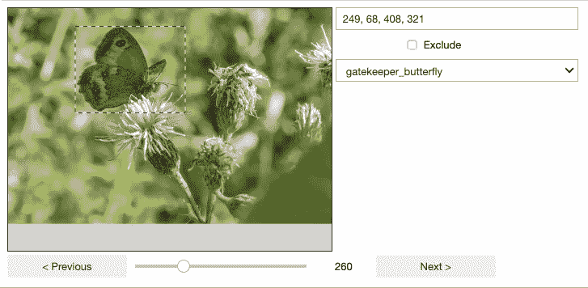
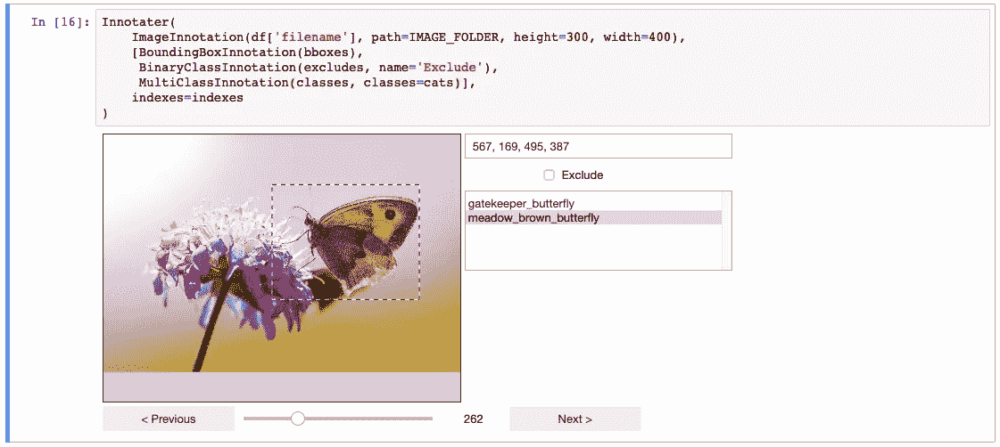
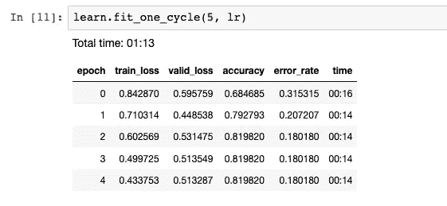

# 不用离开 Jupyter 就可以清理自己的模型数据

> 原文：<https://towardsdatascience.com/clean-up-your-own-model-data-without-leaving-jupyter-bdbcc9001734?source=collection_archive---------16----------------------->

## 使用新的 Innotater 工具注释数据，以获得更好的预测模型。


许多机器学习项目从 Jupyter 笔记本开始，笔记本的前几行加载训练数据。除了快速检查数据看起来是否正确之外，如果您需要离开笔记本来清理或注释您的数据，这可能会中断您的编程流程。

本文介绍了一个新的开源工具， [Innotater](https://github.com/ideonate/jupyter-innotater) ，它提供了一个交互式 Jupyter 小部件，允许开发人员在笔记本中直接内联注释他们的数据。拥有一种简单的方法来清理和扩充数据可以快速产生更好的预测模型。

我们将在计算机视觉任务中使用这种方法，首先，手动过滤掉本来就不应该进入我们数据集的图像，改进一个简单的蝴蝶分类器。

然后，我们使用 Innotater 在图像子集上绘制蝴蝶包围盒。这使我们可以训练一个边界框预测模型，对数据集中的每张图像运行该模型，这样我们就可以生成原始图像的裁剪和放大版本。然后，我们继续训练一个新的分类器，该分类器具有改进的准确性，因为该模型不需要考虑那么多不相关的背景图像。



Innotater widget embedded in a Jupyter Notebook

本文的目标读者是对 Jupyter 笔记本中的计算机视觉模型有一些了解的读者，他们可能有兴趣了解用于注释图像的工具，以及用于通过手动绘制我们自己的边界框并编写一个新模型来放大该边界框来改进模型的“技巧”。

所有的代码都可以在 GitHub 的 [Jupyter 笔记本上找到](https://github.com/ideonate/butterflies)，所以你可以跟着做。它是用 Python 写的，使用了 [fast.ai](https://www.fast.ai/) ，这是一个位于 [PyTorch](https://pytorch.org/) 之上的框架。Fast.ai 将事情保持在一个相当高的水平，并提供最佳实践默认值，因此深度学习代码很轻。

# 获取原始数据

构建一个分类器来识别两种不同的蝴蝶物种的任务是从 Bert Caramans 以前的[关于数据科学的文章中借来的。他写了一个脚本，从 Flickr 上下载被标记为“看门人”或“草甸棕”的照片——这两种蝴蝶在志愿者出于保护目的试图统计野生蝴蝶数量时容易混淆。](/classify-butterfly-images-with-deep-learning-in-keras-b3101fe0f98)

我们的第一台笔记本电脑从 Flickr 下载图片。与通常的“每个类一个文件夹”的文件存储模型不同，我们实际上将所有图像放在一个文件夹中，并构建一个 CSV 文件，列出每个图像的假定类(基于 Flickr 标签)。这样做的原因是，我们可以扩展 CSV 来记录我们手动绘制的边界框，并且如果我们发现已经识别出不正确的物种，也可以很容易地改变图像的类别。我们可以在 Innotater 中做这些事情，然后轻松地将修改后的类和边界框保存回 CSV。

# 过滤和注释数据

[Innotater 工具](https://github.com/ideonate/jupyter-innotater)旨在快速简便地浏览您的图像，并在每张图像上标记重要事实或增加数据。

关于每张图片，我们需要注意以下几点:

1.  分类正确吗？如果图像被分配了错误的物种标签，我们想很容易地改变它。
2.  这张图片首先属于我们的数据集吗？在某些情况下，相册被贴上了蝴蝶种类的标签，但并不是所有的图片都是真正的蝴蝶。所以我们想把它们从数据集中移除。
3.  蝴蝶周围的包围盒。我们不会对所有的图像都这样做，但是至少对一些图像，我们会在蝴蝶周围画一个紧密的边界框。

边界框将允许我们在以后的阶段建立一个更精确的模型，尽管为了建立我们的第一个简单的分类器，我们实际上只需要来自上面前两点的数据。

第二个笔记本[用于执行这些步骤。请注意，在 GitHub 预览中你看不到 Innotater 小部件，所以希望下面的截图能让它活起来。我们使用 Pandas 来读取 CSV 并提取三个 NumPy 矩阵，这些矩阵将被输入到 Innotater 中。](https://github.com/ideonate/butterflies/blob/master/2%20-%20Butterfly%20Innotater.ipynb)

`classes`是一个 0 或 1 的数字列表，指定数据集中的每个图像是(当前)看门人还是草地棕物种。

`excludes`也是一个 0 或 1 的数组。它开始时全是 0，但我们可以将一个条目变成 1，以便从我们的数据集中排除相应的图像。

`bboxes`是一个四列矩阵，包含我们对每张图片的包围盒的 x，y，w，h，其中(x，y)是盒子的左上角，w 是宽度，h 是高度。这些都是从 0 开始的，直到我们手动抽取任何盒子。

上面矩阵的每一行对应于我们从 CSV 加载的熊猫数据帧中的“文件名”列。

我们几乎准备好调用创新者了(在家里你也需要这样做！)，但首先我们需要考虑我们浏览图片的顺序。

## 把事情混在一起

由于 CSV 的创建方式，我们在文件的开头有近 500 张草地棕色蝴蝶的图片，然后在后半部分有近 500 张看门蝴蝶的图片。因为我们并不期望在每一张图片上绘制边界框——可能只有 200 张左右——如果我们按照默认的顺序进行，那么这将会导致一个问题。如果我们在看到的每张图片上画出边界框，直到我们有足够的注释，那么我们将只在第一种蝴蝶的子集上有边界框。守门蝴蝶不会有！

因此，在 7 号单元格中，我们使用了一点 Python/NumPy 操作来创建一个名为`indexes`的新映射，它基于索引号指定了一个新的排序。新的排序显示第一个草地棕色，然后第一个看门人，然后第二个草地棕色，等等…

## 召唤创新者！

为了查看和编辑数据集的所有重要方面，这是我们使 Innotater 的用户界面出现的方式:



Invoking the Innotater widget within a Jupyter Notebook

启动 Innotater 小部件的语法设计得简单而灵活。格式是`Innotater(inputs, targets, indexes=indexes)`,其中输入和目标是特殊 Innotation 对象的数组(或者只是单个项目),这些对象实质上是数据集矩阵表示的包装器。一般来说，`inputs`将数据包装在你的数据科学问题的‘x’侧，不要期望被改动；`targets`是“y”方向，可能需要更改—例如，更改分类或输入边界框数据。

根据您提供的数据格式，Innotation 类是灵活的；您只需要确保为数据类型选择正确的 Innotation 子类。例如，图像本身(我们的机器学习任务的‘x’侧)只需要包装在一个 ImageInnotation 对象中，就像这样:`ImageInnotation(filenames, path='./images')`。如果您的文件名已经是绝对的或者相对于工作文件夹的，那么 path 参数是可选的，事实上您不需要提供文件名:您可以提供已经加载的矩阵，可能是使用 Open CV2 中的 open_image 导入的。

在目标端，我们使用`BinaryClassInnotation(excludes)`将 excludes 数组的 0 和 1 表示为每个图像旁边的复选框。excludes 变量实际上不在我们问题的“y”侧，但是我们希望能够编辑它，并且我们将使用它来过滤 excludes==1 的图像。

真正的“y”侧目标包括蝴蝶的分类，通过`MultiClassInnotation(classes, classes=cats)`变成了列表框组件。注意我们可以在这里再次使用 BinaryClassInnotation，因为我们只有两个类(0 或 1)，但是一个复选框在两个不同的物种之间切换感觉不太合适(“选中 Gatekeeper 的复选框，取消选中其他物种”)，如果我们希望在将来添加更多的物种，列表框方法可以扩展。classes 变量本身可以有多种形式:一个简单的 0 和 1 的 Python 列表、一个 NumPy 列向量或数据的二维一键编码。Innotater 会检查您的数据并相应地进行处理。

我们要使用的最有趣的 Innotation 类可能是`BoundingBoxInnotation(bboxes)`,它最初显示为一个单独的文本框，我们可以在其中输入每个框的(x，y，w，h)形状，作为一个逗号分隔的数字列表。更好的是，它会自动连接到我们在`inputs`中提供的 ImageInnotation，这样我们就可以在图像上画出一个框，并自动设置我们的边界框坐标来代表我们画出的形状！

实例化小部件的完整代码是:

```
Innotater( 
    ImageInnotation(df['filename'], path=IMAGE_FOLDER, height=300, width=400),
    [BoundingBoxInnotation(bboxes),
     BinaryClassInnotation(excludes, name='Exclude'),
     MultiClassInnotation(classes, classes=cats, dropdown=**True**)
    ],
    indexes=indexes
)
```

使用“下一页/上一页”按钮，您可以浏览每个图像和绘制框，更改类别，或选中“排除”复选框。当你这样做的时候，底层的 Python 变量`bboxes`、`classes`和`excludes`将会立即更新。因此，在任何时候，在[我们的笔记本](https://github.com/ideonate/butterflies/blob/master/2%20-%20Butterfly%20Innotater.ipynb)中，我们都可以访问小部件下面的单元格 12，将更新后的变量设置回 Pandas 数据帧(变量名为`df`)并将 CSV 文件写入磁盘:

```
df[['x','y','w','h']] = bboxes
df['exclude'] = excludes
df['class'] = [cats[i] **for** i **in** classes]

*# And save the full Pandas data back to a CSV file*
df.to_csv(BUTTERFLIES_BBOXES_FILEPATH, index=**False**)
```

笔记本的设置方式意味着我们可以在不同的笔记本会话中返回，加载最新的 CSV 值，并继续注释。只要您在每个会话中显式保存 CSV，您就不必一次注释所有数据。

# 捕捉蝴蝶

现在我们已经检查并注释了我们的数据，让我们对它做些什么吧！本节涉及三个笔记本，在 [butterflies GitHub repo](https://github.com/ideonate/butterflies) 中编号为 3 到 5。

## 基础训练

首先，在 [3 - Basic Train.ipynb](https://github.com/ideonate/butterflies/blob/master/3%20-%20Basic%20Train.ipynb) 中，在 Innotater 中剔除任何被我们自己标记为‘排除’的图像后，我们只是训练一个基本的分类器模型。这是标准机器学习教程中的“猫或狗”。fast.ai 框架为我们做了这么多，以至于这里真的很少有机器学习代码。

大多数代码是从 fast.ai 示例中借用的样板文件。代码被注释以解释发生了什么:将 CSV 加载到 Pandas 数据帧中，使用该数据帧生成包含训练和测试数据集的“DataBunch”对象，然后使用该对象向预训练的 ResNet50 模型提供训练数据。它使用 Adam 优化器来训练冻结了 10 个时期的大多数现有层；然后模型被“解冻”,这样所有的层都可以在接下来的 5 个时期进行微调。

选择我们的验证集是这个项目中需要考虑的事情。出于验证的目的，保留 20%的数据集似乎是明智的，有一个 fast.ai 函数可以通过随机选择来做到这一点。但这导致了“数据泄漏”——验证集中的图像可能与训练集中的图像非常相似，从而允许模型通过抓住这些图像的不相关人工制品来“作弊”。发生这种情况是因为来自同一个 Flickr 相册的图像通常按顺序位于数据帧中。因此，更安全的方法是将每个类的前 80%的图像用于训练，剩下的 20%用于验证。这样，在最坏的情况下，我们只在训练集和验证集中拆分一个专辑。



Training results in the basic model: accuracy at end of 5th epoch is 0.82

有了基本模型，我们最终达到了 82%的准确率。不算太差！

## 包围盒模型

这个项目的全部意图是看看绘制我们自己的边界框是否能帮助我们建立一个更好的模型。理论是，建立一个模型来预测紧密的边界框，准确地显示蝴蝶在图像中的特征，这意味着我们可以裁剪和放大蝴蝶本身，并有希望在放大的图像上明确地训练一个分类器。

对于一张新的看不见的蝴蝶照片，我们将分两个阶段运行我们的分类过程:首先，预测边界框，以便我们可以放大蝴蝶；其次，在放大的图像上运行我们的分类器。

这两个阶段是在最后的两个笔记本中开发的，在 GitHub 中编号为 4 和 5。

notebook [4 - BBox 的第一部分 Train and Generate.ipynb](https://github.com/ideonate/butterflies/blob/master/4%20-%20BBox%20Train%20and%20Generate.ipynb) 的工作方式与 notebook 3 非常相似，它使用类似的基础设施来训练模型。在这种情况下，我们预测的是边界框，而不仅仅是“0 或 1”分类，所以这有点复杂。为了建立这个模型，我们首先删除所有没有画出边界框的图像——记住我们从来没有打算注释所有的图像。我们还必须编写自己的 fast.ai 类来处理边界框(在编写本文时，fast.ai 自己的基础设施还没有完全准备好)。

优化是类似的，但我们使用 L1 损失测量(目标和预测坐标之间的绝对水平和垂直距离的总和)来查看模型相对于我们的手动绘图的表现如何。这本笔记本展示了一些不同的尝试，试图获得更好的边界框预测——这比以前的笔记本有点混乱——但无论如何，到最后我们有了一些看起来合理的边界框。我们可以做得更好，这些盒子通常会剪掉重要的蝴蝶标记，这些标记可能对下一阶段的分类器有意义！无论如何，你当然可以尝试改进这一点，但让我们继续前进…

notebook 4 中的最后一个单元格将模型应用于 CSV 中的所有图像(除了那些标有`excludes`为 1 的图像),以便输出我们裁剪和缩放的图像。在训练时，我们只能利用那些存在边界框的图像，但现在我们已经训练了模型，我们可以将其应用于每一个图像，以获得完整的边界框预测集。代码遍历每张图像，并基于这些边界框坐标生成图像的“缩放”版本——每张新图像都有望包含一只漂亮的大蝴蝶。

我们最初的一组图像中，有一些蝴蝶出现在整个图像中相对较小的部分。这在边界中引入了许多噪声，并且由于我们的图像在我们的“基本训练模型”的预处理中被调整为 256 像素见方，如果我们在缩放的图像上再次训练，更多的蝴蝶本身应该会找到它进入神经网络层的方法。

## 缩放和裁剪训练

由于我们已经在 notebook 4 的末尾对所有图像执行了所有缩放和裁剪，您会发现 notebook[5-zolled Cropped train . ipynb](https://github.com/ideonate/butterflies/blob/master/5%20-%20Zoomed%20Cropped%20Train.ipynb)几乎是 notebook 3 的精确副本，除了它运行在新缩放的图像上(这些图像保存在“zolled”子文件夹中)。使用我们之前训练基本模型时使用的相同训练步骤似乎是公平的:我们希望能够比较模型，以查看在缩放图像上训练的模型是否表现更好。

在训练结束时，我们看到准确率为 84%(高于前一版本的 82%)。这绝对是朝着正确的方向前进！

# 结论

事实上，你可以在训练所有这些模型方面做得更好——我的目的从来不是教你成功地训练计算机视觉神经网络。单个结构更好的神经网络完全有可能模拟我们的组合模型中发生的一些“缩放”。输入数据本身是不可靠的，因为对于一个相对较小的数据集，我们只能希望 Flickr 用户都采取一致的方法来拍摄照片，然后标记并上传它们。

但我希望这个项目表明，Innotater 是一种有趣的方式，可以让你接触到数据，不仅可以清理你的数据集，还可以手动封装“人类洞察力”，否则可能无法进入你的建模过程。最终，在这个例子中，我们已经依靠人类来手动标记蝴蝶的种类，那么为什么不更进一步，首先教你的模型蝴蝶是什么样子的呢？

在编写本文时，图像、单个边界框和 listbox/checkbox 控件是 Innotater 数据唯一可用的包装器。它们的组合方式已经非常灵活了，但是当然，根据您的项目，您可能需要其他注释类型(可能是多个边界框和不同的形状)。请联系我们，描述您的数据所面临的问题，或者在尝试使用 Innotater 时遇到的限制，进一步的开发可以纳入您的想法和解决方案！更多细节可以在 [Innotater GitHub 页面](https://github.com/ideonate/jupyter-innotater)上找到。