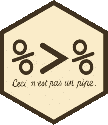
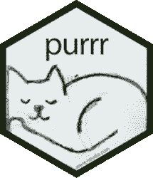
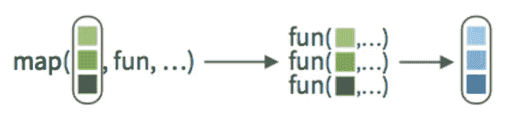

# 带有函数式编程的 Cleaner R 代码

> 原文：<https://towardsdatascience.com/cleaner-r-code-with-functional-programming-adc37931ef7a?source=collection_archive---------3----------------------->

# 介绍

由于工作转换，我最近成为了一名 R-to-Python 的转换者。然而，一些兼职项目让我每天在两种语言之间切换。除了让我感到头疼之外，这种日常的反复让我对编程范例有了很多思考。具体来说，我真的成了 r 中函数式编程范式的传播者。我想就什么是函数式编程(FP)以及它如何给你带来超能力(某种程度上)给出一点见解。

# 为什么重要？

r 在编程世界中有着独特的地位。全世界每天都有成千上万的人使用它来分析和处理数据。它的用户很少受过纯计算机科学的训练，而且在许多情况下，R 代码只运行一次。这种组合会导致 R 程序变得草率和低效。我们是怎么到这里的？推理通常是:如果它有效，它就有效，对吗？

如果这个“为什么改变？”心态听起来很熟悉，这篇博文是写给你的。事实上，r 是一种受丰富的数学理论影响的完整的(尽管是特定领域的)编程语言。学习 FP 的基础知识将帮助你写出更好的代码，从而使你成为一名更好的统计学家、数据科学家，或者当你读到这篇文章时，我们已经决定称自己为什么。

# 什么是函数式编程？

我不打算给出一个严格的定义。你可以去维基百科了解一下。

简单来说，FP 就是它听起来的样子。如果你不止一次地做某件事，它属于一个函数。在 FP 中，函数是你执行任务的主要方法。所有的动作都只是(通常是创造性的)你所写的函数的实现。

一旦你进入其中，优势就显而易见了。您的代码更容易修复和维护，因为您已经将代码分割成易于维护的部分。您的代码更容易阅读，因为如果您正确命名了所有内容，您的代码看起来就更接近普通英语。用函数调用代替长代码块也可以帮助你减少[面条](https://en.wikipedia.org/wiki/Spaghetti_code)和[末日金字塔代码](https://en.wikipedia.org/wiki/Pyramid_of_doom_(programming))。


Most bad code is not this delicious

好吧，我们怎样才能重新训练我们的大脑来适应这种甜蜜的 FP 呢？

# 第 0 步:学习基础知识

要想写出真正“功能性”的函数，必须是 ***纯*** 。一个纯函数有两条规则:

*   **它必须是确定性的**
    也就是说，每次你用相同的输入运行这个函数，它必须有相同的输出。每一个。单身。时间。"但是有随机成分的函数和统计过程呢？"你问？只需在函数内部设置一个种子，或者让种子成为函数的参数。无论如何，这对可再生科学很重要。
*   这意味着你的功能不能触及或改变它之外的任何东西。这意味着你可能永远不应该使用全局赋值(`<<-`)操作符。奇怪的是，这也意味着`print()`函数不服从 FP。

# 第一步:抛弃循环


正如我的研究生导师曾经告诉我的，

> 如果你在 R 中写循环，你可能做错了。

(当然，他是在调试我的第三层嵌套`for`循环时告诉我的。)

但是…循环是如此的基本！为什么我们要尽量少用它们呢？原因有两个，第一个是针对 r 的。

**整个语言已经矢量化了** 即使你以前从未听说过这个词，你也已经知道了。向量化是你写这个的原因:

```
x <- 1:10
y <- 2 * x
```

代替

```
x <- 1:10
for (i in seq_along(x)) {
    y <- 2 * x[i]
}
```

**循环很慢——使用适用！**
`apply()`函数，以及类似的函数，是 R 的 FP 功能得以完全实现的基础。虽然在大多数语言中，循环和应用(通常称为“映射”)的速度是相同的，但是我们将会看到在 r 中使用 apples 会显著提高速度。

r 的基础有一些应用，但真正漂亮的是在`purrr`中发现的。稍后将详细介绍。

# 第二步:管道，潮汐，和更多的管道

如果你还没有听说过 Tidyverse，准备好去见你的新朋友吧。但首先，让我们来认识一下潮汐之星的 ***管操作员*** :



管道(`%>%`)是由几个不同的包提供的操作符，但是最常见的是通过`dplyr`或`tidyverse`来访问。哦，如果你觉得重复输入(`%>%`)很痛苦，RStudio 给你一个捷径:Ctrl-Shift-M。

那么，它是做什么的呢？简单地说，管道接受左边的内容，并将其作为右边内容的第一个参数。例如:

```
add <- function(x, y) x + y
3 %>% add(5) 
# 8
```

这似乎比简单地键入`add(3, 5)`更冗长，但是这允许您将复杂的操作写成 ***管道*** *:*

```
3 %>%
  add(5) %>%
  add(1) %>%
  add(3) %>%
  add(7)

# 19
```

太琐碎？看看这个来自我的一个咨询项目的真实片段:

```
data_clean <- data_raw %>%
  isFinal() %>%
  dropLastFiling() %>%
  getAccStats() %>%
  getPctIncs() %>%
  capOrDrop(inc_vars, cap = 3)
```

你不需要看函数做什么就知道我在这里隐藏了很多复杂性。然而，你几乎可以用英语阅读:

*   拿原始数据来说
*   了解这是否是最后一次纳税申报
*   删除每个组织的最后一个纳税申报
*   获取会计统计数据
*   获得年同比增长百分比
*   在适当的时候去掉或限制这些变量(我使用 300%的上限)

没有这种模块化，代码几乎不可能调试。删除每个组织的最新纳税申报有问题吗？你必须通读数百行代码。在这里，您只需找到定义`dropLastFiling`的位置，并在那里修复它。此外，您可以更清楚地看到准备数据的步骤。


现在，我们准备好开始做 Tidyverse 了。`tidyverse`实际上是包的集合，你可能不需要全部。我们需要的大部分东西实际上都包含在`dplyr`里。

总之，`tidyverse`充满了专门为常见数据操作任务构建的易于使用的函数。以下是一些最常用的方法:

`select()` —选择要保留(或删除)的列
`filter()` —选择要保留(或删除)的行
`arrange()` —按给定的行对数据进行排序
`rename()` —重命名列
`mutate()` —从现有列中创建新行
`group_by()` —组织数据，使其按某个分类变量
`summarize()`进行分组——类似于`mutate()`，但将`group_by()`中的数据折叠成汇总统计数据

示例:

```
mtcars %>%
  filter(am == 0) %>%         # Consider manual cars only
  group_by(cyl) %>%           # Group them by the number of cylinders
  summarize(                  # Get the mean and sd of fuel
    mean_mpg = mean(mpg),     # economy by cylinder
    sd_mpg = sd(mpg)
  ) %>%
  ungroup()                   # Undo effects of group_by()
                              # (Not always req, but good practice) 

# Output:
# A tibble: 3 x 3
#     cyl mean_mpg sd_mpg
#   <dbl>    <dbl>  <dbl>
# 1     4     22.9   1.45
# 2     6     19.1   1.63
# 3     8     15.0   2.77
```

# 第三步:熟悉应用程序和地图



The package `purrr` is short for “Pure R”. The third R was added for the cat mascot, I suppose.

我们的工具包中还有一个缺口:我们不允许使用循环，*有些任务对我们来说还没有矢量化*！数据分析师要做什么？

解决方法是使用 ***应用*** (也叫 ***贴图*** )。地图收集了一些事物，并对其中的每一个事物应用一些功能。这里有一张图直接取自 RStudio 的 [purrr 小抄](https://maraaverick.rbind.io/banners/purrr_apply_cheatsheet_rstudio.png) *(鸣谢:* [*玛拉·阿威克*](https://twitter.com/dataandme) *)* :



*旁注:* `*dplyr*` *包实际上是从 applies 中得到它的名字的。* `*dplyr*` *=数据+应用+ R.*

`purrr`包里有多得离谱的地图可供选择。[说真的，看看那张备忘单](https://maraaverick.rbind.io/banners/purrr_apply_cheatsheet_rstudio.png)！

**例如，把所有的放在一起**:假设我有一个字符串向量，我想提取每个字符串中最长的单词。没有矢量化的函数可以帮我做到这一点。我需要用空格字符分割字符串，得到最长的单词。为了获得戏剧性的效果，我还将字符串大写并粘贴在一起:

```
library(tidyverse)
library(purrr)

sentences <- c(
  "My head is not functional",
  "Programming is hard",
  "Too many rules"
)

getLongestWord <- function(words) {
  word_counts <- str_length(words)
  longest_word <- words[which.max(word_counts)]
  return(longest_word)
}

sentences %>% 
  toupper() %>% 
  str_split(' ') %>% 
  map_chr(getLongestWord) %>% 
  str_c(collapse = ' ')

# [1] "FUNCTIONAL PROGRAMMING RULES"
```

# 额外步骤:了解行话

在其他语言中，FP 的一些行话是内置的。具体来说，几乎每种语言都有三个高阶函数，不管是不是函数式的:map(我们已经介绍过)、reduce 和 filter。

> 高阶函数是这样一种函数，它要么接受一个函数作为参数，要么返回一个函数，或者两者都接受。

**在 R 中过滤很容易。**对于数据帧，我们可以使用使用`tidyverse::filter`。对于大多数其他事情，我们可以简单地使用 R 的向量化。然而，当所有其他的都失败时，基数 R 确实有一个`Filter()`函数。示例:

```
Filter(function(x) x %% 2 == 0, 1:10)
# [1]  2  4  6  8 10
```

**同样，你可能永远也不会在 R** 里用到 `**Reduce()**` **。但为了以防万一，它是这样工作的:`Reduce()`将接受一个集合和一个二元函数(即接受两个参数)，并沿着该集合一次两个地连续应用该函数。示例:**

```
wrap <- function(a, b) paste0("(", a, " ", b, ")")
Reduce(wrap, c("A", "B", "C", "D", "E"))
# [1] "((((A B) C) D) E)"
```

另一个广受欢迎的 FP 话题是 ***奉承*** 。Currying 是这样一种行为:获取一个带有许多参数的函数，然后将它分解成接受部分参数的函数。这些有时被称为 ***部分功能*** 。下面的例子使用了一个 ***函数工厂*** 来制作部分函数:

```
# Adder is a "function factory" - a function that makes new functions.
adder <- function(a) {
    return(function(b) a + b)
}

# Function factory pumping out new functions.
add3 <- adder(3)
add5 <- adder(5)

add3(add5(1))
# 9
```

你觉得这个概念很难理解吗？你并不孤单。为了使这更具可读性，`functional`库为您提供了一个显式的 currying builder:

```
library(functional)
add <- function(a, b) a + b
add3 <- Curry(add, a = 3)
add5 <- Curry(add, a = 5)

add3(add5(1))
# 9
```

附注:动词“currying”来自哈斯克尔·库里，著名的数学家/计算机科学家/宾夕法尼亚州立大学的研究员。

# 摘要

你觉得自己更聪明了吗？更厉害？准备好用你的新 FP 技能折磨你的数据了吗？以下是一些重要的要点:

*   不再有循环！永远不会。
*   任何时候你想使用一个循环，找到合适的应用/映射。
*   尽可能将 Tidyverse 集成到您的工作流程中。
*   当对一件事应用几个函数时，使用管道(`%>%`)(例如，在 Tidyverse 中操作一个数据帧)。

在编码时坚持这些心态可以大大减少难看的、难以维护的代码。将东西装入函数中可以给你留下干净、易读、模块化的*馄饨代码*。我将引用约翰·伍兹的一句名言:

> 编写代码时，始终要假设最终维护您代码的人是一个知道您住哪儿的暴力精神病患者。

