# 在 Python 中清理、分析和可视化测量数据

> 原文：<https://towardsdatascience.com/cleaning-analyzing-and-visualizing-survey-data-in-python-42747a13c713?source=collection_archive---------0----------------------->

## 使用`pandas`、`matplotlib`和`seaborn`从脏数据中产生可消化的见解的教程

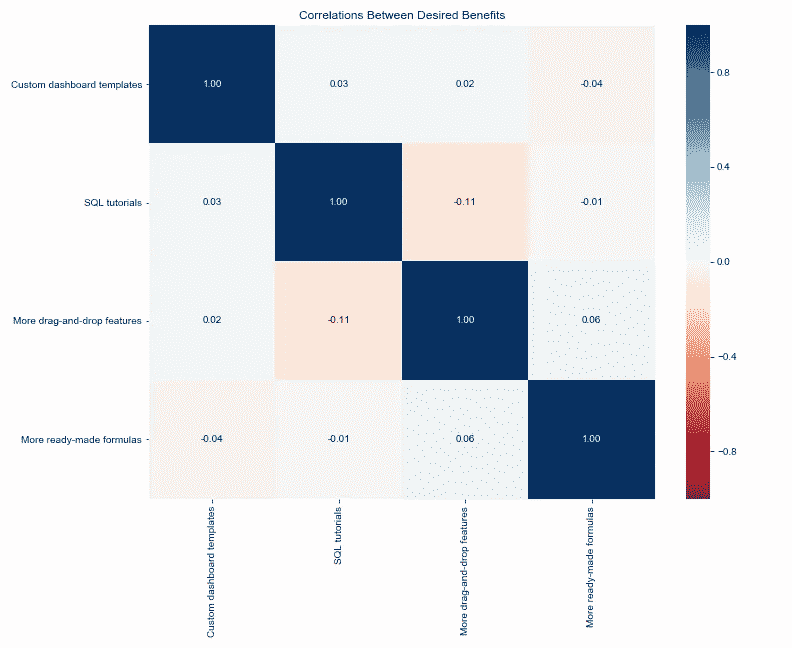

如果你在 D2C 的一家初创公司从事数据工作，很有可能你会被要求至少查看一次调查数据。由于 SurveyMonkey 是最受欢迎的调查平台之一，它很有可能是 SurveyMonkey 的数据。

SurveyMonkey 导出数据的方式不一定适合开箱即用的分析，但它非常接近。在这里，我将展示几个您可能想问的关于调查数据的问题的例子，以及如何快速提取这些答案。我们甚至会编写一些函数，让我们在设计未来的问题时更加轻松。

我们将使用`pandas`、`matplotlib`和`seaborn`来理解我们的数据。我使用了 [Mockaroo](https://mockaroo.com/) 来生成这些数据；具体来说，对于调查问题字段，我使用“自定义列表”并在适当的字段中输入。您可以通过在`random`模块中使用`random.choice`来达到同样的效果，但是我发现让 Mockaroo 为我创建整个事情更容易。然后我调整了 Excel 中的数据，使其反映了 SurveyMonkey 导出的结构。

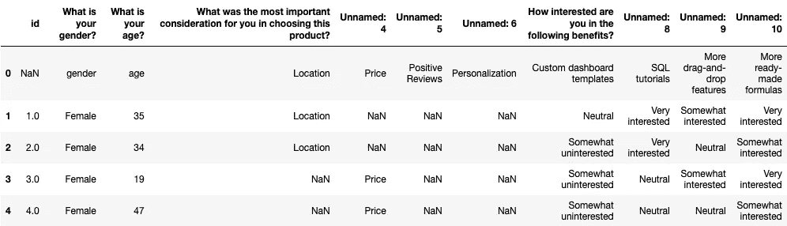

Oh boy…here we go

你对此的第一反应可能是“啊。太恐怖了。”我的意思是，列名没有正确读入，有大量的 nan，而不是像 0/1 或 1/2/3/4/5 这样的数字表示，我们在每个单元格中都有实际的文本答案…我们真的应该用多索引读入吗？

但是不要担心，没有你想象的那么糟糕。在这篇文章中，我们将忽略多重索引。(反正没人真的喜欢和他们一起工作。)团队需要尽快得到这些见解——所以我们会想出一些简单的解决方案。

首先:我们被要求去发现这些问题的答案是如何随着年龄组而变化的。但是`age`只是一个年龄——我们没有年龄组的专栏！幸运的是，我们可以很容易地定义一个函数来创建一个。

但是如果我们像这样运行它，我们会得到一个错误！这是因为我们有第一行，它的年龄值是单词“年龄”而不是数字。由于第一步是将每个年龄转换为一个`int`，这将失败。

我们需要从 DataFrame 中删除该行，但是当我们以后重命名列时会用到它，所以我们将它保存为一个单独的变量。

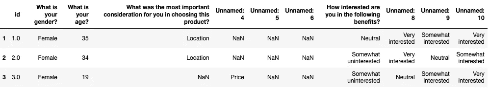

您会注意到，自从删除了`headers`，我们现在在单独查看调查数据时丢失了一些信息。理想情况下，您会有一份调查中提出的问题及其选项的列表，由任何想要分析的人提供给您。如果没有，您应该在文档或笔记中保留一个单独的方式来引用此信息，以便在工作时可以查看。

好了，现在让我们应用`age_group`函数来得到我们的`age_group`列。

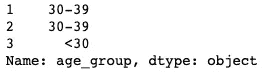

太好了。接下来，让我们将数据分成子集，只关注第一个问题。第一个问题的答案在不同的年龄段有什么不同？

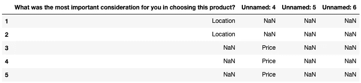

太好了。我们现在有了变量中的答案。但是当我们绘制这些数据时，它看起来不会很好，因为错误命名的列。让我们编写一个快速函数来简化列的重命名:

还记得之前的`headers`吗？我们可以用它来创建我们的`new_names_list`进行重命名。

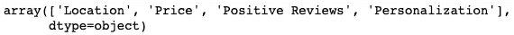

它已经是一个数组了，所以我们可以直接传入它，或者为了可读性，我们可以先重命名它。

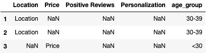

看起来不是更好吗？别担心，我们差不多到了获得一些见解的部分了。

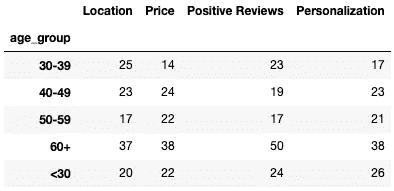

请注意`groupby`和其他聚合函数是如何自动忽略 nan 的。这让我们的生活变得简单多了。

假设我们现在也不太关心分析 30 岁以下的客户，那么我们将只绘制其他年龄组。

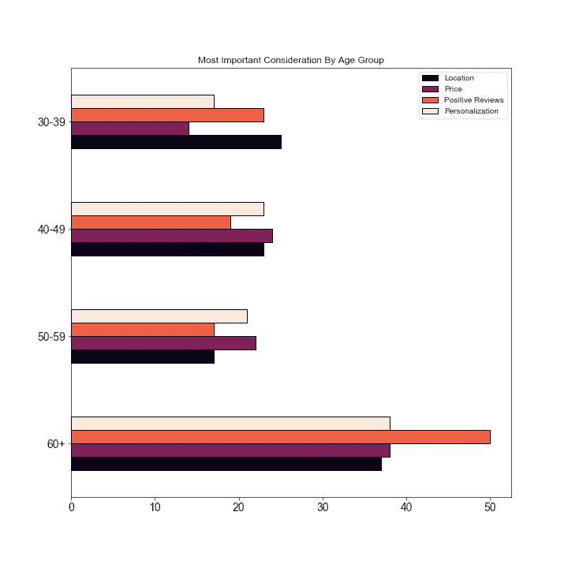

好吧，这很好，但是 60 岁以上的人群比其他人群多，所以很难进行公平的比较。我们该怎么办？我们可以在单独的图中标出每个年龄组，然后比较分布情况。

“但是等等，”你可能会想。"我真的不想为 4 个不同的情节写代码."

当然不是！谁有时间做那个？让我们写另一个函数来完成它。

我相信是[珍妮·布莱恩](https://twitter.com/JennyBryan?)，在她精彩的演讲“代码的气味和感觉”中，首先向我透露了以下信息:

如果你发现自己复制并粘贴代码，只是改变了一些值，你真的应该写一个函数。

对于我来说，这是一个很好的指导，让我决定什么时候为某个东西写一个函数是值得的，什么时候不值得。我喜欢用的一个经验法则是，如果我要复制粘贴 3 次以上，我就写一个函数。

除了方便之外，这种方法还有其他好处，例如:

*   减少出错的可能性(在复制和粘贴时，很容易意外忘记更改值)
*   有助于提高代码的可读性
*   构建您的个人功能工具箱
*   迫使你在更高的抽象层次上思考

(所有这些都提高了你的编程技能，让需要阅读你代码的人更开心！)

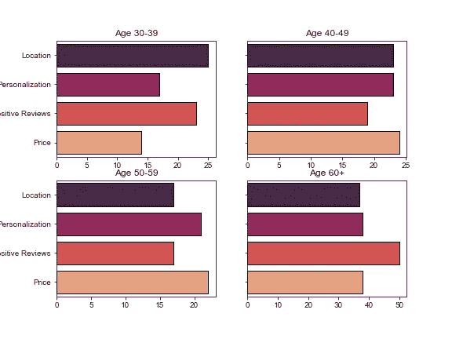

Hooray, laziness!

当然，这是从均匀分布中产生的数据，因此我们不会期望在组之间看到任何显著差异。希望你自己的调查数据会更有趣。

接下来，让我们解决另一种形式的问题。在这项研究中，我们需要了解每个年龄组对特定福利的兴趣。令人高兴的是，这些问题实际上比前一种更容易处理。让我们来看看:

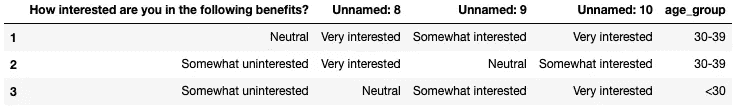

看，因为这是一个小的数据帧，`age_group`已经被附加了，我们不需要添加它。

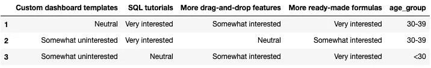

酷毙了。现在我们有了子集化的数据，但这次我们不能像对另一个问题那样，只通过计数来汇总数据，上一个问题中的 nan 将被排除，以给出该响应的真实计数，但有了这个问题，我们将只获得每个年龄组的响应总数:

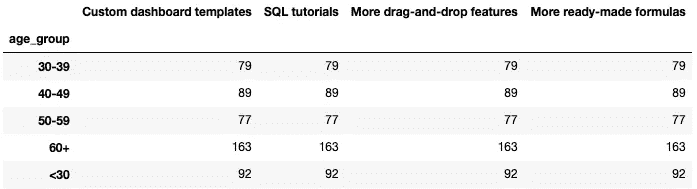

这绝对不是我们想要的！问题的关键是了解不同年龄组的兴趣，我们需要保存这些信息。所有这些告诉我们的是每个年龄组中有多少人回答了这个问题。

那我们该怎么办？一种方法是用数字重新编码这些反应。但是，如果我们想在一个更精细的层次上保持这种关系呢？如果我们用数字编码，我们可以得到每个年龄组的兴趣水平的中位数和平均数。但是如果我们真正感兴趣的是每个年龄组中选择每个兴趣水平的人的具体百分比呢？在柱状图中传达这些信息会更容易，同时保留文本。

这就是我们接下来要做的。而且——你猜对了——是时候写另一个函数了。

**给新学员的快速提示:**大多数人不会明确地说出来，但让我明确一下可视化通常是如何实现的。总的来说是一个高度迭代的过程。即使是最有经验的数据科学家也不会不假思索地写出所有这些规格的图表。

一般来说，你从`.plot(kind='bar')`开始，或者类似的，取决于你想要的图，然后你改变大小，颜色映射，使用`order=`得到正确排序的组，指定标签是否应该旋转，设置 x 轴或 y 轴标签不可见，等等，取决于你认为对使用可视化的人来说什么是最好的。

所以不要被人们在制作剧情时看到的一长串代码吓倒。它们通常是在测试不同规范的几分钟内创建的，而不是一次性从头开始编写完美的代码。

现在，我们可以为按年龄组划分的每个福利绘制另一个 2x2。但是我们必须为所有 4 个好处这样做！再说一遍:谁有时间做这个？相反，我们将使用几个`for`循环来循环每个福利，以及每个福利中的每个年龄组。但是如果你感兴趣的话，我建议你把它重构为一个函数，如果你碰巧有很多这样格式的问题。

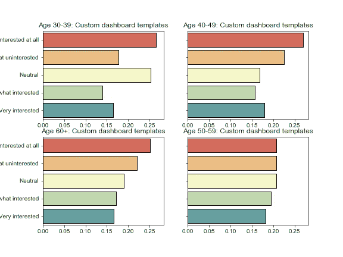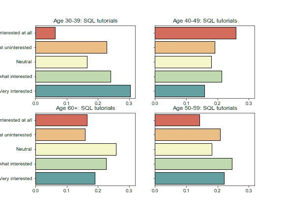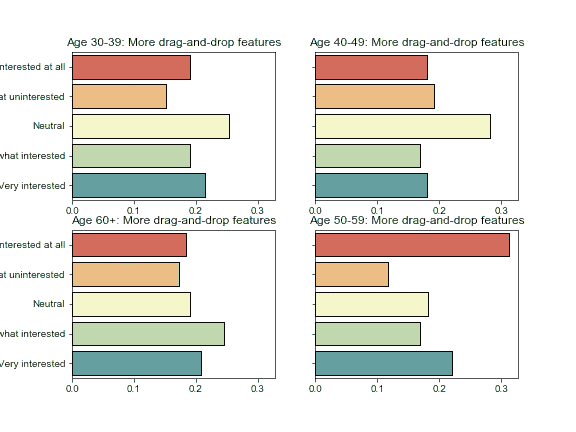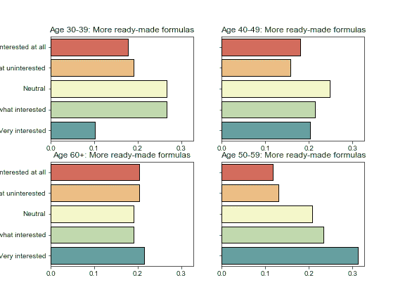

成功！如果我们想导出每组单独的图，我们只需添加行`plt.savefig('{}_interest_by_age.png'.format(benefit))`，`matplotlib`会自动保存每组图的漂亮清晰的渲染。

这使得其他团队的人使用你的发现变得特别容易；您可以简单地将它们导出到 plots 文件夹，人们可以浏览这些图像，并能够将它们拖放到 PowerPoint 演示文稿或其他报告中。

这些可以使用多一点的填充，所以如果我再做一次，我会稍微增加人物的允许高度。

让我们再举一个例子:如前所述，对收益进行数字编码。然后，我们可以生成不同利益之间的相关性热图。

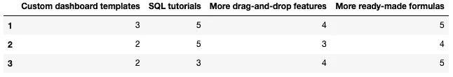

最后，我们将生成相关矩阵并绘制相关图。

同样，由于数据是随机生成的，我们预计几乎没有相关性，这也是我们的发现。(有趣的是，SQL 教程与拖放功能略有负相关，这实际上是我们可能期望在真实数据中看到的！)

让我们做最后一种类型的图，一种与热图密切相关的图:簇图**。聚类图使相关性在分析调查响应时特别有用，因为它们使用层次聚类(在本例中)根据利益的密切相关程度将它们分组。因此，与其目测单个收益正相关或负相关的热图，当你有 10 个以上的收益时，这可能有点疯狂，该图将被分割成簇，这更容易查看。**

**如果您熟悉层次聚类的数学细节，还可以轻松地更改计算中使用的关联类型。一些可用的选项是“单身”、“一般”和“病房”——我不会进入细节，但“病房”通常是开始时的安全赌注。**

**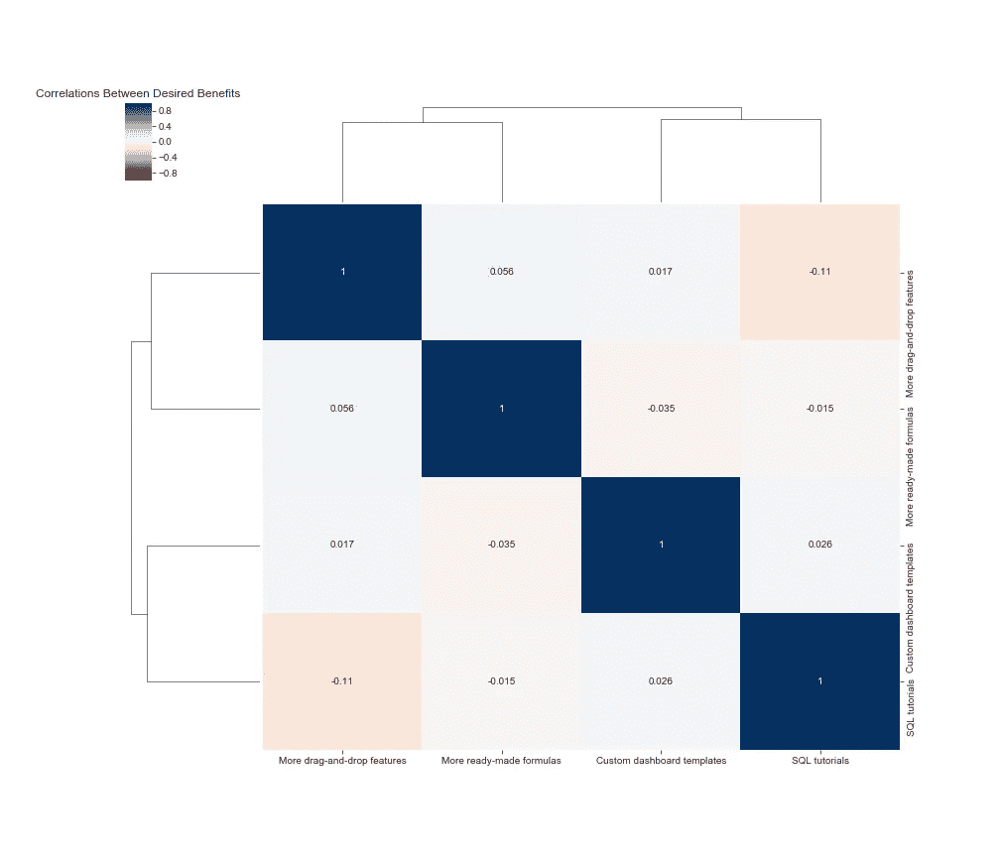**

**长标签通常需要一点调整，所以我建议在使用集群映射之前将你的优势重命名为较短的名称。**

**对此的快速评估表明，聚类算法认为拖放功能和现成的公式聚集在一起，而自定义仪表板模板和 SQL 教程形成另一个集群。由于相关性如此之弱，你可以看到当利益链接在一起形成一个集群的“高度”非常高。(这意味着您可能不应该根据这一发现做出任何商业决策！)尽管关系很弱，但希望这个例子是说明性的。**

**我希望您喜欢这篇关于使用调查数据和编写函数来快速生成可视化结果的快速教程！如果你认为你知道一种更有效的做事方式，请在评论中告诉我——这正是我在需要尽快就个别问题提出见解时想到的方法。**