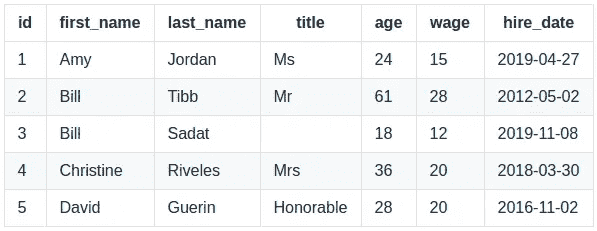
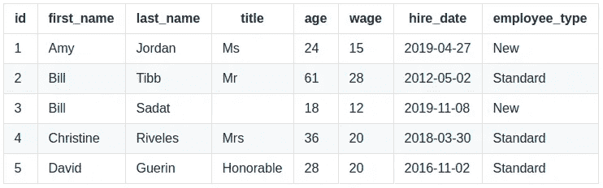
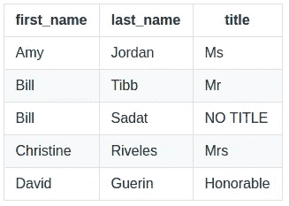
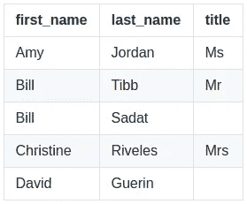
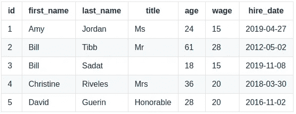
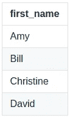

# 用 SQL 清理和转换数据

> 原文：<https://towardsdatascience.com/cleaning-and-transforming-data-with-sql-f93c4de0d2fc?source=collection_archive---------5----------------------->


## 了解如何使用 SQL 查询来准备、清理和转换用于分析的数据！

进行数据分析时，首先要执行的任务之一是创建干净的数据集。您从数据中获得的洞察力仅与数据本身一样好，因此毫不奇怪，分析专业人员大约 80%的时间都花在准备供分析使用的数据上。

SQL 可以帮助加速这项重要的任务。在本教程中，我们将讨论常用于从查询输出中清理、转换和删除重复数据的不同函数，这些数据可能不是我们想要的形式。这意味着您将了解:

*   `CASE WHEN`
*   `COALESCE`
*   `NULLIF`
*   `LEAST` / `GREATEST`
*   铸造
*   `DISTINCT`

在本教程中，我们将使用下面的示例表`employees`来说明我们的函数是如何工作的:



Our sample table, `employees`

这些数据被预加载到下一个技术沙箱中，供您试验和测试以下查询。在这里免费连接数据库[！](https://nt.dev/s/13bc3fa3dda1)

我们开始吧！

> 本教程改编自 Next Tech 的完整 **SQL for Data Analysis** 课程，其中包括浏览器内沙盒环境以及使用真实数据集的互动活动和挑战。你可以在这里开始学习这门课程[！](https://c.next.tech/2YDy9JV)

# `CASE WHEN`

`CASE WHEN`是一个允许查询将列中的各种值映射到其他值的函数。`CASE WHEN`语句的一般格式是:

```
CASE
    WHEN condition1 THEN value1
    WHEN condition2 THEN value2
    ...
    WHEN conditionX THEN valueX
    ELSE else_value
END
```

这里，`condition1`、`condition2`、`conditionX`为布尔条件；`value1`和`value2`到`valueX`是映射布尔条件的值；并且`else_value`是如果布尔条件都不满足时映射的值。

对于每一行，程序从`CASE WHEN`语句的顶部开始，并评估第一个布尔条件。然后程序从第一个布尔条件开始运行每个布尔条件。对于从语句开始算起的第一个评估为 true 的条件，该语句将返回与该条件关联的值。如果没有一个语句评估为真，那么将返回与`ELSE`语句相关联的值。

例如，假设您想从`employees`表中返回雇员的所有行。此外，如果员工是在 2019-01-01 之后被雇用的，您可能希望添加一个列，将他们标记为`New`员工。否则，它会将该员工标记为`Standard`员工。该列将被称为`employee_type`。我们可以使用如下的`CASE WHEN`语句创建这个表:

```
SELECT
    *,
    CASE
        WHEN hire_date >= '2019-01-01' THEN 'New'
        ELSE 'Standard'
    END AS employee_type
FROM
    employees;
```

该查询将给出以下输出:



Output from query using `CASE WHEN`

`CASE WHEN`语句有效地将雇用日期映射到描述雇员类型的字符串。使用`CASE WHEN`语句，您可以随意地映射值。

# 联合

另一个有用的技术是用标准值替换`NULL`值。这可以通过`COALESCE`功能轻松实现。`COALESCE`允许您列出任意数量的列和标量值，如果列表中的第一个值是`NULL`，它将尝试用第二个值填充它。`COALESCE`函数将继续在值列表中向下搜索，直到找到一个`non-NULL`值。如果`COALESCE`函数中的所有值都是`NULL`，则该函数返回`NULL`。

为了说明`COALESCE`函数的简单用法，假设我们想要一个雇员姓名和职务的列表。然而，对于那些没有标题的，我们想改为写值`'NO TITLE'`。我们可以用`COALESCE`来完成这个要求:

```
SELECT
    first_name,
    last_name,
    COALESCE(title, 'NO TITLE') AS title
FROM
    employees;
```

该查询产生以下结果:



Output from query using `COALESCE`

在处理创建默认值和避免`NULL`时，`COALESCE`总是有用的。

# 努里夫

`NULLIF`在某种意义上是`COALESCE`的反义词。`NULLIF`是一个双值函数，如果第一个值等于第二个值，将返回`NULL`。

例如，假设我们想要一份雇员姓名和职务的列表。不过，这一次，我们想把标题`'Honorable'`换成`NULL`。这可以通过以下查询来完成:

```
SELECT
    first_name,
    last_name,
    NULLIF(title, 'Honorable') AS title
FROM
    employees;
```

这将从`title`列中删除所有提到的`'Honorable'`，并给出以下输出:



Output from query using `NULLIF`

# 最小/最大

对于数据准备来说，两个常用的函数是`LEAST`和`GREATEST`函数。每个函数接受任意数量的值，并分别返回最小或最大的值。

这个变量的一个简单用法是替换过高或过低的值。例如，假设最低工资增加到 15 美元/小时，我们需要更改任何收入低于该水平的员工的工资。我们可以使用以下查询来创建它:

```
SELECT
    id,
    first_name,
    last_name,
    title,
    age,
    GREATEST(15, wage) as wage,
    hire_date
FROM
    employees;
```

该查询将给出以下输出:



Output from query using `GREATEST`

如你所见，比尔·萨达特的工资从 12 美元涨到了 15 美元。

# 铸造

另一个有用的数据转换是在查询中更改列的数据类型。这通常是为了使用只适用于一种数据类型(如文本)的函数，同时处理不同数据类型(如数值)的列。

要更改列的数据类型，只需使用`column::datatype`格式，其中`column`是列名，而`datatype`是要将列更改为的数据类型。例如，要在查询中将`employees`表中的年龄更改为文本列，请使用以下查询:

```
SELECT
    first_name,
    last_name,
    age::TEXT
FROM
    employees;
```

这将把`age`列从整数转换成文本。现在，您可以将文本函数应用于这个转换后的列。还有最后一个条件:并非每种数据类型都可以转换为特定的数据类型。例如，`datetime`不能转换为浮点类型。如果您进行了意外的奇怪转换，您的 SQL 客户端将会抛出一个错误。

# 明显的

通常，在浏览数据集时，您可能会对确定一列或一组列中的唯一值感兴趣。这是关键字`DISTINCT`的主要用例。例如，如果您想知道`employees`表中所有唯一的名字，您可以使用以下查询:

```
SELECT
    DISTINCT first_name
FROM
    employees;
```

这将产生以下结果:



Output from query using `DISTINCT`

您还可以对多个列使用`DISTINCT`来显示所有不同的列组合。

我希望你喜欢这篇关于 SQL 数据清理和转换的教程。这只是在数据分析中使用 SQL 的开始。如果你想了解更多，Next Tech 的 **SQL for Data Analysis** 课程包括:

*   用于数据准备和清理的更多功能
*   聚合函数和窗口函数
*   导入和导出数据
*   使用复杂数据类型的分析
*   编写性能查询

这里可以免费[上手！](https://c.next.tech/2YDy9JV)