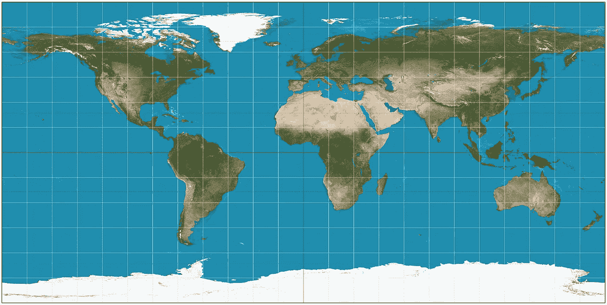
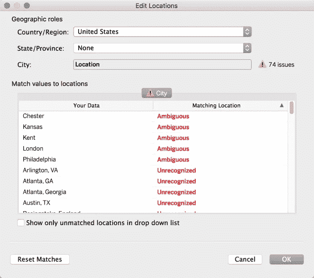
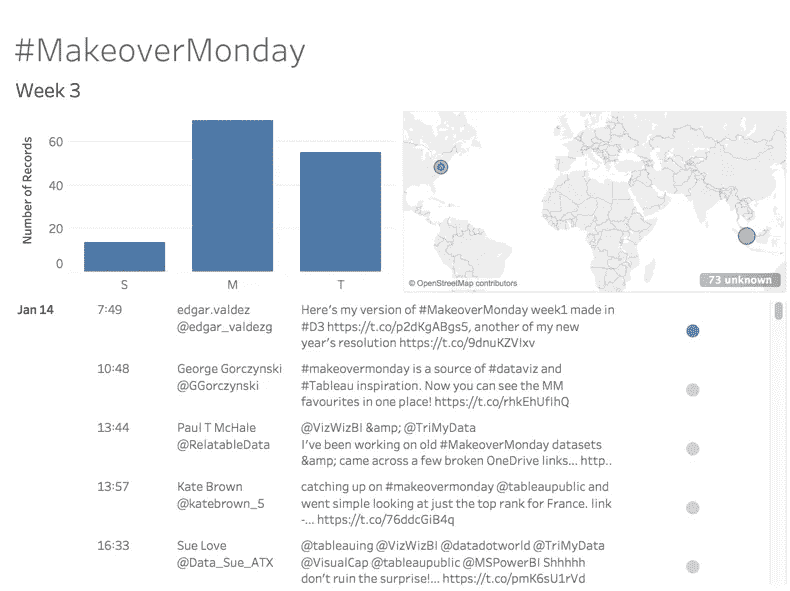
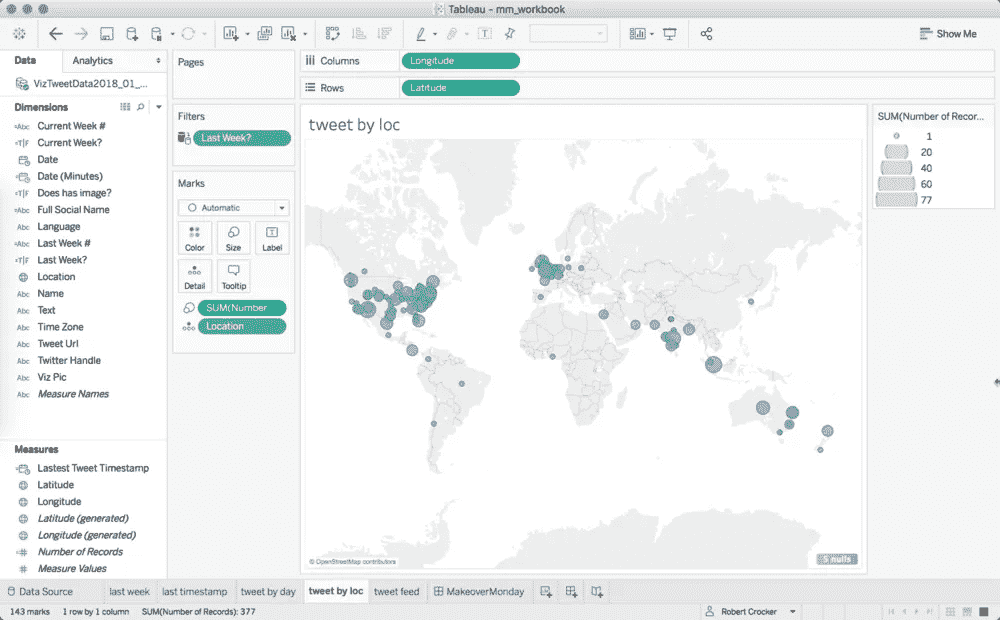

# 使用 GeoPy 清理位置数据

> 原文：<https://towardsdatascience.com/cleaning-location-data-with-geopy-51613bcd3c89?source=collection_archive---------27----------------------->



在本文发表时，Python 已经有超过 120，000 个库。随着我为了数据科学的需要而更深入地研究 Python，我发现自己安装了每一个我认为有用和/或有趣的库。这些图书馆中有一个是 GeoPy。正如其文档所述，GeoPy 是一个简单的库，旨在使用外部地理编码器和数据源对位置数据进行地理编码并获得位置坐标。数据清理问题的完美解决方案。

# 什么问题…和谁？

我目前正在参与一个三人项目，协助[伊娃·默里](https://www.linkedin.com/in/evamurray1/)和[安迪·克里贝尔](https://www.linkedin.com/in/andykriebel/)完成他们的[周一改造项目](http://www.makeovermonday.co.uk/)。如果你不知道那是什么，你一定要检查一下，然后投入进去(特别是如果你喜欢数据可视化的话)。Eva 或 Andy 将在每个星期天发送一个可视化数据和一篇文章。然后，参与者利用这些数据，使用他们选择的任何可视化工具创建他们自己的可视化(简称 viz)。然后，参与者在 Twitter 上分享他们的 viz 的链接和图像，并在 Data.World 上发布。最后，Eva 和 Andy 通过现场网络研讨会提供对这些可视化效果的反馈。

在这个项目中，我最棒的队友是罗伯特·克罗克和迈赫萨姆·拉扎·赫马尼。我和 Mehsam 的项目的一部分是收集包含他们 vizzes 的图片和链接的 tweets。Mehsam 收集了过去两年的推文，而我使用 [tweepy](http://docs.tweepy.org/en/v3.5.0/) 来获取最近的推文。从这些推文中，我提取了各种有用的信息，比如参与者的位置(如果有的话)。

从推文中提取的位置数据的问题之一(除了奇怪的格式问题)是它们是如何产生的不一致。这些不一致使得 Rob 很难使用 Tableau 来绘制参与者的位置…



Rob’s Tableau window showing the geographical detection issues.

因此，团队建议将位置更改为经纬度坐标。Rob 接着问 GeoPy 图书馆是否有帮助。那时我很高兴几天前下载了那个随机库。现在您将看到实现。如果你想查看代码，可以在我们的 [GitHub 项目报告](https://github.com/JohnDeJesus22/-MakeoverMonday-Collaborative-Project/blob/master/MOMgeopyApplied.py)中找到。

# 清洗代码

```
# Import Libraries and Classes
import pandas as pd
import numpy as np
from geopy.geocoders import Nominatim
from geopy.exc import GeocoderTimedOut
```

GeoPy 提供各种地理编码器。然而，其中一些需要获取 API 密钥。我决定使用提名，因为这对我来说是最容易使用的，而且不需要 API 密匙。我们还将为一个函数导入 GeocoderTimedOut 错误，我们将使用该函数对我们的位置进行地理编码。

```
# Load Data
df=pd.read_csv('data.csv',encoding='latin1')

# Function used to geocode locations and override timeout error
def do_geocode(address):
    geopy = Nominatim()
    try:
        return geopy.geocode(address,exactly_one=True)
    except GeocoderTimedOut:
        return do_geocode(address)

# Creating Geocoded Location column
df['GeocodedLocation']=df['Location'].apply(lambda x: do_geocode(x) if x != None else None)
```

当时加载的数据有 1100 多个条目(相当于 3 周)。使用上面的函数，我们可以对每个位置进行地理编码(这是我从 stackoverflow.com 修改的函数)。地理编码器的参数为 exactly _ one = True，因为我们只希望返回一个地址。

如果没有这个功能(正如我所经历的)，地理编码器将在地理编码过程中超时。上面的函数通过再次运行直到完成任务来防止超时。

为了存储地理编码的位置，使用 apply 属性和 lambda 函数创建了一个名为‘geocoded location’的列来应用 do_geocode 函数。一些 tweets 没有参与者的位置，所以我将让它返回 None，这样可以高效地创建坐标。

```
# Create the Latitude Column
lat=[]
for i in df['GeocodedLocation']:
    if i== None:
        lat.append(None)
    else:
        lat.append(i.latitude)
df['Latitude']=lat
df['Latitude'].astype('float')

# Create the Longitude Column
long=[]
for i in df['GeocodedLocation']:
    if i== None:
        long.append(None)
    else:
        long.append(i.longitude)
df['Longitude']=long
df['Longitude'].astype('float')
```

接下来，使用循环创建纬度和经度列。同样，我们将返回 None，以便 Tableau 可以将这些列中的数据识别为位置类型。每个坐标的数据类型都被转换成浮点数，所以不需要在 Tableau 中手工完成。

```
# Drop GeocodedLocation Column
df=df.drop(['GeocodedLocation'],axis=1)# Export Data to a csv
df.to_csv('data.csv', index=False)
```

然后我们将删除“GeocodedLocation”列，因为现在我们已经有了纬度和经度坐标列，保留它是多余的。然后数据被导出到一个 csv 文件中，这样就可以进行 Tableau 可视化了。

# 清洗的结果

现在我们有了我们的纬度和经度坐标，我们能够从 Tableau 开始，拥有一张几乎没有检测到任何位置的地图:



Before the GeoPy changes.

去所有的地方好让 Rob 施展他的舞台魔术！



After the GeoPy changes! A lot better huh?

你可以看看 Rob 在他的 [Tableau 公开简介中制作的仪表板草图。](https://public.tableau.com/profile/robert.crocker#!/vizhome/mm_workbook/MakeoverMonday)

# 感谢

再次感谢 Rob 让 GeoPy 的存在浮出水面，感谢他和 Mesum 调查这件事(也感谢他们是伟大的队友)。也感谢 GeoPy 的[创造者们，他们制作的库解决了我们的问题。](https://github.com/geopy/geopy/blob/1.11.0/docs/index.rst)

# 还有一点

你一定要参加周一的化妆大赛。这是练习和提高数据可视化技能的好机会。你还可以获得额外的好处，让你的 viz 得到审查，并成为一个令人惊讶的支持社区的一部分。以下是改头换面星期一的所有链接:

1.[改头换面星期一网站](http://www.makeovermonday.co.uk/)(在这里可以看到如何参与项目的主要网站)

2.[#改头换面周一推特消息](https://twitter.com/search?q=%23MakeoverMonday&src=tyah)(忽略其他关于化妆之类的随机消息……)

3.[数据。世界](https://data.world/makeovermonday)(周一改造的数据集与 viz 帖子放在一起)

期待您的参与:)

直到下一次，

约翰·德杰苏斯

*原载于*[*www.jddata22.com*](https://www.jddata22.com/home//cleaning-location-data-with-geopy)*。*