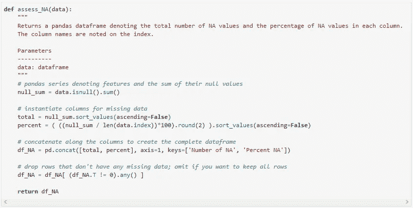
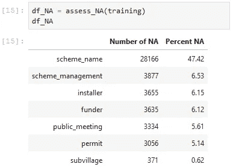

# 清除熊猫数据帧中的缺失值

> 原文：<https://towardsdatascience.com/cleaning-missing-values-in-a-pandas-dataframe-a88b3d1a66bf?source=collection_archive---------9----------------------->

使用 Python 可视化缺失数据的方法以及如何处理它们。


Photo by [Jan Kolar / VUI Designer](https://unsplash.com/@jankolar?utm_source=medium&utm_medium=referral) on [Unsplash](https://unsplash.com?utm_source=medium&utm_medium=referral)

在分析数据时，您可能会遇到丢失的数据(也称为空值或 NaNs)。数据清理是数据分析管道的重要组成部分，确保数据清理干净将使您的分析更加有力。

# 确定缺失值

您需要导入的唯一库是 pandas:

```
import pandas as pd
```

如果您正在使用 Python 中的 pandas 库，并且经常处理具有缺失值的数据，并且需要更快地进行数据分析，那么这里有一个快速函数，它会输出一个数据帧，告诉您每列中有多少缺失值及其百分比:



可读性稍差的版本，但是您可以将它复制粘贴到您的代码中:

```
def assess_NA(data):
    """
    Returns a pandas dataframe denoting the total number of NA values and the percentage of NA values in each column.
    The column names are noted on the index.

    Parameters
    ----------
    data: dataframe
    """
    # pandas series denoting features and the sum of their null values
    null_sum = data.isnull().sum()# instantiate columns for missing data
    total = null_sum.sort_values(ascending=False)
    percent = ( ((null_sum / len(data.index))*100).round(2) ).sort_values(ascending=False)

    # concatenate along the columns to create the complete dataframe
    df_NA = pd.concat([total, percent], axis=1, keys=['Number of NA', 'Percent NA'])

    # drop rows that don't have any missing data; omit if you want to keep all rows
    df_NA = df_NA[ (df_NA.T != 0).any() ]

    return df_NA
```

您需要传递的唯一参数是 dataframe 对象。这里有一个例子，我们在名为`training`的丢失数据的数据帧上调用函数`assess_NA()`，然后输出数据帧:`df_NA`。



行表示数据框的要素，列提供关于缺失数据的信息。如果没有丢失的值，那么它将只输出一个空的数据帧。

# 清除丢失数据的方法

了解了这一点，您就可以更好地了解如何处理空值，例如:

1.  **删除**行
2.  **使用平均值、中值、0、假、真等进行估算**。

## 删除包含空值的行

这个方法是处理丢失值的一种简单但混乱的方式，因为除了删除这些值之外，它还可能删除不为空的数据。您可以在整个数据帧或特定列上调用`dropna()`:

```
# Drop rows with null values
df = df.dropna(axis=0)# Drop column_1 rows with null values
df['column_1'] = df['column_1'].dropna(axis=0)
```

轴参数决定了函数将作用的尺寸。`axis=0`删除所有包含空值的行。`axis=1`做了几乎相同的事情，只是它删除了列。

## 输入空值

插补不是丢弃缺失数据的值，而是用另一个值替换这些值，通常是特定列的平均值或中值。使用任何一种都有好处。例如，如果该列有许多异常值，中位数可能会更有用，因为它更能抵抗这些异常值。通过这种方式，我们试图保留数据的某些方面。为此，我们可以在 dataframe 列上调用`fillna()`函数，并将`mean()`或`median()`指定为参数:

```
# Impute with mean on column_1
df['column_1'] = df['column_1'].fillna( df['column_1'].mean() )# Impute with median on column_1
df['column_1'] = df['column_1'].fillna( df['column_1'].median() )
```

除了平均值和中值之外，在某些情况下，用 0 来输入缺失数据也是一个好主意:

```
# Impute with value 0 on column_1
df['column_1'] = df['column_1'].fillna(0)
```

知道在处理丢失的数据时采取什么途径很大程度上取决于领域知识和您的直觉告诉您的关于数据的信息。这是一步一步来的，通过使用数据集，你可以问一些有意义的问题。