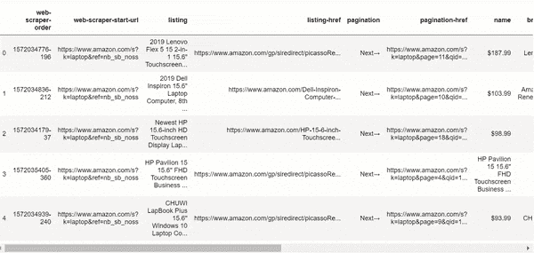
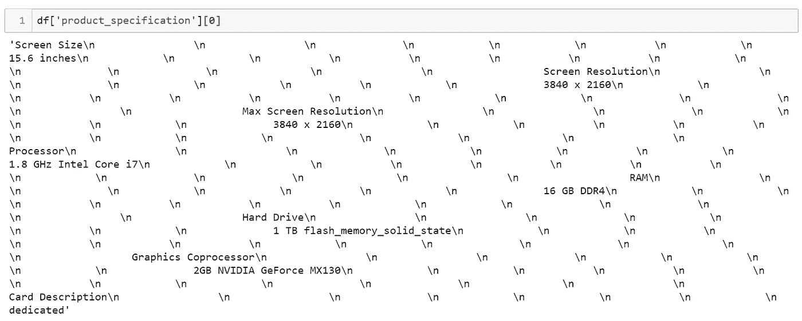
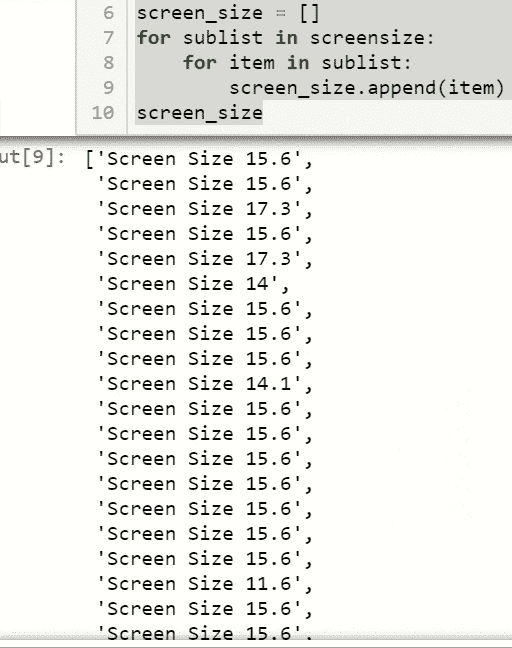
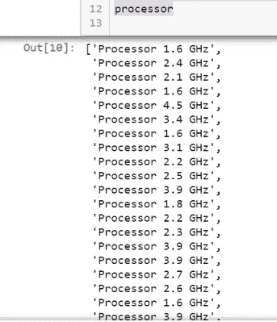

# 用熊猫和 Regex 清理网络抓取的数据！(第一部分)

> 原文：<https://towardsdatascience.com/cleaning-web-scraped-data-with-pandas-and-regex-part-i-a82a177af11b?source=collection_archive---------13----------------------->


Photo by [JESHOOTS.COM](https://unsplash.com/@jeshoots?utm_source=medium&utm_medium=referral) on [Unsplash](https://unsplash.com?utm_source=medium&utm_medium=referral)

## 如何从网络搜集的数据中创造意义，用于数据分析和机器学习

# ||我||简介

既然我已经开始每天编程，我决定投资一台笔记本电脑，让我能够顺利地执行多项任务，并以我习惯的方式运行所有我想要的应用程序。

我有一台基于 Unix 的 Macbook，但当我在处理需要处理大量图像或视频的项目时，它的 M3 处理器就不适合我了。我也有一台工作用的 Windows 笔记本，配有不错的 i5，但在使用它之后，我意识到我的需求要高得多。

然而，我不打算随便花 2000 美元买一台性能好的机器。实际上，我想了解笔记本电脑的组件/规格(尺寸、存储、内存、处理器等)。)有助于在市场上以某一价格形成 Lapton 的总体表现。例如，我想推导出:

*   笔记本电脑不同组件与其价格之间的关系。
*   产品等级和特定组件之间的关系。
*   不同品牌及其类似产品的比较。

我可以从搜集产品数据中获得许多见解，我最终将开发一种算法，在给定大量输入的情况下找到合适的笔记本电脑。

# || II ||网页抓取

> 多亏了一个朋友，我发现了谷歌 Chrome 上的“Web Scraper”扩展。这里可以找到[。
> 这个扩展帮我在亚马逊上收集了笔记本电脑所需的数据。](https://chrome.google.com/webstore/detail/web-scraper/jnhgnonknehpejjnehehllkliplmbmhn/related)

这个网页抓取器做了大多数其他人做的事情:它从页面来源收集我们想要的信息。网站并不总是让你很容易从他们的网页中提取数据，因此你需要清理提取的数据，然后才能使用它进行任何类型的分析。


Photo by [The Creative Exchange](https://unsplash.com/@creativeexchange?utm_source=medium&utm_medium=referral) on [Unsplash](https://unsplash.com?utm_source=medium&utm_medium=referral)

那么，我所说的“清理”数据是什么意思呢？
通常，数据会有一些杂质，如 NaN(空)值、不必要的列、不可读的字符或空格(я或\s)。
在下面我的笔记本电脑数据集的例子中，你会看到我们所有的数据是如何存储在一个单独的列中的，我们需要将每组单词拆分到单独的列中。

对于**网络抓取，**你可以按照[这个指南](https://www.scrapehero.com/scrape-product-data-from-amazon/)使用谷歌 Chrome 上的网络抓取扩展来提取亚马逊上的产品数据。
我将专门处理亚马逊上的产品数据，尽管我相信你可以从很多网站上搜集。重要的是为您的提取找到正确的 JSON 代码(如您在指南中所见)。
**在进入下一部分之前，** [**学习如何抓取数据**](https://www.scrapehero.com/scrape-product-data-from-amazon/) **。如果你已经有了一个 CSV 格式的数据，那就继续吧。**

# || III ||导入库和数据

既然您已经将收集到的数据保存为 CSV 格式，那么让我们加载一个 Jupyter 笔记本并导入以下库:

```
#!pip install pandas, numpy, reimport pandas as pd
import numpy as np
import re #Regex
```

然后上传数据，用`df = pd.read_csv('amazon.csv')`读取。该表应该类似于下面的输出。



Extracted Data — Not exactly clean, is it?

这是我对数据的看法:并非完全无用，因为它确实包含了所有需要的信息，尤其是在`product_specification`列中。但是，当我们查看该列的一个实例时，它看起来像是:



看起来完全有可能为我的数据集中的每一项将这些组件分成不同的列。首先，我将分离我的数据，只把需要的列复制到一个新的 DataFrame 中。

```
data = df[['listing', 'listing-href', 'brand', 'review_count', 'sales_price', 'product_description', 'product_specification']].copy()
```

现在我们的专栏已经在`data`了，让我们开始清理过程。

# || IV ||打扫卫生

> 像数据科学家一样思考，而且..像玛丽·近藤一样思考

首先，我们必须删除所有包含 Null/NaN 值的行。这是因为我们不能在没有任何值的列上运行 regex 函数，我们最终会得到不匹配的索引值，并且以后很难将我们清理过的列合并到数据集。

```
data = data.dropna(how='any')
data = data.reset_index(drop=True)
```

现在我们已经删除了空值，可以开始清理数据集了。第一步是删除`\s, \n, \t`字符。正如你在上面的图片中看到的，我们的信息在`\n`人物中变得模糊不清。

```
data = data.replace(r'\n',' ', regex=True)
data = data.replace(r'\t','', regex=True)
data = data.replace(r'\s\s\s','', regex=True)
```

**注意:**我使用`\s\s\s`是因为经过一些实验，我注意到了一种三个空格的制表符的模式。但是，如果你没有这样的模式，你也可以只使用`\s`。

# || V ||正则表达式

下一步也极其重要。我们必须删除不包含以下信息的特定行。唯一的问题是它会显著减小数据集的大小。然而，就我而言，我认为这比空值要好。空值必须通过均值、中值或众数来填充，这两种方法在这里都没有意义。因此，我将删除没有所需数据的行。

```
#Screen Size
data.drop(data[~data.product_specification.str.contains("Screen Size")].index, inplace=True)#Processor type
data.drop(data[~data.product_specification.str.contains("Processor (?<![a-zA-Z:])[-+]?\d*\.?\d+\s\w+",regex=True)].index, inplace=True)#Processor Speed
data.drop(data[~data.product_specification.str.contains("GHz (?:[A-Za-z]+\s){0,}[A-Za-z]+\w+",regex=True)].index, inplace=True)#RAM
data.drop(data[~data.product_specification.str.contains("RAM (\w+\s\w+){1,}",regex=True)].index, inplace=True)#Storage
data.drop(data[~data.product_specification.str.contains("Hard Drive (\w+\s\w+\s\w+){1,}",regex=True)].index, inplace=True)#Graphic Card
data.drop(data[~data.product_specification.str.contains("Chipset Brand (\w+){0,}",regex=True)].index, inplace=True)#Graphic Card Brand
data.drop(data[~data.product_specification.str.contains("Card Description (\w+){0,}",regex=True)].index, inplace=True)data = data.reset_index(drop=True)
```

在上面的代码行中，当我使用`~`操作符时，这个函数会做相反的事情。所以当我说`~data.product_specification.str.contains`时，我实际上是在做一个“不包含”函数，不会删除包含括号内值的字符串。
在括号内，我指定了我要寻找的正则表达式字符串。例如，如果我想在单词“卡片描述”后输入 0 个或更多单词，我可以说`Card Description (\w+){0,}`。在这之后的部分我会进一步解释。

现在我知道我的数据长度不会受到影响，我可以将`product_specification`列转换成 regex 功能的列表。

```
l = []
for i in data['product_specification']:
    l.append(i)
```

在这里，我将解释正则表达式语法以及如何从每一列中提取文本数据。在下面的代码行中，我提取了列表中每台笔记本电脑的屏幕尺寸，并将它们存储在一个名为“screen_size”的单独列表中。

```
screensize = []for words in l:
    screensize.append(re.findall(r"^Screen Size (?<![a-zA-Z:])[-+]?\d*\.?\d+", words))

screen_size = []
for sublist in screensize:
    for item in sublist:
        screen_size.append(item)
```

下图向我们展示了 regex 循环后 screen_size 的样子。



如你所见，对于每台笔记本电脑，我都有单词“屏幕尺寸”以及存储在列表中的尺寸(15.6、17.3 等)。

因此，如果您仔细观察 regex 语法，您会发现我在单词“Screen Size”后面请求了一个浮点数

我们不能使用`\d`的原因是它们不是整数，而是浮点类型。因此，我必须指定将有一个“.”2 个整数之间带
和`\d*\.?\d+`。

让我们看另一个例子，提取每台笔记本电脑的处理器速度。

我们重复这些步骤，编写类似的行，同时更改 regex 语句。

```
processors = []for words in l:
    processors.append(re.findall(r"Processor (?<![a-zA-Z:])[-+]?\d*\.?\d+\s\w+", words))

processor = []
for sublist in processors:
    for item in sublist:
        processor.append(item)
```

下图向我们展示了 regex 循环后的`processor`的样子。



现在，如果你看看这个和上一个的区别，你可以看到我在`\d*\.?\d+`后面加了`\s\w+`，因为现在我们在浮点数后面又多了一个词“GHz”。

因此，查看数据并了解您将为每个组件收集什么类型的信息非常重要。

我们需要为每个组件执行相同类型的循环。如果你在最后看我的要点，你会发现所有的例子都已经在里面了。

**注:**这只是第一部分！在即将发布的下一篇文章中，我会将所有这些列表存储到我的 DataFrame `df`中，并执行更多的清理操作，例如清理名称、替换不常用的类别、删除$符号和单位，如“GHz”或“GB”。

# 第一部分结束

下面，你可以找到我的笔记本，里面有清理这些数据的所有代码。

The “Cleaning” notebook.

> 请继续关注更多—第 2 部分即将推出。
> 
> 关注 Rohan Gupta，了解其他数据科学内容和教程！