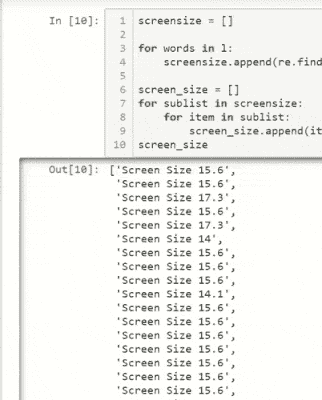
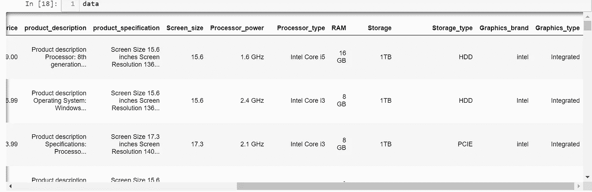
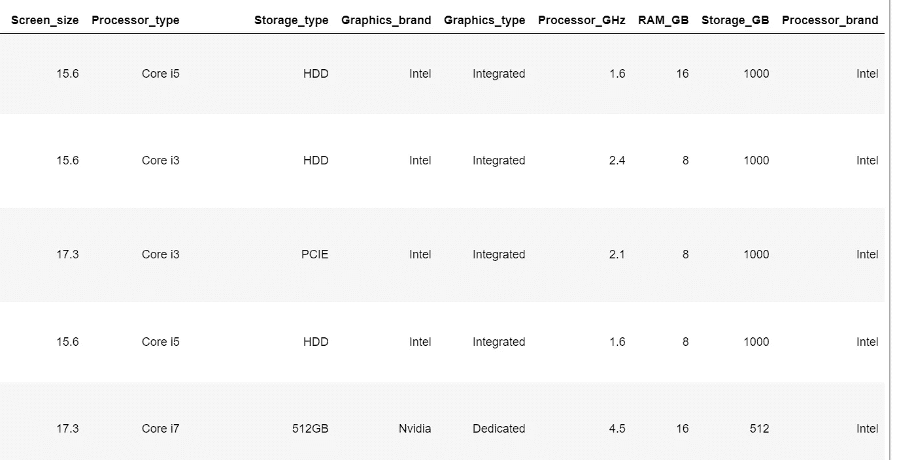
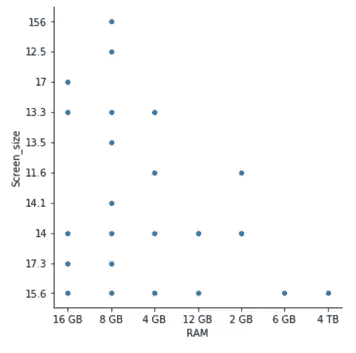

# 用熊猫清理网络抓取的数据(下)

> 原文：<https://towardsdatascience.com/cleaning-web-scraped-data-with-pandas-part-ii-8520f47cc929?source=collection_archive---------32----------------------->


Photo by [Oliver Hale](https://unsplash.com/@4themorningshoot?utm_source=medium&utm_medium=referral) on [Unsplash](https://unsplash.com?utm_source=medium&utm_medium=referral)

## 如何从网络搜集的数据中创造意义，用于数据分析和机器学习

这篇文章是我之前关于清理网络抓取数据的讨论的延续。您可以通过以下链接访问第一部分:

[](/cleaning-web-scraped-data-with-pandas-and-regex-part-i-a82a177af11b) [## 用熊猫和 Regex 清理网络抓取的数据！(第一部分)

### 如何从网络搜集的数据中创造意义，用于数据分析和机器学习！第 2 部分—即将推出！

towardsdatascience.com](/cleaning-web-scraped-data-with-pandas-and-regex-part-i-a82a177af11b) 

# || I ||数量与质量(数据)

正如我在之前的帖子中提到的，清理数据是机器学习的先决条件。测量数据的健全性也可以很好地表明模型的精确程度。说到网络抓取的数据，你经常会在清理的过程中丢失很多信息。那么应该是什么呢？数量还是质量？


Photo by [JOSHUA COLEMAN](https://unsplash.com/@joshstyle?utm_source=medium&utm_medium=referral) on [Unsplash](https://unsplash.com?utm_source=medium&utm_medium=referral)

回答这个问题并不容易，因为它实际上取决于案例和数据科学家制定的流程。

如果您最终处理的数据需要较少的特异性来处理它的变量，那么您可以选择使用数量，并且应该可以使用数据清理方法，这些方法可以使用推理数据来替换值。

但是，如果您处理的数据确实需要特殊性。例如，在这种情况下，我们正在处理笔记本电脑数据。使用平均值、中间值或众数来替换我们数据中缺失的值是没有意义的，因为有多种类别的笔记本电脑具有不同的规格组合。例如，如果 i5 是列“处理器”的模式，您不能让所有缺少的值都等于 i5，因为这会扭曲数据，产生很大的偏差。

因此，您可以通过删除缺少值的行来清除数据。这将把数据从 440 个值减少到 153 个值。我知道这对机器学习模型来说不太好，但作为一名数据科学家，我明白我的结果质量将与我的数据质量密切相关。因此，保持整洁是最好的方法，否则我将不得不手动检查每一行缺失的数据来填补空白。
— —*——‘废话少说——我们走吧* — — —


Photo by [Smart](https://unsplash.com/@smartphotocourses?utm_source=medium&utm_medium=referral) on [Unsplash](https://unsplash.com?utm_source=medium&utm_medium=referral)

# || II ||映射并存储到数据框架中



在使用 regex 从每个字符串中提取出所需的文本片段以获得每个新数据列的列表后，我停止了第 1 部分。图中显示了每一列:
- `screen_size`:屏幕尺寸
- `processor` : GHz
- `processor_type`:名称
- `ram` : RAM
- `storage`:数量(HDD/SSD)
- `chipset`:显卡品牌
- `gc`:显卡类型

获得这些列表后，我们现在可以将它们作为列添加到我们的数据框架中。我们只需将每个 DataFrame 列分配给其各自的 list 对象，然后映射每行的文本，这样就可以只保留相关的数据。下面的代码行是我如何为每一个专栏做这件事的例子。例如，在列表 screen_size 中，我们得到了整个字符串“屏幕尺寸 15.6”，而我们只想要“15.6”。我们也希望每行都这样，所以当我们使用**映射函数**去掉前 12 个字符:*“屏幕尺寸 15.6”→“15.6”。*同样，您应该能够理解不同列的其他示例。

```
#Screen Size
data['Screen_size']= screen_size
data['Screen_size']= data['Screen_size'].map(lambda x: str(x)[12:])#Processor Power
data['Processor_power'] = processor
data['Processor_power'] = data['Processor_power'].map(lambda x: str(x)[10:])#Processor Type
data['Processor_type'] = processortype
data['Processor_type'] = data['Processor_type'].map(lambda x: str(x)[5:-2])#RAM
data['RAM'] = ram
data['RAM'] = data['RAM'].map(lambda x: str(x)[:])#Storage & Storage Type
data['Storage'] = storage
data['Storage'] = data['Storage'].map(lambda x: str(x)[:])
data['Storage_type'] = data['Storage'].map(lambda x: x.split()[2])
data['Storage'] = data['Storage'].map(lambda x: x.split()[0] +  x.split()[1])#Graphics Card brand
data['Graphics_brand'] = chipset
data['Graphics_brand'] = data['Graphics_brand'].map(lambda x: str(x)[:])#Graphics Card Type
data['Graphics_type'] = gc
data['Graphics_type'] = data['Graphics_type'].map(lambda x: str(x)[:])
```

结果应该如下所示:



clean-ish data…

# || III ||数值型数据是真正的数值型

接下来，我将把每个数字列转换成一个真正的数字列，允许它反映所包含的数据类型(整型或浮点型)。为此，我必须从销售价格列中删除' $ '符号，然后将其转换为数字。对于屏幕尺寸，由于我们只有数字，我们只需要转换它。**确保使用** `**errors='coerce'**` **。**

```
salesprice = data['sales_price'].str.lstrip('$')
salesprice = pd.to_numeric(salesprice, errors='coerce')
salesprice.fillna(salesprice.mode()[0], inplace=True)
screensize = data['Screen_size']
screensize = pd.to_numeric(screensize, errors='coerce')
```

那很容易。现在让我向你展示用`rstrip`和`lstrip`做同样事情的另一种方法。这次我将使用列`processor_power`和`ram`。我们希望在第一种情况下删除“GHz ”,在第二种情况下删除“GB”。

```
data['Processor_GHz'] = data['Processor_power'].str.rstrip('GHz')
data['RAM_GB'] = data['RAM'].str.rstrip(' GB')
```

上面几行应该已经在您的数据中创建了新的列，现在可以将这些列转换为数字。

# || IV ||保持分类数据的相关性

当你有分类数据时，最好少于 5 个类别，因为这会使你的数据不那么模糊。在 processor_type 列中，我可能不能拥有少于 5 个类别，但是我肯定可以将所有相似的对象移动到一个类别中。比如“AMD A4”和“AMD A6”都可以归入“AMD A 系列”。我还添加了一个名为“Other”的类别，包含该列中不常用的值。因此，下面几行:

```
#Removing "Intel" since we would come to know by the name.
processortypez = data['Processor_type'].str.lstrip(' Intel')pt = []
for i in processortypez:
    if i == 'core_m':
        i = 'M Series'
    elif i == 'AMD A4' or i =='AMD A6' or i=='Apple A6':
        i = 'AMD A Series'
    elif i == 'i7' or i == 'Core':
        i = 'Core i7'
    pt.append(i)data['Processor_type'] = pt
proz = data['Processor_type']pz = []
for i in proz:
    if i != 'Core i3' and i != 'Core i5' and i != 'Core i7' and i != 'Celeron' and i != 'Pentium' and i != 'AMD A Series' and i != 'AMD R Series':
        i = 'Other'
    pz.append(i)data['Processor_type'] = pz
```

我对“存储”列做了类似的操作，其中 1TB 是 1000GB，因为我将删除“GB”部分，所以我将有一个单一的度量单位，将所有 TB 转换为 GB。

```
strzz = data['Storage']
zz = []
for i in strzz:
    if i == '1TB':
        i = '1000GB'
    elif i == '2TB':
        i = '2000GB'
    elif i == 'FlashMemory':
        i = '64GB'
    zz.append(i)
data['Storage'] = zz
data['Storage_GB'] = data['Storage'].str.rstrip('GB')
```

我也对许多其他需要修复的列做了同样的事情。你可以在提供的要点(在底部)中找到所有完整的例子。

## 最后，我将删除不需要的列:

```
data = data.drop(columns=['Processor_power', 'RAM', 'Storage'])
```

## 已清理数据帧的快照:



Clean and ready-to-use data.

## **我运行了一个快速散点图来查看数据，猜猜我发现了什么:**

```
import seaborn as sbscatplot = sb.relplot(x="RAM", y="Screen_size", data=data)
```

下面你可以看到散点图。注意到什么奇怪的事了吗？



其中一个屏幕尺寸写着“156”！这不可能。它应该是 15.6，所以让我们继续快速更改它:

```
scrnsize2 = []
for i in screensize:
    if i == 156.0:
        i = 15.6
    scrnsize2.append(i)
df[screen_size]=scrnsize2
```

# 第二部分结束

感谢阅读。我希望你从这两部分中学到了有用的东西！下面，你可以找到我的笔记本，里面有清理这些数据的所有代码。

The “Cleaning” Notebook

> 关注 Rohan Gupta，了解其他数据科学内容和教程！