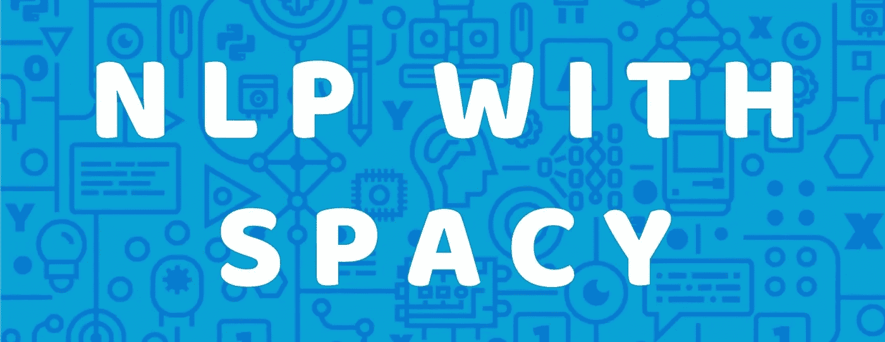
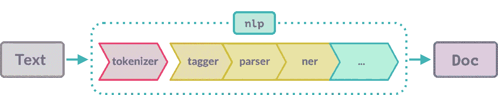
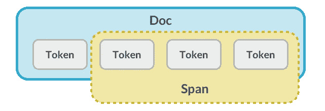
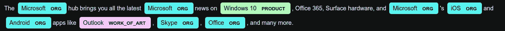

# 用代码明确 NLP 的基本原理。

> 原文：<https://towardsdatascience.com/clear-the-fundamentals-of-nlp-with-code-7d419daefccf?source=collection_archive---------31----------------------->

## 有空间的自然语言处理(第二部分)

> 使用 spacy 获得 NLP 基础知识的实践经验。



> 这是上一篇文章[NLP 综合指南](https://medium.com/@manimannu93/nlp-with-spacy-part-1-beginner-guide-to-nlp-4b9460652994)的延续。

在上一篇文章中，我介绍了什么是自然语言处理，什么是自然语言处理的子集(NLU 和 NLG)以及应用。

在这篇文章中，我将通过使用越来越流行的 [spaCy](https://spacy.io/) 包和一些应用程序的实现，用代码演示 NLP 的基础。

# 为什么是 spaCy？

众所周知，斯坦福大学最著名的 NLTK 图书馆被人们使用了几十年。它是由研究人员和学者构建的，作为 NLP 系统的工具。NLTK 是为了支持教育和帮助学生探索想法而创建的。虽然，它对 NLP 系统很有效。这是一个字符串处理库，它返回字符串作为结果。

spaCy 是为 Matt Honnibal 在 [Explosion AI 开发的“Python 中的工业强度 NLP”而打造的。](https://explosion.ai/)主要用于生产环境及其极端的用户友好性。这是一种基于对象的方法，它返回对象而不是字符串和数组。

## 相对于 NLTK 的优势:

*   它非常快，因为它是用 Cython 语言编写的。
*   依存解析。
*   它还提供了对更大的词向量的访问，这些词向量更容易定制。
*   综合词向量。
*   支持 GPU 加速。
*   支持用户定义的深度学习网络。
*   但是，与 NTLK 相比，在句子标记化方面非常慢

# 你将会学到什么。

1.  符号化。
2.  别说了。
3.  词干化和词汇化。
4.  依存解析。
5.  词性标注。
6.  组块。
7.  实体识别。
8.  词向量相似度。

# 先决条件

在开始之前，您需要在 pip 或 conda 的帮助下将它安装到您的环境中(如果您已经安装了的话)。我喜欢用 pip，所以用 pip 安装。

```
# Using pip
sudo pip install spacy# Using conda
conda install -c conda-forge spacy
```

您需要手动安装特定于语言的模型，因为它们不与 spaCy 库捆绑在一起。

*   **en_web_core_sm = >** 小
*   **en_web_core_md = >** 中型
*   **en_web_core_lg = >** 大号

其中“en”指的是英语，大小因其能够执行的应用而异，在我们的情况下，小型和中型封装是可以的。使用下面的命令下载和安装统计模型。最好为您的项目创建一个虚拟环境。

```
# Download Models
python3 -m spacy download en_web_core_[any size]
```

## 数据类型:Doc、Span、令牌。

*   Doc 对象包含关于文本的所有信息。提供对文本所请求的语言信息的访问的属性、方法和特性。



Source: spaCy.io

*   文档的切片称为 span 对象，元素称为 Token 对象。它们只包含地址并指向 doc 对象中的数据。它们就像一个指针。



Source: Datacamp.com

# 1.符号化。

这是自然语言处理任务中的一个基本步骤。单词“标记化”描述了将文本分成单词、标点符号..etc 转换成令牌，对它进行处理后，结果存储在 **Doc 对象中。**

Tokenization

*   这就是单词标记化。它是通过用空格、标点、符号和其他元素分隔单词的方式来执行的。
*   From isn 't = = > ' is '，' n t '和分隔'！'== >感叹，' .'== >句号这都属于标点符号范畴。

# 2.别说了。

停止像**这样的话，“一、是、上、为、我的、也、任何、只有、现在..etc"** 由于它们对我们想要在处理之前丢弃它们的句子没有贡献意义，所以它们是在执行**机器翻译&文本摘要、问答问题**时不需要丢弃停用词的一些情况。

Stopwords Removal Script.

*   标点符号不变
*   换行符(\n)、特殊字符和标点符号应该手动删除。

# 3.词干化和词汇化。

词干化和词汇化都是指文本规范化，即我们将每个单词缩减为其词根或基本形式。

> **举例:**Plays Played = =>Play(根形式)

**== >词干**通过截断与单词一起使用的后缀或前缀来输出单词，这种情况更糟，不能提供正确的基本形式，但有时会提供，但大多数情况下**会返回无效单词。**不幸的是，spacy 不提供词干功能。

> **示例:病历报告**生成为**病历报告，删除了**后缀。
> 
> 在某些情况下，**学习**让位于**学习。**

**== >词汇化**提供实际的词根，因为它使用词汇和词形分析来缩减输入文本。它返回一个真实的语言单词。

Lemmatization.

*   可以看到“有”== >“有”和“发射”== >“发射”完成了。

# 4.依存句法分析

为了更好地理解每个词(如主语、宾语、动词)之间的关系，它为每个词加上了句法依存标签。

*   spaCy 库提供了一个奇妙的可视化工具，名为**dispasy**，用于将的依赖标签显示为图形。

Dependency_parsing.

*   它用于语义分析，也用于检查语法错误。

# 5.词性标注

它分配词类标签，如名词、副词、形容词..句子中的每个单词。分配标签是必要的，因为它有助于区分不同上下文中相同标记或单词的含义。

> **举例:**什么**下一个**？她坐在**旁边**她，
> 
> 两者都有共同的词 **next** ，但是第一个是副词，第二个是介词。

POS_Tagging.

我们可以用两种不同的方式输出 POS 标签，要么通过**。pos_ attribute** 显示粗粒度的 pos 标签，表示完整的单词或**。tag_ attribute** 显示原始标签名称的缩写。

# 6.组块

组块是向句子添加句法结构和意义的过程，而词性标签描述动词、副词、形容词等，但它们不提供意义，**组块是通过将词性标签**作为输入并返回组块作为输出来执行的。它有助于提取用于命名实体识别的名词和动词短语组。

Noun phrase Chunking.

# 7.命名实体识别

命名实体识别也称为 Ner，用于将现实世界的对象标记为预定义的类别**，如名称、地点、事物、组织、数量、数字等。**spacy 统计模型能够识别多种命名或数值实体。您可以通过对大量数据进行训练来添加您的自定义类别。

Named Entity Recognition on Microsoft News.



NER Output.

*   它的应用是在利用 NER 标签的搜索引擎中，该标签被识别用于有效的搜索。

# 8.词向量相似度

这是一个将单词转换成向量的过程，用于**寻找同一棵树**的单词之间的相似性。对于人类来说，很容易知道“狗”和“猫”之间的相似之处，因为它们都属于动物范畴。对于机器来说，他们找到了与向量的相似之处。它还用于句子和文档，以查找每个句子之间的相似性。它也被称为单词嵌入

Word vector similarity.

*   这只是一个例子，我们可以用不同的统计模型来做更多的工作。
*   词向量相似度的应用是推荐系统和机器翻译。

# 结论:

*   许多 NLP 库表现良好，使用 spacy 的目的是使过程快速并简化任务，具有内置的词向量，并提供具有良好准确性的结果。
*   Spacy 有能力立即执行任务，但需要基本的理解。
*   尝试调整预先训练好的模型
*   如果任务不能很好地执行，为任务编写自己的自定义管道类。

我们已经看到了一些 NLP 任务的基础，但它们更多，我们只是触及了表面，对引擎盖下的过程有了深刻的理解，您可以做许多有趣的事情。

> 快乐学习:)

# 参考资料:

1.  塞维多夫 Guts，[https://www . slide share . net/Yuri Guts/natural-language-processing-NLP](https://www.slideshare.net/YuriyGuts/natural-language-processing-nlp)。
2.  [lahi ru Liyanapathirana，https://heart beat . fritz . ai/NLP-chronicles-intro-to-spacy-34949 f1 BC 118](https://heartbeat.fritz.ai/nlp-chronicles-intro-to-spacy-34949f1bc118)。