# 清除“助推”周围的空气

> 原文：<https://towardsdatascience.com/clearing-air-around-boosting-28452bb63f9e?source=collection_archive---------18----------------------->

## 了解获得最佳结果的当前定位算法


Clearing Photo by [SpaceX](https://unsplash.com/@spacex?utm_source=medium&utm_medium=referral) on [Unsplash](https://unsplash.com?utm_source=medium&utm_medium=referral)

**注:**虽然这篇文章有点数学化，但只要阅读前两节，即[简介](#4b85)和[历史](#a355)就能理解`Boosting`和`Gradient Boosting`的核心工作。之后的部分是不同梯度提升算法的论文解释。

这是我来自`Concepts`类别的帖子中的一个，可以在我的 github repo [这里](https://github.com/PuneetGrov3r/MediumPosts/tree/master/Concepts)找到。

# 索引

1.  [简介](#4b85)
2.  [历史](#a355) ( [套袋](#3203)、[随机森林](#0d9a)、[助推](#4f1e)、[梯度助推](#072a))
3.  [AdaBoost](#935b)
4.  [XGBoost](#2143)
5.  [灯 GBM](#2c63)
6.  [CatBoost](#7e1c)
7.  [延伸阅读](#70b0)
8.  [参考文献](#d087)

```
***NOTE:*** This post goes along with ***Jupyter Notebook*** available in my Repo on Github:[[ClearingAirAroundBoosting](https://nbviewer.jupyter.org/github/PuneetGrov3r/MediumPosts/blob/master/Concepts/Boosting.ipynb)]
```

# 1)简介

[^](#bd3e)

**Boosting** 是一种集成元算法，主要用于减少监督学习中的偏差和方差。

今天，Boosting 算法是在各种各样的环境/问题中获得最先进结果的最常用算法之一。它已经成为任何机器学习问题或竞赛获得最佳结果的首选方法。现在，

1.  助推算法取得如此巨大成功的背后原因是什么？
2.  它是如何形成的？
3.  未来我们能期待什么？

我会试着通过这篇文章回答所有这些问题，以及更多的问题。

# 2)历史

[^](#bd3e)


Photo by [Andrik Langfield](https://unsplash.com/@andriklangfield?utm_source=medium&utm_medium=referral) on [Unsplash](https://unsplash.com?utm_source=medium&utm_medium=referral)

助推是基于[卡恩斯](https://en.wikipedia.org/wiki/Michael_Kearns_(computer_scientist))和[瓦兰特](https://en.wikipedia.org/wiki/Leslie_Valiant) (1988，1989)提出的问题:“一组**弱学习者**能创造出一个单独的**强学习者**？”。

[Robert Schapire](https://en.wikipedia.org/wiki/Robert_Schapire) 在 1990 年[的一篇论文](https://en.wikipedia.org/wiki/Boosting_(machine_learning)#cite_note-Schapire90-5)中对 Kearns 和 Valiant 问题的肯定回答对机器学习和统计学产生了重大影响，最显著的是导致了 boosting 的发展。

与 Bagging 同时出现的还有其他一些集成方法，你可以说它们是现代梯度增强算法的子集，它们是:

1.  **打包**(自举聚合):(即[自举](https://en.wikipedia.org/wiki/Bootstrapping_(statistics)) +聚合) [^](#bd3e)

Bagging 是一个集合元算法，有助于提高稳定性和准确性。它还有助于减少差异，从而减少过度拟合。

在 bagging 中，如果我们有 N 个数据点，并且我们想要制作“m”个模型，那么我们将从数据“m”次**中取出数据**的一些**部分【主要是`(1–1/*e*)` ≈63.2% 】,并且重复其中的一些行**，以使它们的长度等于 N 个数据点(尽管它们中的一些是冗余的)。现在，我们将在这些“m”个数据集上训练这些“m”个模型，然后获得“m”组预测。然后我们汇总这些预测，得到最终的预测。

它可以与神经网络、分类和回归树以及线性回归中的子集选择一起使用。

2.**随机森林** : [^](#bd3e)

随机森林(或随机决策森林)方法是一种通过构建大量决策树来操作的集成学习方法。它有助于减少决策树模型中常见的过度拟合(具有高深度值)。

随机森林结合了“装袋”思想和随机选择特征，以构建一个决策树集合来对抗方差。正如在 bagging 中一样，我们为决策树制作了**自举训练集**，但是现在对于我们在树生成过程中制作的每个分裂，我们只选择了**特征总数**的一小部分【主要是`√n` 或`log2(n)`】。

这些方法，自举和子集选择，使得树彼此更加*不相关，并且有助于更大程度地减少方差，从而以更一般化的方式减少过拟合。*

***3。助推** : [^](#bd3e)*

*上述方法使用互斥模型的平均值，以减少方差。**助推**有点不一样。Boosting 是一种*顺序集成*方法。对于总数为“n”的树，我们以顺序方法添加树预测(即，我们添加第二个树来提高第一个树的性能，或者您可以说尝试纠正第一个树的错误，等等)。我们所做的是，从目标值中减去第一个模型的预测乘以一个常数(`0<λ≤1`)，然后将这些值作为目标值，我们拟合第二个模型，依此类推。我们可以把它看作:新的模型试图纠正以前的模型/以前的模型的错误。升压几乎可以用一个公式来概括:*

*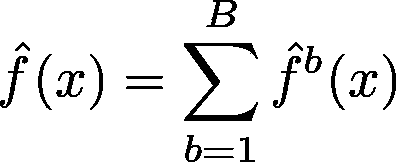*

*Boosting Formula*

*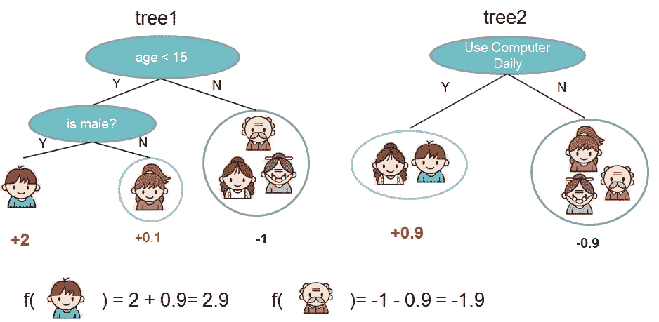*

*Example: Predicting if someone will like computer games. [Source: XGBoost docs]*

*即最终预测是所有模型预测的总和，每个模型都乘以一个小常数(`0<λ≤1`)。这是看待 Boosting 算法的另一种方式。*

*因此，实际上我们试图从每个学习者(都是**弱学习者**)那里学习关于目标的少量信息，这些学习者试图改进先前的模型，然后将它们相加以获得最终的预测(这是可能的，因为我们仅拟合先前模型的残差)。所以，每个顺序学习者都试图预测:*

*`(initial predictions) — (λ * sum_of_all_predictions_of_previous_learners)`*

*基于它们的性能，每个树预测器也可以具有不同的`λ`值。*

***4。渐变增强:** [**^**](#bd3e)*

*在梯度增强中，我们采用一个*损失函数*，它在每个拟合周期被评估(就像在深度学习中一样)。Jerome H. Friedman 关于梯度推进的第一篇[论文](https://statweb.stanford.edu/~jhf/ftp/trebst.pdf)关注的是最终函数的加法展开，类似于我们上面看到的。*

*我们首先预测一个目标值(比如，`γ`)，一个给出最小误差的常数(即第一次预测是`F0 = γ`)。之后，我们根据之前的输出计算数据集中每个点的梯度。因此，我们用预测和先前模型的所有输出的总和之间计算的误差来计算误差函数的梯度，w.r.t .先前模型的所有输出的总和，在平方误差的情况下将是:*

*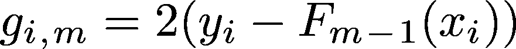*

*gradient w.r.t. sum of all values for that data point (i.e. ith gradient)*

*这样我们就有了以前模型所有输出的梯度。*

*为什么我们要这样计算梯度？*

*在神经网络中，根据所有参数(即所有神经节点)计算梯度是很简单的，因为神经网络在所有层中都是线性的(或其梯度易于计算的某个函数)组合，所以利用*反向传播*(根据所有参数)计算梯度并更新它们更容易。但是在这里，我们不能根据决策树的任何参数(如深度、叶子数量、分裂点等)计算输出的梯度，因为这并不简单(实际上是抽象的)。*

*J.H. Friedman 对每个输出使用误差梯度(误差函数),并使模型适合这些梯度。*

*这对获得更好的模型有什么帮助？*

*每个输出所代表的梯度 w.r.t .是我们应该向哪个方向移动以及移动多少，以获得特定数据点/行的更好结果，将树拟合问题转换为优化问题。我们可以使用任何类型的损失函数，它是可微分的，并且可以根据我们手头的任务进行定制，这在正常的助推中是不可能的。例如，我们可以将 MSE 用于回归任务，将 Log Loss 用于分类任务。*

*这里如何使用渐变来获得更好的效果？*

*与 Boosting 不同，在 Boosting 中，在`ith`迭代中，我们学习了输出(目标)的某个部分，而`(i+1)th`树将尝试预测剩下要学习的部分，即我们拟合残差，在这里，在梯度 Boosting 中，我们计算所有数据点/行的梯度，这告诉我们想要移动的方向(负梯度)和移动量(可以认为是梯度的绝对值)，并在这些梯度上拟合树。*

```
*These gradients, based on our loss function (chosen to optimize our problem better than others), reflect change we would want for our predictions. For example in convex loss functions we will get some multiple to some multiple of exponential increase in gradients with increase in residuals, whereas residuals increase linearly. Therefore getting better convergence time. Depends on loss function and optimization method.*
```

*这些给了我们数据点的梯度区域，这些区域将需要类似的更新，因为它们将具有类似的梯度。现在，我们将找到该区域的最佳值，该值将给出该区域的最小误差。(即采油树装配)*

*之后，我们将这些预测与之前的预测相加，得到这一阶段的最终预测。*

*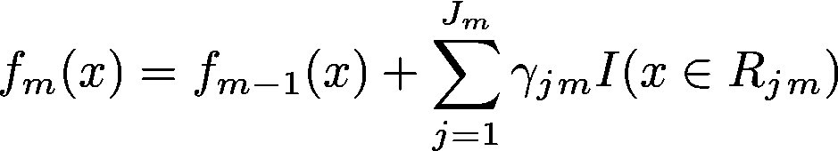*

*Where γjm is **prediction** for jth region for mth tree and Jm is number of regions for mth tree. So adding γ, for that region found by tree fitting, times identity, giving 1 iff that data point is in current region..*

*这为我们提供了每个数据点/行的新预测。*

> *正常提升和梯度提升之间的基本区别在于，在正常提升中，我们将下一个模型拟合到残差，而在梯度提升中，我们将下一个模型拟合到残差的梯度。Err… GradientBoosting 实际上使用了一个损失函数，因此我们将下一个模型拟合到该损失函数的梯度(其中我们通过使用以前的预测来找到梯度)。*

```
***NOTE BEGIN***
```

***对此可能的进一步改进:***

*当前的梯度增强库远不止于此，例如:*

1.  *树形约束(如`max_depth`，或`num_leaves`等)*
2.  *收缩(即`learning_rate`)*
3.  *随机抽样(行二次抽样、列二次抽样)[在树和叶级别]*
4.  *惩罚学习(`L1`回归、`L2`回归等)[这将需要一个修改的损失函数，并且用正常的增强是不可能的]*
5.  *还有更多…*

*这些方法(其中一些)在称为 [*随机梯度 Boosting*](https://en.wikipedia.org/wiki/Gradient_boosting#Stochastic_gradient_boosting) 的 Boosting 算法中实现。*

```
***NOTE END***
```

# *3) AdaBoost*

*[^](#bd3e)*

**

*Photo by [Mehrshad Rajabi](https://unsplash.com/@mehrshadr?utm_source=medium&utm_medium=referral) on [Unsplash](https://unsplash.com?utm_source=medium&utm_medium=referral)*

*这是第一个在 ML 世界引起巨大反响的 Boosting 算法。它是由 Freund 和 Schapire (1997)开发的，这里的[是论文。](http://www.site.uottawa.ca/~stan/csi5387/boost-tut-ppr.pdf)*

*除了顺序添加模型预测(即提升)之外，它还会为每个预测添加权重。它最初是为分类问题而设计的，它们增加了所有错误分类样本的权重，减少了所有正确分类的数据点的权重(尽管它也可以应用于[回归](http://citeseerx.ist.psu.edu/viewdoc/download?doi=10.1.1.409.2861&rep=rep1&type=pdf))。因此，下一个模型必须更多地关注权重较大的例子，而不是权重较小的例子。*

*它们也有一个常数来收缩每棵树的预测，其值在拟合期间计算，并取决于拟合后得到的误差。误差越大，该树的常数值越小。这使得预测更加准确，因为我们从不太准确的模型中学到的东西更少，而从更准确的学习者那里学到的东西更多。*

*它最初用于两类分类，并选择输出为{-1，+1}，其中:*

1.  *它从每个数据点的相等权重开始= 1/N(其中，N:数据点的数量)，*
2.  *然后，它使用初始权重(初始时相同)将第一分类模型`h_0(x)`拟合到训练数据，*
3.  *然后，它计算*总*误差，并基于此更新所有数据点的权重(即，我们增加错误分类的权重并减少正确分类的权重)。总误差在计算用于预测特定树的收缩常数*时也变得有用。(即我们计算常数，比如说`α`，它对于大误差来说是小的，反之亦然，并且在收缩和重量计算中都使用)**

*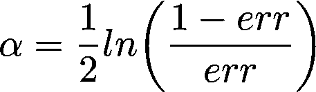*

*4.最后，当前回合的预测在与`α`相乘后被添加到先前的预测中。因为它最初被分类为+1 或-1，所以它将最后一轮后的预测符号作为最终预测:*

*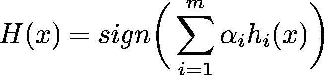*

*where `α_i is ith constant (prev. point)` and h_i is ith model predictions*

*(AdaBoost 不是基于梯度的)*

# *4) XGBoost*

*[^](#bd3e)*

**

*Photo by [Viktor Theo](https://unsplash.com/@viktortheo?utm_source=medium&utm_medium=referral) on [Unsplash](https://unsplash.com?utm_source=medium&utm_medium=referral)*

*XGBoost 试图改进以前的梯度增强算法，以提供更好、更快和更通用的结果。*

*它对梯度增强使用了一些不同的和一些新的附加物，例如:*

***a)规则化学习目标:***

*与许多其他目标函数的实现一样，这里它建议向损失函数添加一个额外的函数，以惩罚模型的复杂性(如 LASSO、Ridge 等)，称为*正则化项*。这有助于模型不过度拟合数据。*

*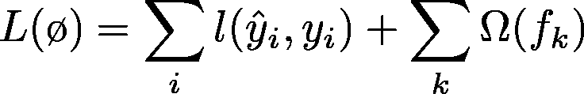*

*Some loss function + (Some regularization function to control complexity of model)*

*现在，对于本质上是附加的梯度增强，我们可以将我们的第‘t’个预测写为`F_t(x) = F_t-1(x) + y_hat_t(x)`，即，这舍入了预测加上所有先前预测的总和。损失函数:*

*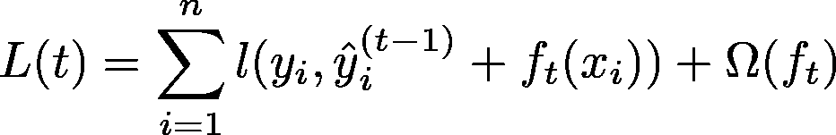*

*其中经过 [**泰勒级数近似后的**](https://en.wikipedia.org/wiki/Taylor_series) 可以写成:*

*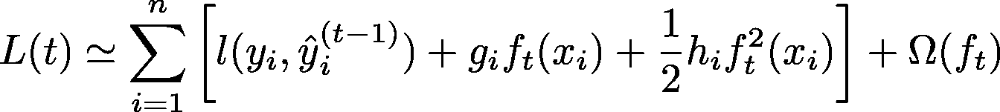*

*where g_i and h_i are gradient and hessian of loss function. i.e. 1st order and 2nd order differentiation of loss function*

*为什么要到二阶？*

*仅具有一阶梯度的梯度增强面临收敛问题(收敛仅在小步长下可能)。这是损失函数的很好的近似，加上我们不想增加计算量。*

*然后，通过使损失函数的梯度等于零来找到损失函数的最佳值*从而通过损失函数找到用于进行分裂的函数。(即分割后损失变化的函数)**

*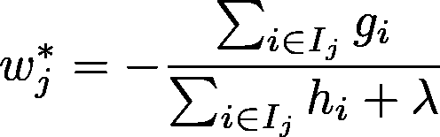*

*Found by putting above formla’s differentiation equal to zero. [Optimal Change value]*

***b)收缩和列子采样:***

*它还为每棵树增加了收缩，以减少特定树的影响，并对列进行子采样，以防止过度拟合并减少方差，如历史部分所述。*

***c)不同的分割查找算法:***

*梯度增强算法遍历所有可能的拆分，以找到该级别的最佳拆分。然而，如果我们的数据非常大，这可能是一个昂贵的瓶颈，因此许多算法使用某种近似或其他技巧来寻找，不是最好的，而是特别好的分割。因此，XGBoost 查看特定特性的分布，并选择一些百分点(或分位数)作为分割点。*

```
***Note:**
For approximate split finding these methods are also used, instead of percentile method:
1) By constructing approximate histogram of gradient statistics.2) By using other variants of binning strategies.*
```

*它建议选择一个值，姑且称之为`q`，现在从[0，100]的分位数范围中，几乎每第`q`个分位数值被选择作为用于分裂的候选分裂点。大致会有`100/q`个候选点。*

*它还增加了*稀疏感知*分裂发现，这在稀疏大数据数组中很有帮助。*

***d)为了提高速度和空间效率:***

*它建议将数据分成**块**，内存中的块。每个块中的数据以**压缩列(CSC)** 格式存储，其中每一列按照对应的特征值进行*存储*。因此，对块中的列进行线性搜索就足以获得该块的该列的所有拆分点。*

*块格式使得在线性时间中找到所有分裂变得容易，但是当轮到获得这些点的梯度统计时，它变成梯度统计的非连续获取(因为梯度仍然是先前的格式，其中块值具有指向它们的梯度的指针)，这可能导致高速缓存未命中。为了克服这个问题，他们为梯度累积设计了一个**缓存感知**算法。其中，每个线程都有一个内部缓冲区。这个缓冲区用于以小批量的方式获取渐变并累积它们，而不是从这里访问一些渐变，然后从那里按顺序访问一些渐变。*

*找到最佳的块大小也是一个问题，它可以帮助最好地使用并行性，并最大限度地减少缓存未命中。*

*它还提出了一种叫做**块分片的东西。**它在多个磁盘上交替写入数据(如果你有那些的话)。因此，当它想要读取一些数据时，这种设置可以帮助同时读取多个数据块。例如，如果您有 4 个磁盘，那么这 4 个磁盘可以在单位时间内读取 4 个数据块，从而提供 4 倍的加速。*

# *5)灯光 GBM*

*[^](#bd3e)*

**

*Photo by [Severin D.](https://unsplash.com/@sdmk?utm_source=medium&utm_medium=referral) on [Unsplash](https://unsplash.com?utm_source=medium&utm_medium=referral)*

*本文提出了两种技术来加速整个升压过程。*

*对于第一种，它提出了一种方法，在这种方法中，他们不必使用特定模型的所有数据点，而不会损失太多的信息增益。它被命名为**基于梯度的单侧采样(GOSS)。**在其中，他们计算损失函数的梯度，然后按绝对值排序。它还证明了具有较大梯度值的值对信息增益的贡献更大，因此它建议对于该特定模型忽略许多具有低梯度的数据点。*

*因此，对于特定模型，取顶部梯度的一些部分和剩余部分的不同部分(随机地来自剩余梯度)，将一些低权重应用于随机梯度组，因为它们具有较低的梯度值，并且不应该对我们的当前模型有太大贡献。*

*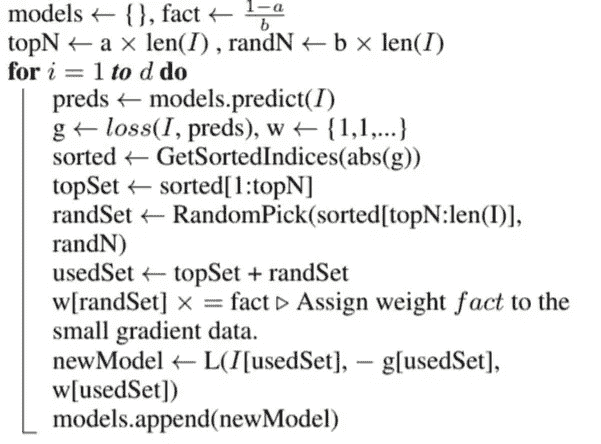*

*Get gradients of loss, sort them, take top gradient set and random from rest, reduce weight of random ones, and add this model to previous models’ set.*

*这里需要注意的一点是，LightGBM 使用基于直方图的算法，将连续的特征值存储到离散的容器中。这加快了训练速度，减少了内存使用。*

*此外，他们使用了一种不同的决策树，这种决策树优化叶子的方式，而不是普通决策树的深度方式。(即，它列举所有可能的叶子并选择具有最小误差的一个)*

**

*对于第二种方法，提出了一种将多个特征组合起来使*成为一个*新特征的方法，从而在不损失太多信息的情况下降低了数据的维数。这种方法被称为**独家功能捆绑(EFB)** 。它说，在高维数据的世界中，有许多列是互斥的。怎么会？因为高维数据具有许多高度稀疏的列，所以数据中可能存在许多同时不取任何值的列(即，大多数时间它们中只有一个取非零值，即互斥)。因此，他们建议将这些特征捆绑成一个，在一些预先指定的值以上没有冲突(即，对于许多点，它们在相同的数据点没有一些非零值。即它们不是完全互斥的，而是在某种程度上互斥的)。仍然为了区分来自不同特征的每个值，它提出给来自不同特征的值添加不同的常数，因此来自一个特征的值将在一个特定的范围内，而来自其他特征的值将不在该范围内。例如，假设我们有 3 个特征要组合，并且都在 0-100 之间。因此，我们将第二个特征加上 100，第三个特征加上 200，得到 3 个特征的三个范围，分别等于[0，100]、[100，200]和[200，300]。并且在基于树的模型中，这是可接受的，因为它不会通过分裂影响信息增益。*

*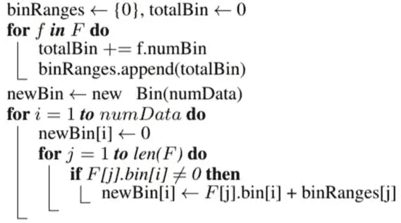*

*Find binRanges for all features to combine, make a new bin with values equal to bin_value + bin_range.*

*制作这些包实际上是 NP 难问题，类似于*图着色*问题，也是 NP 难问题。因此，在图着色问题中，它选择了一个好的近似算法，而不是最优解。*

*虽然这两种方法是本文的主要亮点，但它也提供了对梯度提升算法的改进，如子采样、最大深度、学习速率、叶子数等。，这是我们在上面讨论过的。*

*总的来说，这是一篇非常数学化的论文。如果你对样张感兴趣，你应该看看这篇[论文](https://papers.nips.cc/paper/6907-lightgbm-a-highly-efficient-gradient-boosting-decision-tree.pdf)。*

# *6)催化增强*

*[^](#bd3e)*

**

*Photo by [Alex Iby](https://unsplash.com/@alexiby?utm_source=medium&utm_medium=referral) on [Unsplash](https://unsplash.com?utm_source=medium&utm_medium=referral)*

*本文重点研究增压遭受的问题之一，即泄漏，*目标泄漏*。在 Boosting 中，许多模型对训练样本的拟合依赖于目标值(用于计算残差)。这导致测试集中目标值的移动，即**预测移动**。因此，它提出了一种绕过这个问题的方法。*

*另外，还提出了一种将**分类特征**转换为**目标统计量(TS)** 的方法(如果做错会导致目标泄漏*)。**

*它提出了一种叫做*有序推进*的算法，有助于防止目标泄露，以及一种处理分类特征的算法。虽然两者都使用了一种叫做**的排序原则**。*

*首先，用于将分类特征转换成**目标统计量(TS)** 。如果你知道分类特征的*均值编码*或*目标编码*，特别是 K 重均值编码，这将很容易理解，因为这只是一个小小的扭曲。他们所做的是避免目标泄漏，但仍然能够进行目标编码，对于第 I 个元素，他们在数据集中取其上的(i-1)个元素，以获得该元素的特征值(即，如果 7 个元素在第 I 个元素之上，与第 I 个元素属于同一类别，则他们取这些值的目标平均值，以获得第 I 个元素的特征值)。*

*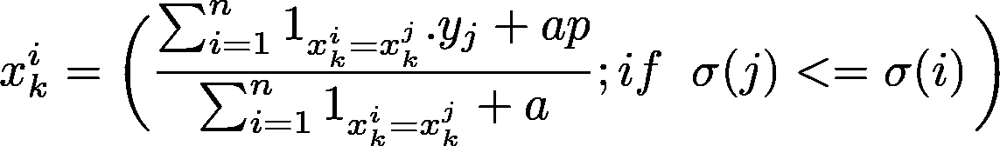*

*Average target values if i,j belong to same category, only if in this iteration’s random permutation that element is above ith element (if condition in statement). ‘a’ and ‘p’ are parameters to save eq from underflowing.*

*其次，为了证明算法*的预测偏移*，提出了一种算法，他们称之为**有序提升**。在每次迭代中，它独立地对新的数据集`D_t`进行采样，并通过将当前模型应用于该数据集并拟合新的模型来获得*未偏移残差*(因为这是足够/在某种程度上(依赖于)不同的数据集)。实际上，他们将新的数据点添加到先前的点上，因此，它至少为当前迭代中添加的新数据点提供了未偏移的残差。*

*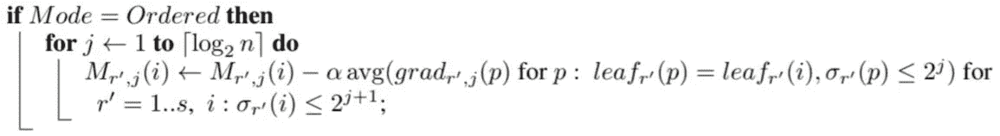*

*For i=1..n, from random permutation r`, compute avg(gradient if it belongs to same leaf) only if from permutation r` is that leaf point present above 2^(j+1) th point. [Update Model by adding new preds]*

*有了这个算法，如果有“n”个例子，我们可以制作“n”个模型。但我们只做`log_2(n)`型号，出于时间考虑。因此，这样一来，第一个模型适合 2 个示例，然后第二个模型适合 4 个示例，依此类推。*

*CatBoost 也使用了一种不同的决策树，叫做*遗忘树*。在这样的树中，在树的整个级别上使用相同的分裂标准。这样的树是平衡的，不容易过度适应。*

*在不经意树中，每个叶索引可以被编码为长度等于树深度的二进制向量。这一事实在 CatBoost 模型评估器中被广泛使用:它首先将所有浮点型特征和所有一位热编码特征二值化，然后使用这些二值特征来计算模型预测。这有助于快速预测。*

# *7)进一步阅读*

*[^](#bd3e)*

1.  *特雷弗·哈斯蒂；罗伯特·蒂布拉尼；杰罗姆·弗里德曼(2009 年)。 [*统计学习的要素:数据挖掘、推理和预测*](http://statweb.stanford.edu/~tibs/ElemStatLearn/download.html) (第二版。).纽约:斯普林格。(国际标准书号 978–0–387–84858–7)*
2.  *所有引用*

# *8)参考文献*

*[^](#bd3e)*

1.  *[维基百科——助推](https://en.wikipedia.org/wiki/Boosting_(machine_learning))*
2.  *特雷弗·哈斯蒂；罗伯特·蒂布拉尼；杰罗姆·弗里德曼(2009 年)。 [*统计学习的要素:数据挖掘、推断和预测*](http://statweb.stanford.edu/~tibs/ElemStatLearn/download.html) (第二版。).纽约:斯普林格。(国际标准书号 978–0–387–84858–7)*
3.  *论文— [助推法简介—约夫·弗罗因德、罗伯特·e·沙皮雷](http://www.site.uottawa.ca/~stan/csi5387/boost-tut-ppr.pdf) (1999) —阿达助推法*
4.  *论文— [XGBoost:一个可扩展的树增强系统—陈天琦，Carlos Guestrin (2016)](https://arxiv.org/pdf/1603.02754.pdf)*
5.  *[堆栈交换—需要帮助理解 XGBoost 的适当拆分点建议](https://datascience.stackexchange.com/questions/10997/need-help-understanding-xgboosts-approximate-split-points-proposal)*
6.  *论文— [LightGBM:一种高效的梯度推进决策树—柯，孟等](https://papers.nips.cc/paper/6907-lightgbm-a-highly-efficient-gradient-boosting-decision-tree.pdf)*
7.  *论文— [CatBoost:具有分类特征的无偏增强—普罗霍伦科娃、古塞夫等人](https://arxiv.org/pdf/1706.09516.pdf) — v5 (2019)*
8.  *论文— [CatBoost:支持分类特征的梯度增强—谷林埃尔绍夫多罗古什](http://learningsys.org/nips17/assets/papers/paper_11.pdf)*
9.  *论文— [使用不经意树增强 LambdaMART—Modr y，Ferov (2016)](https://arxiv.org/pdf/1609.05610.pdf)*
10.  *YouTube — [CatBoost —新一代梯度增强—安娜·维罗妮卡·多罗古什](https://www.youtube.com/watch?v=8o0e-r0B5xQ)*
11.  *[渐变增强算法简介](https://machinelearningmastery.com/gentle-introduction-gradient-boosting-algorithm-machine-learning/) —机器学习掌握*

```
*Suggestions and reviews are welcome.
Thank you for reading!*
```

**签名:**

**