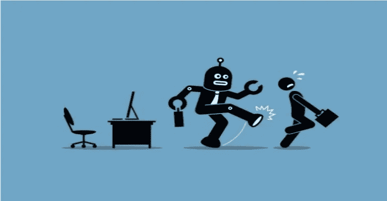
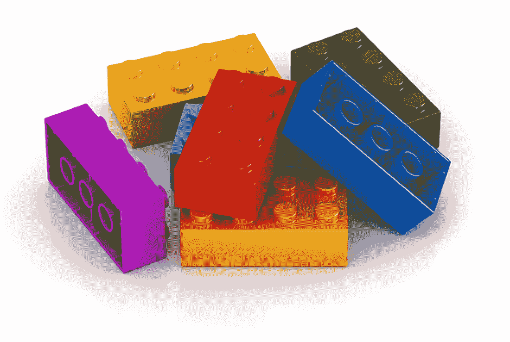
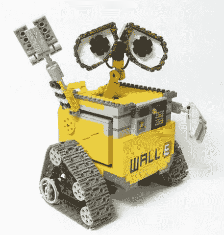

# 清理人工智能周围的水。

> 原文：<https://towardsdatascience.com/clearing-the-water-around-a-i-5ca596dad1b9?source=collection_archive---------20----------------------->

## 大数据还是大炒作？

今天几乎每个人都经历过一些关于人工智能的影响和新想法。大多数公司、银行、零售店等都在关注人工智能将如何扩大他们的市场，并引领他们走向更成功的冒险。我敢肯定，你们都曾经与没有人工智能技术知识的人进行过或听过一次对话，担心地谈论他们的生活将如何被它改变。我现在正坐在华尔街旁的早餐店里，写下这篇文章并体验着它。想象一下，几个经典的纽约高管在谈论他们已经开始在公司实施的人工智能战略；“这比我们想象的要好得多，我不知道发生了什么，我只是希望我们能够尽快开始裁员”。

如今，许多初创公司都在试图给人工智能一记耳光，旨在获得大量资金，而且通常都能成功。这个领域被人们视为今天的“淘金热”，但公众对其运作方式的理解模糊不清(双关语)。

# 算法是乐高积木

“算法是一组逐步执行的指令，非常明确，即使像计算机这样头脑简单的东西也能遵循它们。”

就其本身而言，除了仅仅从声音上打动或恐吓人们之外，算法本身并不比电锯聪明。(人工智能用 [Destin](https://www.youtube.com/watch?time_continue=2&v=OdW7vhYYSdM) 、SmarterEveryDay 解决电锯回扣问题)

试着一遍又一遍地想一件事做得非常好的事情。这对于排序数字列表或在互联网上搜索龙之母的图片非常有用。

但是一旦我们开始以聪明的方式将许多算法链接在一起，我们就可以开始玩人工智能了:人工智能只是特定领域智能行为的幻觉。想想人类的进化，一旦我们的原始祖先开始集体工作来完成他们的目标，我们是如何真正开始进化的。几乎就像大自然可能是我们的参数，生存是我们的主要目标。

**屏幕后面发生了什么**

让我们用一个人工智能的例子，这个例子目前每天被使用数百万次，让人们可以访问他们正在寻找的任何信息。

“好的谷歌，附近哪里有最好的泰国菜？”

1.  一种特定的算法会将我记录的原始声波转换成数字信号。
2.  另一种算法将试图把我问题的数字信号翻译成一串英语音素:感知上不同的声音(besté-[taį]-·福伊德)。串音位的过程对单个单词来说是合理的，但对句子来说是极其困难的。这种算法使用语言学方法来寻找“独特的单位声音”，利用一些有趣的语言学理论。
3.  下一个算法将把这些音素“besté-[taį]-·福伊德”分割成它认为我说的单词。它很可能只是我的句子的一部分，它可以最好地解释，就像“最好的泰国菜”。结果将被发送到搜索引擎。
4.  搜索引擎是对解释的字符串进行研究的关键部分。SE 本身只是一个巨大的管道，由一系列其他算法组成，处理查询并返回答案。
5.  你猜对了，我的问题的这个答案将会进入另一个算法，将我的回答格式化成一个连贯的英语句子。
6.  最后，最后一个算法将以非机器人、类似人类的方式用言语表达那句话；"我在你附近找到了几个亚洲地方."

这几乎是每个人工智能系统如何工作的概念:在街道上导航的自动驾驶汽车，扫描你客厅的 Roombas，社交媒体反馈和建议，在线广告网络等等。

**总结**

对人工智能所做的事情和我所解释的内容的简单理解，遵循上面相同的“算法流水线”。

A.接受来自特定域的数据。

B.执行一系列计算。

C.给出我们的预测或决定。

**人工智能算法的两个区别**

1.  这些算法通常处理概率，而不是处理确定性，就像说“我 91%确定 x 发生了”而不是“x 发生了”。
2.  不同于传统算法(程序员提前修复那些指令，以便它运行并知道它在做什么)，**人工智能算法指令是由算法本身学习的。它直接从“训练数据”(这使它能够看到每一个类别的数千到数百万个例子)中做到这一点，并学会区分输入和输出。**

**结论**

人工智能正在迅速发展，它在未来的应用几乎是不可避免的。随着越来越多的数据变得可用，硬件技术不断进步，以及我们是否有有道德意识的人帮助设计它，我们可能会也可能不会打开潘多拉的盒子。对于人工智能来说，程序员的角色不是“告诉”算法做什么，而是找到方法告诉它“如何”训练自己做什么:通过数据和概率规则。

**作品引用**

波尔森，尼古拉斯 g 和詹姆斯·斯科特。“介绍。”AIQ:人和机器如何一起变得更聪明。纽约:圣马丁出版社，2018 年。