# 发展中地区的气候变化和粮食短缺:Python 中的分析

> 原文：<https://towardsdatascience.com/climate-change-and-food-scarcity-in-developing-regions-an-analysis-in-python-d8ca5ec5f496?source=collection_archive---------22----------------------->


Photo by [Pixabay](https://www.pexels.com/@pixabay) on [Pexels](https://www.pexels.com/photo/earth-desert-dry-hot-60013/)

今天讨论的最重要的环境问题之一是全球变暖。这是由于气候变暖对农作物产量、天气模式、海平面、野火事件和生态系统的影响。自 19 世纪 50 年代有记录以来，全球气温上升的速度比任何时候都快，预计到本世纪末气温将再上升 1.8 至 5.8 摄氏度。全球变暖是由二氧化碳、甲烷、水蒸气、含氯氟烃和一氧化二氮等温室气体的排放造成的。


[Source](https://climate.nasa.gov/causes/)

这些气体对气候有隔离作用，导致大气吸收热量，使地球变暖。这些气体中有许多是从工厂化农业、汽车尾气、飞机尾气和化石燃料开采中释放出来的。

如果我们不尽快解决气候变化问题，[生态系统将继续被破坏](https://www.pnas.org/content/pnas/103/35/13116.full.pdf)，海平面将继续上升，农作物产量(粮食产量)将减少。[关于粮食生产，由于气候变暖，作物杂草、昆虫和虫害预计将会增加。](https://digitalcommons.unl.edu/cgi/viewcontent.cgi?article=1023&context=nasapub)

> 气候变化可能会对发展中国家产生不利影响，那里的粮食产量下降可能会导致营养不良、人口流离失所以及因过度拥挤导致的疾病传播。


[Source](https://www.who.int/publications/10-year-review/health-guardian/en/)

此外，世界卫生组织(世卫组织)[声称](https://www.who.int/publications/10-year-review/health-guardian/en/)对于传染病来说，气候变化是一个威胁倍增器:

> 它应对现有的威胁——无论是霍乱爆发、寨卡病毒向新地理区域的传播，还是干旱带来的严重营养不良——并增强这些威胁。风险是熟悉的，但它们的影响在频率和严重性上被放大了。气候变化会扩大传染病的分布，特别是由蚊子和其他媒介传播的疾病，并引发其他疾病的出现。尼帕病毒和汉坦病毒作为人类病原体的出现被追溯到极端天气事件，这些事件迫使动物宿主离开它们的生态位并入侵人类住区。

[耶鲁气候连线](https://www.yaleclimateconnections.org/2019/09/a-brief-guide-to-the-impacts-of-climate-change-on-food-production/)还指出:

> 此外，气温上升会改变对一些病原体和毒素的暴露。考虑一下:生蚝中的*沙门氏菌、弯曲杆菌、副溶血弧菌*，以及真菌毒素真菌，它们都有可能在更温暖的环境中茁壮成长。大气中更多的二氧化碳也会减少某些作物中的膳食铁、锌、蛋白质和其他常量和微量营养素。

鉴于气候变化对粮食生产和疾病传播的未来影响，关于气候变化影响的公众教育至关重要。在本帖中，我们将对 ourworldindata.org[提供的](https://ourworldindata.org/crop-yields)[数据中心](https://datahub.io/collections/climate-change)提供的公共气候变化数据和全球农作物产量数据进行简单的探索性分析。在另一篇文章中，我们将仔细研究一些传染病数据。

我们从导入 python 库 Pandas 开始:

```
import pandas as pd
```

我们要看的第一个数据集是每年的全球气温数据。我们可以将数据读入 dataframe 并打印前五行:

```
df_global_temp = pd.read_csv("annual_temp.csv")
print(df_global_temp.head())
```

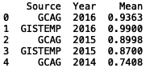

接下来，我们可以过滤我们的数据，以便我们只获得与 NASA GISTEMP 源相对应的记录:

```
df_global_temp = df_global_temp[df_global_temp['Source'] == 'GISTEMP'].reset_index()[["Source", "Year", "Mean"]]
print(df_global_temp.head())
```

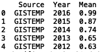

接下来，我们可以绘制年平均温度与时间的关系图。接下来，我们导入 python 可视化软件包“seaborn ”,并绘制时间序列的线图:

```
import seaborn as sns
sns.set()
sns.lineplot(df_global_temp['Year'], df_global_temp['Mean'])
plt.ylabel("Mean")
plt.title("Average Global Mean Temperature")
```

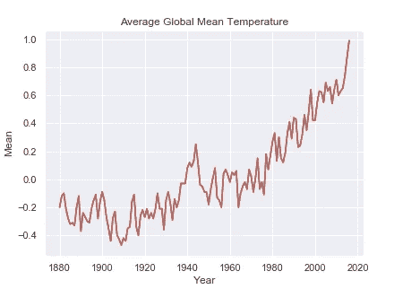

接下来我们可以看看 ourworldindata.org 提供的全球大米和小麦年产量。让我们将“rice-yield.csv”数据读入数据帧，并查看前五行:

```
df_rice = pd.read_csv("rice-yields.csv")
df_rice.head()
```

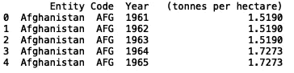

我们还可以观察一组独特的区域:

```
from collections import Counter
print(set(df_rice['Entity'].values))
print("NUMBER OF REGIONS: ", len(set(df_rice['Entity'].values)))
```

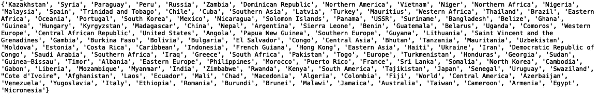

Countries in the Rice Yield Data set

总共有 148 个地区。知道发展中地区更容易遭受气候变化带来的风险，缩小我们的范围将是有益的。《时代》杂志称，尼日利亚、海地、也门、菲律宾和斐济将面临气候变化带来的最严重后果。

考虑到这一点，我们可以从尼日利亚的水稻生产开始:

```
df_rice = pd.read_csv("rice-yields.csv")
df_rice = df_rice[df_rice['Entity']=='Nigeria'].reset_index()[["Entity", "Code", "Year", ' (tonnes per hectare)']]
print(df_rice.head())
```

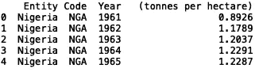

接下来，我们可以绘制 1960 年至 2014 年尼日利亚的水稻产量:

```
sns.lineplot(df_rice['Year'], df_rice[' (tonnes per hectare)'])
plt.ylabel("Rice Production in Nigeria (tonnes per hectare)")
plt.title("Annual Rice production in Nigeria")
```

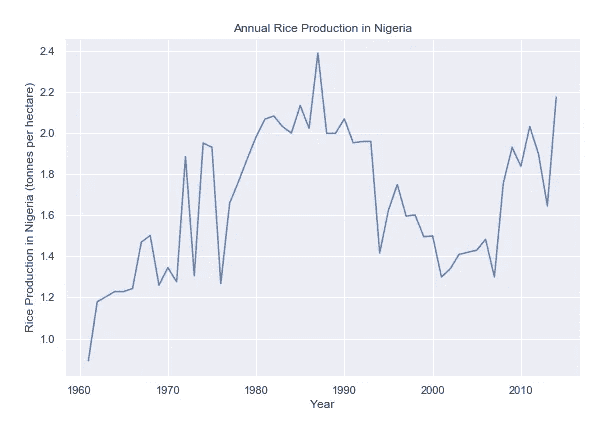

接下来，我们可以叠加全球年平均温度和尼日利亚的水稻产量:

```
sns.set()
sns.lineplot(df_global_temp['Year'], df_global_temp['Mean'])
plt.ylabel("Mean")
plt.title("Average Global Mean Temperature and rice production in Nigeria")

sns.lineplot(df_rice['Year'], df_rice[' (tonnes per hectare)'])
plt.ylabel("Mean temperature/tonnes per hectare rice in Nigeria ")
```

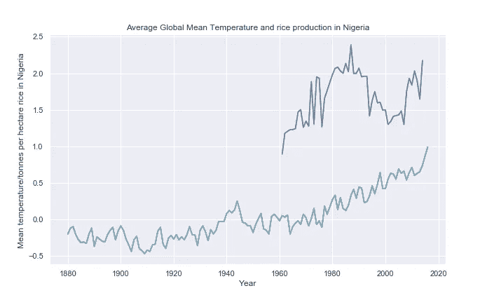

有趣的是，1987 年至 2006 年间，尼日利亚的水稻产量似乎大幅下降。

我们也可以看看海地的水稻产量:

```
df_rice = pd.read_csv("rice-yields.csv")
df_rice = df_rice[df_rice['Entity']=='Haiti'].reset_index()[["Entity", "Code", "Year", ' (tonnes per hectare)']]
print(df_rice.head())
```

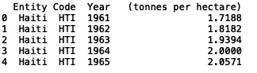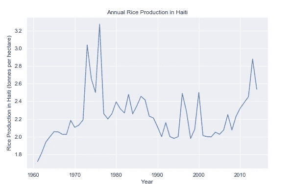

我们可以看它上面覆盖的气候数据:

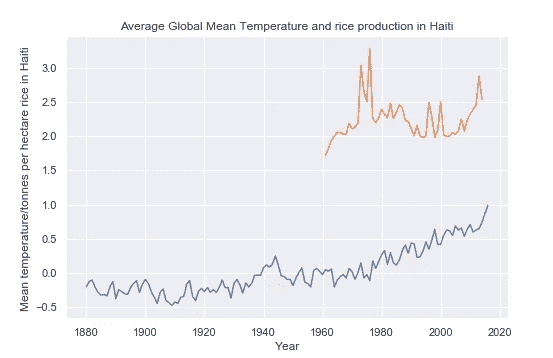

海地的水稻产量似乎也略有下降。

我们也可以看看尼日利亚同样的小麦生产地块:

```
df_wheat = pd.read_csv("wheat-yields.csv")
df_wheat = df_wheat[df_wheat['Entity']=='Nigeria'].reset_index()[["Entity", "Code", "Year", ' (tonnes per hectare)']]
print(df_rice.head())
sns.set()
sns.lineplot(df_global_temp['Year'], df_global_temp['Mean'])
plt.ylabel("Mean")
plt.title("Average Global Mean Temperature and wheat production in Nigeria")sns.lineplot(df_wheat['Year'], df_wheat[' (tonnes per hectare)'])
plt.ylabel("Mean temperature/tonnes per hectare wheat in Nigeria ")
```

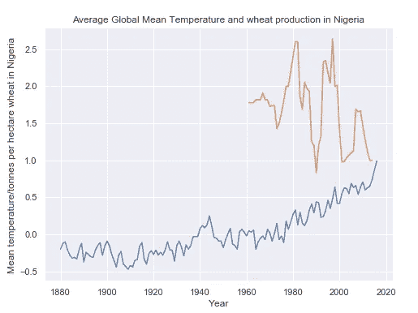

同样，随着全球年气温的上升，尼日利亚的小麦产量似乎有下降趋势。

在这一点上，从数据中得出任何结论都需要更详尽的分析，但到目前为止，我们的分析似乎与文献中报道的一致。我们将在这里结束我们的分析，但请随意查看其他地区的作物产量以及 datahub 上提供的一些其他气候变化数据。

如前所述，除了影响农作物产量，科学家认为气候变化对传染病的传播也有影响。在下一篇文章中，我们将分析公开发布的传染病数据和气候变化数据，看看我们是否发现了任何趋势。这篇文章中的数据集和代码可以在 [GitHub](https://github.com/spierre91/medium_code) 上找到。感谢您的阅读！