# 气候变化怀疑论——及其与英国退出欧盟的怪异联系

> 原文：<https://towardsdatascience.com/climate-change-and-its-weird-connection-to-brexit-8247a243d815?source=collection_archive---------13----------------------->

有一个相当可靠的共识(62/38 ),即气候变化正在发生，这是由于人类活动。

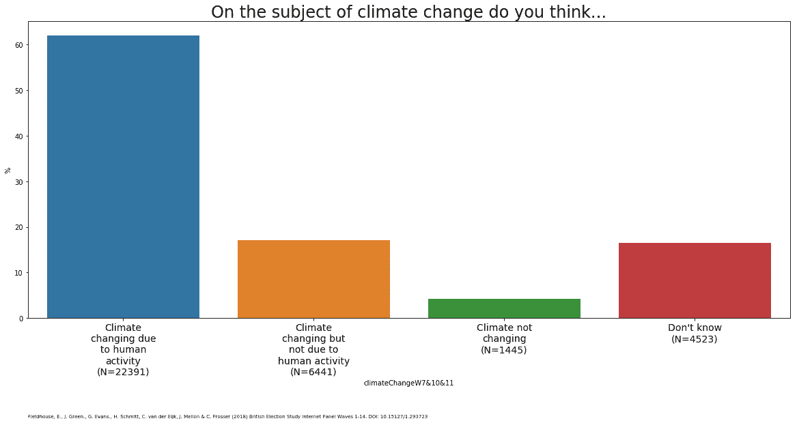

如果你把范畴扩大到“环境”，关注做得是否足够，或者暗示有一个权衡，那么结果会逐渐变得更加平衡。

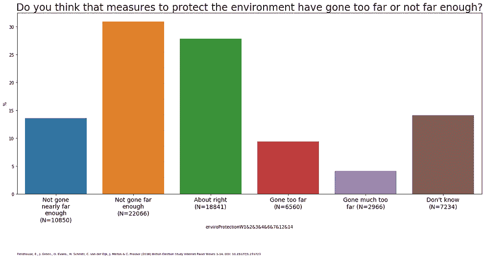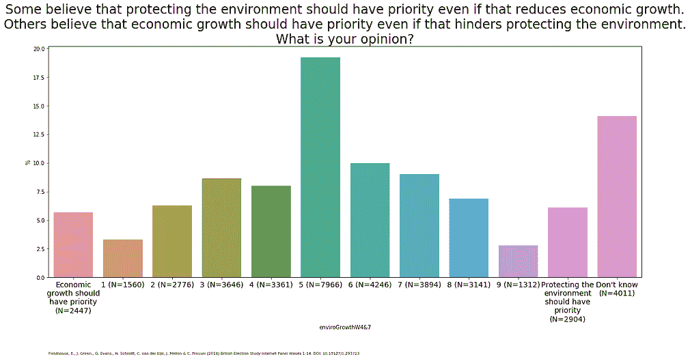

可能有些人已经在看这些图表了，他们想知道假设他们抓住了与气候变化怀疑论相同的东西是否合理——它们确实是不同的问题，涉及完全不同的辩论。所以，让我们看看气候变化问题的答案与[英国选举研究数据集](https://www.britishelectionstudy.com/data-object/wave-14-of-the-2014-2018-british-election-study-internet-panel/)有什么关联/反关联(你不需要阅读/理解下面图表中的每个变量——但如果你**想要**一个部分解释者，[在我之前的博客文章](/whats-up-with-the-uk-broadsheet-tabloid-split-80c9426c19fa?source=friends_link&sk=3328cdcdffae0cc7bf798451e4a12a8e)中有所涉及):

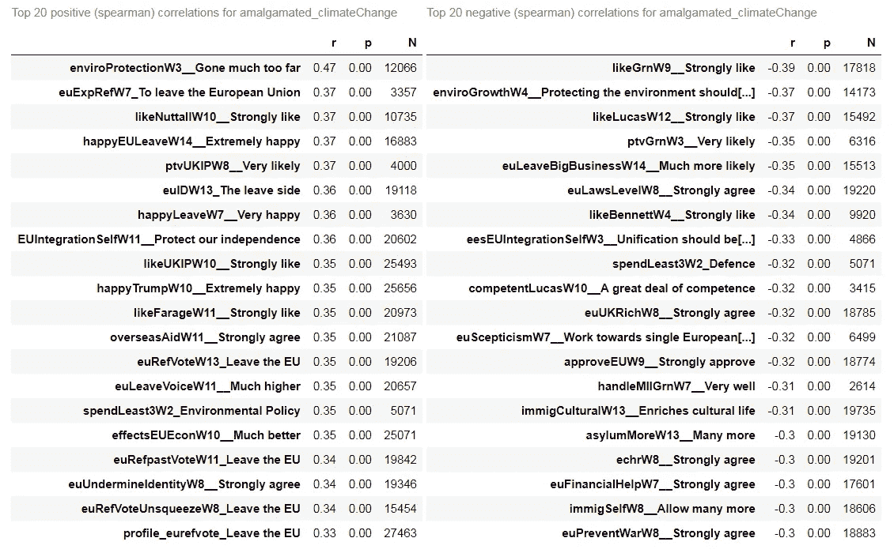

*   这两个问题——环境保护和环境增长——确实与气候变化怀疑论有很强的关联
*   毫不奇怪，气候变化怀疑论与喜欢(认为他们有能力/擅长处理‘最重要的问题’)绿党/他们的领导人是不相关的
*   令人惊讶的是**每一个其他高正/负相关变量都与**直接相关(“你在欧元中投了哪一票？”)**或间接向英国退出欧盟**(“你对川普/海外援助/移民有什么感觉？”这三者都与 euref 投票密切相关)
*   如果你想知道这有多不可能，我对英国选举研究数据集的处理创建了约 6800 个变量，其中约 5%直接/间接与英国退出欧盟有关。所以，不太可能。

那么，气候变化怀疑论对 euRef 投票的瓦解是什么样的呢？

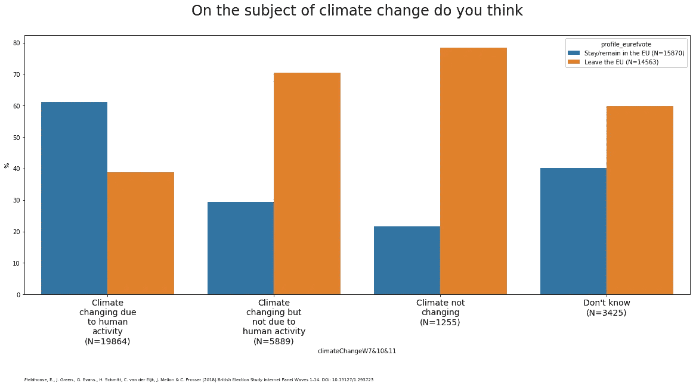

如果你看看每个离开和留下的分布，而不是每个气候变化类别中的差异，这就不那么明显了(几乎大多数离开者认为气候变化正在发生，并且是由人类造成的)。

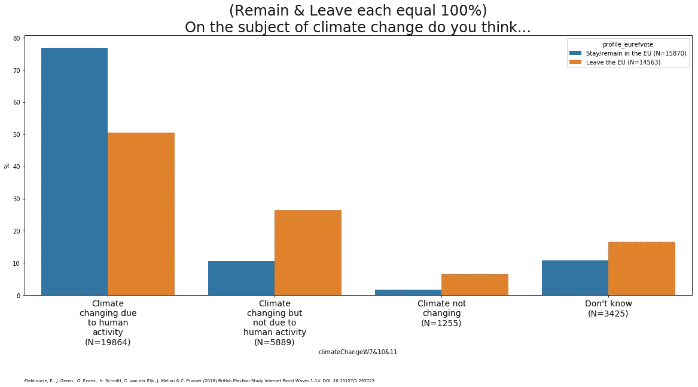

但也许这是某种侥幸的模式，只适用于这一个问题？号码

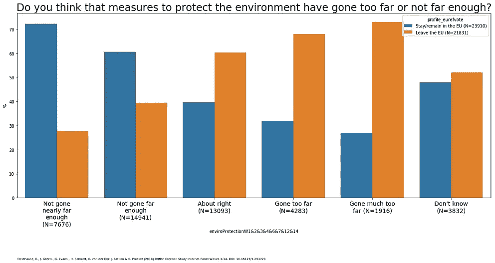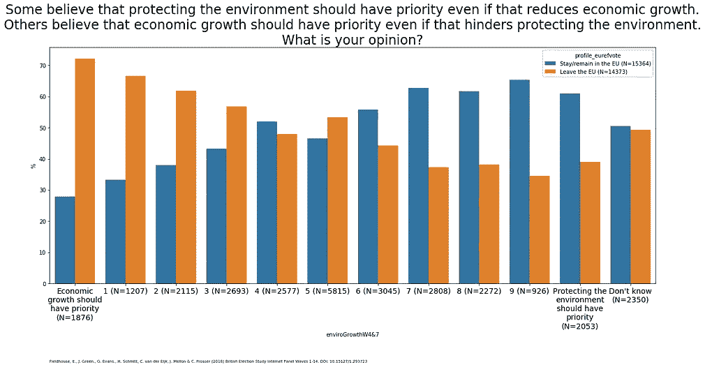

好吧，这有点奇怪——但也许这只是与绿色政治的混淆——例如，绿党反对英国退出欧盟，支持移民，可能不喜欢川普。也许如果我们控制人们对绿党的看法，这种模式就会消失？

下面是针对气候变化怀疑论(相信人类创造的气候变化← →不相信气候变化)回归英国选举研究数据集中所有变量(除了上面提到的另外两个变量)的结果。

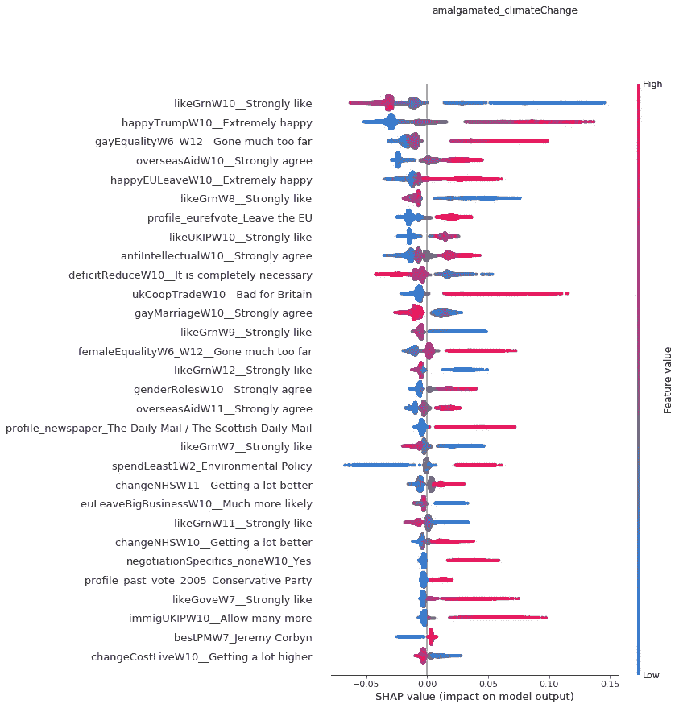

这是一种非常非常懒惰的方法(如上所述，如果你**想要**更多关于图表如何制作/如何阅读的细节，[部分解释者在此](/whats-up-with-the-uk-broadsheet-tabloid-split-80c9426c19fa?source=friends_link&sk=3328cdcdffae0cc7bf798451e4a12a8e) )—我没有将它缩小到一个单独的波，所以你可以看到在不同的波中问的同一个问题——但是你可以看到那些*明显*相互混淆的变量(无论你是否喜欢 2017 年以及 2016 年的绿色)如何抑制彼此的影响。

值得注意的是，这看起来多么像一份懒惰的刻板印象清单(我再次强调，这是一个基于 6800 个变量的完全自动化的过程)——特朗普支持、同性恋恐惧症、拒绝外国援助、拒绝专家、支持紧缩、支持传统性别角色、相信英国无需做出任何让步就能获得完全的“单一市场”准入。当然，还有《每日邮报》的读者！

显然，文化战争的东西(值得注意的是，有政党标记在那里，但没有左右经济分裂)。英国不是美国——你可以看到核心保守党投票偏向气候变化怀疑论——以及一些保守派精英(马特·雷德利/尼格尔·劳森)的反映……但我不认为你可以认为这是政党层面创造的东西，并通过党派之争传播给选民。

除了注意到这可能与心理倾向有关——就像对紧缩、移民、特朗普、性别角色、同性恋的态度一样——至少与明确的意识形态一样，很难知道如何处理这一点。

对于这些情绪，我们只知道两件事是肯定的:

*   他们可以很快改变
*   **没有人确切知道是什么改变了他们**

**对这篇文章的早期评论(嗯，评论)提出了这样一个问题:所有这些事情是否仅仅是“正确”的问题。根据之前的文章，人们对“正确”的理解总是含糊不清——这是政治指南针上的细分(警告这张图表是一种实验性的——就像“还不是很好”——通过只显示上部轮廓(峰值)，x 标记每个类别的平均值，在一个图表上获得几个重叠分布的方法):**

**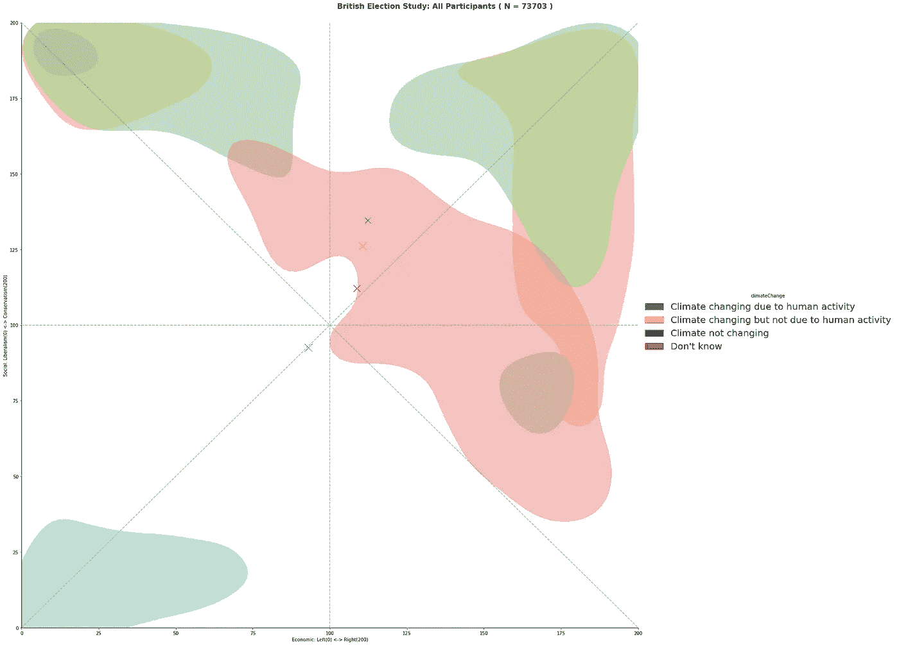**

**附录——应 Leo Barasi 的要求，我添加了环境增长和环境保护的回归分析(但我删除了与绿党相关的变量):**

*   **值得强调的是，这些都是快速运行(将安排更深入的版本在夜间运行),由于我已经排除了许多最佳预测因素，这些模型只能解释一小部分差异……但是天啊，这真的很明显**
*   **更新:跑步现在是慢版本(R /variance 解释约 25–30%—考虑到我们已经剔除了所有绿党变量，这还不错)**
*   **要明确的是——并在某种程度上先发制人统计学家的蔑视——这些回归模型的目的是探索性分析。统计学家中有一种并非完全不公平的趋势，认为机器学习是不专业的统计——这是真的，因为机器学习模型让人们想象他们可以跳过模型生成/分析步骤。但是，只要你认为这是对“相关变量”的详尽分解，你就没问题。**

**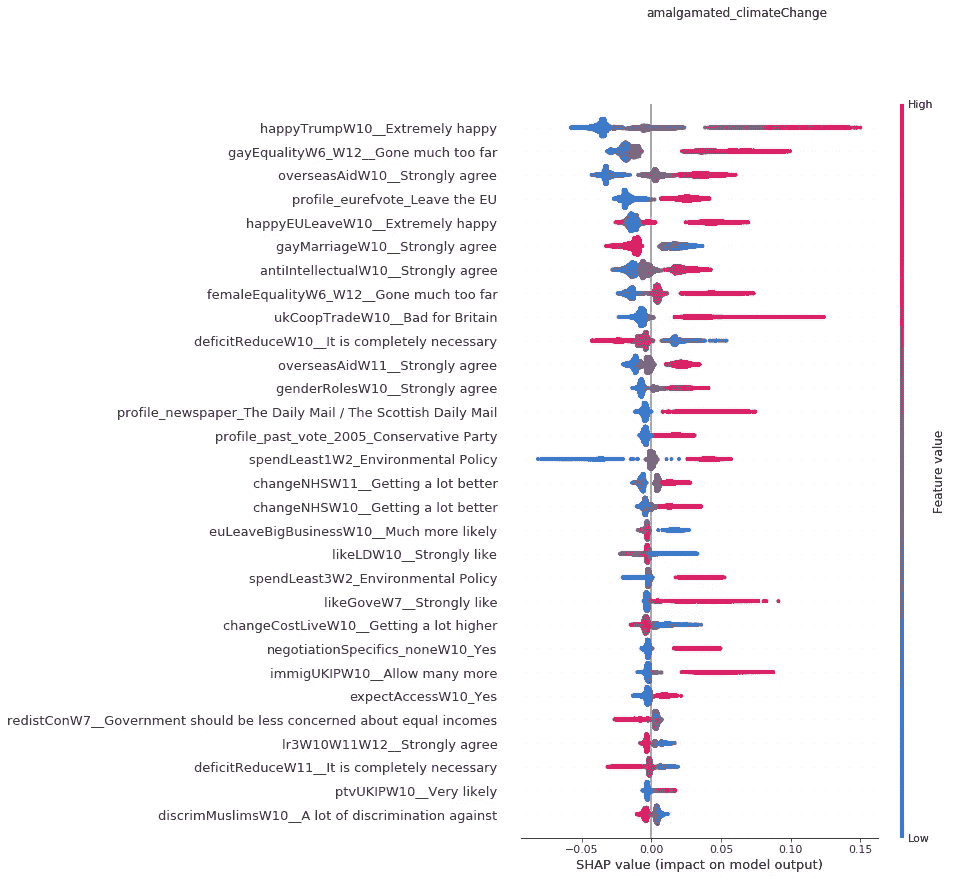**

**Believes Climate Change Happening and Caused By Humans ← → Believes Climate Change Not Happening**

*   **expect access/negotiationSpecifics _ None =英国将在英国退出欧盟之后获得完全的单一市场准入(/不做任何让步)**
*   **redistCon =受访者认为保守党倾向于再分配的地方**
*   **普通劳动人民没有得到他们应得的国家财富**

**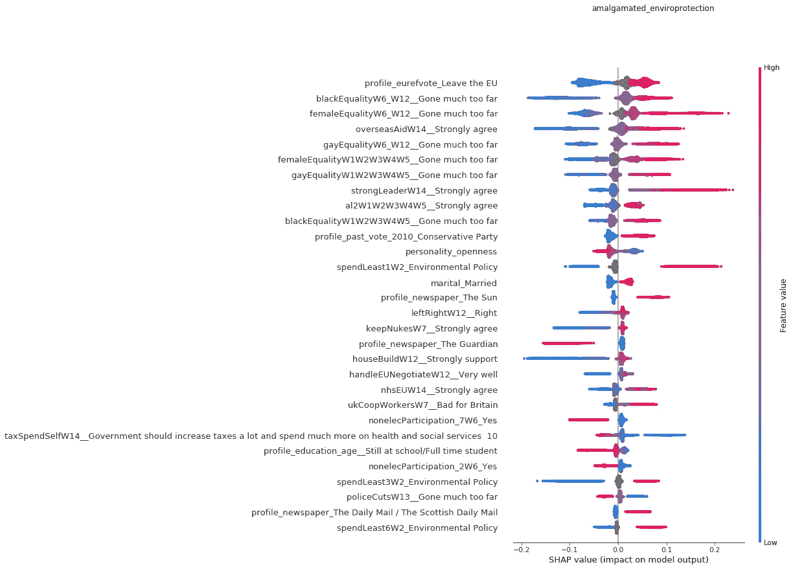**

**Measures to protect environment: Not gone nearly far enough ← → Gone much too far**

*   **无电子参与:2 =签署请愿书，7 =出于道德原因购买/拒绝购买产品**
*   **house build……在英国选举研究问卷 pdf 中缺失——与 councilHouse 密切相关……也不在 pdf 中！不得不礼貌地问 BES 团队。**

**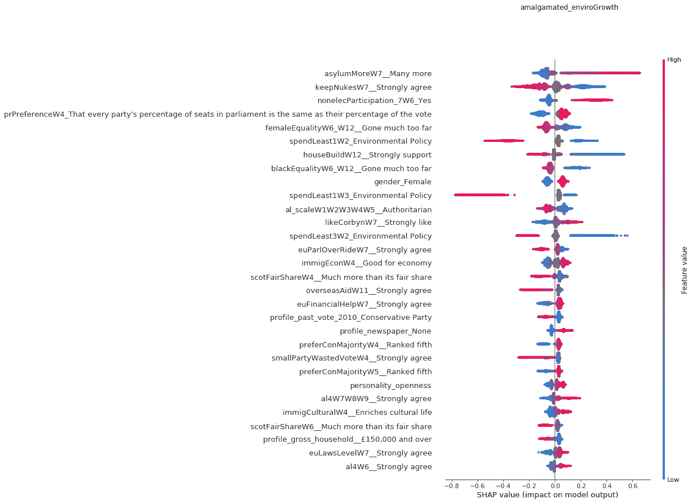**

**Economic Growth vs Environmental Protection: Economic growth should have priority ← → Protecting the environment change should have priority**

*   **性别差异很有意思——这也解释了威权主义等级预测优先考虑经济增长的模式，但有一个元素(al4 =审查)预测优先考虑环境，因为在 al4 上有很强的性别差异(有理由将其从 al_scale 中删除)**
*   **优先考虑经济增长会产生收入效应(尽管很小)**
*   **报纸读者群“无”效应很难解读——大多数报纸给你一个优先考虑经济增长的理由了吗，还是说它与不读报纸有关？(注意[之前的博客显示，不看报纸的读者在价值观上不会偏离大众](/what-is-the-right-wing-press-c3e7d21789ab?source=friends_link&sk=a8b953749f7b06f9ecb040e0bd82185f)**

**[Python 笔记本](https://github.com/MariosRichards/BES_analysis_code/blob/master/Climate%20Change.ipynb)(相当清晰)**