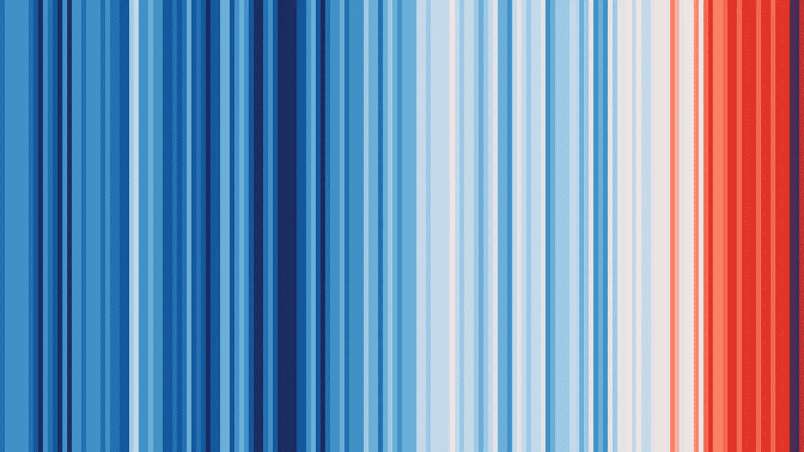
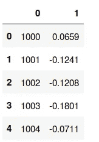
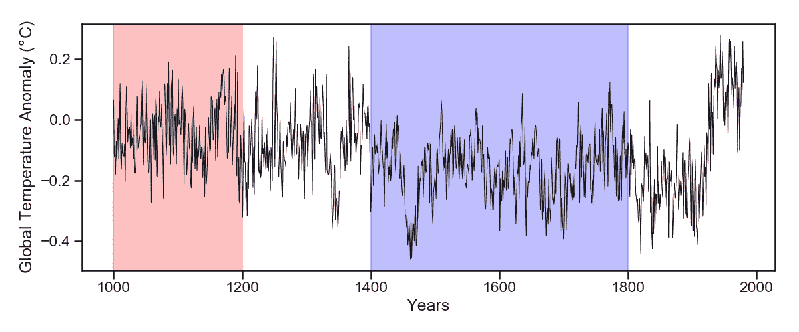
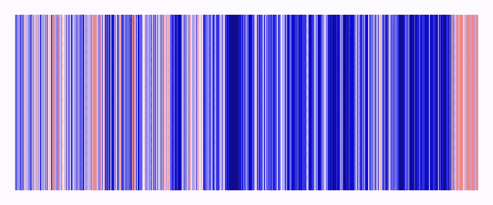

# 气候热图变得简单

> 原文：<https://towardsdatascience.com/climate-heatmaps-made-easy-6ec5be0be6ff?source=collection_archive---------19----------------------->

## 用熊猫和海牛调查古气候数据

不久前**艾德·霍金斯**博士，恰好是[气候螺旋](https://www.climate-lab-book.ac.uk/spirals/)的创造者，向世界发布了从 1850 年到 2017 年全球年气温的[变暖条纹](https://www.climate-lab-book.ac.uk/2018/warming-stripes/)图。这个概念很简单，但也非常丰富:每个条纹代表一年的温度，随着时间序列的推移，任何人都可以非常明显地看到变化。

从本质上讲，这些条纹一起构成了一个热图，而热图很容易通过`Seaborn`的一点帮助来制作。这里的目的是扩展几个世纪的变暖条纹，从稍微不同的角度来看温度变化，但为此你需要数据。

The original Warming Stripes made by Dr. Ed Hawkins

# 穴居人的气候

顾名思义，古气候学是一种专注于遥远时代气候条件的研究——从几个世纪前到我们星球出现后的第一个千年。

你可能会疑惑:*我们*怎么才能*知道*？这有点复杂，但古气候学通过使用被称为**代理**的数据，树木年轮、冰芯、珊瑚和其他自然资源中包含的**温度**和**降雨量**的间接测量数据而繁荣发展，这些数据被仔细分析以提供良好的气候信息重建。

你可以去很多地方下载古气候时间序列，但是你的第一站应该是 NOAA 的国家环境信息中心(NCEI)数据库。对于喜欢气候的科学家和*数据*来说，这是一座金矿(但不是唯一的一座)。

# 把所有的放在一起

您将使用的数据代表了从 1000 年到 1998 年北半球温度的时间序列重建，这在 [Mann、Bradley 和 Hughes (1999)](https://agupubs.onlinelibrary.wiley.com/doi/abs/10.1029/1999GL900070%4010.1002/%28ISSN%291944-8007.GRL40) 的开创性工作中有所展示。你可能从**曲棍球棒**图中知道这一点，但是现在你将有机会在这里制作**你自己的**版本的图。

首先，导入常见的疑点:

# 读取文件

使用`Pandas`可以通过`read_csv()`读取包含时间序列的文本文件:

`delim_whitespace=True`参数识别由空格分隔的数据列，使用`header=None`您对`Pandas`说您的数据没有标题，也没有特定的列名，因此数据文件中的时间序列如下所示:

Two simple columns

这些列由索引号识别，第一列为“0”(年份列)，第二列为“1”(温度数据)。好消息是`Pandas`允许您用任何您喜欢的`str`名称来重命名列，例如:

# 你自己的曲棍球棒

一个令人惊叹的`Seaborn`功能是可以根据不同的喜好为您的图形设置`style`和`context`，例如:

虽然有许多选项，但所选的`style`是`ticks`和上下文`talk`，也从`Matplotlib`参数中定义了`lines.linewidth`。查看`[Seaborn](https://seaborn.pydata.org/tutorial/aesthetics.html)` [文档](https://seaborn.pydata.org/tutorial/aesthetics.html)了解更多信息。

样式准备好了，是时候用`Seaborn`和`Matplotlib`的组合来绘制你的**曲棍球棒**图了:

The Hockey Stick, right at the end (where we are now)

上面发生了什么事？你用`sns.lineplot()`绘制温度数据就像你用`Matplotlib`中的标准`plt.plot()`一样，而红色和蓝色阴影区域在`axvspan()`的帮助下(带着诗意的许可)代表了[中世纪温暖期](https://en.wikipedia.org/wiki/Medieval_Warm_Period)和[小冰期](https://en.wikipedia.org/wiki/Little_Ice_Age)。任何接触过`Matplotlib`的人都熟悉`set_xlabel()`和`set_ylabel()`函数，但是在这里你可以看到它们也可以很好地处理`$\degree$`符号的 LaTeX。

别再打曲棍球了，条纹在哪里？

# 古气候条纹

将原始变暖条纹作为热图来看，图表没有显示任何颜色条，也没有轴标签和刻度，因此抑制这些以保持您自己的条纹的保真度是很重要的。为此，`Seaborn`提供了[足够多的选项](https://seaborn.pydata.org/generated/seaborn.heatmap.html)来做一个好的近似。

需要注意的一点是，`Seaborn`需要一个 2D 数组作为输入数据，而您的时间序列是一个简单的 1D 数组:

解决这个问题的一个方法是使用`NumPy`并用`[np.newaxis](https://docs.scipy.org/doc/numpy-1.13.0/reference/arrays.indexing.html#numpy.newaxis)`创建一个新的维度。解决了这个问题，制作自己的条纹就很容易了:

How comparable is the Hockey Stick era to the last 1000 years?

使用`sns.heatmap()`你的论点是:

*   `data`:温度时间序列`mbh99`
*   `cmap`和`cbar`:来自`[Matplotlib](https://matplotlib.org/examples/color/colormaps_reference.html)` [库](https://matplotlib.org/examples/color/colormaps_reference.html)的`seismic`颜色图(其他酷的有:RdYlBu_r、地震、coolwarm、bwr、RdBu_r)和`False`来抑制颜色条
*   `vmin`、`vmax`和`center`:绘制颜色的最小(-.4)和最大(. 1)极限，而红色和蓝色在 0°处发散。
*   `xticklabels`和`yticklabels`:所有`False`使条纹可见

你在这里，你自己的温暖条纹。很容易，不是吗？

# 结论

古气候学是对遥远时期气候的研究，从几个世纪前到地球诞生的最初几天。NCEI 的古气候数据库允许任何人下载来自不同研究的几个数据集，例如 Mann、Bradley 和 Hughes(1999)，但是你也可以从许多其他人那里获得数据。

只需一点点`Pandas`和`Seaborn`你就可以读取数据并为你感兴趣的任何时间序列制作热图，比如你在这里使用的，并制作你自己版本的变暖条纹(以及许多其他东西)。玩得开心！

PS:就在这里，你可以很容易地获得源代码和数据[。](https://github.com/willyhagi/flyingcircus/tree/master/Paleostripes)

## 参考

[1]m . e . Mann、r . s . Bradley 和 m . k . Hughes(1999 年)。[过去一千年北半球的温度:推论、不确定性和局限性。](https://agupubs.onlinelibrary.wiley.com/doi/10.1029/1999GL900070) *地球物理研究快报*， *26* (6)，759–762。