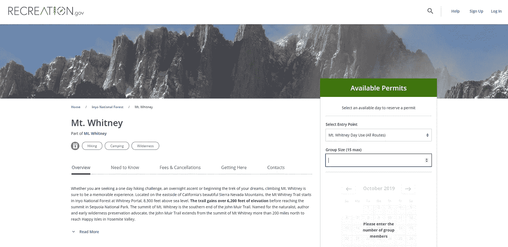

# 用网络浏览器自动化和 R 攀登惠特尼山

> 原文：<https://towardsdatascience.com/climbing-mt-whitney-with-web-browser-automation-and-r-b11dcf9353b2?source=collection_archive---------25----------------------->


Mt Whitney by [Dan Eckert](https://www.flickr.com/photos/cloudchaser32000/26630353105)

## 惠特尼山是美国境内最高的山，你需要一个许可证才能攀登它。这些许可证是有限的。但有时，有人会归还他的许可证。它将出现在许可证网站 recreation.cov 上。我想得到其中的一个，并会告诉你如何。

我的一个朋友有两周的时间去申请惠特尼山的许可证。直到他提出这次旅行，我才真正了解这座山。惠特尼山位于加利福尼亚州，海拔 4421 米。因为每年都有很多人想去那里。美国农业部林务局决定限制徒步登山的许可数量。要获得许可，你只需登录这个[网站](https://www.recreation.gov/permits/233260)，查看你和#徒步旅行者的约会是否有空。



Mt. Whitney permit website (2019 Oct 3rd)

你会很快注意到，如果你不是一个早起的人，你想要约会的所有许可都消失了。现在你有三个选择。一，辞职不爬山。第二，每天自己查看网站，看看是否有新的或退回的许可证。第三，让一个机器人或浏览器自动为你检查许可。我的朋友决定问我第三种选择。由于我对硒元素有一些经验(最近刚刚在 [EARLconf](https://earlconf.com/#speakers) 展示)，我想尝试这种方法。

# 遵循本教程所需的知识

*   [如何启动 docker 容器](https://docs.docker.com/engine/reference/commandline/build/)
*   [硒元素的一些基础知识](https://docs.ropensci.org/RSelenium/articles/docker.html)
*   [如何使用 Chrome 或 Firefox 开发工具](https://developers.google.com/web/tools/chrome-devtools)

# RSelenium 和 docker 入门

首先，我想在云上运行我的机器人。此外，我想获得一个可复制的环境。所以我决定遵循 RSelenium 的[小插图方法](https://github.com/ropensci/RSelenium/blob/master/vignettes/docker.Rmd)。这意味着为硒使用 docker 容器。所以我的第一个任务是旋转两个 docker 容器。第一个应该运行 Selenium，第二个应该运行 R 和 python 来访问它。

旋转硒容器很简单:

```
docker run -d -p 4445:4444 --name seleniumcontainer --net mynet selenium/standalone-chrome
```

我在 docker 容器之间使用了一个名为`mynet`的共享网络。这允许两个 docker 容器在网络中找到彼此，甚至通过名字。

第二个 docker 容器必须由三个文件组成。

1.  执行我的硒元素调用
2.  `sendmail.py`从 python 发送电子邮件
3.  `DockerFile`建造码头集装箱

docker 文件需要看起来像这样:

[https://gist.github.com/zappingseb/6d65f7d27ce85185c785613f83a8036f](https://gist.github.com/zappingseb/6d65f7d27ce85185c785613f83a8036f)

我使用了`tidyverse` docker 容器并安装了 RSelenium 包。另外，我安装了 python `secure-smtplib`和`email`。我还在 docker 容器中添加了一个 cronjob。该 cronjob 将通过以下方式每 12 小时运行一次网络爬虫:

```
RUN apt-get update && apt-get -y install cron
RUN echo "0 */12 * * * root Rscript /tmp/run_tests.R" >>   
  /etc/crontab
RUN service cron start
```

现在我想旋转 docker 容器。但是我的`sendmail.py`和`run_tests.R`文件不见了。让我们来创造它们

# 用砷来爬许可证

要使用 RSelenium，您首先需要连接到 Selenium 服务器。它在另一个 docker 容器中运行。要连接到它，请运行:

```
remDr <- remoteDriver(remoteServerAddr = "seleniumcontainer", browserName = "chrome")
```

只要容器在`mynet.`内运行，名称`seleniumcontainer`将被自动识别，两步将进入惠特尼山许可证网站。打开浏览器并导航到网站:

```
remDr$open()
remDr$navigate("https://www.recreation.gov/permits/233260/")
```

## 使用许可表单

更难的是找到可以点击的元素。首先，我注意到我需要点击选项“所有路线”，这是下拉菜单中的第三个选项:


Mt Whitney dropdown menu HTML code

该选项可通过其`id`访问。这个 id 是`division-selection`。通过用`id`点击元素，下拉菜单将打开。下拉菜单打开后，您需要点击网站上的第三个`option`元素。通过这 4 行代码，您可以使用 RSelenium 实现它:

```
el_1 <- remDr$findElements("id", "division-selection")el_1[[1]]$clickElement()el_2 <- remDr$findElements("css selector", "option")el_2[[3]]$clickElement()
```

如您所见,`findElements`返回了一个包含所需属性的 *webElements* 列表。`clickElement`是这样一个 *webElement* 的方法，基本上会点击元素。

这是浏览器自动化步骤中最简单的部分。更难的部分是输入徒步旅行者的数量。更改它们最安全的方法是不仅在文本字段中键入内容，而且使用 javascript 来更改它的值。字段`number-input-`将用于此。


Mt Whitney numeric input

为了改变这个值，我使用了下面的代码:

```
el_3 <- remDr$findElements("id", "number-input-")# executing a javascript piece to update the field value
remDr$executeScript("arguments[0].setAttribute('value','1');"), list(el_3[[1]]))# clearing the element and entering 1 participant
el_3[[1]]$clearElement()el_3[[1]]$sendKeysToElement(list("1"))
```

你可以清楚地看到我想要一张进山的许可证。javascript 片段运行在 webElement 本身上，它存储在`el_3[[1]]`中。对于硒元素，我更喜欢用`remDr$findElements`方法寻找元素。之后，如果我确定只有一个元素，我就取第一个。方法`clearElement`和`sendKeysToElement`删除旧值并输入所需值。`sendKeysToElement`的 API 有点奇怪，因为它需要一个键列表，而不是一个字符串。但是一旦使用了，就很容易保存你的代码。

## 与许可证日历交互

在这些步骤之后，带有许可的日历被激活。我想在 2019 年 10 月拿到许可证。所以我需要点击“下一步”,直到 10 月份到来。


Mt Whitney next button

我使用`while`命令构建了一个循环来执行这个任务

```
# Get the initial month shown
month_elem <- remDr$findElements("css selector", ".CalendarMonth_caption strong")
month <- month_elem[[1]]$getElementText()# Loop to until the October calendar is shown
while(!grepl("October", month)) {

  el_4 <- remDr$findElements("css selector", ".sarsa-day-picker-
    range-controller-month-navigation-button.right")
  el_4[[1]]$clickElement() Sys.sleep(1)
  month_elem <- remDr$findElements("css selector", 
    ".CalendarMonth_caption")
  month <- month_elem[[2]]$getElementText()}
```

包含月份的元素有标签`class="CalendarMonth_caption"><strong>...</`。我用 CSS 选择器访问了这个。单击 next 按钮，它有一个特定的 CSS 类，一个新的日历名称会显示出来。我花了一段时间才发现旧的日历月并没有消失。现在必须检查第二个元素的名称。所以我用新显示的日历标题覆盖了`month`变量。

## 从日历中导出第一个可用日期

作为人类，找到一个空闲的日子很简单。只要看看日历，搜索里面有 A 的蓝色方框:


Calendar with available day at Mt Whitney

对于电脑来说，没那么容易。就我而言，我只有一个问题要回答。2019 年 10 月第一次爬惠特尼山是什么日期？

```
day_elem <- remDr$findElements("css selector", ".rec-available-day")
if (length(day_elem) < 1) {
  earliest_day <- "NODAY"
} else {
  earliest_day <- strsplit(
    day_elem[[1]]$getElementText()[[1]],
    split = "\n")[[1]][1]
}
```

因此，我搜索任何带有类`rec-available-day`的条目。为了防止出现任何条目，我获取了第一个条目的文本，并获取了换行符之前的所有字符。这提取了日期的数字。现在，把这个包起来，发一封电子邮件，注明日期:

```
fileConn<-file("/tmp/output.txt")writeLines(paste0("The earliest day for Mnt Whitney in ", month[[1]], " is: ", earliest_day, "th of October 2019.\n\n-------------------\n"))close(fileConn)# Write an email from output.txt with python
system("python /tmp/sendmail.py")
```

# 激活 docker 容器

脚本完成后，我将所有文件打包在我的 [GitHub 存储库中(zappingseb/mtwhitney)](https://github.com/zappingseb/mtwhitney) 。他们将通过每 12 小时发一封电子邮件来帮助我。从那里，我回到我的 docker 服务器，git 克隆了存储库。然后，我可以运行以下命令来启动 docker 容器:

```
docker build --net mynet --name mtwhitney -f Dockerfile .
```

并通过连接到 docker 容器来测试脚本一次:

```
docker run -it mtwhitney /bin/bash
```

并使用以下命令运行脚本:

```
sudo Rscript /tmp/run_tests.R
```

我收到一封邮件。收到邮件后，我确信脚本会运行，并使用`Ctrl + p`和`Ctrl + q`断开连接。

# 学习

写这篇文章真的让我收到了一封电子邮件，里面有一个免费的位置和攀登惠特尼山的许可:


email from Browser Automation

浏览器自动化对这样的用例很有帮助。它帮助我获得了许可证。我没有通过每隔几秒钟浏览网站或查看具体日期来过度设计它。这更像是一个有趣的项目。你可以想出很多办法让它变得更好。例如，如果有日期，它可以发送电子邮件。但是我想每 12 小时获取一次日志文件，看看是否出了什么问题。

在抓取过程中，网站更新了一次。所以我收到了来自我的刮刀的错误信息。我把脚本改成了这篇博文中的脚本。如果你明天想刮掉惠特尼山的书页，这个剧本可能不起作用。Recreation.gov 可能已经换了网站。

我使用浏览器测试来使我的 R-shiny 应用程序更安全。我在一个受监管的环境中工作，这些测试让我节省了很多时间。这一次，如果没有像 [RSelenium](https://github.com/ropensci/RSelenium) 或 [shinytest](https://blog.rstudio.com/2018/10/18/shinytest-automated-testing-for-shiny-apps/) 这样的好工具，我会花时间进行点击测试。尝试一下，享受你的浏览器为你做的工作。

# 相关文章

*   [Travis CI for R —高级指南](/travis-ci-for-r-advanced-guide-719cb2d9e0e5)
*   [R 包的漂亮测试](/rtest-pretty-testing-of-r-packages-50f50b135650?source=---------9------------------)
*   [如何让人们在一小时内做好准备](https://medium.com/datadriveninvestor/how-to-get-people-r-ready-in-an-hour-thors-hammer-d8c853abaf0b?source=---------16------------------)

> 作者注:您也可以用纯 python 代码完成所有这些工作。我只是更熟悉硒元素和 tidyverse docker 容器。这让我的生活更轻松。