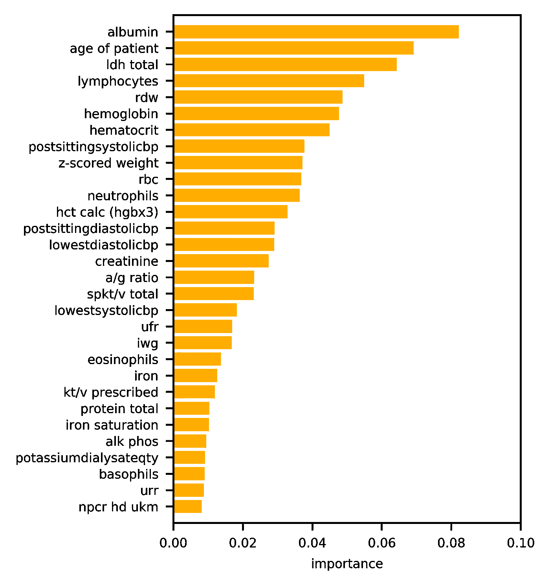
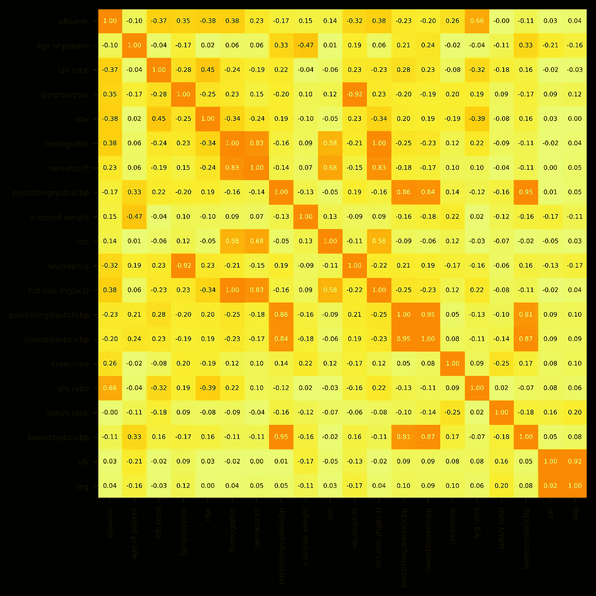
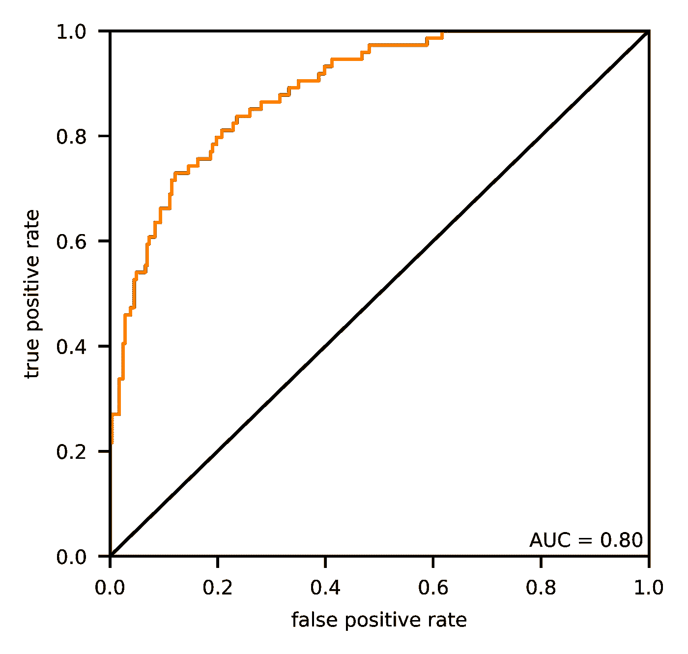
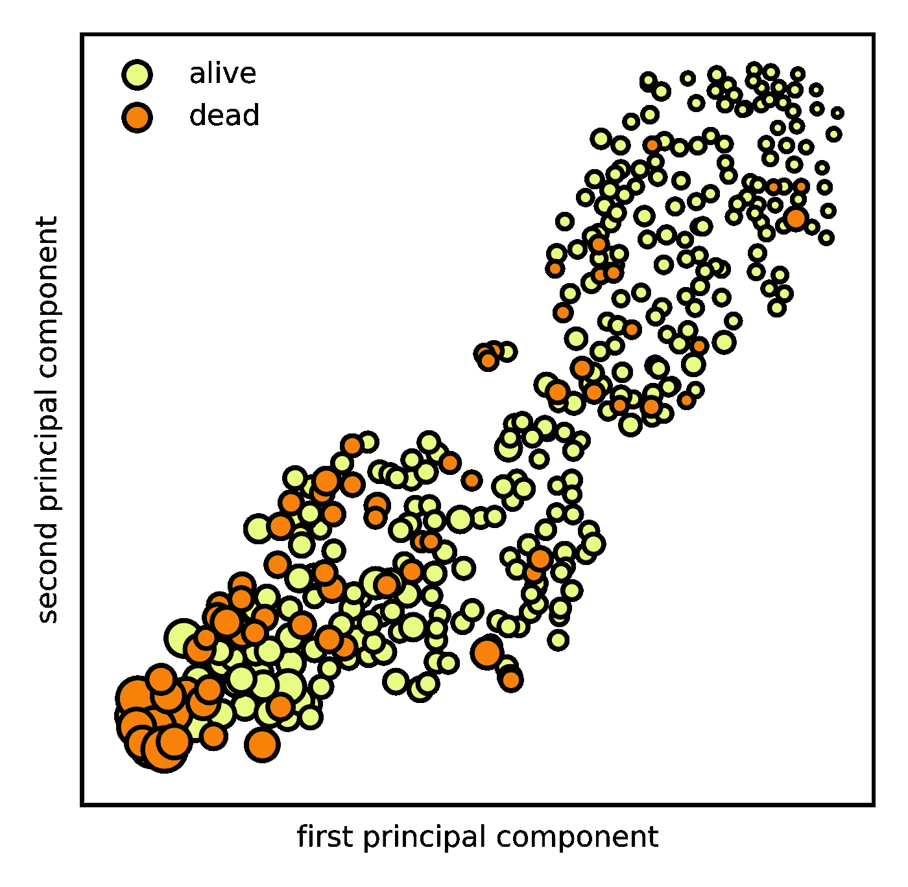
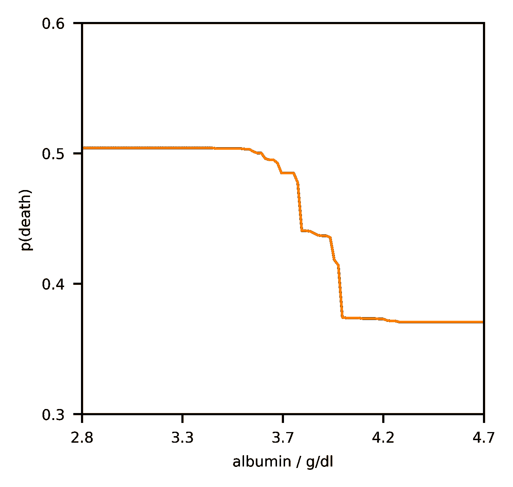

# 临床数据科学导论

> 原文：<https://towardsdatascience.com/clinical-data-science-an-introduction-9c778bd83ea2?source=collection_archive---------10----------------------->

## [临床数据科学](https://towardsdatascience.com/tagged/clinical-data-science)

## 超越统计测试和 p 值。

Photo by [Hush Naidoo](https://unsplash.com/@hush52?utm_source=medium&utm_medium=referral) on [Unsplash](https://unsplash.com?utm_source=medium&utm_medium=referral)

# 介绍

## 关于

[**临床研究**](https://en.wikipedia.org/wiki/Clinical_research)/[/**流行病学**](https://en.wikipedia.org/wiki/Epidemiology) 是对患者进行研究以探讨新疗法或改进现有疗法的领域。在这个过程中，收集并生成了大量需要处理的数据。这篇文章的目的是分享一些来自 [**数据科学**](https://en.wikipedia.org/wiki/Data_science) 的技术，供临床使用。[此外，还介绍了一个案例研究，该案例研究已在科学杂志](https://academic.oup.com/ndt/advance-article-abstract/doi/10.1093/ndt/gfaa128/5854486?redirectedFrom=fulltext)上发表。请注意，大多数提到的方面当然不限于临床领域，在其他地方也可能遇到。

## 一些定义

首先，我们来分享一些临床研究中经常用到的表达式的定义(摘自维基百科)。

> [**生物标志物**](https://en.wikipedia.org/wiki/Biomarker) :某种生物状态或状况的可测量指标。通常测量和评估生物标记来检查正常的生物学过程、致病过程或对治疗干预的药理学反应。
> 
> [**主要结果**](https://en.wikipedia.org/wiki/Clinical_endpoint) :一个临床终点，该终点提供了足够的证据，以支持治疗的监管声明的方式充分描述了治疗的临床效果。重要的是，主要结果是“硬的”，即可测量和明确定义的标准，如干预或缓解(疾病的体征和症状减少或消失)后 30 天内死亡。
> 
> [**次要结果**](https://en.wikipedia.org/wiki/Clinical_endpoint) :治疗的额外临床特征，但其本身不能令人信服具有临床意义的治疗效果。次要结果与主要结果相关，并支持研究的成功。它们可以是“软的”，例如从一到五的范围内患者感知的疼痛。
> 
> [**替代终点**](https://en.wikipedia.org/wiki/Surrogate_endpoint) :特定治疗效果的衡量标准，可能与*真实*临床终点相关，但不一定有保证关系。美国国立卫生研究院将替代终点定义为“旨在替代临床终点的生物标志物”。

通常，人口统计学属性(年龄、性别、种族)、生物标记(血红蛋白、心率、白细胞)和治疗参数(剂量、频率)是特征(自变量)，结果/终点是输出(因变量)。

# 数据管理

是否允许(以及如何)处理患者数据的问题经常出现，因此对所谓的[**【GCP】**](https://www.fda.gov/science-research/science-and-research-special-topics/clinical-trials-and-human-subject-protection)良好临床实践进行一些评论可能会有所帮助。 [**临床试验**](https://en.wikipedia.org/wiki/Clinical_trial) 的工作方式是，一个 [**赞助商**](https://learn.marsdd.com/article/clinical-trials-sponsors-and-sponsor-investigators/) (例如一家制药公司)就试验/研究的内容写一份建议书，然后该建议书必须得到某个 [**伦理委员会**](https://en.wikipedia.org/wiki/Ethics_committee) 的批准。一旦主办方获得开展研究的许可， [**研究者**](https://en.wikipedia.org/wiki/Clinical_investigator) (例如医院的医生)就可以开始招募患者进行临床试验。(请注意，有可能成为**申办者-研究者**、，这是医院研究小组的情况。)医生必须向他们的病人详细说明这项研究，它对社会的益处，以及一些潜在的风险。他们不被允许为他们的参与支付报酬，但是那些参与的人可以以其他方式得到补偿。签署 [**知情同意书**](https://en.wikipedia.org/wiki/Informed_consent) 的患者同意参与并提供其数据，这些“受试者”随后会收到一个患者识别号。将名/姓映射到患者识别号的字典必须安全存储。患者将接受研究护士和医生的检查，他们将收集数据并将其存储在数据库中。请注意，这些患者可能只去医院一次或几次(纵向研究)，他们可以随时离开研究。数据收集过程非常昂贵，因为这些数据是通过实验产生的。此外，由于参与可能会给患者带来压力，研究人员必须确保他们生成/收集的数据是高质量的。

# 数据分析

一旦从 [**群组**](https://en.wikipedia.org/wiki/Cohort_(statistics)) 中收集到足够数据，就可以开始分析了。在谈论数据科学方法及其挑战之前，应该说明在流行病学研究中通常是如何进行分析的。

## 经典方法

让我们假设这项研究是在 [**肺病学**](https://en.wikipedia.org/wiki/Pulmonology) 进行的，该小组希望调查“运动”对肺功能的影响，即运动(例如每周花在耐力运动上的时间)是使肺“变好”还是“变坏”。**肺功能**由[肺活量测定法](https://en.wikipedia.org/wiki/Spirometry)确定，并提供[1 秒用力呼气容积(FEV1)](https://en.wikipedia.org/wiki/Spirometry#Forced_expiratory_volume_in_1_second_(FEV1)) ，其将被定义为结果。因为它是一个连续变量，所以会进行一些回归，这可能是线性的。将对群组的子集进行采样，例如，那些在某些特征中没有缺失值/异常值的患者，或者那些在输出值的某个范围内的患者(并且将绘制哪些患者被包括在模型中的流程图，以便清楚其对谁有效)；人口是非常明确的。接下来，医生将解释模型中必须包括哪些其他效应以校正 FEV1 的变化(即已知效应)。例如，与不吸烟/没有哮喘/没有暴露于污染的人相比，吸烟/患有哮喘/暴露于环境污染的人将具有较低的 FEV1。将执行 [**(线性)回归**](https://en.wikipedia.org/wiki/Regression_analysis) (使用这几个标准化的连续变量和分类变量)，并根据其大小(和符号)比较系数，以讨论相对影响。

或者，有两个亚组，例如体检时间少于两小时的亚组和体检时间超过两小时的亚组。每个亚组在测量的 FEV1 方面具有平均值和标准误差，并且执行 [**学生 t 检验**](https://en.wikipedia.org/wiki/Student%27s_t-test) **/** [**曼-惠特尼 *U* 检验**](https://en.wikipedia.org/wiki/Mann%E2%80%93Whitney_U_test) ，并且检查 [**p 值**](https://en.wikipedia.org/wiki/P-value) 是否低于 0.05(对应于 95% [**置信区间**](https://en.wikipedia.org/wiki/Confidence_interval) )。如果是，结果被认为是[统计显著的](https://en.wikipedia.org/wiki/Statistical_significance)，即存在影响。

以上是来自 [**【生物】统计**](https://en.wikipedia.org/wiki/Statistics) 的一些标准方法。人们可能会对提前选择变量的事实感到惊讶，因为无法以这种方式发现意外情况，因为永远不知道(完全)要将哪些变量包括在结果“校正”的集合中。然而，收集许多生物标志物还不是普遍的做法。一方面，这种情况正在慢慢改变，人们正在讨论更系统地收集数据。另一方面，在收集了大量数据的情况下，人们希望应用机器学习方法。

## 数据科学方法

在传统方法中，一切都是明确定义和预先选择的，与此相反，数据科学方法更加开放。公式化的问题是一样的，但是所有的变量都包括在内，人口不必分层。我们来看一个来自 [**肾脏病**](https://en.wikipedia.org/wiki/Nephrology) 的例子。有一组 [**慢性肾脏疾病**](https://en.wikipedia.org/wiki/Chronic_kidney_disease) 患者，即肾脏停止工作而需要 [**肾脏替代疗法(透析)**](https://en.wikipedia.org/wiki/Dialysis) 的人，并且观察到一些患者在治疗开始后死亡。还不完全清楚为什么会发生这种情况，即调查**患者死亡率**是任务。也许治疗过程还没有优化，也许这取决于患者。然而，我们的想法是开发一个具有尽可能少的不相关变量的模型，同时仍然保持模型的性能。关于每个患者的人口统计学、治疗参数和实验室值的一些数据可以作为时间序列获得(通常，这样的问题由 [**生存分析**](https://en.wikipedia.org/wiki/Survival_analysis)[**/卡普兰-迈耶估计**](https://en.wikipedia.org/wiki/Kaplan%E2%80%93Meier_estimator) 来回答)。

**Figure 1:** Reported causes of death as 1-grams in a word cloud. (image by author)

让我们在不多谈**数据预处理**的情况下提及一些可能遇到的问题，因为已经有[其他文章](/introduction-to-data-preprocessing-in-machine-learning-a9fa83a5dc9d)讨论过了。

1.  可能没有时间开发新的东西，所以最好使用标准库，如 [Pandas](https://pandas.pydata.org/) 、 [Scikit-Learn](https://scikit-learn.org/stable/) 和 [Matplotlib](https://matplotlib.org/) 。
2.  数据集可能是倾斜的，例如，20%的正类，80%的负类。作为性能标准，准确度将不起作用，更合理的是在网格搜索中最大化**(作为一个或多个超参数的函数)。此外，存在许多必须首先移除的**，例如通过计算 [**标准分数**](https://en.wikipedia.org/wiki/Standard_score) 并移除极值。****
3.  ****[**删截**](https://en.wikipedia.org/wiki/Censoring_(statistics)) 是最具挑战性的方面之一，因为删截患者的结果未知。为了解决这个问题，这个问题可以定义为在透析开始后存活一定时间的概率，在这种情况下，是 5 年(包括不同时间间隔的敏感性分析)。通过计算**平均值**或**中值**统计数据，假设每个组都来自多维分布(这也可以仅从死亡前最后几个月的数据中得出，人们必须尝试什么效果最好)。只有在这五年的时间内具有已知结果的患者将被包括在内，标记为 y=0(存活)和 y=1(死亡)。然而，这样做去除了时间成分并显著缩小了数据集，并且是 [**选择偏差**](https://en.wikipedia.org/wiki/Selection_bias) 的来源。****
4.  ****不是每个变量都适用于每个人。此外，测量间隔不规则。重要的是只保留那些定期测量的数据，以避免潜在的偏差(由于 [**插补**](https://en.wikipedia.org/wiki/Imputation_(statistics)) 缺失值)。****
5.  ****需要一种存在若干相关或冗余特征的数据挖掘方法。计算 [**相关系数**](https://en.wikipedia.org/wiki/Correlation_and_dependence) 有助于识别冗余变量。****
6.  ****将结果传达给一群不熟悉数学和算法并且已经建立了方法的人是另一个挑战。因此，使用可解释的算法或使用额外的模型检查技术更容易，例如 [**【置换重要性】**](https://scikit-learn.org/stable/modules/generated/sklearn.inspection.permutation_importance.html) 和 [**【部分相关性】**](https://scikit-learn.org/stable/modules/generated/sklearn.inspection.partial_dependence.html#sklearn.inspection.partial_dependence) 。 [**随机森林**](https://en.wikipedia.org/wiki/Random_forest) 是一个伟大的算法，因为它具有高度的可解释性，并且不需要担心特征工程。此外，在现代实施方式中，还有内置的**过配合** / **欠配合**防止功能。****
7.  ****可能存在 [**采样偏差**](https://en.wikipedia.org/wiki/Sampling_bias) ，例如，队列中年龄较大的患者多于年龄较小的患者，这可能导致错误的结论。如果总的来说有更多的老年患者，那么可以预料会有更多的患者死亡。这可能是最大的困难，因为你永远不知道一个效果是自然发生的，还是因为你的采样不好。****

**** [## 偏见如何扭曲你的预测

### 理解数据及其分布是精确模型的关键。

towardsdatascience.com](/how-sampling-biases-might-be-ruining-your-predictions-f9e021d79723)**** 

****在具有总共 105 个变量的随机森林的第一次运行之后，获得了以降序 [**特征重要性**](https://christophm.github.io/interpretable-ml-book/feature-importance.html) 排列的长列表。****

********

******Figure 2:** Feature importance of the thirty most importance variables. (image by author)****

****这些变量中很可能有一些是相互关联的。此外，随着重要性的降低，一个特性对整体性能的贡献也在减少。您可以设置一个最小重要性阈值，在此阈值之后，功能将变得不相关，或者固定功能的数量(并让它来确定阈值)，这两种方法是等效的，因此在这种特定情况下将保留 20 个最相关的功能。此外，在相关特征集合中(根据**等级相关性，阈值在+/- 0.7 以上/以下)，保留具有较高临床相关性的那些特征。******

************

********Figure 3:** Correlations among the 20 most important features. (image by author)******

******此外，去除由非均匀采样(采样偏差)产生的变量也很重要。例如，如果队列中年龄比年轻患者大得多，就很难对患者的*年龄对死亡的影响做出说明。也许更年轻的患者离开研究是因为他们优先接受器官移植。必须仔细检查这些变量，因为它们会导致错误的结论。*******

******最终模型包含 12 个特征，预测准确率为 80%。最好计算一个 [**ROC 曲线**](https://en.wikipedia.org/wiki/Receiver_operating_characteristic) 来展示性能(另一个选项是构建 [**混淆矩阵**](https://en.wikipedia.org/wiki/Confusion_matrix))；在这种情况下，曲线下的面积应该与精度相对应。该模型比随机猜测要好，因为曲线在对角线上方。理想情况下，应将模型性能与某些 [**黄金标准**](https://en.wikipedia.org/wiki/Gold_standard_(test)) 进行比较(如果有)，因为只有这样才能真正评估性能。如果还没有可用的黄金标准，甚至比随机猜测稍微好一点的表现就足够了——理论上。模型未能预测一些病例，因此可能没有足够的信息来预测所有的死亡。或者，一些样本可能与疾病完全无关(通常，应该记录某人死亡的原因)。******

********

******Figure 4:** ROC curve for performance estimation of the final model. (image by author)****

****另一种表示这两个组(并观察它们的可区分性)的方式是通过降维方法绘制它们，例如 [**t 分布随机邻居嵌入**](https://en.wikipedia.org/wiki/T-distributed_stochastic_neighbor_embedding) 。点的大小与*白蛋白*水平成反比，因为这是最重要的特征。较大的点在第一次透析后五年内死亡的概率较高。我们看到脆弱的病人倾向于聚集，他们与强壮的病人重叠。一种可能的解释是，这些健壮的病人有死亡的危险。还可以看出，一些死亡发生在更类似于健壮状态的状态。这可能意味着未记录的任何类型的事故都可能包含在数据集中。此外，没有明显的异常值。****

********

******Figure 5:** Dimensionality reduction by t-distributed stochastic neighbor embedding with the features of the final model. (image by author)****

****下图显示了模型中变量的最终列表。 [*白蛋白*](https://www.kidney-international.org/article/S0085-2538(15)58101-5/pdf) 的相关性在 20 世纪 90 年代就已为人所知，并且证明该方法是可行的。注意，这种方法也可以用于 [**生物标志物发现**](https://en.wikipedia.org/wiki/Biomarker_discovery) 。虽然*白蛋白*被证明在这种特定情况下(血液透析)是一个很好的标志，但值得一提的是，它不是一个非常[**特异的**](https://en.wikipedia.org/wiki/Sensitivity_and_specificity) 死亡标志，因为它暗示了一系列其他可能的**病理**，如脱水、高血压、糖尿病、营养不良、肝损伤等。****

********

******Figure 6:** Importance of features in the final model. (image by author)****

****通过计算特征的部分相关性来观察效应发生的方向也是令人感兴趣的。对于*白蛋白*，我们看到较低的值会增加死亡的概率，并且[这个阈值与](https://www.kidney-international.org/article/S0085-2538(15)58101-5/pdf)之前报道的一致。人们现在可以想出给病人提供白蛋白的主意，但这只有在这是死亡的根本原因而不仅仅是症状的情况下才会起作用。但总的来说，这将是一种开发个性化治疗/疗法的方法。****

********

******Figure 7:** Partial dependence of albumin on death. (image by author)****

****在临床研究领域，尽可能精确地工作是很重要的。尽管医生已经对自己的工作持怀疑态度，但也应该这样做。如果得出错误的结论，人们可能会想出可能伤害患者的治疗/程序。然而，如果工作做得好，许多生命可以被挽救——例如通过[创建有用的应用来预测病人的状态](https://kidnai.herokuapp.com/home)。****