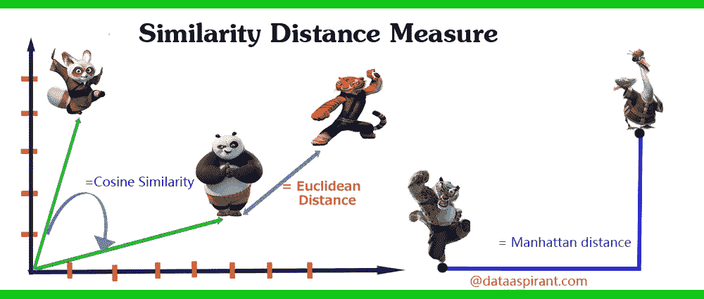
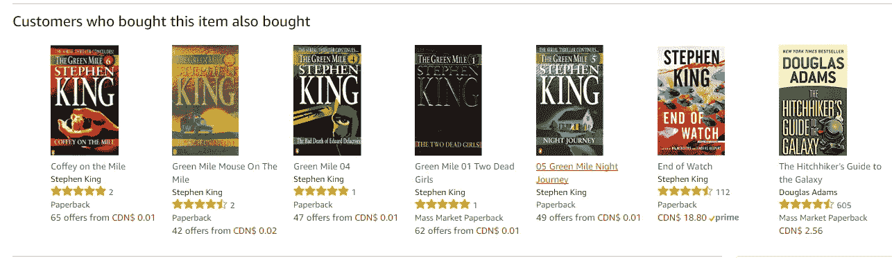

# 网络空间的克隆人战争

> 原文：<https://towardsdatascience.com/clone-wars-in-cyberspace-the-contest-between-facebook-google-twitter-and-linkedin-to-create-6d2a9bc0f718?source=collection_archive---------29----------------------->

Photo by Greg Ortega on Unsplash

## 看似相似的造型

## **脸书、谷歌、Twitter 和 LinkedIn 之间创造完美复制品的竞赛**

与[QUT 商学院广告、营销和公共关系高级讲师 Edwina Luck](https://staff.qut.edu.au/staff/e.luck) 博士共同撰写。

**你有没有想过自己有没有二重身？双胞胎吗？和你有相同 DNA 的人？这是一个很有趣的问题，可能属于科幻电影或书籍。《银翼杀手 2049》中的一个概念，而不是我们 2019 年的现实。但是许多人没有意识到他们有一个替身的可能性很大。在征服网络空间的战争中，脸书、谷歌、Twitter 和/或 LinkedIn(即将推出)上的一种算法可能已经创造出了你的完美复制品。**

在线克隆人并不是什么新鲜事。多年来，脸书、谷歌和 Twitter 一直在各自的广告平台上竞争创造相似的受众。脸书广告公司宣布在 2013 年 3 月发布他们的 [*长相相似的观众*](https://www.adweek.com/digital/lookalike-audiences/) 专题，而 Twitter 广告公司在同年 12 月推出了他们的 [*量身定制的观众*](https://adexchanger.com/social-media/twitter-rolls-out-tailored-audiences/) ( [一个非常相似的专题](https://adexchanger.com/social-media/twitter-rolls-out-lookalike-audiences-new-mobile-ad-ids-targeting-by-phone-number/))。然后，谷歌广告也抄袭了脸书，在 2015 年发布了他们的 [*客户匹配*](https://www.businessinsider.com.au/google-launches-customer-match-similar-audiences-and-universal-app-campaigns-2015-9) 功能。今年 1 月，LinkedIn 宣布他们正在研究长相相似的受众，这是脸书广告平台的关键特征之一。

相似的观众是通过一种叫做[相似建模](https://adage.com/article/dataworks/alike-models/239590/)的[预测分析](https://www.researchgate.net/publication/276248376_Beyond_the_hype_Big_data_concepts_methods_and_analytics)方法创造的，这种方法使用[机器学习](https://www.sas.com/en_au/insights/analytics/machine-learning.html)根据当前和历史数据预测未来的结果。例如，机器学习可以根据客户购买的内容、购买时间，甚至他们在社交媒体上发布的内容来预测客户的行动。脸书提供了一门 15 分钟的免费课程，帮助广告商学习何时以及如何利用长相相似的观众，尽管他们的一些预测方法被发现与 shady Cambridge Analytica 使用的[(他帮助唐纳德·川普](https://theintercept.com/2018/04/13/facebook-advertising-data-artificial-intelligence-ai/)[赢得了 2016 年美国总统大选](https://www.theguardian.com/technology/2018/mar/17/facebook-cambridge-analytica-kogan-data-algorithm))非常相似。同样，谷歌正在把机器学习放到每一个广告客户的手中，推特也在使用机器学习首先为你展示最好的推文。

然而，关于这些公司如何制作相似的模型，明显缺乏透明度，这就是为什么人们通常不太理解。据、[、](https://www.linkedin.com/in/musen/)、[、](https://www.linkedin.com/in/zhen-xia-65790032/)和[大同陈](https://www.linkedin.com/in/datong-chen-aa11083/)在雅虎开发了一个模仿系统！[优于其他方法 50%以上](http://proceedings.mlr.press/v53/ma16.pdf)，在线广告中使用的系统可分为三种类型:

## 简单的基于相似性的相似系统

通过比较种子用户(例如您的客户)与可用用户(例如不是你的客户的脸书用户)来判断哪一个用户更受欢迎，或者哪一个用户具有更多的定量属性，或者这两个用户是否相同。相似度是用[距离度量](https://bigdata-madesimple.com/implementing-the-five-most-popular-similarity-measures-in-python/)计算的，距离度量是 python(编程语言，不是 snake)中用于度量相似度的机器学习算法。

## 基于回归的相似系统

一种基于[逻辑回归](/building-a-logistic-regression-in-python-step-by-step-becd4d56c9c8)寻找相似物的统计方法，逻辑回归是一种机器学习分类算法，用于预测事件发生的概率。在基于回归的系统中，算法的目标是预测种子用户(例如银行客户)将执行期望的结果(例如注册定期存款)基于以前的数据(例如他们的年龄、工作、婚姻状况等)。

## **基于分段近似的相似系统**

一种分段方法，通过基于用户特征(如兴趣类别)创建分段来查找相似部分。例如，如果用户喜欢 NBA 比赛，则该用户被认为属于体育部分。基于分段近似的系统的一般思想是找到与种子用户“共享”尽可能多的顶部分段的可用用户。

Image: Dataaspirant.com

来自经验丰富的独立科学家的文章可能是最容易看到机器学习预测能力的方式。在他们的教程中，[我们如何在一个小时内建立图书推荐系统第二部分-k 最近邻和矩阵分解](/how-did-we-build-book-recommender-systems-in-an-hour-part-2-k-nearest-neighbors-and-matrix-c04b3c2ef55c)，高级数据科学家 [Susan Li](https://medium.com/u/731d8566944a?source=post_page-----6d2a9bc0f718--------------------------------) 开发了一个系统，根据共同的图书评级在亚马逊上找到相似人群的聚类，并预测他们会对其他书籍感兴趣。

[Susan Li](https://medium.com/u/731d8566944a?source=post_page-----6d2a9bc0f718--------------------------------) 的系统结合了 [K 近邻](https://link.medium.com/v761OgqYFU)和[矩阵分解](https://link.medium.com/cTNlc2vfzU)两种算法，前者假设相似的事物彼此靠近，后者是一种协作过滤技术，其原理是对某种项目有相同兴趣的人也会对其他某种项目有相同兴趣。实验结果表明，李的图书推荐系统[比亚马逊的](/how-did-we-build-book-recommender-systems-in-an-hour-part-2-k-nearest-neighbors-and-matrix-c04b3c2ef55c)更准确，因为它的所有建议都是恐怖小说。在下图中，你可能会注意到亚马逊推荐了 6 本斯蒂夫·金的恐怖小说和一本道格拉斯·亚当斯的科幻喜剧小说，这种组合对恐怖小说迷来说可能有点奇怪。

Image: Susan Li

至于长相相似的受众在广告定位中的未来，也不清楚。或许这些关于从社交网络系统通信中确定用户个性特征的全球专利[和来自脸书的特征](https://patents.google.com/patent/US8825764B2/en)以及来自谷歌的[分级行为特征](https://patents.google.com/patent/US20130166494A1)提供了一些线索，让我们知道他们将会走上哪一个方向。