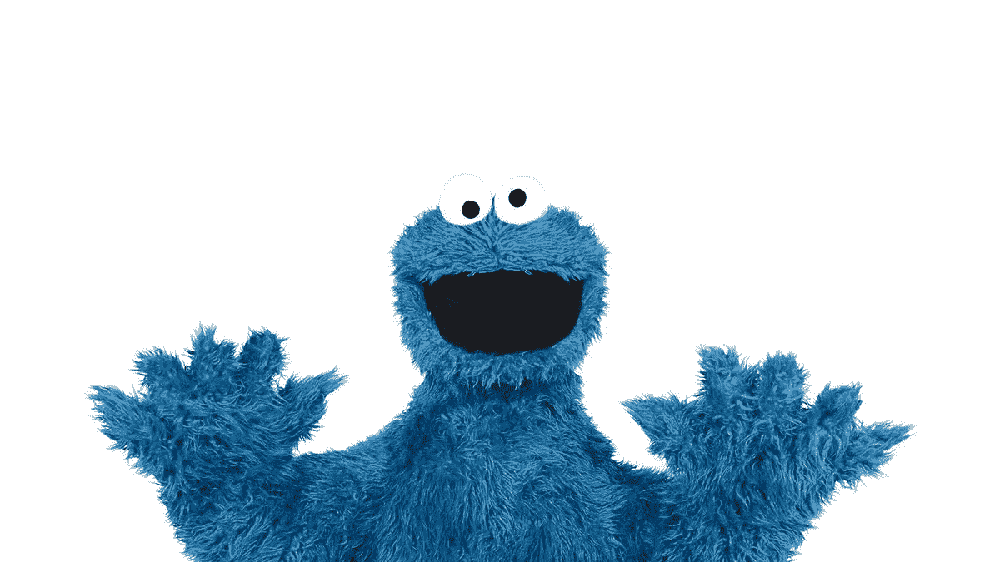
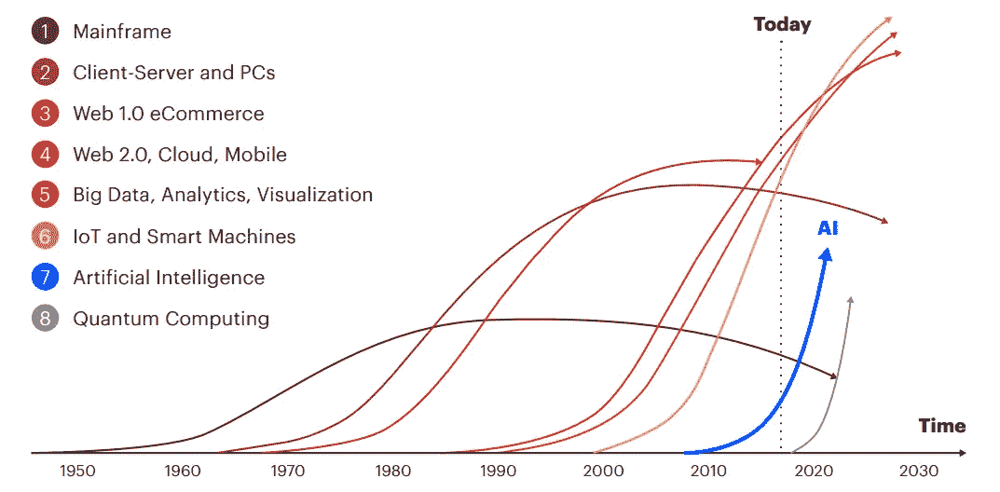
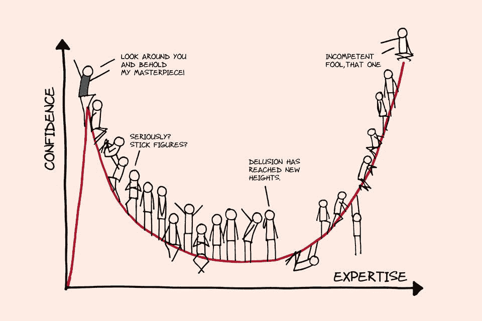

# 秘密数据科学家——他们是谁？

> 原文：<https://towardsdatascience.com/closet-data-scientists-who-are-they-b22219f8c759?source=collection_archive---------8----------------------->

## “今天我们将活在当下，除非不愉快，在这种情况下我会吃一块饼干”——饼干怪兽

## 如果你认为你已经准备好职业转换到人工智能，请阅读这篇文章

你白天有工作。你把业余时间花在大规模开放在线课程(MOOCs)和在 Jupyter 笔记本上运行机器学习(ML)模型上。你梦想在数据科学领域工作。你在谷歌上搜索“数据科学家的技能集”，疯狂地试图核对清单上的每一项。

是的，我在和你说话，秘密数据科学家。

## 在压缩技术浪潮的时代学习技能

人工智能(AI)领域发展如此之快，以至于数据科学技能集的增长速度超过了特朗普对全球经济的威胁。

Google 的*精选片段*来自搜索“*数据科学家技能集*”产生**统计**、 **R/Python** 、 **ETL** 、**数据角力与探索**、 **ML 算法**、**高级机器学习(深度学习)**、**大数据处理框架**和**数据可视化**。KDnuggests 发表了“*成为数据科学家所需的 9 项必备技能*”，提出前述技能是必修的，也是成为数据科学家的先决条件。

究竟怎样才能成为一名成熟的数据科学家呢？

**回答**:你没有。我确信公司有数据科学团队是有原因的。

Source: [1] Accenture (AI: The Momentum Mindset) — Compressing Technology Waves

随着技术浪潮的压缩，公司对新技术做出反应的时间越来越少。“坐以待毙”的心态不再是“安全”的方法，因为公司有可能成为人工智能的落后者。俗话说“一旦落后，就再也回不去了”。

同样，对于我们这些试图进入人工智能领域的秘密数据科学家来说，我们需要理解并接受这一点:

> 人工智能的发展速度超过了我们的速度。

每天都有研究进展和新技术出现。一个新的最先进的(SOTA)语言模型可能会出现，加入木偶家族(包括像 *ELMo* 、 *BERT* 和 *Big BIRD* )，或者一个新的 SOTA 图像分类器可能会被创建，它可以更准确地对图像进行分类，或者用更少的标记图像获得类似的结果。

从业者自己也明白 AI 可以有多广阔。他们不指望你知道一切。他们在寻找随着技术进步能够掌握必要技能的人。

最好的数据科学家是那些不断用人工智能的最新进展更新自己，并学习完成工作所需的技能的人。

# 也就是说，有些事情你必须做对…

围绕我上一篇关于我的人工智能之旅的文章，一个反复出现的回应是关于“*我需要知道什么*”才能被认为“足够好”来从事数据科学工作。对于那些试图转行的人来说，这个问题可能会让人感到更加畏缩(尤其是对于那些没有技术背景的人)。

我是这样看的。

## 做一个基本的婊子

钉牢你的基础。这是最简单的，但是大多数人都做不好。

你不需要知道从简单的线性回归到 GPT-2 的一切。然而，你确实需要理解使那些传统的 ML 模型工作的数学概念(例如，随机森林的*熵*或朴素贝叶斯分类器的*最大似然估计*)。此外，了解传统模型(如*主成分分析*)与神经网络模型(如*剔除*或*批量归一化*)的不同正则化方法。

了解基础知识不仅仅是能够背诵准确度、精确度或召回率的公式，而是知道哪种度量在哪种情况下更合适。这不是关于理解什么是*过度拟合*，而是理解*为什么会发生*并且能够假设哪种正则化方法会工作得最好。这不是在数据集上应用不同的模型并获得最高的准确性，而是评估和解释为什么某些模型比其他模型更好。你知道要点了。

## 展示你的兴趣

人工智能领域的职业生涯绝非易事。如果你正从一个完全不同的领域过渡到几乎没有重叠技能的领域，请准备好证明你为什么能够胜任数据科学家的角色。你的简历应该证明这一点可以让你获得面试机会，但是要准备好详细阐述这些项目。大多数面试都是从技术测试开始的(通常是基于编码的)，所以在像 *Leetcode* 或 *Hackerrank* 这样的网站上温习你的编码技能。

如果你不知道，完成 MOOCs 并在样本数据集上应用模型是 ***而不是*** 相当于展示兴趣。最低限度，从前到后完成一个学校或个人项目。这包括获取数据(例如网络搜集)、数据聚合和清理、特征工程、模型构建、模型评估以及*理想情况下*在平台上部署(例如网络或移动设备)。

在解释这些项目时，清楚地表达出来是很重要的。从项目背后的动机开始，然后是一个高层次的解释，生产模型所涉及的工具和步骤。之后，找出你在项目中最大的收获和最大的挑战，以及你是如何解决它们的。准备好面试官可能会问你的任何问题。面试官通常希望更详细地了解项目的某些部分，尤其是当他们闻到血腥味时(通常是当你掩饰项目的重要方面时)。

## 在你感兴趣的领域保持最新

总是知道你感兴趣的特定领域的最新发现和研究。

如果你申请的是一个专门从事自然语言处理的职位，这意味着你要了解向量空间模型和单词嵌入等基础知识。与 SOTA 语言模型保持同步也很重要，比如*伯特*和 *GPT-2* 能够区分和解释这些模型的差异也是一个巨大的优势，因为它展示了你阅读研究论文的能力。在人工智能领域，这是一项有价值的基本技能。

如果你申请的是专门研究计算机视觉的角色，一定要了解各种知名深度学习架构的演变。其中包括像 *AlexNet* 、 *VGG* 、 *GoogleNet* 、 *ResNet* 和 *DenseNet* 这样的网站。物体检测和语义分割也是好知道的(即*过食*、 *YOLO* 、 *SSD* 、 *FPN* 、 *R-CNN* 、*快 R-CNN* 、*快 R-CNN* 、*屏蔽 R-CNN* )。当然，像*迁移学习*这样的概念也是深度学习的基础。

## 读，读，读

人工智能阅读和编码一样多。

作为从业者，了解您感兴趣的领域中的最新技术是非常重要的。不要阅读和筛选每天发表的数百篇研究论文，而是在社交媒体上关注相关的人工智能思想领袖或研究人员。Twitter 通常是一个很好的来源(这基本上是我拥有 Twitter 账户的唯一原因)。

# 收拾好你的行李，是时候搬出衣橱了

## 当你认为自己还没准备好的时候，你已经准备好了

从个人经验来看，在你没有准备好的时候进行面试有助于你了解你处于信心-专业知识曲线的哪一部分(或者更正式地称为*邓宁-克鲁格效应*)。

Dunning-Kruger Effect (Source: The Business Times [5])

这是一种认知偏差，当人们没有足够的相关知识来准确判断自己的能力时，他们往往会出现这种偏差。换句话说，就是当 ***愚蠢的人认为自己*** 聪明的时候。

是真的。我以为我已经准备好成为一名数据科学家了。但是一种叫做现实的东西给了我一记耳光，让我意识到我是多么无知。

话虽如此，但你不一定要成为穿白色衣服的人(从图中)才能开始申请人工智能相关的工作。你只需要*而不是*成为穿蓝色制服的人。对自己的技能有自知之明，知道如何提升自己，总比痴心妄想好。

## 迈出信仰的一大步

最后，做好每次面试的准备。

每一次面试都是获得理想工作的机会。不要退而求其次。面试失败总比不尝试好。每一次面试都让你更近一步。

由于人工智能研究人员似乎有一种趋势，即以芝麻街布偶命名他们的语言模型，或许值得借鉴该剧试图灌输给儿童的一些教训。在最近的一集里，**布偶**艾比·卡达比**的兄弟鲁迪**弄乱了他正在画的一幅画，并对自己非常不满。他得到了胡珀商店老板艾伦的鼓励，并最终受到启发创作了一幅新画。Kate 的这篇文章[3]完美地总结了它(阅读它以获得灵感！)——“失败”是一种被遗忘的技能。你会意识到，为孩子准备的课程也会对成年人产生巨大的影响。

如果所有这些都失败了，记住奥斯卡说的话——“狗屎可能会更糟”。

万事如意！

大卫

阅读更多关于我从金融职业到人工智能的转变。

 [## 两年前我不知道如何写代码。现在我是一名 AI 工程师。

### 我最原始的旅程

towardsdatascience.com](/i-had-no-idea-how-to-write-code-two-years-ago-now-im-an-ai-engineer-13c530ab8227) 

***支持我！*** —如果你喜欢我的内容并且*没有*订阅 Medium，请考虑支持我并通过我的推荐链接[在这里](https://davidcjw.medium.com/membership)(注:*你的一部分会员费将作为推荐费*分摊给我)。

## 参考

[1] AI:动量思维方式—[https://www . Accenture . com/_ ACN media/pdf-73/Accenture-strategy-AI-Momentum-Mindset-exec-summary-POV . pdf](https://www.accenture.com/_acnmedia/pdf-73/accenture-strategy-ai-momentum-mindset-exec-summary-pov.pdf)
【2】Dunning-Kruger 效应—[https://www . business times . com . SG/brunch/not-so-blindness-ignition-The-Dunning-Kruger-Effect-at-work](https://www.businesstimes.com.sg/brunch/not-so-blissful-ignorance-the-dunning-kruger-effect-at-work)
【3】《芝麻街》在强调一种被遗忘的技能:失败——