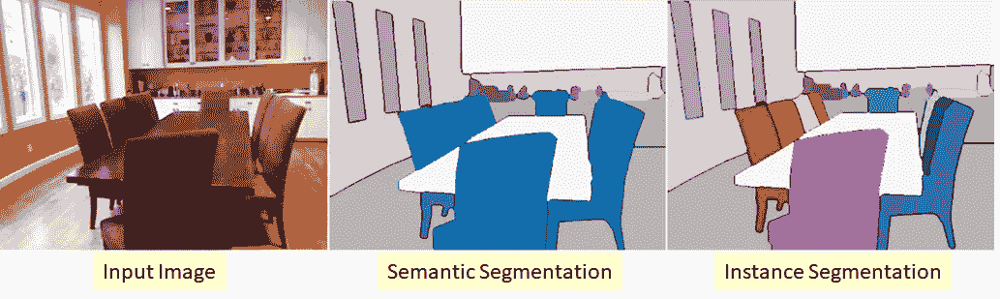
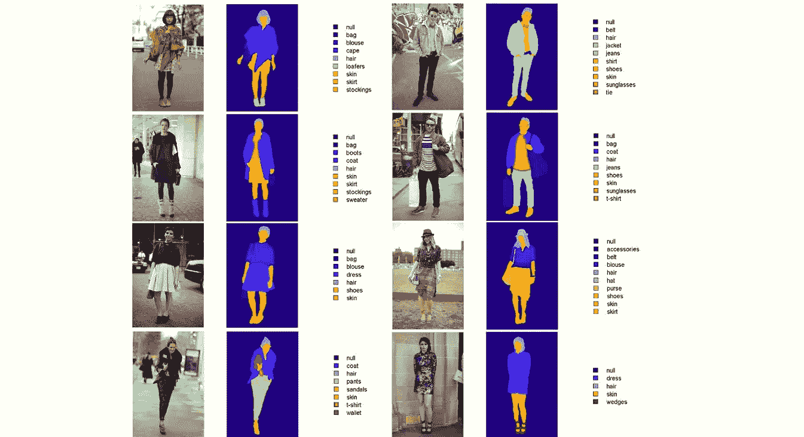
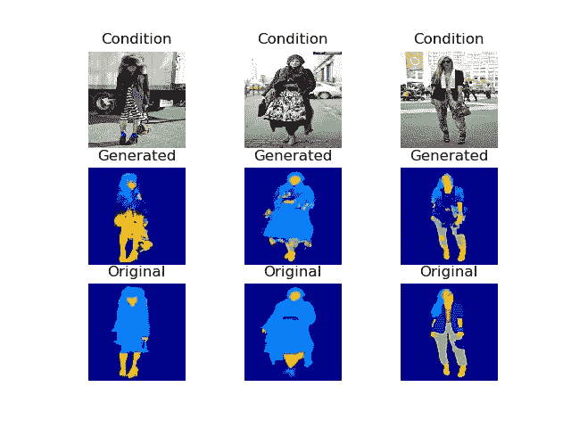
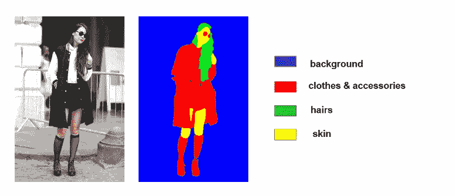
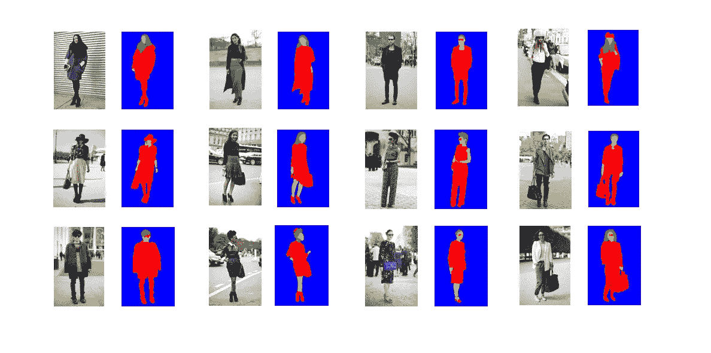
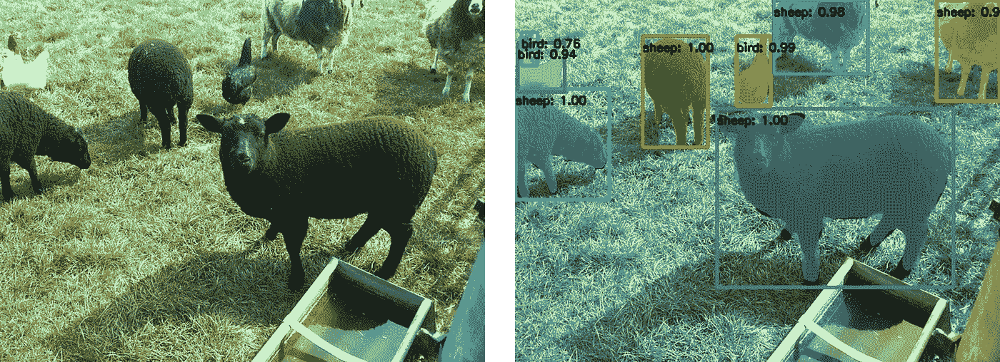
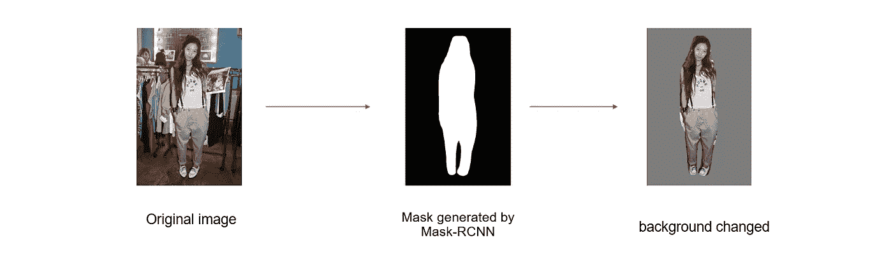
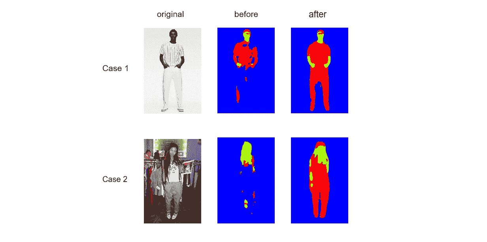
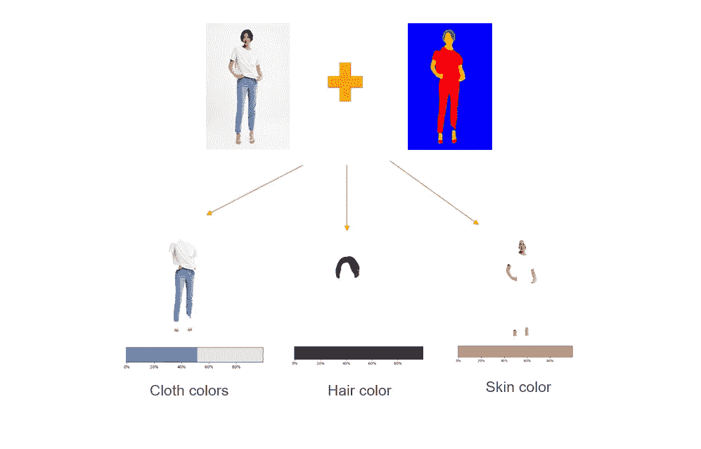

# 基于生成对抗网络的服装和颜色提取

> 原文：<https://towardsdatascience.com/clothes-and-color-extraction-with-generative-adversarial-network-80ba117e17e6?source=collection_archive---------12----------------------->

## 在这篇文章中，我将讨论使用生成对抗网络(GAN)从图像中提取衣服和颜色。

让我们简要回顾一下本文中使用的关键概念。

# **一些关键概念:**

**图像分割:**在计算机视觉中，图像分割是将数字图像分割成多个片段(像素组)的过程。分割的目标是将图像的表示简化成更有意义和更容易分析的东西。

细分过程中有两个粒度级别:

*   **语义分割** —对图像中的物体特征进行分类，并将像素集划分为与现实世界类别相对应的有意义的类别。
*   **实例分割** —识别图像中每个对象的每个实例，而不是像语义分割那样对每个像素进行分类。例如，它不是将九把椅子归类为一个实例，而是识别每把椅子(见下图)。

**Semantic Segmentation vs Instance Segmentation (**[**source**](/review-deepmask-instance-segmentation-30327a072339)**)**

**神经网络**是一种计算学习系统，它使用一个功能网络来理解一种形式的数据输入，并将其转换为所需的输出，通常是另一种形式。人工神经网络的概念是受人类生物学和人类大脑神经元共同运作以理解人类感官输入的方式的启发。

**生成对抗网络(GAN)** 是一种特定类型的神经网络(由[**Ian good fellow**](https://en.wikipedia.org/wiki/Ian_Goodfellow)及其同事于 2014 年发明)，由两个网络组成:生成器部分和鉴别器部分。在训练过程中，这些网络相互竞争，从而相互提高。训练过程从随机噪声开始，生成器从噪声中生成输出(因为输入是一些随机数据，所以初始输出也有噪声)。鉴别器将输出与来自数据集的数据进行比较，并意识到它与来自原始数据集的片段相差甚远，因此它向生成器返回否定结果。随着时间的推移，发生器根据从鉴频器收集的反馈产生更好的输出。最后，鉴别者发现很难理解生成器产生的输出是原始的还是伪造的。该训练过程的关键点是找到训练集的概率密度函数，并使用该函数生成数据集中不存在的新片段。

GAN 有许多有趣的应用:文本到图像，图像到图像的翻译，图像分辨率增强，检测假画，假面生成器(NVIDIA)等。

在这篇文章中，我将重点介绍图像到图像的翻译。

# 服装分割模型

对于训练过程我已经使用了[**服装公司解析(CCP)数据集**](https://github.com/bearpaw/clothing-co-parsing) 其中包含:

*   2，098 张高分辨率街头时尚照片，共 59 个标签
*   各种各样的风格、配饰、服装和姿势
*   所有图像都带有图像级注释
*   1000 多张图像带有像素级注释

**Clothing Co parsing dataset**

出于训练目的，仅使用 1000 个逐像素分割的图像。作为一个网络模型，我在 Keras 中使用了 GAN 的 pix2pix 实现，来自下面的 repo [**source**](https://github.com/eriklindernoren/Keras-GAN/tree/master/pix2pix) 。我稍微修改了一下初始代码。模型的输入/输出大小为 256x256(输入图像分辨率)。为了更好的质量，我把这个尺寸改成了 512x768。

我为什么决定使用 GAN 网络？分割任务也可以由 CNN 来完成。但与 CNN 相比，GAN 模型可以从数据缺乏中学习，并产生更好的结果。在训练过程中，生成器从训练集中看到原始图像及其成对的逐像素分割版本。

首先，我尝试用原始的 CCP 数据集训练网络，这意味着 59 个类。实验失败了，因为不同类型的衣服在数据集中的分布是不同的，并且训练集包含每个类的少量实例。比如裤子/裤子的数量在 400 左右，而 t 恤的数量不到百件。因此，不平衡的小数据集导致推理模式下分割质量差。然后我尝试将一些类别合并在一起(裤子/长裤/牛仔裤，所有类型的鞋子，所有类型的包包等等。).这一步将类的数量减少到了 29 个，但是分割的质量仍然不尽如人意。

**Segmentation results for 29 classes**

最后，我成功地建立了“四类”模型:背景、皮肤、头发以及人身上的所有衣服和配饰。这种数据集是平衡的，因为训练集中的所有图像都包含所有四个类的实例(几乎所有图像都有头发)。该模型为 1k 图像训练了 3000 个历元。

Sample image from dataset for “four classes”

在用数百张图像进行推理模式测试时，我意识到该模型对背景很敏感:非模糊背景的输入图像，衣服和背景具有相似的颜色。这些都是失败的例子。对于人工神经网络模型，失败的情况是正常的，因为它不像人脑那样学习东西。因为网络从形状、颜色和许多对人类来说不明显的特征中学习，我们不能肯定地预测它在不同情况下会如何工作。

Left couple: background is not blurred, right couple: background is similarly colored to clothes

但是我们的模型对于背景模糊的图像非常有效:

Positive results

那么如何才能解决这个问题呢？我尝试手动将原始图像的背景替换为纯色，并意识到使用这种输入，模型会产生更好的结果。但是这项工作如何实现自动化呢？面罩-RCNN 来救援了！

**Mask R-CNN** 是对象检测算法 fast R-CNN 的扩展，增加了一个额外的 Mask 头。额外的蒙版头允许我们按像素分割每个对象，也可以在没有任何背景的情况下单独提取每个对象。

A sample mask R-CNN output trained on COCO-dataset ([source](https://medium.com/@fractaldle/mask-r-cnn-unmasked-c029aa2f1296))

我要用 mask-RCNN 模型生成的一个 Mask(针对一个人)。

我在 keras 中使用了以下 mask-rcnn 的实现: [**来源**](https://github.com/matterport/Mask_RCNN)

因此，在将输入图像输入到我们的模型之前，预处理工作已经完成。首先，使用 Mask-RCNN 模型及其产生的掩模从输入图像中分割出人。有了这个遮罩，我们可以用纯色替换所有不属于这个人的像素。在我们的例子中，它是灰色的。我尝试了 3 种颜色(黑色、白色、灰色)作为背景，只有灰色通过了测试(我不清楚为什么会这样，这太神奇了！希望很快找到答案)。

因此，不是将原始图像提供给模型，而是提供背景改变的版本作为输入。

From left to right: original image, segmentation result by our model, result after preprocessing with Mask-RCNN model. (case1 image [source](https://www.zara.com/ie/en/vertical-stripe-t-shirt-p00722426.html))

# 模型用例

到目前为止一切顺利。但是我们如何使用这些按像素分割的图像呢？

可以从图像中裁剪出衣服，除此之外还可以得到衣服的主色，以及皮肤和头发的颜色。从分割的图像中对不同类别的分割过程是通过颜色阈值处理来完成的，因此我们得到它们的掩模。为此，我使用了 HSV(色调、饱和度、值)颜色空间。我们使用这个空间而不是 RGB 的原因是因为 HSV 空间描述颜色的方式与人眼感知颜色的方式相似。在 RGB 颜色空间中，所有三个分量都与颜色光相关，但是在 HSV 空间中，色调变化相对小于外部闪电的变化。例如，两种红色可能具有相似的色调值，但 R、G 和 B 值完全不同。

Use-cases of model result ([image source](https://www.zara.com/uk/en/t-shirt-with-contrast-pocket-p01165176.html))

**参考文献:**

https://missing link . ai/guides/神经网络-概念/实例-分割-深度学习/

[https://deepai . org/machine-learning-glossary-and-terms/neural-network](https://deepai.org/machine-learning-glossary-and-terms/neural-network)

[https://medium . com/@ fractal dle/mask-r-CNN-un mask-c 029 aa 2f 1296](https://medium.com/@fractaldle/mask-r-cnn-unmasked-c029aa2f1296)