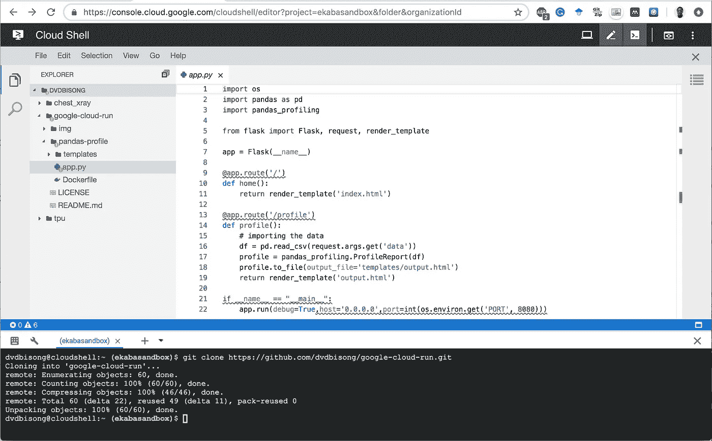

# 云运行:通过 HTTP 请求的数据集摘要

> 原文：<https://towardsdatascience.com/cloud-run-dataset-summaries-via-http-request-9b5fe24fe9c1?source=collection_archive---------38----------------------->

## 使用熊猫轮廓


Google Cloud Run 为运行无状态容器提供了一个托管平台。随着计算基础架构得到管理，它可以自动扩展以响应用户流量的增加。云运行服务通过 HTTP 请求或异步事件(如发布/订阅消息)接收 web 流量。这个项目使用 Cloud Run 来运行一个无状态容器，该容器使用 Pandas profiling 来显示结构化 CSV 数据集的汇总统计信息。CSV 文件通过 HTTP 请求传递给容器。**首先，启动 Google Cloud Shell 实例，通过运行:** `git clone [https://github.com/dvdbisong/google-cloud-run.git](https://github.com/dvdbisong/google-cloud-run.git.)` [**来拉资源库。**](https://github.com/dvdbisong/google-cloud-run.git.)

# 目录

*   [云运行:使用 Pandas Profiling 的数据摘要](https://medium.com/p/9b5fe24fe9c1#0341)
*   [申请代码](https://medium.com/p/9b5fe24fe9c1#15b2)
*   [创建容器图像](https://medium.com/p/9b5fe24fe9c1#a1b8)
*   [使用云构建构建映像，并上传到容器注册表](https://medium.com/p/9b5fe24fe9c1#b782)
*   [使用云运行部署容器](https://medium.com/p/9b5fe24fe9c1#6fc6)
*   [在谷歌云存储上公开数据集](https://medium.com/p/9b5fe24fe9c1#3913)
*   [检索数据集摘要](https://medium.com/p/9b5fe24fe9c1#5344)
*   [结论](https://medium.com/p/9b5fe24fe9c1#f4b2)

# 应用程序代码

文件`app.py`中的应用程序代码包含使用 Flask web 框架编写的 Python 代码，该框架通过路径`/profile`在端口 8080 上通过 HTTP 接收结构化的(格式良好的)CSV 文档，并返回包含数据集摘要分析的网页。数据集汇总统计数据是用`pandas-profiling`包生成的。代码在`pandas-profile`目录下，可以在**谷歌代码编辑器(云壳的一个组件)上查看。**



View the app.py file on Google Code Editor (Cloud Shell).

# 创建容器图像

docker 文件概述了创建容器映像的方法。对于这个项目，我们将基于官方 Python 映像构建 docker 文件。Dockerfile 指定了构建映像时要安装在容器上的相关包。**使用谷歌代码编辑器，**导航至`pandas-profile`查看 docker 文件。


View the Dockerfile on Google Code Editor (Cloud Shell).

为了完整起见，下表总结了 docker 文件中使用的命令。

```
+------------+-----------------------------------------------------+
| **Command**    | **Description** |
+------------+-----------------------------------------------------+
| **FROM**       | The base Docker image for the Dockerfile.           |
| **RUN**        | It execute commands on top of the current image as  |                              |              new layers.                                         |
| **COPY**       | Copies files from the local machine to the          |
|              container filesystem.                               |
| **CMD**        | Specifies the command to execute when running the   |   |              container. This command is overridden if another    |   |              command is specified at runtime.                    |
| **WORKDIR**    | Set working directory of the container.             |
| **ENV**        | Set Environment variable as a key-value pair that   | |              will be available in the container after building.  |
+------------+-----------------------------------------------------+
```

# 使用云构建构建映像，并上传到容器注册中心

Cloud Build 是一项 GCP 服务，用于自动化代码工件的部署，作为 CI/CD 管道的一部分。这里，Cloud Build 用于构建 Docker 映像，作为一系列构建步骤，完成的映像被推送到 Google 容器注册表。以下代码使用云构建构建映像，并将映像上传到容器注册。从目录`pandas-profile`运行这段代码。

`gcloud builds submit --tag gcr.io/ekabasandbox/dataset-profile`

其中，
- `ekabasandbox`为 GCP 项目 ID，
- `dataset-profile`为图像名称。
确保根据需要修改这些参数。


Building Image with Cloud Build.

要查看 Google 容器注册表上的图像，请运行以下代码:

`gcloud container images list`

# 使用云运行部署容器

下一步将把映像部署到 Cloud Run 并运行容器。使用下面的代码部署到云运行。选择部署托管云运行计算的区域(最好是`us-central1`)。当提示输入服务名时，接受缺省值，并响应`y`以允许未经身份验证的调用。

`gcloud beta run deploy --image gcr.io/ekabasandbox/dataset-profile --platform managed --memory 2Gi`

当容器被部署时，我们得到消息:

`Service [**dataset-profile**] has been deployed and is serving traffic at [**https://dataset-profile-4fa5lgaxpq-uc.a.run.app**](https://dataset-profile-4fa5lgaxpq-uc.a.run.app/)`

打开服务 URL 以查看部署的容器。


Home Page of Deployed Application Container.

# 在 Google 云存储上公开数据集

我们将作为 HTTP 请求传递给 Cloud Run 上的应用程序的数据集存储在 Google 云存储中。对于此项目，通过编辑对象权限使数据集可公开访问。添加一个新的名称设置为`allUsers`的`User`实体。


Make Dataset on GCS publicly available.

# 检索数据集摘要

要使用`pandas profiling`检索数据集摘要，将公共数据集 URL 从 Google 云存储传递到路径`/profile`并获取变量`data`。放在一起我们就有了 URL `[https://dataset-profile-4fa5lgaxpq-uc.a.run.app/profile?data=https://storage.googleapis.com/ekaba-test-data/crypto-markets-1.csv](https://dataset-profile-4fa5lgaxpq-uc.a.run.app/profile?data=https://storage.googleapis.com/ekaba-test-data/crypto-markets-1.csv)`。


Dataset Summary with Pandas Profile.

# 结论

本文提供了在 Cloud Run 上构建和部署无状态容器化应用程序的演练。在本例中，我们使用 Python `pandas-profiling`包实现了一个简单的应用程序，为结构化 CSV 数据集生成探索性数据分析输出。像这样的应用程序使得用最少的努力理解更多关于数据集的信息变得非常容易。最后，确保删除云运行服务，以及云容器注册表中不再需要的图像。