# 聚类分析:创建、可视化和解释客户群

> 原文：<https://towardsdatascience.com/cluster-analysis-create-visualize-and-interpret-customer-segments-474e55d00ebb?source=collection_archive---------1----------------------->

## 客户细分

## 探索聚类分析的方法，通过降维使聚类可视化，通过探索有影响力的特征来解释聚类。

虽然我们已经看到大量有监督的机器学习技术在组织中使用，但这些方法通常都有一个大问题；对标记数据的需求。幸运的是，有许多无监督的方法可以将数据聚类到以前看不到的组中，从而从您的客户中提取新的见解。

本文将指导您了解客户聚类的细节。请注意，我不仅会向您展示您可以使用哪个 sklearn 软件包，更重要的是，**如何使用它们以及需要注意什么。**

和往常一样，[数据](https://www.kaggle.com/blastchar/telco-customer-churn/)相对简单，你可以跟着笔记本[到这里](https://github.com/MaartenGr/CustomerSegmentation)。它包含来自电信公司的客户信息，通常用于预测客户流失:

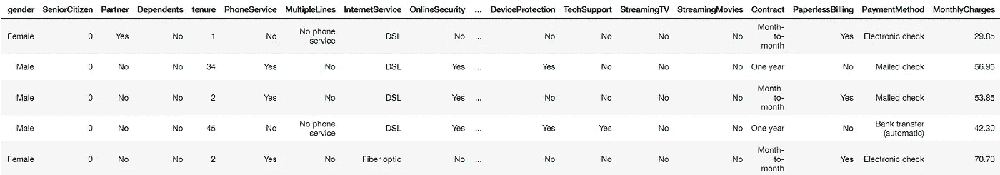

# 聚类算法

有许多无监督聚类算法，尽管它们在某些情况下各有所长，但我将讨论两种常用的算法。

## k 均值聚类

根据我的经验，这是目前最常用的数据聚类算法。k-Means 从选择你可以自己设定的随机中心开始。然后，所有数据点都根据它们的欧几里德距离被分配到最近的中心。接下来，计算新的中心并更新数据点(见下面的 gif)。这个过程一直持续到聚类在迭代之间没有变化。

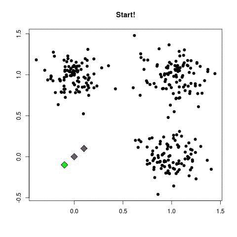

*An animation demonstrating the inner workings of k-means — Courtesy: Mubaris NK*

在上面的例子中，三个聚类中心开始时彼此非常接近。这通常不是很好，因为它将很难找到集群。相反，您可以使用 *k-means++* 来改进中心的初始化。它从一个初始中心开始，并确保所有后续中心都足够远。这优化了中心的选择和创建。

然后，您可以使用所谓的**肘**方法来确定最佳的 *k* 簇。当选择一系列聚类时，您希望找到收益递减点。您可以通过在 X 轴上绘制聚类数，在 Y 轴上绘制惯性(类内平方和标准)来实现这一点。然后选择 *k* 来找到折弯:

```
import seaborn as sns
import matplotlib.pyplot as plt
from sklearn.cluster import KMeansscores = [KMeans(n_clusters=i+2).fit(df).inertia_ 
          for i in range(10)]
sns.lineplot(np.arange(2, 12), scores)
plt.xlabel('Number of clusters')
plt.ylabel("Inertia")
plt.title("Inertia of k-Means versus number of clusters")
```

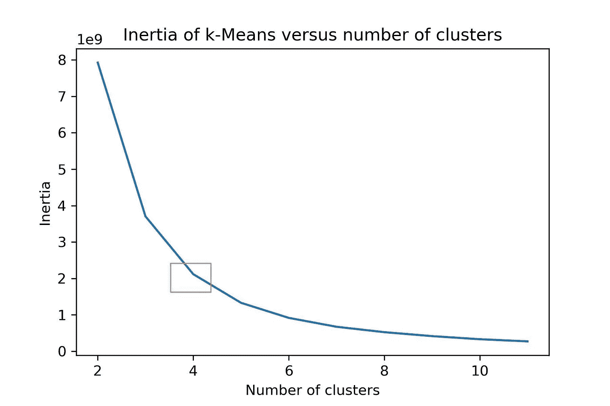

你可以看到橙色广场的转弯处。因此，我们选择 k=4 个使用 k-均值生成的聚类。

需要注意的一点是，由于 k-Means 通常使用欧几里德距离来计算距离，由于维数灾难，它在高维数据集上工作得不好。这个诅咒在某种程度上说明了高维空间中的欧几里德距离没有什么意义，因为它们通常非常接近。

我们使用的数据有点高维，因为我们有 27 个特征。

一个解决方案是使用**余弦距离**，它在高维空间中工作得更好。因为余弦距离和欧几里德距离对于归一化向量是线性连接的，所以我们可以简单地归一化我们的数据。

```
from sklearn import preprocessingnormalized_vectors = preprocessing.normalize(df)
scores = [KMeans(n_clusters=i+2).fit(normalized_vectors).inertia_  
          for i in range(10)]
sns.lineplot(np.arange(2, 12), scores)
plt.xlabel('Number of clusters')
plt.ylabel("Inertia")
plt.title("Inertia of Cosine k-Means versus number of clusters")
plt.savefig("intertia_cosine_kmeans.jpg", dpi=300)
```

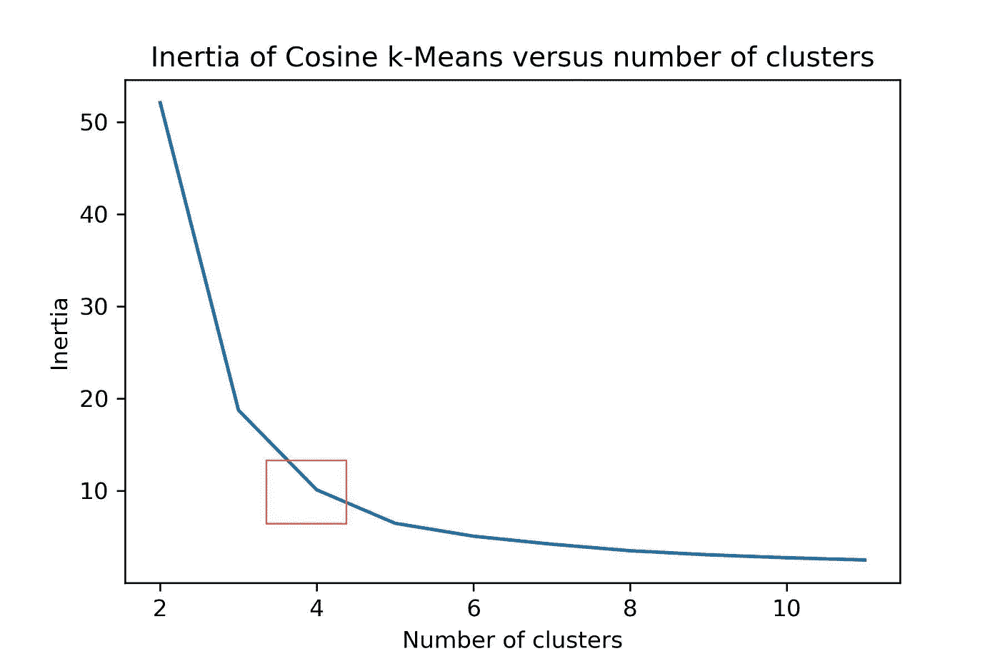

k-Means 在计算上非常昂贵。这种方法的更快速的替代方法是*微型批次装置*和*桦木*。这两种方法都可以更快地生成聚类，但是这些聚类的质量通常低于 k-Means 生成的聚类。

## 基于密度的噪声应用空间聚类

聚类也可以基于数据点的密度来完成。一个例子是基于密度的带噪声应用的空间聚类(DBSCAN ),如果数据点足够密集，它就对数据点进行聚类。DBSCAN 通过扫描邻域来识别集群并扩展它们。如果它找不到任何可以添加的点，它就简单地移动到一个新的点，希望它能找到一个新的集群。任何缺少足够的邻居进行聚类的点都被归类为噪声:

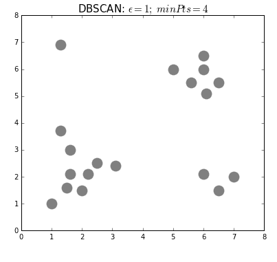

*An animation demonstrating the inner workings of DBSCAN — Courtesy:* dashee87

k-means 的不同之处在于，DBSCAN 不要求您指定聚类数。DBSCAN 的两个主要参数是构成聚类的最小点数(`minPts`)和邻域的大小(`eps`)。

你通常不希望`minPts`很小，因为会产生噪声簇。根据经验，最好至少将`minPts`设置为数据中的要素数。`eps`有点难以优化，可能需要 k 距离图来找到正确的值。使用小值通常是首选。

DBSCAN 的替代方案是光学器件，其性能与 DBSCAN 相似，但不需要明确设置`eps`。

# 评估集群

下一步是执行实际的聚类，并尝试解释聚类的质量及其内容。

## 剪影分数

要开始评估集群，您首先需要了解构成一个好的集群的要素。尽管存在许多定义和方法来评估聚类，但最常用的方法之一是计算所谓的轮廓得分。

轮廓分数基于聚类之间和聚类内的距离来度量聚类之间的可分性。它为每个样本计算平均类内距离(`**a**`)和平均最近类距离(`**b**`)，前者是类内的平均距离，后者是样本和它不属于的最近类之间的距离。那么，一个样本的轮廓系数就是`**(b - a) / max(a, b)**`。

让我们计算前面提到的所有方法的轮廓分数:

```
from sklearn.metrics import silhouette_score# Prepare models
kmeans = KMeans(n_clusters=4).fit(df)
normalized_vectors = preprocessing.normalize(df)
normalized_kmeans = KMeans(n_clusters=4).fit(normalized_vectors)
min_samples = df.shape[1]+1 
dbscan = DBSCAN(eps=3.5, min_samples=min_samples).fit(df)# Print results
print('kmeans: {}'.format(silhouette_score(df, kmeans.labels_, 
                                           metric='euclidean')))
print('Cosine kmeans:{}'.format(silhouette_score(normalized_vectors,
                                          normalized_kmeans.labels_,
                                          metric='cosine')))
print('DBSCAN: {}'.format(silhouette_score(df, dbscan.labels_, 
                                           metric='cosine')))
```

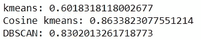

看到基于余弦的 k-Means 优于 k-Means 并不奇怪，因为我们在数据中有大量的特征(27)。有趣的是，DBSCAN 同样表现出色。

然而，尽管客观的测量是首选的，我相信当涉及到无监督聚类时，直观地检查聚类是评估它们的最好方法之一。千万不要盲从客观的衡量标准。确保你总是检查到底发生了什么！

因此，接下来是在 2d 和 3d 中可视化集群的方法。

# 可视化集群

为了可视化聚类，可以使用最流行的降维方法之一，即主成分分析和 t-SNE。

## 主成分分析

PCA 的工作原理是使用正交变换将相关要素转换为一组线性不相关要素的值。剩下的是包含最大可能方差的特征。要深入了解 PCA，请参见[这篇](/a-step-by-step-explanation-of-principal-component-analysis-b836fb9c97e2)文章。

然后我们可以在 3d 中可视化我们的数据:

```
pca_df = prepare_pca(2, df, normalized_kmeans.labels_)
sns.scatterplot(x=pca_df.x, y=pca_df.y, hue=pca_df.labels, 
                palette="Set2")
```

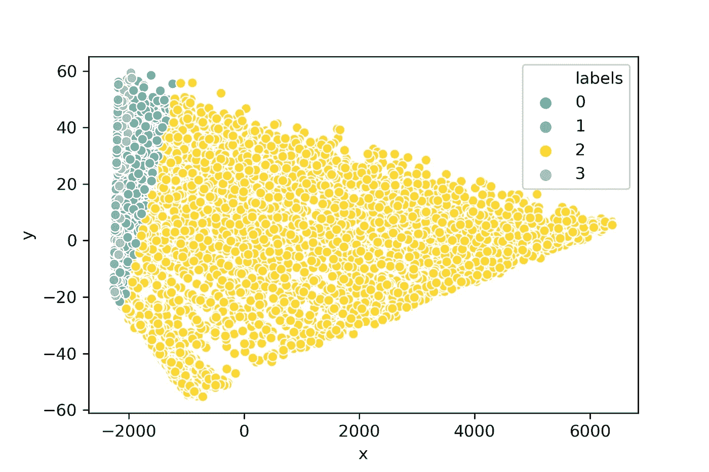

尽管 PCA 可能已经成功地降低了数据的维数，但它似乎不能非常直观地可视化聚类。高维数据经常出现这种情况，它们通常聚集在同一点周围，PCA 提取该信息。

相反，我们可以使用一种称为 t-SNE 的算法，这种算法专门用于创建数据的直观表示/可视化。

## t 分布随机邻居嵌入(t-SNE)

t-SNE 是一种用于可视化高维数据的算法。它使用点之间的局部关系来创建低维映射，这导致捕获非线性结构。

它从创建概率分布(即高斯分布)开始，该概率分布规定了相邻点之间的关系。然后，它使用学生 t 分布构建一个尽可能接近该分布的低维空间。现在你可能想知道为什么它在这一步使用了学生 t 分布。嗯，高斯分布有一个短尾巴，把附近的点挤压在一起。如果使用学生 t 分布，则尾部更长，点更容易分离。

让我们在 3d 中实现 t-SNE，看看我们是否能更好地可视化集群:

```
tsne_3d_df = prepare_tsne(3, df, kmeans.labels_)
tsne_3d_df['normalized_kmeans'] = normalized_kmeans.labels_
tsne_3d_df['dbscan'] = dbscan.labels_plot_animation(tsne_3d_df, 'kmeans', 'kmeans')
plot_animation(tsne_3d_df, 'normalized_kmeans', 'normalized_kmeans')
plot_animation(tsne_3d_df, 'dbscan', 'dbscan')
```

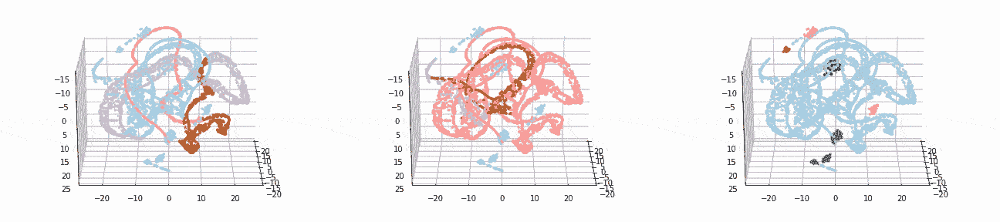

Euclidean k-Means (LEFT), Cosine k-Means (MIDDLE), DBSCAN, (RIGHT)

t-SNE 为数据提供了更加直观的可视化表示。从动画中可以看出，余弦 k 均值和 DBSCAN 似乎都创建了逻辑聚类。

# 解释集群

现在，我们已经对客户进行了细分，如果我们知道每个集群的独特之处就好了。这将帮助我们了解我们拥有哪些类型的客户。

一种方法是简单地绘制所有变量，并查看聚类之间的差异。然而，这种方法在处理 10 个以上的变量时会失败，因为它很难可视化和解释:

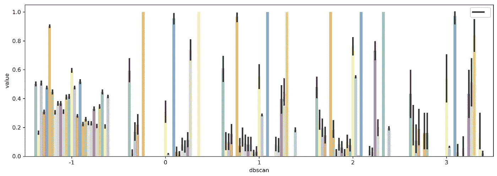

解决方案是选择一个变量子集，在一定程度上，这些变量在定义集群时很重要。我想在这里演示两种方法，即平均组之间的方差和通过预测建模提取特征重要性。

## 变量内和聚类间的方差

在群集任务中变量重要性的一个假设是，如果按群集排序的变量的平均值彼此之间显著不同，则该变量在创建群集时可能是重要的。

我们首先根据生成的聚类汇总数据，并检索每个变量的平均值:

```
from sklearn.preprocessing import MinMaxScalerscaler = MinMaxScaler()
df_scaled = pd.DataFrame(scaler.fit_transform(df))
df_scaled['dbscan'] = dbscan.labels_df_mean = (df_scaled.loc[df_scaled.dbscan!=-1, :]
                    .groupby('dbscan').mean())
```

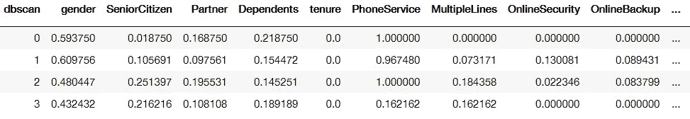

Groupby of clusters generated by DBSCAN averaged per variable

我忽略了-1 簇，因为它被 DBSCAN 定义为噪声。为了便于可视化，数据在 0 和 1 之间缩放。

接下来，我简单地计算每个变量内聚类之间的均值方差，并选择方差最大的前 7 个变量:

```
results = pd.DataFrame(columns=['Variable', 'Var'])
for column in df_mean.columns[1:]:
    results.loc[len(results), :] = [column, np.var(df_mean[column])]
selected_columns = list(results.sort_values(
        'Var', ascending=False,
    ).head(7).Variable.values) + ['dbscan']tidy = df_scaled[selected_columns].melt(id_vars='dbscan')
sns.barplot(x='dbscan', y='value', hue='variable', data=tidy)
```

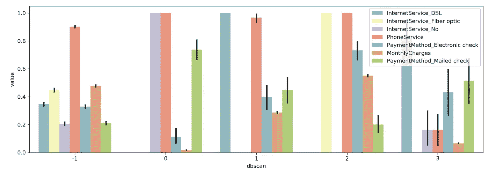

您现在可以更清楚地看到集群之间的差异。例如，在群集 0 中，您可以看到每个人都没有互联网服务，而大多数其他群集包含有互联网服务的人。此外，我们可以看到，集群 2 仅包含同时拥有光纤和电话服务的人，这意味着这些服务要么是一起购买的，要么是同一套餐。

**注意**:我没有考虑标准偏差、偏斜度和峰度，这些在比较变量时很重要。上面的方法只是选择变量的第一步。

## 随机森林特征选择

最后，我们可以使用聚类作为目标变量，然后应用随机森林来了解哪些特征在聚类的生成中是重要的。这种方法需要更多的工作，因为您必须检查模型的准确性，以准确提取重要的特征。

在本例中，我将跳过这一步，因为我们正在处理不平衡的目标和多个类:

```
from sklearn.ensemble import RandomForestClassifier
X, y = df.iloc[:,:-1], df.iloc[:,-1]
clf = RandomForestClassifier(n_estimators=100).fit(X, y)data = np.array([clf.feature_importances_, X.columns]).T
columns = list(pd.DataFrame(data, columns=['Importance', 'Feature'])
           .sort_values("Importance", ascending=False)
           .head(7).Feature.values)tidy = df_scaled[columns+['dbscan']].melt(id_vars='dbscan')
sns.barplot(x='dbscan', y='value', hue='variable', data=tidy)
```

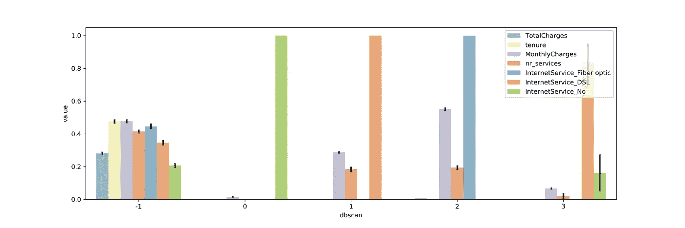

我们可以看到，与我们之前进行的方差分析相比，选择了相似的特征。由于这种方法需要更多的验证工作，我建议使用前面描述的方差法。

# 感谢您的阅读！

希望本文能帮助您理解聚类算法背后的原理，最重要的是如何应用它们。

如果你像我一样，对人工智能、数据科学或心理学充满热情，请随时在 [LinkedIn](https://www.linkedin.com/in/mgrootendorst/) 上添加我，或者在 [Twitter](https://twitter.com/MaartenGr) 上关注我。

有代码的笔记本可以在这里找到。