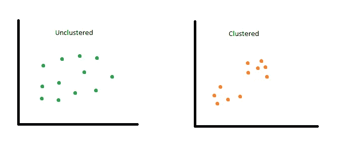
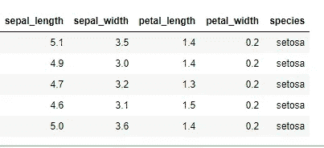
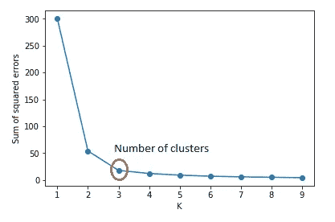
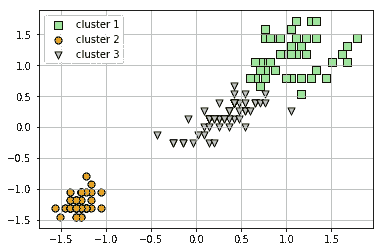

# 聚类分析:无监督算法的理论和实现

> 原文：<https://towardsdatascience.com/cluster-analysis-theory-and-implementation-of-unsupervised-algorithms-87823c4c5e03?source=collection_archive---------21----------------------->

## 包括 k-means、分层和 DBSCAN 的优缺点


Photo by [Arnaud Mariat](https://unsplash.com/@arnaudmariat?utm_source=medium&utm_medium=referral) on [Unsplash](https://unsplash.com?utm_source=medium&utm_medium=referral)

简单地说，聚类就是根据某些属性分离观察值。用更专业的术语来说，聚类是一种无监督的机器学习算法，是一种将观察值(数据)以相似的观察值彼此更接近的方式分组的过程。这是一种“非监督”算法，因为与监督算法(如随机森林)不同，你不必用标记的数据来训练它，而是将你的数据与一些指令(如你想要的聚类数)一起放入“聚类机器”，机器将找出其余的，并根据底层模式和属性对数据进行聚类。

李·RCT(1981):

> 聚类分析是一种新发展起来的面向计算机的数据分析技术。它是许多研究领域的产物:统计学、计算机科学、运筹学和模式识别。



What does it mean for data to be clustered?

本文的目的是强调一些行业应用，并讨论最常用的聚类算法的优缺点。在第二部分中，我将演示 K-means 聚类的一个实现，作为 Python 环境中的一个例子。**最后，我将为数据科学家留下一些额外的技术笔记。**

## 行业应用

为什么聚类在统计学和机器学习领域如此受欢迎？这是因为在广泛的商业应用案例中，聚类分析是一种强大的数据挖掘工具。这里只是众多应用中的几个:

*   **探索性数据分析(EDA)** :聚类是最基本的数据分析技术的一部分，用于理解和解释数据，并开发对数据特征和模式的初步直觉。
*   **统计分析**:常用于识别同一变量在不同样本中的(不)相似性(如 A 城市*vs*B 城市儿童的数学成绩)。
*   **城市规划**:集群有助于识别具有相似特征的家庭和社区，以实施适当的社区发展政策。
*   **异常检测:**保险行业使用聚类来识别异常和潜在的欺诈交易。
*   **客户细分:**聚类广泛用于开发营销策略，例如，针对不同类别的客户进行不同种类的促销。
*   **计算机视觉**:在计算机视觉/图像分割中，聚类用于根据模式识别过程将数据划分为不相交的组。
*   **在生物学中**:聚类是遗传学和分类学分类以及理解现存和灭绝生物进化的基本工具。
*   **和许多其他的**:聚类有广泛的其他应用，如建筑推荐系统、社会媒体网络分析、土地利用分类中的空间分析等。

## 许多不同的聚类算法

聚类算法家族有几种变体:K-means、hierarchical、DBSCAN、spectral、gaussian、birch、mean shift 和 affinity propagation 就是其中的一些。下面，我将重点介绍前三种算法的一些要点，它们是最常用的算法。

**K-表示**:首先，“ *K* 表示你想要的集群数。也就是说， *K = n* 表示要识别的聚类的数量 *n* 。还有一种叫做“质心”的东西，它是一个假想的/人为的数据点(数据点的平均值)，每个数据聚类都围绕着它进行分区。因此 *K = 2* 意味着该算法将把观测值(数据)分成两个群，使得质心和观测值之间的距离最小化。

> 优点:*简单易懂，易于实现*
> 
> 缺点:*有时难以选择*K*；离群值可以在它们的方向上拖动质心；缩放数据可以改变群集*

**层次聚类:**层次聚类以两种不同的方式工作:第一种称为“自下而上”或聚集聚类，其中每个观察值得到自己的聚类，然后每对聚类合并在一起形成另一个聚类，以此类推。另一个(*又名*)。“自上而下”或分裂聚类)的工作方向相反，*即*，所有的观测值都是从一个集群开始，然后重复划分成更小的集群大小。

> 优点:*易于实现；通过查看树状图，很容易确定聚类的数量；比 K-均值聚类更具信息量*
> 
> 缺点:*对异常值高度敏感；对于大型数据集可能非常耗时*

**DBSCAN:** [于 1996 年](https://citeseerx.ist.psu.edu/viewdoc/summary?doi=10.1.1.121.9220)提出，它是一种基于密度的算法，在给定最小点数的情况下，根据观测值彼此的接近程度对它们进行聚类。它需要两个参数:(I)*ε*(*ε*)—确定点应该在一个聚类中的半径；以及(ii) *minPts* —指定形成密集空间/聚类的最小点数。有趣的是，1996 年提出该算法的论文获得了 2014 年 KDD 大会的“[时间检验奖](https://www.kdd.org/News/view/2014-sigkdd-test-of-time-award)”。

> 优点*:与 K-means 和层次聚类不同，DBSCAN 在异常值存在的情况下是健壮的；因此可以用于异常(即异常值)检测。*
> 
> 缺点:i *t 对参数值比较敏感(* ε *和*min pts)；无法在变化的数据密度中正确识别任何群集。

# 5 步实施

实现聚类算法的整个过程非常简单，因为与其他受监督的机器学习算法相比，在过程和参数调整中需要较少的人工决策。在这一节中，我将使用`sklearn`库演示 Python 环境中的 K-means 集群实现。

**第一步。安装依赖关系**

基本上你需要三个库:`pandas`处理数据，`seaborn`可视化，`sklearn`输入预处理和建模。

```
# to import and work with data
import pandas as pd 
# to visualize data and results
import seaborn as sns
import matplotlib.pyplot as plt 
# to pre-process model inputs
from sklearn import preprocessing 
# clustering algorithm
from sklearn.cluster import KMeans
```

**第二步。数据**

我在这个演示中使用的数据是著名的 *iris* 数据集。我之所以选择这个数据集，是因为在散点图中可以很容易/直观地将聚类分开。

在许多情况下，导入数据后，您可能需要做一些处理，如编码分类变量等。还需要确保没有`NaN`价值观。

```
# import data
df = pd.read_csv("iris.csv")
df.head()
```



```
# select data
df = df[["petal_length", "petal_width"]]# see if there's NA values
df.isna().sum()
```

**第三步。准备模型输入**

选择数据集后，接下来以模型可以使用的方式预处理/格式化输入。在这个阶段会发生两件事:所选特征的标准化(减少数据的可变性)和将数据框转换成`numpy`数组。

```
# data normalization
df = preprocessing.scale(df)
df = pd.DataFrame(df)# input
import numpy as np
X = df.iloc[:, [0,1]].values
```

**第四步。确定集群数量**

在 K-means 算法中，你需要定义你想要的聚类数。所谓的“[肘法](https://en.wikipedia.org/wiki/Elbow_method_(clustering))可以通过最小化误差平方和来帮助确定。

```
##########################
# The "elbow" method #
##########################k_range = range(1,10)
sse = []
for k in k_range:
    km = KMeans(n_clusters = k)
    km.fit(X)
    sse.append(km.inertia_)plt.xlabel("K")
plt.ylabel("Sum of squared errors")
plt.plot(k_rng, sse, marker='o')
```



**第五步。模型实现**

一旦您在上一步中确定了唯一需要的参数，您就可以拟合模型，在二维图中可视化聚类数，并进一步分析以回答您正在寻找的研究问题。

```
# model
km = KMeans(n_clusters = 3)
y_km=km.fit_predict(X)# plot the 3 clusters
plt.scatter(
    X[y_km == 0, 0], X[y_km == 0, 1],
    s=50, c='lightgreen',
    marker='s', edgecolor='black',
    label='cluster 1'
)plt.scatter(
    X[y_km == 1, 0], X[y_km == 1, 1],
    s=50, c='orange',
    marker='o', edgecolor='black',
    label='cluster 2'
)plt.scatter(
    X[y_km == 2, 0], X[y_km == 2, 1],
    s=50, c='lightblue',
    marker='v', edgecolor='black',
    label='cluster 3'
)
```



```
# value counts in different clusters
frame = pd.DataFrame(X)
frame['cluster'] = y_km
frame['cluster'].value_counts()
```

# 数据科学家的技术笔记

1.  就像其他机器学习算法一样，如果有分类特征，就需要用数字特征编码。
2.  需要重申的是，聚类算法对尺度敏感，因为该算法使用欧几里德距离。因此，请确保输入数据经过适当的预处理。
3.  请注意，与监督分类实现不同，在监督分类实现中，模型首先被拟合，然后用于预测，在聚类中，模型拟合和预测一起发生(因此使用了`fit_predict())`
4.  如果您对 K-means 实现中的哪些有效哪些无效感兴趣，请查看这个 [StackOverflow 页面](https://stats.stackexchange.com/questions/133656/how-to-understand-the-drawbacks-of-k-means/133841#133841)。
5.  如果你对`rstat`感兴趣，你可以看看这个 [UC 商业分析](https://uc-r.github.io/kmeans_clustering)页面，里面有代码和一些有用的讨论。