# 群集地球仪

> 原文：<https://towardsdatascience.com/clustered-globe-e5c54b42de16?source=collection_archive---------22----------------------->

## Ep。3:将我们的活动分组到度假目的地

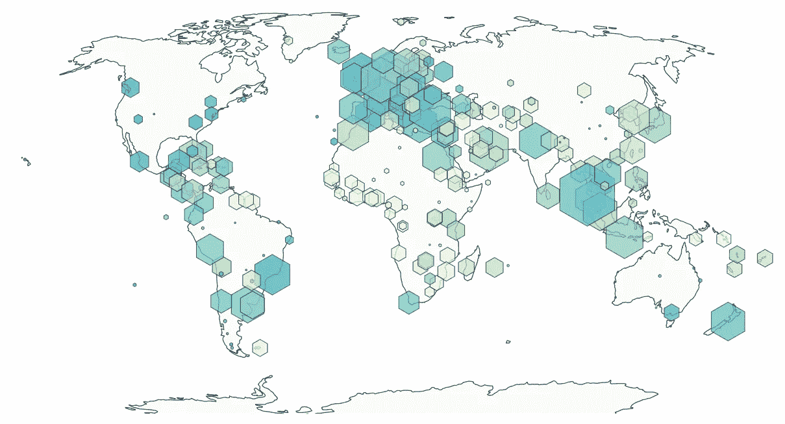

Our output today; clustered holiday destinations all over the globe; Read below for the clustering details

之前我们已经[测量了](/planet-beehive-aeca53ba0326)并且[分类了](/playground-earth-238f8253b030)我们的活动，现在我们有了一个粗略的想法，从我们的个人兴趣出发，什么是最好的活动。但是一个单一的活动值得我们稀缺的假期时间依赖它吗？在两周假期的其他日子里，我们应该告诉家人做什么？事实上，一项活动可能还不足以决定我们的下一个度假目的地。为了真正确定目的地，**我们必须确定彼此在合理旅行时间内的活动组**。换句话说:是时候对我们的地理数据进行聚类分析了！

> **聚类分析**或**聚类**是对一组对象进行分组的任务，使得同一组中的对象(称为**聚类**)彼此之间比其他组(聚类)中的对象更加相似(在某种意义上) *—维基百科*

# 我们的方法

1.  **探索**不同的**聚类算法**及其与我们的问题相关的优缺点
2.  **设置聚类过程中使用的约束和变量**(即距离、最小/最大活动等)。)
3.  **将聚类算法**应用于我们的数据，以每个活动和一个聚类之间的一对一关系进行存储
4.  **将我们的集群**可视化在地图上，**与我们的评分标准**相结合，能够对集群进行相互比较

# **数据**

我们今天进行聚类所需的数据是地理数据，即每个活动的经度和纬度。由于我们已经在[第 1 集](/planet-beehive-aeca53ba0326)中使用[谷歌地图的地理编码 API](https://developers.google.com/maps/documentation/geocoding/intro) 导出了这些数据，因此不再需要提取更多数据来完成我们的任务。

# 聚类算法

对数据应用任何聚类分析的最大缺陷是选择了错误的聚类算法。有许多具有不同属性的不同算法用于计算形成聚类的数据点组。每个问题都不一样，每个算法都会得出不同的结果。因此，无论何时开始聚类分析，重要的是从评估最常见的聚类算法的优缺点开始。不要对每个问题都应用你最熟悉的算法，因为它不一定能给你最优的解决方案。

在本文中，我不会深入讨论每种聚类算法，只分析哪种算法最适合我们的问题。为了更好地阅读这个主题，以及我们今天将要探索的算法，我向[推荐](/the-5-clustering-algorithms-data-scientists-need-to-know-a36d136ef68)[乔治·赛义夫](https://medium.com/u/e2af5c8737ec?source=post_page-----e5c54b42de16--------------------------------)的这篇文章。

我个人喜欢图表比较，所以作为第一步，在图 1 中，你会发现我们的问题的关键属性的非常简化的比较，对于以下算法: [K-Means](https://en.wikipedia.org/wiki/K-means_clustering) ， [Mean-Shift](https://en.wikipedia.org/wiki/Mean_shift) ， [DBSCAN](https://en.wikipedia.org/wiki/DBSCAN) ，[期望最大化](https://en.wikipedia.org/wiki/Expectation%E2%80%93maximization_algorithm)和[凝聚层次](https://en.wikipedia.org/wiki/Hierarchical_clustering)聚类。请注意:

*   仅比较解决我们问题的直接要求的特征(不比较许多其他聚类算法属性)。
*   如果您认为我们忽略了一个非常适合我们问题的基本聚类算法，请告诉我。

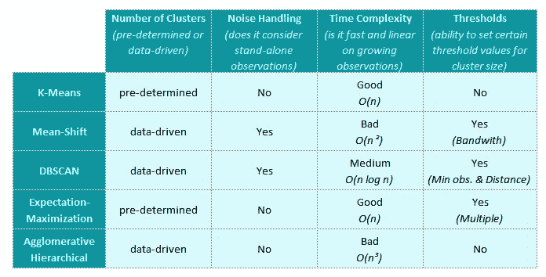

Fig. 1 Comparing our requirements against clustering algorithms

让我们逐一分解并解释我们的需求:

*   **聚类数:**一些聚类算法要求事先知道聚类数，然后将所有数据点分配给给定的聚类数。然而，在我们分析的这一点上，我们没有从我们的活动中得到的集群数量的有价值的估计。因此，我们正在寻找一种算法，从数据中推导出聚类数。*匹配算法:均值漂移、DBSCAN、凝聚分层*
*   **噪声处理:**并非所有的数据点都被认为是聚类的一部分。对于一些算法，最好在应用聚类之前从数据集中去除噪声，而其他算法有一种在过程中定义噪声的方法。在我们的例子中，我们不想删除噪音，而是希望标记它。我们可以在一个偏僻的地方举办一个很棒的独立活动，它不会是任何度假目的地的一部分，但仍然希望它被标记为离群目的地。为此，我们需要一个处理噪声的算法。*匹配算法:Mean-Shift，DBSCAN*
*   [**时间复杂度**](https://en.wikipedia.org/wiki/Time_complexity) **:** 在此阶段不太重要，因为我们只会以非常低的频率执行聚类，并且我们的数据集估计不会以非常快的速度增长。然而，如果我们的活动数据集确实增长了，并且一个 O(n)算法变得难以管理，我们仍然希望防止在以后的阶段不得不重构一切。在我们的例子中，我们的目标是尽可能获得最好的时间复杂度。从 O(n)算法(或更差的算法)我们认为聚类不适合我们的问题。*匹配算法:K 均值、期望最大化、DBSCAN*
*   **阈值:**一些聚类算法的性质提供了参数，利用这些参数来操纵聚类过程并为聚类边缘设置一些边界。这在我们的案例中非常重要，因为我们希望设置一些阈值，以确定在假日期间可管理的集群规模。例如，查看第 1 章中坐标上的散点图，很容易看出大多数聚类算法会将整个欧洲聚类在单个聚类中。很难在一个假期内完成。因此，我们需要能够设置一些指导原则，例如我们考虑形成单个集群的阈值。*匹配算法:均值漂移、DBSCAN、期望最大化*

在这五个选项中，只有 **DBSCAN** 聚类算法符合我们问题的所有条件(尽管在时间复杂度上仍然只能获得中等分数),最重要的是，它所需的参数非常适合我们想要的聚类。因此，我们将继续使用 DBSCAN，如果我们无法获得所需的聚类结果，我们可以继续探索亚军算法:均值漂移。

# **设置约束&变量**

首先，我们要设置我们要聚类的细节的边界。在这个阶段，我希望将各个国家分开，只将活动集中在一个国家内。因此，根据集群的性质，小国可能会成为一个单一的集群。尽管在*“真实世界”*中可能存在跨境度假目的地，但我们仍然能够在该过程的后续步骤中通过组合相邻集群来形成这些目的地。

此外，具体到 DBSCAN，我们必须定义两个**变量。**由于 DBSCAN 是一种基于密度的聚类算法，它需要一个 epsilon 和一个聚类的最小群体，以准确定义它应该寻找的密度。

***ε*:**在我们的例子中，我们可以使用这个ε变量来定义我们愿意在一个完整的假期内在活动之间旅行的距离范围。但是，由于距离将从坐标中提取，因此所需的实际输入值将是线性距离，而不是行驶距离。

让我们在这一点上非常务实，并说我们不想浪费一整天的时间开车去参加下一个假期活动，我们愿意覆盖的最大值大约是半天。假设它转换成 500 公里的最大量；考虑到[是 1.4 基准](https://www.ncbi.nlm.nih.gov/pmc/articles/PMC3835347/)，这将产生 357 km 的线性距离，我们将输入该距离作为初始ε变量。

***最小活动人口:*** 我们希望在单个集群中的最小活动数量与假期的实际持续时间直接相关(这将是稍后阶段的必需参数)。但是我们可以在执行算法的时候过滤活动的数量。因此，对于聚类过程，我们应该选择最少数量的活动来填充假期的最短持续时间。

我们要考虑的最短可能持续时间是一个周末假期。三天以及同等的最低活动量。自动意味着，如果在 epsilon 距离内只有两个或更少的活动，这些活动将被视为异常值，而不是任何度假目的地的一部分。

# 应用聚类算法

最后，是时候开始有趣的事情了，将 DBSCAN 聚类应用到我们的数据集。我们将使用 python 和 [scikit learn](https://scikit-learn.org/stable/modules/clustering.html) 集群包进行实际实现。

作为聚类的一个例子，我们将选择美国。一个主要活动分散在各地的大国:

Interactive Chart #1 All major activities in the USA in our data-set

现在让我们应用 DBSCAN 聚类算法，将 500 km 的旅行距离作为 epsilon 要求，将三个活动作为一个聚类中所需的最小人口。

集群名称以国家 ISO 代码开头，然后是该国家内的集群编号，最后是集群中的活动编号。请注意' *-1* '指的是离群值。

Interactive Chart #2 All major activities clustered into holiday destinations

这看起来更像是我们可以去的实际目的地。在这种情况下，聚类产生了 7 个目的地聚类:

*   *中东*有 27 项重大活动(从芝加哥到新奥尔良(！))
*   *东北部*有 26 项重大活动(从波斯顿到 DC)
*   *佛罗里达*有 22 项主要活动
*   *西南部*有 17 项主要活动(从洛杉矶到布鲁斯峡谷 NP)
*   *夏威夷群岛*有 5 大活动
*   *旧金山*有 4 大活动
*   *科罗拉多*有 3 大活动

另外 7 项活动没有进入任何类别，被视为异常值。一些精彩刺激的公路旅行！集群的大小在此时并不重要，因为这将在稍后阶段进行微调，届时假期将会开始起作用。

对变量如何影响聚类感到好奇？请参见下面的矩阵，其中有三个不同的行程距离作为ε变量(250、 **500** 和 700)和三个最低人口要求(1、 **3** 、5):

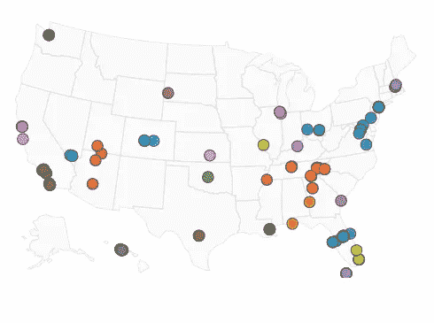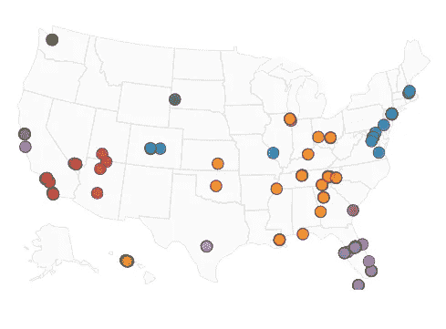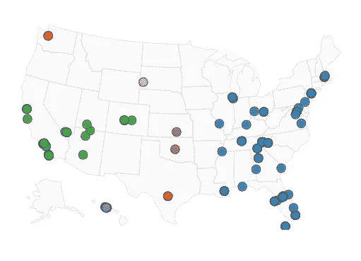

Minimum Population Requirement: 1 ; Travel Distance for Epsilon: 250, 500, 750 km respectively ; No outliers

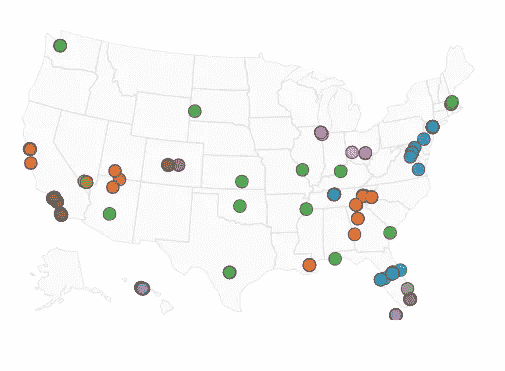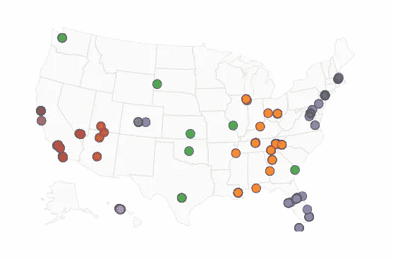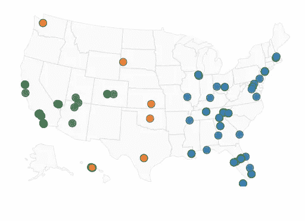

Minimum Population Requirement: **3**; Travel Distance for Epsilon: 250, **500**, 750 km respectively ; Outliers in green, green and orange respectively

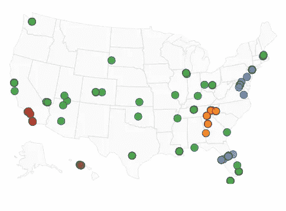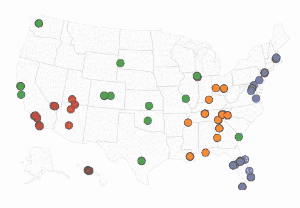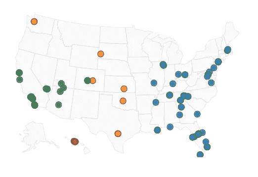

Minimum Population Requirement: 5; Travel Distance for Epsilon: 250, 500, 750 km respectively ; Outliers in green, green and orange respectively

总的来说，趋势很明显:移动距离越短，意味着聚类越多越小，离群值也越多。而更大的移动距离意味着更大的集群和更少的集群。此外，更少的最小总体意味着更少的异常值和更多的(小)聚类，而更高的最小总体自动导致更多的异常值和更少的聚类。

对于探索美国的度假目的地，我们对变量的选择(中间的一个)似乎是一个非常合理的结果；很好地平衡了聚类数、聚类大小和离群值的数量。

但是世界其他地方呢？让我们在下面的交互式图表中探索一下。一定要放大图片探索集群，在这些 **248** 不同的度假目的地中找到一颗宝石！

Interactive chart #3 All clustered activities globally created with plotly

按照我们的逻辑，许多较小的国家(因此基本上西欧和南欧的所有国家)将是每个国家一个集群(除了岛屿目的地)，但是较大的国家已经被很好地分成多个目的地。总的来说，这正是我们现阶段的目标；让我们能够开始分析目的地，而不是单一的活动。

# 添加分数并可视化

既然我们已经有了度假目的地，我们可以添加回我们在第 1 章中基于活动评论创建的评分标准。让我们从十大度假目的地及其主要城市(活动数量)开始:

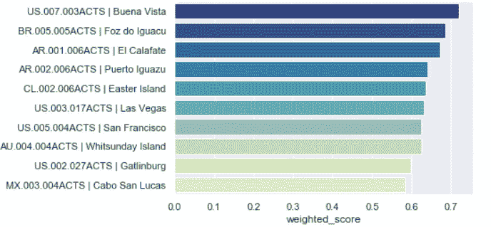

Chart #1 Top 10 cluster with their main city based on weighted scoring measure

好吧，看来我们一定要把科罗拉多放在我们遗愿清单的首位！有趣的是，在伊瓜苏瀑布附近的巴西和阿根廷，这两个国家都排在前 5 名。最后，复活节岛也是得分很高的度假目的地。可能不是第一个想到的地方？

最后，我们希望看到全球每个度假目的地的加权平均得分，就像我们在[第 1 章](/planet-beehive-aeca53ba0326)中列出所有活动一样。请注意，聚类的大小指的是包含的活动数量和评分标准的颜色填充的暗度(越暗越好):

Interactive chart #4 All our global clusters with their average score

今后，我们将把这些度假目的地作为我们的分析对象，不再详细讨论作为目的地的单一活动和/或国家。

感谢您阅读今天的文章，下次我们将解决 TSP 问题，并为每个目的地创建优化的道路旅行！

*关于我自己的更多信息请随时查看我的* [*LinkedIn*](https://www.linkedin.com/in/thijs-bressers-a793bb19)