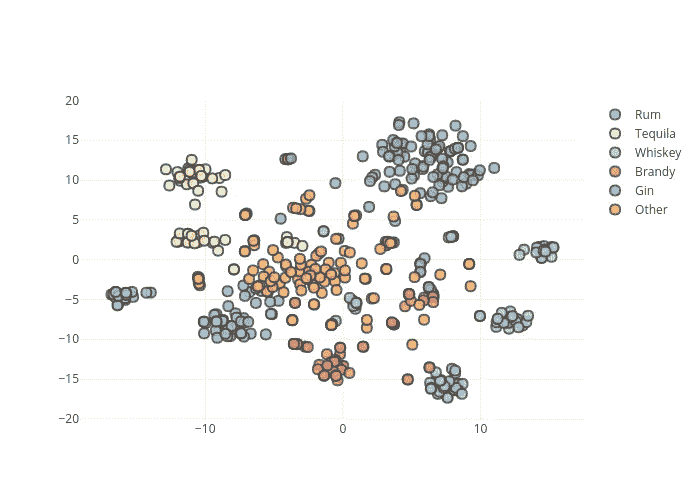

# 使用 t-SNE 和 Plotly 聚类人工智能生成的鸡尾酒配方

> 原文：<https://towardsdatascience.com/clustering-ai-generated-cocktail-recipes-using-t-sne-and-plotly-127300df43ba?source=collection_archive---------27----------------------->

## 让数据可以直观地探索

Scroll down for the interactive version!

最近，我[训练了](https://medium.com/@daniel_24692/generating-novel-cocktail-recipes-with-a-specific-style-through-recurrent-neural-networks-4339e9168404)一个递归神经网络，让[根据纽约酒吧](https://medium.com/@daniel_24692/rage-with-the-machine-tasting-cocktails-created-by-an-ai-5651d05ca6e0)[死亡&公司](https://www.deathandcompany.com/)的风格生成鸡尾酒配方。事实上，这些食谱中有相当多的特色是配料的奇特组合，通常在实践中会产生很好的效果。然而，尽管品尝一些人工智能生成的鸡尾酒不可否认非常美味，但对鸡尾酒产量的系统分析将非常有益。当然，更好的(也是为未来计划的)是将 cocktailAI 部署为一个 web 工具。作为一种安慰，你在这里得到了下一个最好的东西:数百种人工智能生成的鸡尾酒配方以直观的方式呈现！

但在我们到达那里之前，让我们先做一个有趣的练习，分析一下《现代经典鸡尾酒》一书中的 500 多种鸡尾酒配方，我用这本书作为 cocktaili 的数据库。一种方法是通过*聚类*，把相似的鸡尾酒分组，把不相似的分开(我们暂时不知道‘相似’是什么意思)。假设一个标准图有两个维度(典型的 x 和 y)，我们如何从数据库中的数百种鸡尾酒成分中选择两个变量呢？在这里，我们需要一个被称为降维的工具，它获取我们的数据，并试图在两个维度上根据它们的成分和数量来表示食谱之间的相似性。我们将使用[t-SNE](https://www.oreilly.com/learning/an-illustrated-introduction-to-the-t-sne-algorithm)(t-分布式随机邻居嵌入)作为一个特别强大的非线性降维工具。我们从 SNE 霸王龙那里得到的数据可以绘制成二维图，现在我们可以开始分析了！

Interactive t-SNE plot of Death & Co cocktail recipes. Hover for cocktail name, drag-select for zoom

在 t-SNE 图中，点的聚类表示一组相似的数据点(在本例中为鸡尾酒配方)。为了便于识别，我冒昧地根据它们的基酒(或主要类型的烈酒；此处定义为 22.5 毫升以上的任何液体)。你可以非常清楚地看到，对于大多数碱基，我们实际上可以检测到明显的簇。如果你还没有注意到，这是使用 [Plotly](https://plot.ly/python/getting-started/) 绘制的，所以你可以将鼠标悬停在某个点上，它会显示相应的死亡& Co 鸡尾酒配方的名称和基础(当然，我不能给你配方本身，因为它来自商业来源)。特别是对于杜松子鸡尾酒，我们可以识别出一组清晰的相似配方。如果你观察威士忌鸡尾酒，可以观察到一个有趣的现象。标记为“威士忌”的三个聚类对应于基于主要威士忌变体的鸡尾酒:波旁威士忌、黑麦威士忌和苏格兰威士忌(加上分别用于爱尔兰威士忌和日本威士忌的较小聚类)。对于龙舌兰酒，我们可以注意到分别依赖布兰科龙舌兰酒和雷萨多龙舌兰酒的鸡尾酒之间的明显区别。当然，白朗姆酒和棕色朗姆酒也有类似的行为。想象一下，也许下一次死亡时& Co 会点一杯不寻常的威士忌鸡尾酒，它不在任何威士忌酒类中！

Interactive t-SNE plot of AI-generated cocktail recipes. Hover for cocktail name+recipe, drag-select for zoom

因此，接下来我们来到了更有趣的主题——人工智能生成的鸡尾酒！我收集了大约 400 只，给它们同样的 t-SNE 聚类处理。而这一次，在上面的 Plotly 图中，当你悬停在该点上时，除了名称之外，你实际上还可以获得大约 400 种人工智能生成的鸡尾酒的每一种的配方！对于杜松子酒和龙舌兰酒鸡尾酒，我们可以看到一个与原始 Death & Co 配方类似的图片(绝对位置在 t-SNE 曲线中并不重要，只有相对位置才重要)。现在，朗姆酒鸡尾酒严重偏向棕色朗姆酒(特别是由于 tiki 鸡尾酒中大量的棕色朗姆酒扭曲了算法)，剩下的几个白色朗姆酒点奇怪地与宣称为“其他”的鸡尾酒重叠。至于威士忌，一个强大的黑麦集群可以确定，一个稍微小一点的波旁酒。缺少苏格兰主题的食谱确实很奇怪。让我知道你是否能在图中发现任何其他模式！

所有这些都很棒的一个原因是，您可以根据给定的基础专门搜索配方，而不必滚动列表或 excel 文件。如果你想对你的鸡尾酒配方列表做同样的事情，你可以在 GitHub 上找到我的代码。此外，如果你特别喜欢冒险，你可以在远离他们的地方寻找鸡尾酒配方，看看他们是否有一份时髦的配料清单！请记住，这里显示的这个人工智能生成的食谱数据库是**而不是**策划的。可能有不存在的必要成分，可能有错误(在拼写和概念上)。此外，一些含有“两种基本成分”的配方中，两种颜色直接重叠在一起，这可能会让人有点困惑。所以，在这个激动人心的新世界里，要小心行事，这个世界充满了有待发现的发现和有待收获的收获！