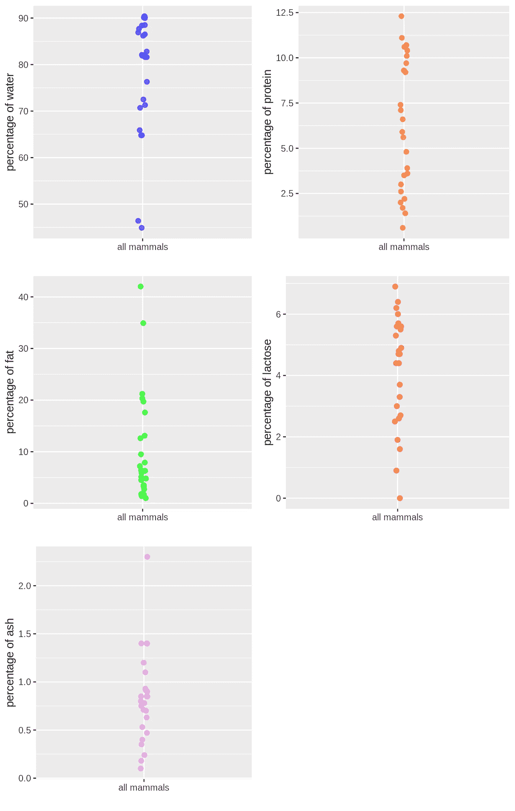
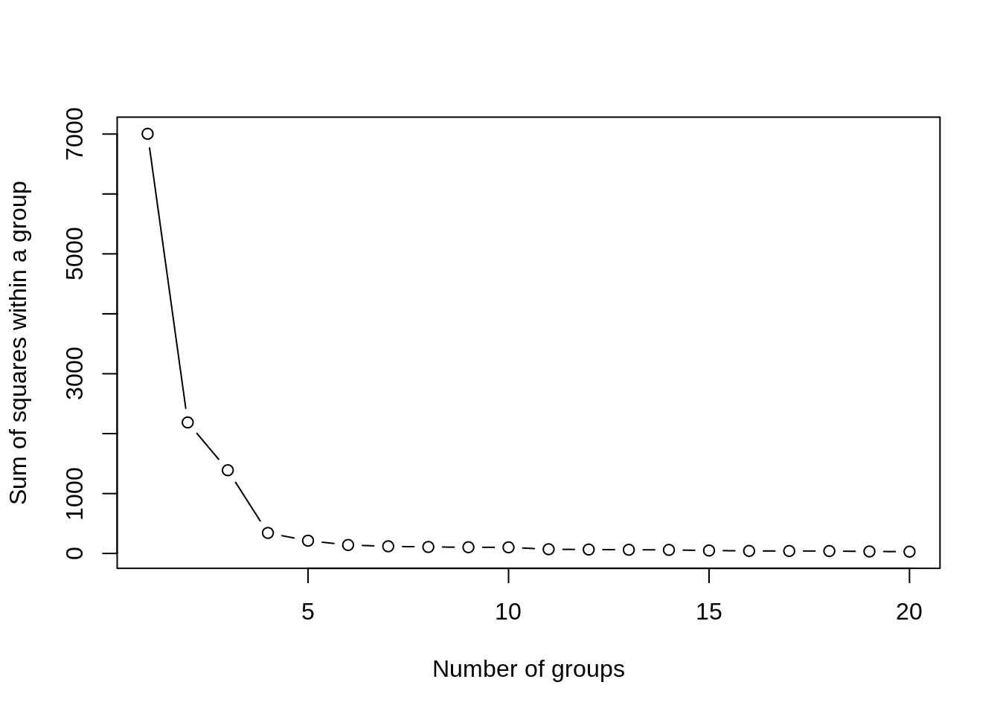
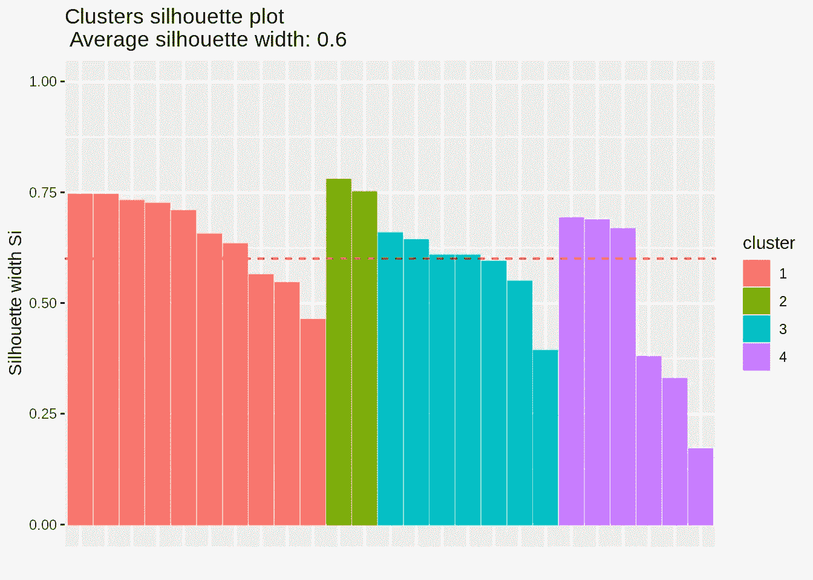
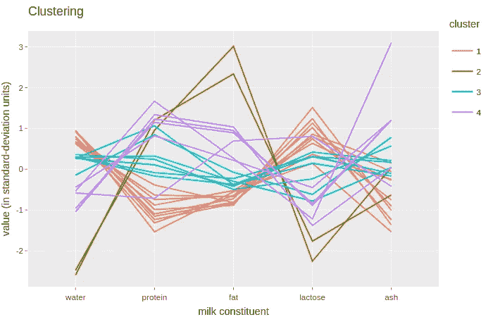

# 基于 K-means 的 R 中的聚类分析

> 原文：<https://towardsdatascience.com/clustering-analysis-in-r-using-k-means-73eca4fb7967?source=collection_archive---------0----------------------->

## 了解如何使用最著名的聚类算法之一来识别数据中的组


Photo by [Mel Poole](https://unsplash.com/@melipoole?utm_source=medium&utm_medium=referral) on [Unsplash](https://unsplash.com?utm_source=medium&utm_medium=referral)

聚类分析的目的是识别数据中的模式，并根据这些模式创建组。因此，如果两个点具有相似的特征，这意味着它们具有相同的模式，因此它们属于同一组。通过聚类分析，我们应该能够检查哪些特征通常一起出现，并了解一个群体的特征。

在这篇文章中，我们将使用 K-means 算法对多个变量进行聚类分析。目的是根据物种乳汁的成分找到哺乳动物的群体。这里涉及的要点是:

1.  聚类中使用的数据的简要说明；
2.  K-means 算法如何工作的解释；
3.  如何决定我们想要作为输入的组的数量；
4.  使用轮廓宽度的聚类验证。
5.  如何解释结果并以可视化的方式显示出来。

# 描述数据

使用的数据集是包 **cluster.datasets** 的一部分，包含以下 6 个变量的 25 个观察值:

**名称** —动物名称的字符向量
T5【水】T6—牛奶样品中水分含量的数值向量
蛋白质 —牛奶样品中蛋白质含量的数值向量
脂肪 —牛奶样品中脂肪含量的数值向量
乳糖 —牛奶样品中乳糖含量的数值向量
灰分 —数值向量

让我们来看一个数据样本

```
**library**(cluster.datasets)data(all.mammals.milk.1956)
head(all.mammals.milk.1956)##        name water protein fat lactose  ash
## 1     Horse  90.1     2.6 1.0     6.9 0.35
## 2 Orangutan  88.5     1.4 3.5     6.0 0.24
## 3    Monkey  88.4     2.2 2.7     6.4 0.18
## 4    Donkey  90.3     1.7 1.4     6.2 0.40
## 5     Hippo  90.4     0.6 4.5     4.4 0.10
## 6     Camel  87.7     3.5 3.4     4.8 0.71
```

下面的图表显示了每个变量的分布。每个点代表一个哺乳动物物种(总共 25 个)。



每个变量都有不同的行为，我们可以分别识别每个变量上的哺乳动物群体，但这不是这里的目的。

所有变量都将用于线性范围的聚类。有时，当(每个要素的)值范围很大时，例如从 0 到 100 万，使用对数标度会很有趣，因为在对数标度上，我们会突出显示值之间的较大差异，较小的差异会被认为不太重要。由于数据集中的值在 0 到 100 之间变化，我们将使用线性标度，它认为值之间的差异同样重要。

# 使聚集

我们将要使用的聚类算法是 K-means 算法，我们可以在包 **stats** 中找到它。K-means 算法接受两个参数作为输入:

*   数据；
*   一个 **K** 值，这是我们想要创建的组的数量。

从概念上讲，K 均值表现如下:

1.  它随机选择 K 个质心；
2.  将数据中的每个点(在我们的例子中，每个哺乳动物)与 n 维空间中最近的质心进行匹配，其中 n 是聚类中使用的特征数(在我们的例子中，5 个特征—水、蛋白质、脂肪、乳糖、灰分)。在这一步之后，每个点都属于一个组。
3.  现在，它将质心重新计算为组中所有其他点的中点(向量)。
4.  它会一直重复第 2 步和第 3 步，直到组稳定下来，即没有点被重新分配给另一个质心，或者达到最大迭代次数(统计库默认使用 10)。

## 选择一个好 K

您选择的 **K** 越大，聚类中组内的方差就越低。如果 K 等于观测值的个数，那么每个点就是一组，方差为 0。在组的数量和它们的方差之间找到一个平衡是很有趣的。一个群体的方差意味着这个群体的成员有多么不同。方差越大，组内的差异就越大。

为了找到平衡，我们如何选择 **K** 的最佳值？

为了回答这个问题，我们将对任意的 **K** 运行 K-means。我们选 3 吧。

```
## K-means clustering with 3 clusters of sizes 7, 2, 16
## 
## Cluster means:
##      water   protein      fat  lactose      ash
## 1 69.47143  9.514286 16.28571 2.928571 1.311429
## 2 45.65000 10.150000 38.45000 0.450000 0.690000
## 3 86.06250  4.275000  4.17500 5.118750 0.635625
## 
## Clustering vector:
##  [1] 3 3 3 3 3 3 3 3 3 3 3 3 3 3 3 3 1 1 1 1 1 1 1 2 2
## 
## Within cluster sum of squares by cluster:
## [1] 300.1562  27.1912 377.2215
##  (between_SS / total_SS =  89.9 %)
## 
## Available components:
## 
## [1] "cluster"      "centers"      "totss"        "withinss"    
## [5] "tot.withinss" "betweenss"    "size"         "iter"        
## [9] "ifault"
```

**kmeans()** 函数输出聚类的结果。我们可以看到质心向量(聚类平均值)、每个观察值被分配到的组(聚类向量)以及表示聚类的紧密度(T8)的百分比(89.9%)，即同一组中的成员有多相似。如果一个组中的所有观察值都在 n 维空间中的同一个精确点上，那么我们将达到 100%的紧凑性。

既然我们知道这个，我们将使用这个百分比来帮助我们决定我们的 K 值，也就是说，将有令人满意的方差和紧凑性的组的数量。

下面的函数绘制了一个图表，通过为算法的几次执行选择的组数( **K** 值)显示“平方和内”(withinss)。平方和内是一个度量标准，它显示了一个组的成员之间的不同程度。和越大，组内的差异就越大。



通过从右到左分析图表，我们可以看到，当组的数量( **K** )从 4 减少到 3 时，平方和有很大的增加，比之前的任何增加都大。这意味着当它从 4 个组变成 3 个组时，聚类紧密度降低(紧密度是指组内的相似性)。然而，我们的目标不是达到 100%的紧凑性——为此，我们只是将每个观察作为一个组。主要目的是找到能够令人满意地解释相当一部分数据的相当多的组。

所以，让我们选择 K = 4，再次运行 K-means。

```
## K-means clustering with 4 clusters of sizes 10, 2, 7, 6
## 
## Cluster means:
##      water   protein      fat  lactose       ash
## 1 88.50000  2.570000  2.80000 5.680000 0.4850000
## 2 45.65000 10.150000 38.45000 0.450000 0.6900000
## 3 81.18571  7.428571  6.90000 4.014286 0.9314286
## 4 68.33333  9.550000 17.41667 2.916667 1.3300000
## 
## Clustering vector:
##  [1] 1 1 1 1 1 1 1 3 3 3 3 1 1 3 1 3 3 4 4 4 4 4 4 2 2
## 
## Within cluster sum of squares by cluster:
## [1]  59.41225  27.19120  63.53491 191.96100
##  (between_SS / total_SS =  95.1 %)
## 
## Available components:
## 
## [1] "cluster"      "centers"      "totss"        "withinss"    
## [5] "tot.withinss" "betweenss"    "size"         "iter"        
## [9] "ifault"
```

使用 3 组(K = 3)我们有 89.9%的分组数据。使用 4 组(K = 4)该值提高到 95.1%，这对我们来说是一个好值。

# 聚类验证

我们可以使用轮廓系数(轮廓宽度)来评估我们的聚类的良好性。

轮廓系数计算如下:

1.  对于每个观察值 **i** ，它计算 **i** 和 **i** 所属的同一个聚类内的所有其他点之间的平均相异度。我们姑且称这个平均相异度**“Di”**。
2.  现在，我们在 **i** 和所有其他聚类之间进行相同的相异度计算，并获得它们之间的最小值。也就是说，我们找到了 **i** 和紧随其自己的集群之后最接近 **i** 的集群之间的不同之处。让我们称这个值为**“Ci”**
3.  轮廓( **Si** )宽度是 Ci 和 Di(Ci-Di)之差除以这两个值中的最大值(max(Di，Ci))。
    **Si = (Ci — Di) / max(Di，Ci)**

因此，剪影宽度的解释如下:

*   Si > 0 意味着观察值被很好地聚集。它越接近 1，它被聚集得越好。
*   Si < 0 意味着观察值被放置在错误的簇中。
*   Si = 0 意味着观察值在两个聚类之间。

下面的轮廓图为我们提供了证据，证明我们使用四个组的聚类是好的，因为没有负的轮廓宽度，并且大多数值都大于 0.5。

```
##   cluster size ave.sil.width
## 1       1   10          0.65
## 2       2    2          0.76
## 3       3    7          0.58
## 4       4    6          0.49
```



## 聚类解释

下图显示了我们聚类的最终结果。实际剧情是互动的，但下图不是。您可以使用下面的代码重现该情节。在交互式绘图中，您可以隔离各组，以便更好地理解每一组。



聚类分析的目的是识别数据中的模式。正如我们在上面的图中看到的，同一组中的观察结果往往具有相似的特征。

我们以绿组为例来评价一下。属于该组的两个哺乳动物物种，即海豹和海豚，它们具有最低的水百分比(44.9%和 46.4%)；它们的牛奶中都含有大约 10%的蛋白质；在所有其他物种中，它们的牛奶中脂肪含量最高，乳糖含量最低。这是发现的将海豹和海豚放在同一组的模式。我们也可以在其他群体中发现这样的模式。

感谢您的阅读。我希望这是一次愉快而有益的阅读。