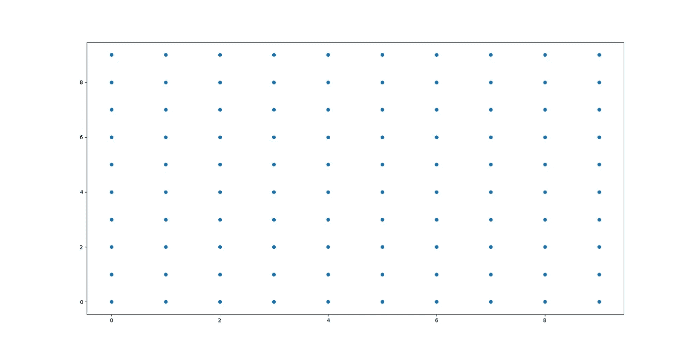
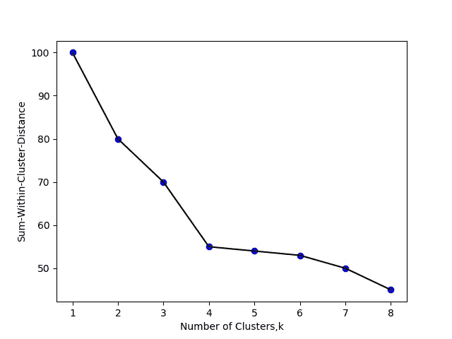
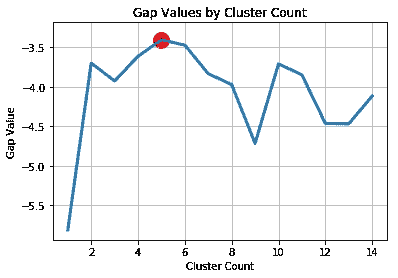

# 聚类评估策略

> 原文：<https://towardsdatascience.com/clustering-evaluation-strategies-98a4006fcfc?source=collection_archive---------1----------------------->

聚类是一种无监督的机器学习算法。它有助于将数据点分组。与监督机器学习算法相比，验证聚类算法有点棘手，因为聚类过程不包含基本事实标签。如果想要在存在基础事实标签的情况下进行聚类，可以使用监督机器学习算法的验证方法和度量。这篇博客文章试图解决地面真相标签未知时的评估策略。

**如何评估聚类？**

评估聚类的三个重要因素是

*(a)聚类趋势(b)聚类数量，* ***k*** *(c)聚类质量*

# **聚集趋势**

在评估聚类性能之前，确保我们正在处理的数据集具有聚类趋势并且不包含均匀分布的点是非常重要的。如果数据不包含聚类趋势，那么由任何现有聚类算法识别的聚类可能是不相关的。数据集中点的非均匀分布在聚类中变得很重要。

为了解决这个问题，可以使用 Hopkins 检验(一种对变量空间随机性的统计检验)来衡量均匀数据分布产生的数据点的概率。

Plot for data from Uniform distribution

***零假设(Ho) :*** *数据点由均匀分布产生(暗示没有有意义的聚类)* ***交替假设(Ha):*** *数据点由随机数据点产生(有聚类)* 
如果 H >为 0.5，可以拒绝零假设，数据很有可能包含聚类。如果 H 更接近 0，则数据集不具有聚类倾向。

# **最佳聚类数，*k***

像 K-means 这样的一些聚类算法需要聚类的数目 *k* 作为聚类参数。在分析中，获得最佳的聚类数是非常重要的。如果 *k* 太高，每个点将大致开始代表一个聚类，如果 *k* 太低，则数据点被错误地聚类。找到最佳的集群数量可以提高集群的粒度。

寻找正确的聚类数没有明确的答案，因为它取决于(a)分布形状(b)数据集中的规模(c)用户要求的聚类分辨率。尽管找到聚类数是一个非常主观的问题。有两种主要的方法来寻找最佳的聚类数目:
(1)领域知识
(2)数据驱动方法

**领域知识** —领域知识可能给出一些关于寻找聚类数目的先验知识。例如，在聚类 iris 数据集的情况下，如果我们有物种的先验知识( *sertosa，virginica，versicolor* )，那么 k = 3。领域知识驱动 *k 值*给出更多相关见解。

**数据驱动方法** —如果领域知识不可用，数学方法有助于找出正确的聚类数。

*经验方法:-* 寻找聚类数的简单经验方法是 N/2 的平方根，其中 N 是数据点的总数，因此每个聚类包含 2 * N 的平方根

*肘方法:-* 聚类内方差是聚类紧密度的度量。组内方差的值越低，形成的组的紧密度越高。

对于使用不同 k 值完成的聚类分析，计算类内方差之和*W*。*W*是点在分析中聚类程度的累积度量。绘制 *k* 值及其相应的组内方差之和有助于找到组的数量。

Plot of Sum of within cluster distance vs Number of clusters in Elbow method

该图显示最佳聚类数= 4。
最初，误差度量(组内方差)随着组数的增加而减小。在特定点 k=4 之后，误差测量开始变平。对应于特定点 k=4 的聚类数应该被认为是最优的聚类数。

*统计方法:-*

间隙统计是一种强有力的统计方法，用来寻找最佳的聚类数， *k* 。

与 Elbow 方法类似，计算不同 k 值的组内方差之和。
然后生成来自参考零分布的随机数据点，并计算不同 k 值聚类的组内方差之和。

更简单地说，将不同 k 值的原始数据集的组内方差之和与相应 k 值的参考数据集(均匀分布的零参考数据集)的组内方差之和进行比较，以找到两者之间的“偏差”或“差距”最高的理想 *k* 值。由于间隙统计量化了这种偏差，间隙统计越多意味着偏差越大。

Gap statistic Value-Cluster number (k)

具有最大间隙统计值的聚类数对应于最优的聚类数。

# 聚类质量

一旦聚类完成，就可以通过许多指标来量化聚类的表现。理想聚类的特征在于最小的类内距离和最大的类间距离。

主要有两种类型的度量来评估聚类性能。

(i) *需要地面真实标签的外在测量*。示例有调整后的 Rand 指数、Fowlkes-Mallows 评分、基于互信息的评分、同质性、完整性和 V-measure。

(二)*不需要基础真值标签的内在度量*。一些聚类性能度量是剪影系数、Calinski-Harabasz 指数、Davies-Bouldin 指数等。

Sklearn 文档对这些指标有非常好的详细描述。

**有用链接**

[聚类趋势](https://rdrr.io/cran/clustertend/) — R 包查找聚类趋势

[nbcluster](https://www.rdocumentation.org/packages/NbClust/versions/3.0/topics/NbClust)—R 包查找集群数量

[sk learn](https://scikit-learn.org/stable/modules/clustering.html#clustering-performance-evaluation)—sk learn 中用于集群性能评估的 Python 包

[gap-stat](https://pypi.org/project/gap-stat/) —用于缺口统计的 Python 包

缺口统计笔记本 —解释缺口统计的 Jupyter 笔记本