# 聚类 FEC 季度活动捐款

> 原文：<https://towardsdatascience.com/clustering-fec-quarterly-campaign-contributions-40d15a7ef28c?source=collection_archive---------22----------------------->

## **对 FEC 数据中的工作角色进行聚类，以创建动画酒吧比赛，直观显示职业贡献**

# 调查 FEC 为民主党个人筹款的情况

民意调查每周都得到大量关注，但新闻通常缺乏对联邦选举委员会文件的深入分析。[的文件](https://www.fec.gov/data/receipts/individual-contributions/?two_year_transaction_period=2020)富含自我识别的捐赠者信息，包括职位、行业和地点。在 2020 年的初选中，几乎所有候选人都发誓不再接受游说者的捐款。从表面上看，这是民主党候选人证明他们不受公司影响的一次高尚尝试。然而，在表面之下挖掘，大量的公司影响可以通过 FEC 数据暴露出来。我将只关注个人捐赠，并试图揭露公司的影响力。

# 限制

联邦选举委员会要求竞选活动只报告超过 200 美元的捐款；因此，数据在很大程度上是不完整的。Q1/Q2 的汇总数据如下所示。就实际筹集的资金而言，伯尼·桑德斯应该以近 4000 万美元的捐款领先于候选人。不幸的是，这一数据不仅不完整，而且由于申报要求，它偏向于较大的捐款。考虑到我正试图识别企业影响力，这实际上是有益的。企业捐赠可能更大，因此在数据中得到很好的体现。最新的统计数字见[政治](https://www.politico.com/2020-election/president/democratic-primary/candidates/fundraising-and-campaign-finance-tracker/)。我可以参考下面这些汇总的数字。

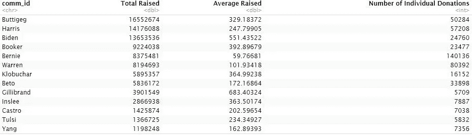

从上述数据来看，伯尼和沃伦在从个人捐款中筹集的平均金额上有明显的劣势。拜登和吉利布兰德得到大笔捐款的支持。但蒂格一直被吹捧为拥有强大的个人捐助者基础。虽然在没有所有数据的情况下，这是非常推测性的，但似乎这些个人捐助者向 Buttigeg(平均 330 美元)捐赠了大量资金，达到了他筹集的 3100 万英镑中的近 1700 万英镑。如此高的平均捐款额使人们对强有力的草根运动的想法产生了怀疑。强大的小型捐助者驱动的活动，在政治收到的总捐款和 FEC 个人报告收到的金额之间的比率应该有很大的差距。相比之下，根据政治的数据，桑德斯筹集了 4600 万英镑，而通过 FEC 的数据，仅筹集了 800 万英镑。总的来说，这并不简单，因为政治的数据包括了为竞选活动捐赠了数百万美元的政治行动委员会。对政治和联邦选举委员会数据之间的任何差距的分析都需要排除这种捐赠。

# **替代方法**

Act Blue 是政治筹款的主要捐助者，人们可以专门使用他们的 FEC 数据来比较候选人。这样做可能会描绘出一幅美国人作为一个整体如何向政治活动捐款的不同画面。然而，这篇文章的目的是探讨企业捐赠。更多有联系的个人捐赠的方式不同于从您的计算机进行 Act Blue 捐赠的简单方式。

# 方法学

在 FEC 报告中，由于缺乏标准化，自我识别数据会导致信息丢失。看一下 FEC 的数据，你会发现 CEO 这个词有许多略微不同的例子。(首席执行官、首席执行官、首席执行官等)。使用正则表达式，我将所有这些角色捆绑成一个单一的 CEO 角色，捕获大量“丢失”的数据。从这里，我会更深入地查看其他自我报告词(创始人、执行董事和总裁等)。这些头衔也代表了他们组织的负责人，因此相当于 CEO。

# 聚类的例子

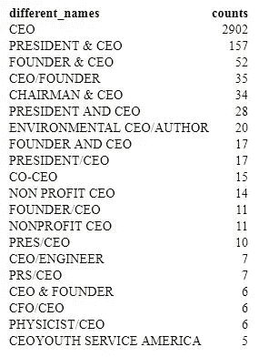

在左边，确切的术语 CEO 在当前的 FEC 报告中出现了 2902 次，然而，术语 CEO 在整个数据中出现了 3533 次。通过将左侧表格中的所有条目标记为 CEO，我们捕获的 CEO 增加了 20%以上。

最酷的是我们可以从这里开始扩展。我添加了类似的术语，如总裁、执行董事等，我们有 4459 个额外的受访者代表了 CEO 的实际角色。我们现在有超过 7500 名受访者被确定为首席执行官。比我们最初的 2902 增加了近 300%

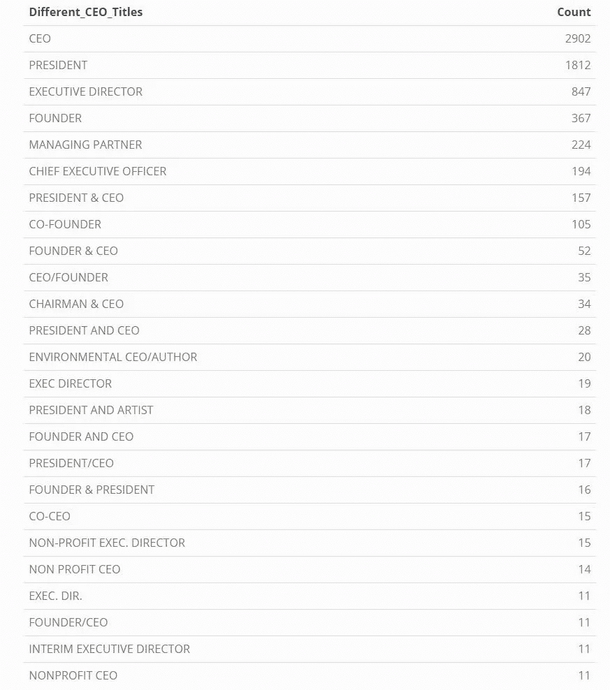

Expanded CEO Cluster

我捆绑了高管职位和 c 级高管职位，如下图所示。

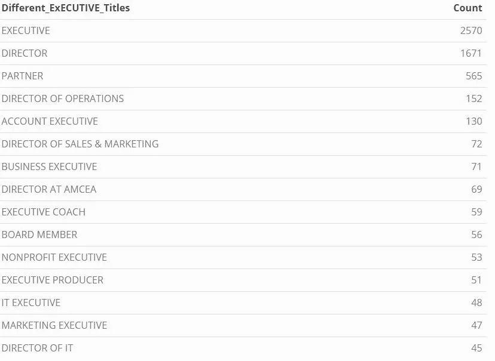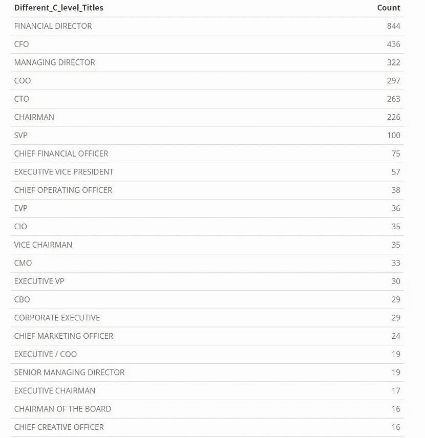

Clustered executives on the left and clustered C-level executives on the right

当我们将所有这些高管级别的职位归为一类时，我们有一个来自不同职业的近 2 万名高管(增加了 700%)的团队，我们可以进一步研究他们在捐赠方面的更深层次的关系。

# 快速验证

在下面的表格中，最下面一行代表捐款在数据中的分布。前两行代表原始数据和聚类数据中的 CEO 捐赠分布。

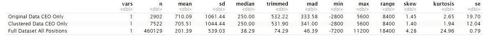

Distribution of Donations

目测上述分布，没有必要运行任何统计测试。聚类很明显地捕捉到了 CEO 群体。同样清楚的是，CEO 群体的捐赠分布与整体数据有着显著的不同。首席执行官的平均捐赠额为 705 美元，中位数为 250 美元，而普通人的平均捐赠额为 201 美元，中位数为 38 美元。

一些读者可能会混淆 min 是一个负数。个人最多可以捐赠给一个候选人 2800 英镑。最低 2800 美元是竞选团队对意外违反竞选财务法的个人的补偿。

# 动画比赛

**建立跟踪候选人捐款的条形图竞赛**

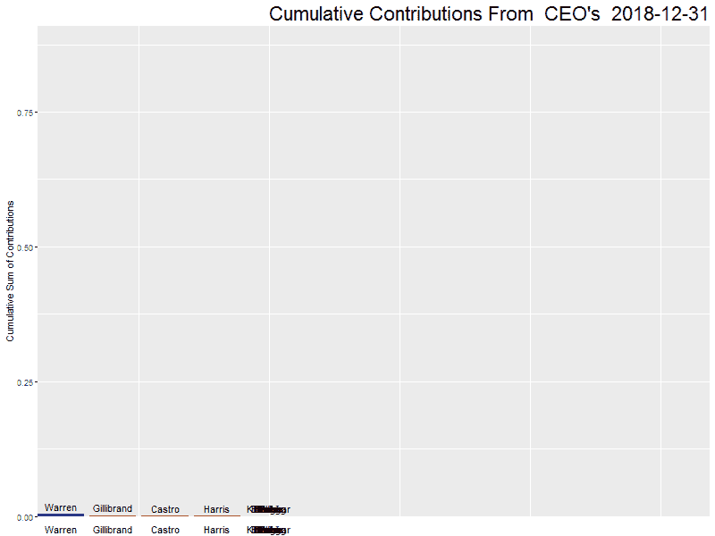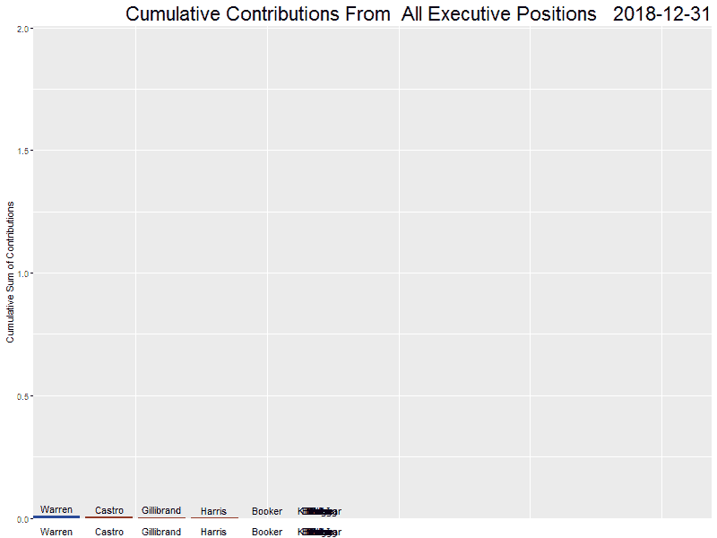

Donations Races by CEO(left) and All Executive Positions (right) measured in millions. Bar color ranges from Blue to Red to represent left and right ideology within Democratic party

# 累积结果

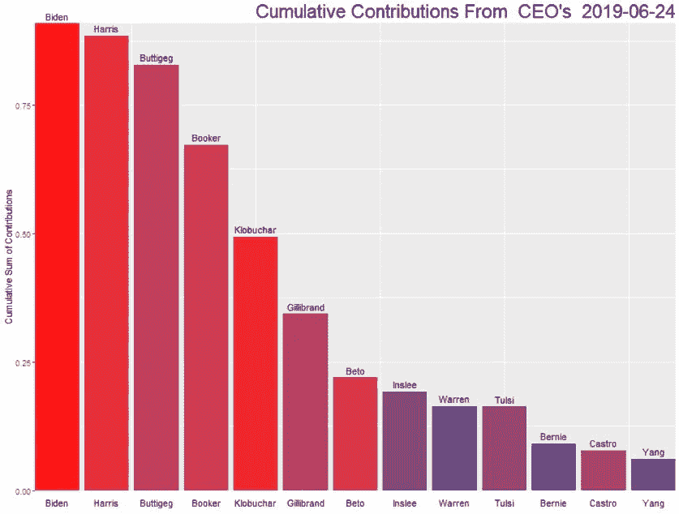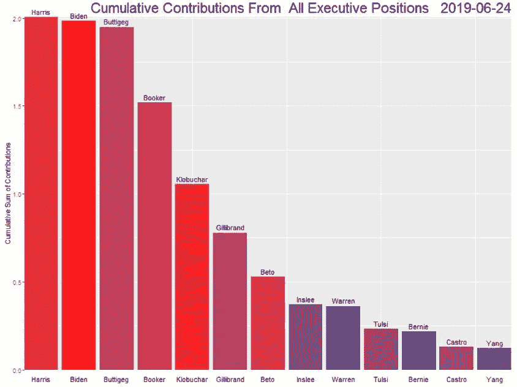

拜登要到 Q2 才参加竞选，他很快就弥补了捐款缺口。拜登、哈里斯和布蒂格显然是企业级捐赠者的最爱。布克、克洛布查尔和吉利布兰德构成了下一波候选人，而该领域的其他人(英斯利、沃伦、塔尔西、伯尼、卡斯特罗和杨)似乎都没有引起公司资金的关注。

桑德斯和沃伦是目前排名前三的候选人，他们得到的公司资助很少。如果这一趋势保持下去，那么看到即将到来的第三季度报告将会很有意思。作为一名选举的临时观察员，我怀疑尽管沃伦的议程是进步的，但她将在第三季度看到公司捐款的显著增加。我认为，企业利益可能希望从拜登身上分散开来，并可能很快对哈里斯/布蒂格/布克失去信心。

# 看看其他集群

我深入研究了其他工作领域。如果我们只使用 Act Blue FEC 的数据，这一分析领域将更具可比性，因为这可能会更好地反映整体捐赠数字。然而，这里有一些初步的结果

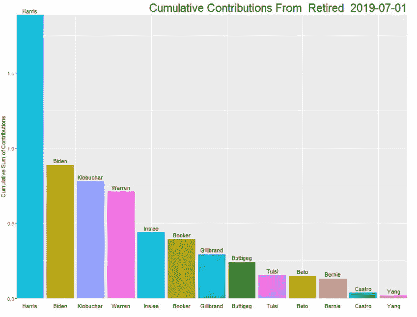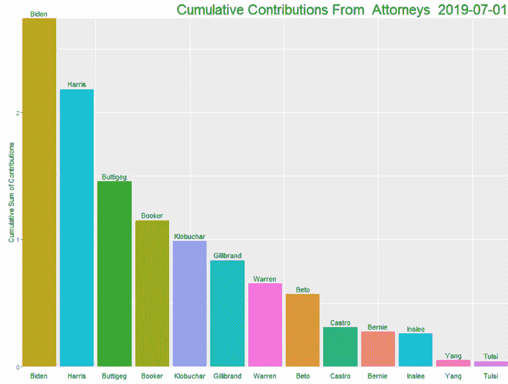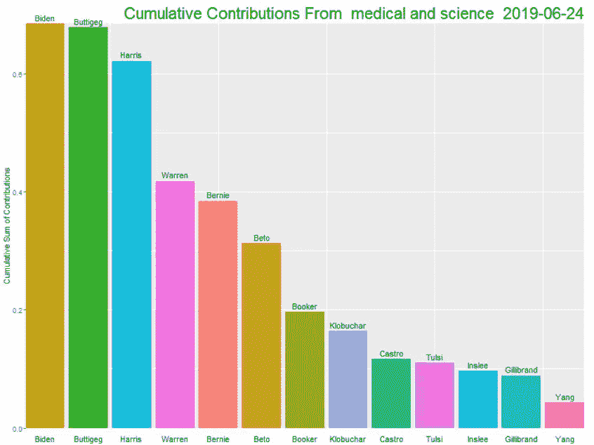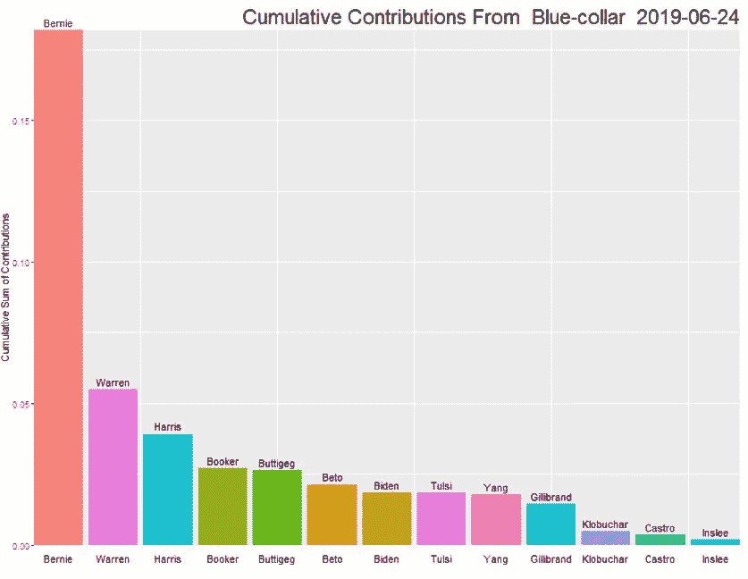

Cumulative Donations by occupations measured in millions(Please see scale differences)

请注意，这些图表的比例各不相同。哈里斯在退休捐赠者中非常受欢迎。拜登和律师以及法律领域的人相处得非常好。纯粹基于身份的假设，我原本预计卡玛拉作为一名律师会从法律领域筹集更多资金，而拜登作为一名资深律师会在退休人员中有更好的表现。

Bernie 在蓝领工人中遥遥领先，但是，在这部分数据中，Bernie 只收到了蓝领群体捐赠的 15 万美元。这凸显了使用这种不完整 FEC 数据的危险性。蓝领工人可能会推动伯尼的筹款领先，但他们的捐款不会超过 200 美元，因此不会出现在联邦选举委员会的数据中。总的来说，我们的数据缺少数百万的个人捐赠。

# **假设**

在我的数据操作中，我做了几个分类假设。我用来聚类这些组的正则表达式方法将包含不正确的例子。正则表达式是一种用算法对职业进行分类的强力尝试。然而，当我追踪最初的工作职业时，绝大多数这些职位都是正确的。我的汇总数据框架存放在我的 [**网站**](https://github.com/justinherman42/Media_Bias_project/blob/master/FEC_Project/clustered_df.csv) 上，我已经用二项式字段对所有已经更改的职位进行了分类，以跟踪它们。请随意查看我所做的假设和集群中的错误捕获。如果您想在自己的分析中采用这种方法，或者开发自己的集群，也请随意。原始的未编辑的职称出现在数据框中。

# 结论

联邦选举委员会的数据是识别公司权力结构以及它们如何影响选举的有力工具。禁止游说者迫使企业影响力发现与民主党的新的邪恶关系。许多公司求助于超级政治行动委员会来影响公民联盟之后的选举过程。然而，很明显，公司层面的高管仍在向他们青睐的候选人捐赠大量资金。虽然这个故事更多的是关于可视化公司层面的捐款，但在某个时候，我会尝试使用这些数据来开发模型，以确定哪些特征导致捐赠者向每个候选人捐款。

要查看上述文章的代码，请访问我的 [*github*](https://github.com/justinherman42/Media_Bias_project/tree/master/FEC_Project) *知识库。该存储库包括一个笔记本文件和 Rpubs 链接，它充当 R* 中所有幕后分析的向导

*要看我的其他项目请访问我的* [*网站*](https://justinherman42.github.io/Portfolio/index.html) *。如果您想联系我，请通过*[*Linkedin*](https://www.linkedin.com/in/justin-herman-3930b817b/)联系我