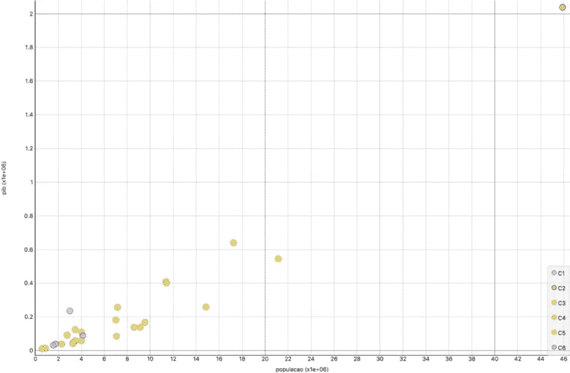

# 详细聚类

> 原文：<https://towardsdatascience.com/clustering-in-detail-b439f31c56b7?source=collection_archive---------32----------------------->

> 它需要上下文、情节、算法、度量和摆弄！

一些数据科学课程的学生向我展示了他们在互联网上找到的关于巴西各州的非常有趣的数据集。

> 第一个情节就是爱情！

但是要抓住它的一些细微差别，需要的不仅仅是第一个情节。

# 背景:巴西，一个联邦共和国

如果你不是来自巴西，也不是来自以州为单位的国家，让我给你提个醒。

在巴西，政治体系分为三级政府:联邦政府、州政府和市政府。

美国有 26 个州，外加一个联邦区(DF)，分为五个地理区域:

# 情节:巴西，一个高度不平等的共和国

作为巴西人，我们总是听到人们谈论圣保罗(SP)在经济方面与该国其他地区有何不同。

我去过圣保罗的首府几次，对这个城市的人口过剩有所了解。

但是没有什么能真正让我为这个阴谋做好准备😵：

此时，很容易得出结论，SP 是数据中的一个强异常值，应该将其丢弃，以便我们可以更好地理解剩余的数据:

Zooming by discarding SP from the plot

> 但是是吗？我们真的应该抛弃它吗？

让我们再坚持一会儿。

# 算法:从简单的开始

因为这个数据集非常简单，所以在聚类之前没有太多的 EDA(探索性数据分析)要做。

让我们在选择聚类算法时也保持简单。

## k 均值

> k-means 几乎不需要配置。差不多了。

是的。k-means 假设聚类的数量作为输入， *k* 。

> 但是我们不知道。

让我们用[橙 3](https://orange.biolab.si) 来帮助我们。

当您打开 k-means 小部件时，Orange3 允许我们为 *k、*选择一系列值，并测试它们以检查我们可以从这些不同的值中获得的轮廓分数:

k-means widget from Orange3

正如所料，我们能做的最好的聚类是将 SP 与其余数据隔离开来。

> 这显示了 k-means 如何对异常值敏感，但这不是本文的重点。

第二好的 *k* 值是 4。让我们检查一下侧影图:

Silhoutte plot for k-means with four clusters.

在轮廓图中，如果一个观察值与其聚类邻居的相似度大于与另一个聚类中的观察值的相似度，则该观察值将被评为正值(最大值为 1.0)。

让我们看看这种群集是什么样子的:

Scatter plot for k-means with four clusters. In this plot, São Paulo is the clear outlier.

> 嗯（表示踌躇等）..很好，但不完美。

是的，这有时会发生在 k-means 身上。

Orange3 显示的分数是 10 次运行的平均值，但单次运行可能不太合适。

## 分层聚类

另一种简单的集群方法叫做层次化，但是需要更多的工作。

关键的一点是，人们可以使用交互式树形图浏览不同的聚类数可能性:

Hierarchical clustering widget using Euclidean distance and Ward’s linkage

> OMG，左边面板这么多选项*😱*

是的，这是一个非常**可配置的**算法，你可以谷歌这些选项中的大部分。

我只是想说明，对于六个集群，我们得到了以下轮廓图:

Silhouette plot for hierarchical clustering with six clusters using Euclidean distance and Ward’s linkage

请注意集群的变化，这不仅仅是因为集群数量的变化:

从上面的图中，我们可以看到聚类主要是根据它们到原点的距离来划分的。

k-means 和层次聚类都尝试过这样做，因为它们认为如果两个状态在这个二维空间中接近，它们就是相似的。

> 那就是**欧几里德距离**！

没错。

# 度量:完全改变你的视角

现在，在我们研究的早期，我和我的学生开始注意到这两个属性之间的比率本身就是一个属性。

> 人均 GDP！

是的，这是一个非常有趣的属性来说明一个国家真正的富裕程度。

> 所以我们可以通过组合前两个属性来创建第三个属性🙃

是的，但不是。如果我们已经可以从现有的属性中获取信息，我们通常会避免创建新的属性。

> 为什么？*🤔*

因为那样的话，我们的绘图将变成 3D 的，更不用说许多其他的问题了(我们正在谈论一个非常简化的数据集)..

> 等等，我们如何从这个情节中掌握信息？

我们将把该图的对角线作为参考。

位于这条对角线右侧的州人口数量会增加。

相反的情况也是如此:这条对角线左边的州有向更大的 GDP 转移的趋势。

> 但是，我们如何告诉算法在没有第三个属性的情况下寻找它呢？

我们改变相似性度量:如果两个状态所代表的向量之间的角度很小，余弦距离使这两个状态变得相似。

> 等等，什么？

检查情节:

Scatter plot for hierarchical clustering using cosine distance and Ward’s linkage, with six clusters.

> 我不明白。

试试这个:

Regression lines illustrating that the cosine distance values the angle with regard to the origin.

> 操！*😱*

是的。

# 总结:巴西是如何真正分裂的

关于最后一个聚类结果，最有趣的事情之一是，当我们分析它时，它很有意义:

*   当谈到财富时，DF 是巴西最重要的局外人，如果你认为 DF 的商业只是政治，那绝对是疯狂的！
*   巴西东南部通常被认为是该国最富裕的地区，但除了少数例外，南部和中西部地区超过了它！
*   到目前为止，巴西的北部和东北部是该国最危急的地区。

现在让我们把这当成一个练习:想象另一个巴西，政治不是为了致富，在 SP 堆积的企业遍布北部和东北部。

> 这是我想看的一个情节😆