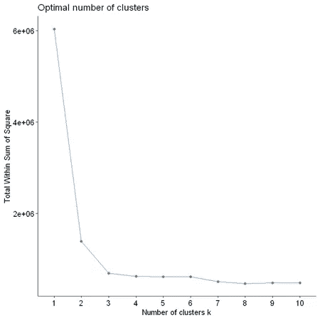

# 高效的产品集群可以推动零售销售

> 原文：<https://towardsdatascience.com/clustering-machine-learning-combination-in-sales-prediction-330a7a205102?source=collection_archive---------7----------------------->

## 无监督学习和统计分析

## 零售业的聚类与库存预测


Image by author

[https://sarit-maitra.medium.com/membership](https://sarit-maitra.medium.com/membership)

对未来的预测是商业中必不可少的组成部分。这些技术的有效实施导致成功的客户关系管理(CRM) &商业中的库存管理。通常用作数据挖掘技术的聚类有助于发现数据中有趣的模式。

尽管我们谈论的是 CRM 和库存管理，但是，集群已经成为高级规划和优化流程的主要来源，并且可以在多个方面使业务受益:

1.  *商店聚类根据绩效和非绩效参数对商店进行分组。*
2.  *减少不必要的库存*
3.  *关注目标细分市场*
4.  *以客户为中心的方法创造一致性和熟悉度*

我们将研究销售交易数据，并根据历史记录分析和预测交易。这里，数据是高层次的，不考虑每笔交易的金额和其他业务因素..数据集包含 1 年/ 52 周内每周购买的 800 件产品。

```
df <- read.csv("Sales_Transactions_Dataset_Weekly.csv", header = TRUE)
print(is.data.frame(df))
print(ncol(df))
print(nrow(df))
print(names(df))
```


```
# number of weeks
DF <- data.frame(df[, 2:53], row.names = df$Product_Code)
print(names(DF));#Check whether there is missing value.
print(sum(is.na(DF)))
```


我们在这个数据集中有 800 种产品，分析所有 800 种产品的数据是不切实际的。因此，让我们根据 52 周内交易的相似性将产品分类。

我们将使用无监督学习进行聚类。

## 聚类:

这是一个优化问题。为了进行优化，我们需要根据最小距离进行决策，或者根据约束条件确定聚类的数量。在这里，我们将使用一些集群。因为在我们开始算法之前必须设置聚类的数量(k ),所以让我们用几个不同的 k 值进行尝试，并检查结果中的差异。

可以定义上述内容的标准算法是—


其中:xi 是属于聚类 Ck 的数据点，μk 是分配给聚类 Ck 的点的平均值。每个观测 xi 被分配给给定的聚类，使得观测到它们被分配的聚类中心μk 的距离平方和最小。

现在，有相当多的聚类算法可用，但没有简单的方法为我们的数据找到正确的算法。我们必须进行实验，为任何给定的数据集找到最适合的算法。

## 主成分分析:

```
# principal component analysis
res.pca <- PCA(DF,  graph = FALSE)# Extract eigenvalues/variances
print(get_eig(res.pca))# Visualize eigenvalues/variances
fviz_screeplot(res.pca, addlabels = TRUE, ylim = c(0, 50))
```


```
fviz_pca_var(res.pca, col.var="contrib",
             gradient.cols = c("#00AFBB", "#E7B800", "#FC4E07"),
             repel = TRUE # Avoid text overlapping
             )
```


## 对主轴的可变贡献:

```
fviz_contrib(res.pca, choice = "var", axes = 1, top = 10) fviz_contrib(res.pca, choice = "var", axes = 2, top = 10)
```


```
# Extract the results for individuals
ind <- get_pca_ind(res.pca)
ind# Coordinates of individuals
head(ind$coord)fviz_pca_ind(res.pca, col.ind = "cos2",
             gradient.cols = c("#00AFBB", "#E7B800", "#FC4E07"),
             repel = TRUE)
```


主成分分析让我们清楚地看到我们所拥有的产品的聚类数。这是我们数据挖掘工作的第一步，非常重要。

让我们使用 factoextra 软件包，它可以处理来自几个软件包的 PCA、CA、MCA、MFA、FAMD 和 HMFA 的结果，用于提取和可视化我们数据中包含的最重要的信息。更重要的是，它给出了人类可以理解的输出。

```
set.seed(123)
k1 <- kmeans(DF, centers = 2, nstart = 25)
k2 <- kmeans(DF, centers = 3, nstart = 25)
k3 <- kmeans(DF, centers = 4, nstart = 25)
k4 <- kmeans(DF, centers = 5, nstart = 25)# plots to compare
p1 <- fviz_cluster(k1, geom = "point", DF) + ggtitle("k = 2")
p2 <- fviz_cluster(k2, geom = "point", DF) + ggtitle("k = 3")
p3 <- fviz_cluster(k3, geom = "point", DF) + ggtitle("k = 4")
p4 <- fviz_cluster(k4, geom = "point", DF) + ggtitle("k = 5")grid.arrange(p1, p2, p3, p4, nrow = 2)
```


这种评估给了我们关于聚类之间 k=3 或 4 的想法，但是，我们不确定最佳聚类。如果我们知道我们想要的聚类数，那么 k-means 可能是我们用例的一个好选择。

除了肘方法之外，用于确定最佳聚类的其他流行方法是剪影方法和间隙统计

## k 均值聚类:

```
# Elbow method
set.seed(101)
fviz_nbclust(DF, kmeans, method = "wss")# WSS means the sum of distances between the points 
# and the corresponding centroids for each cluster
```



在这里，我们尝试为从 1 到 10 的每一个集群数建模，并收集每个模型的 WSS 值。看下面的剧情。随着集群的增加，WSS 值降低。肘点为 3 表示 3 个簇。

## 剪影法:

```
silhouette_score = function(k){
  km = kmeans(DF, centers = k, nstart=25)
  ss = silhouette(km$cluster, dist(DF))
  mean(ss[, 3])}
k = 2:10
avg_sil = sapply(k,silhouette_score )
plot(k, type = 'b', avg_sil, xlab = 'number of clusters', ylab ='average silhouette scores', frame = 'False')
```


这里，最佳数字看起来也是 3

## 差距统计:

间隙统计将 log(Wk)图标准化，其中 Wk 是群内离差，通过将其与数据的适当零参考分布下的预期值进行比较。

```
fviz_nbclust(DF, kmeans, method = "gap_stat")
```


这将不同的输出显示为 4 个集群。让我们根据 Gap-Statistic 方法的发现将此应用于 4 个聚类，并根据 k-means 列的聚类绘制周模式。

```
cluster_4 <- kmeans(DF,centers = 4,nstart = 10)
cluster_4$cluster <- as.factor(cluster_4$cluster)
cluster_4# plotting pattern of weeks as per clustering from kmeans columnsggplot(DF, aes(W1,W44,color =cluster_4$cluster)) +geom_point()
```


这里我们可以解读为，每组分别有 124、197、490 款产品。聚类图显示了明显分开的三个聚类，between_SS / total_SS = 88.6 %表明该聚类模型非常适合该数据。具体来说，有 490 种产品归入第 1 组。


```
group1 = data.frame(t(DF[cluster_3$cluster == 3,]))
summary(sapply(group1, mean))hist(sapply(group1, mean), main = "Histogram of Product Group 1", xlab = "Number of Transactions")
```


在这里，平均每周交易量为 1.66。有相当多的产品每周交易少于 1 次(柱状图中的长条)。其他产品的交易看起来遵循正态分布。让我们将第一组分成两部分:

*   平均每周交易< 2 的组 0，以及
*   包含剩余产品的新组 1。

```
group0 <- group1[,sapply(group1, mean) <= 2]
group1 <- group1[,sapply(group1, mean) > 2]group2 <- data.frame(t(DF[cluster_3$cluster == 1]))
group3 <- data.frame(t(DF[cluster_3$cluster == 2]))# pie chart
slices <- c(ncol(group0), ncol(group1), ncol(group2), ncol(group3))
lbls <- c("Group 0:", "Group 1:", "Group 2:", "Group 3:")
lbls <- paste(lbls, percent(slices/sum(slices)))
pie(slices,labels = lbls, col=rainbow(length(lbls)), main ="Pie Chart of Product Segmentation")
```


我们可以看到，

*   37.2%的产品属于第 0 组，
*   23.2%属于第 1 组，
*   第二组 15.3%，以及
*   24.3%属于第三组。

## 产品细分的箱线图:

```
group1_mean <- sapply(group1, mean)
group2_mean <- sapply(group2, mean)
group3_mean <- sapply(group3, mean)
boxplot(group1_mean, group2_mean, group3_mean, main = "Box-Plot of Product Segmentation", names = c("Group 1", "Group 2", "Group 3"))lapply(list(group1_mean, group2_mean, group3_mean), summary)
```


显示的结果显示，产品分为四个独立的组。

*   组 0 的每周交易次数最少；和
*   组 2 的事务数量最多。

## 分析和预测:

我们将分别分析每个组，这是一种迭代过程。

## 分析(第 0 组):

```
summary(group0_mean)par(mfrow = c(1, 2))
hist(group0_mean, main = "Histogram of Group 1", xlab = "Number of Transactions")
boxplot(group0_mean, main = "Box-plot of Group 1", names = c("Group0"))
```


根据直方图，组 0 的平均每周交易的分布是右偏的。此外，箱线图显示第三个四分位数约为 0.5，这意味着该组中的大多数产品每周的交易量不到 1 笔。尽管有些产品的周交易量大于 1，但考虑到所有产品中的一小部分，这些产品在箱线图中被视为异常值。因此，可以得出结论，这个群体的需求很低。

为了进一步分析，我们希望选择一种代表性产品，其平均周交易量最接近目标值(即中值或平均值)。在这种情况下，由于分布是右偏的，我们选择中位数作为我们的目标值。这一组的代表产品是交易数量与中位数相差最小的产品。

## 预测:

```
idx0 <- which.min(abs(group0_mean-summary(group0_mean)['Median']))
print(idx0)# First row and all columns
DF[215,]#Convert P215 data to time series
ts0 <- ts(group0[,idx0], frequency = 365.25/7)
plot(ts0)
```


我们已经将数据转换成时间序列。在 [*儒略历*](https://en.wikipedia.org/wiki/Year) 中，一年的平均长度为 365.25 天。不过这个也可以用 365 试试。第 0 组的代表产品是 P214。


我们可以看到，P214 每周大部分时间都有零个事务，部分时间有 1 个事务，还有 1/4 个事务。

## 分析(第一组):

```
summary(group1_mean)par(mfrow = c(1, 2))
hist(group1_mean, main = "Histogram of Group 1", xlab = "Number of Transactions")
boxplot(group1_mean, main = "Box-plot of Group 1", names = c("Group1"))
```


在这里，分布几乎以 4 为中心。箱线图中的分布有点偏右，有一个异常值。Q3 百分位> 4 (4.23)，组 1 中的大多数产品是< 4\. Therefore, it can be safely assumed that, the products in this group have low demands too.

```
idx1 <- which.min(abs(group1_mean-summary(group1_mean)['Mean']))
print(idx1)# First row and all columns
DF[318,]#Convert P215 data to time series
ts1 <- ts(group1[,idx1], frequency = 365.25/7)
plot(ts1)
```


The representative product of Group1 is P318.

```
summary(group1[,idx1])
boxplot(group1[,idx1], main = "Box-Plot of P318")
```


The distribution is a little bit right skewed. The average number of weekly transaction is 3.67.

## Decomposition (Group1):

```
# set up plot region
par(mfrow = c(1, 2))
# plot normal variates with mean
acf(ts1, main = "")whitenoise.test(ts1)
```


According to the time plot, the majority of the number of transactions is between 2 and 5 per week. It is clear that there is no trend or seasonality in this time series. Moreover, the auto correlation plot displays white noise in the data. In this way, there is no need to perform decomposition for this time series prior building a forecasting model.

We will apply (1) ETS(Exponential Smoothing) and (2) ARIMA (Autoregressive Integrated Moving Average ). Moreover, other forecasting methods e.g. average, drift, and naïve will be applied based on the characteristic of the data. With only 52 weeks of transaction data, it is difficult to make long-term forecasting.

## ETS(Exponential Smoothing):

Prediction produced using exponential smoothing methods are weighted averages of past observations, with the weights decaying exponentially as the observations get older.

```
fit_ets <- ets(ts1)
summary(fit_ets)
checkresiduals(fit_ets)
```


Ljung-Box statistic p‐value >。显著性水平(\alpha)使我们不拒绝零假设，或者换句话说，时间序列是白色检验。下图显示了模型生成的点预测和预测区间。

```
autoplot(fit_ets)
```


```
plot(forecast(fit_ets, h = 4))
```


残差图显示残差具有恒定的方差和零均值，并且彼此之间没有显著的自相关。尽管这表明该模型非常适合；此外，Ljung-Box 检验的 p 值也表明了残差的独立性。但是，显示预测区间的预测结果过宽，具有负值。所以，ETS 模型对于这个时间序列来说不是一个好的选择。

ETS(A，N，N)是带有附加误差的简单指数平滑。这是意料之中的，因为原始时间序列是白噪声，没有趋势性和季节性。

## ARIMA(第一组):

```
summary(ur.kpss(ts1))
adf.test(ts1)
ur.df(ts1, type='trend', lags = 10, selectlags = "BIC")
```


```
p1 = ggAcf(ts1)
p2 = ggPacf(ts1)
grid.arrange(p1, p2, ncol = 2)
```


P318 这个时间序列是白噪声，是平稳数据。这里，ACF 和 PACF 图具有相同的平稳性观察。

## ARIMA(第一组):

```
fit_arima = auto.arima(ts1, seasonal = FALSE)
summary(fit_arima)
checkresiduals(fit_arima)
```


就模型性能而言，ARIMA 可能更好，然而，与 ETS 模型相比，预测输出与 ETS 非常相似，具有不可接受的宽预测区间。

```
autoplot(forecast(fit_arima, h = 4)) + xlab("Week") + 
ylab("Number of Transactions") + ggtitle("Group 1: Forecast using ARIMA Method")
```


## 平均法、简单法和漂移法:

```
p1 = autoplot(ts1) + autolayer(meanf(ts1, h = 4)) + xlab(“Week”) + 
ylab(“Number of Transactions”) + ggtitle(“Group 1: Average Method”)p2 = autoplot(ts1) + autolayer(naive(ts1, h = 4)) + xlab(“Week”) + 
ylab(“Number of Transactions”) + ggtitle(“Group 1: Naive Method”)p3 = autoplot(ts1) + autolayer(rwf(ts1, h = 4)) + xlab(“Week”) + 
ylab(“Number of Transactions”) + ggtitle(“Group 1: Drift Method”)grid.arrange(p1, p2, p3, ncol = 3)
```


总的来说，这些方法中没有一种比 ARIMA 或 ETS 方法更适合数据。具体来说，使用平均法的预测具有非常相似的结果。然而，朴素方法和漂移方法的预测区间甚至更宽。因此，这些方法不是好的选择。

由于 P318 的原始数据是白噪声，所以很难对这个时间序列进行很好的预测。我们注意到 ARIMA 和 ETS 模型的预测结果都等于 P318 的平均值(3.673/3.68)。

然而，由于预测区间较宽，如果我们只直接使用预测结果，会使业务面临风险。因此，建议不要使用平均值，而是使用第三个四分位值，即每周 5 次交易，这样，我们可以满足 75%的业务需求。

## 分析(第三组):

```
idx3 <- which.min(abs(group3_mean-summary(group3_mean)['Median']))
print(idx3)summary(group3_mean)par(mfrow = c(1, 2))
hist(group3_mean, main = "Histogram of Group 3", xlab = "Number of Transactions")
boxplot(group3_mean, main = "Box-plot of Group 3", names = c("Group3"))
```


根据直方图，每周交易的分布是右偏的。在箱线图中，分布是右偏的，有一些异常值。此外，第 25 百分位是 32.17，这意味着组 3 中的大多数产品的周交易量都大于 32。因此，我们可以得出结论，组 3 中的产品有很高的需求。这里，分布也是居中的，因此，我们选择平均值作为目标值。

```
summary(group3[,idx3])
boxplot(group3[,idx3], main = "Box-Plot of P209")
```


数据分布几乎居中。周成交平均数为 9.9，第三四分位数为 12。

## 分解(第三组):

```
ts3 = ts(group3[,idx3], frequency = 365.25/7)
p1 = autoplot(ts3) + xlab("Week") + ylab("Number of Transaction") + ggtitle("Time Plot (Group 2)")
p2 = ggAcf(ts3)
grid.arrange(p1, p2, ncol = 2)
```


从时间图来看，大部分交易次数在每周 6 到 13 次之间。

原始时间序列由趋势分量和不规则分量组成，但没有季节分量。因此，使用简单移动平均法进行平滑是合适的。

```
autoplot(ts3, series = "Data") + autolayer(ma(ts3, 5), series = "5-MA" ) + autolayer(ma(ma(ts3, 5), 3), series = "3x5-MA") + scale_colour_manual(values=c("Data"="grey50","5-MA"="blue", "3x5-MA" = "red"), breaks=c("Data","5-MA", "3x5-MA"))
```


阶数为 5 时，估计趋势不会像预期的那样平滑。因此，执行移动平均的移动平均。“3x5-MA”趋势更适合。我们将重复应用 ETS(指数平滑)和 ARIMA(自回归综合移动平均)的类似过程，还将研究其他预测方法，如平均、漂移和朴素等。

这里可以执行类似的练习，如 group0 和 group1，以找到最适合的模型。

# 关键要点:

聚类在零售业务决策过程中非常重要。它是有效数据挖掘技术的一部分，在处理大数据时，有效的数据挖掘是至关重要的。数据挖掘涵盖了广泛的数据分析和知识发现任务，从数据表征和鉴别到关联和相关分析、分类、回归、聚类、异常值分析、序列分析以及趋势和演变分析。

然而，我们必须记住，现实生活中的数据是杂乱的，可能包含噪音、错误、异常或不确定性。错误和噪声可能会混淆数据挖掘过程，导致错误模式的产生。数据清理、数据预处理、异常值检测和去除以及不确定性推理是需要与数据挖掘过程集成以进行任何有效分割和预测的技术示例。

***我这里可以联系到***[](https://www.linkedin.com/in/saritmaitra/)**。**