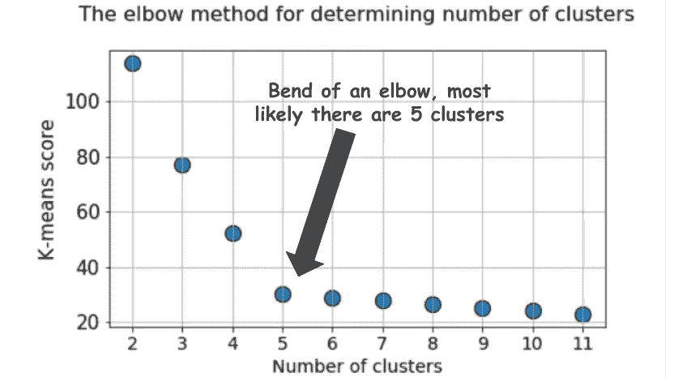
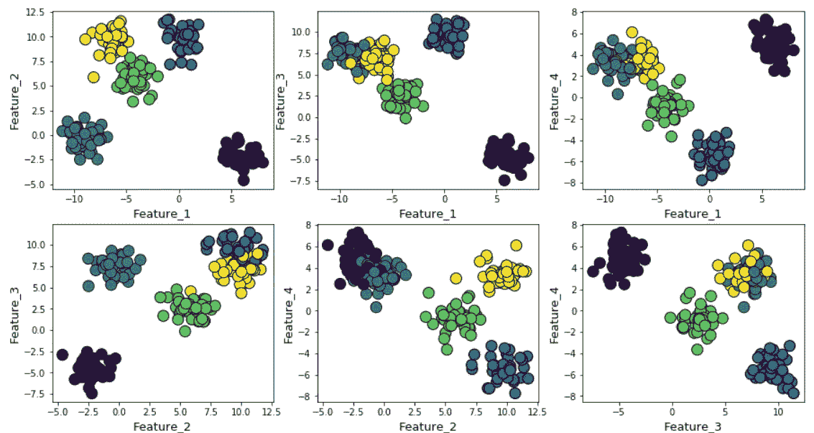
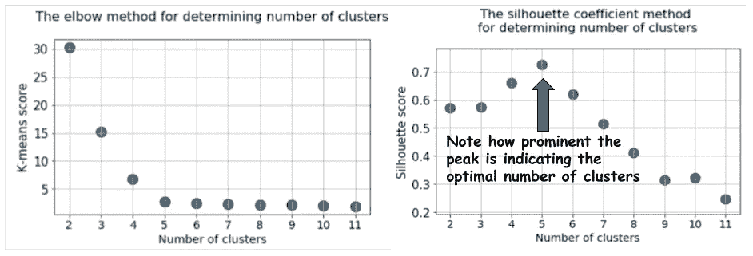
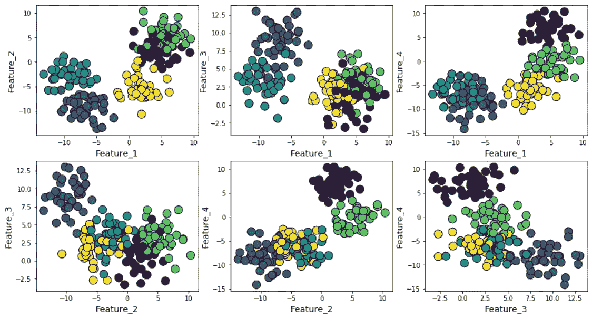
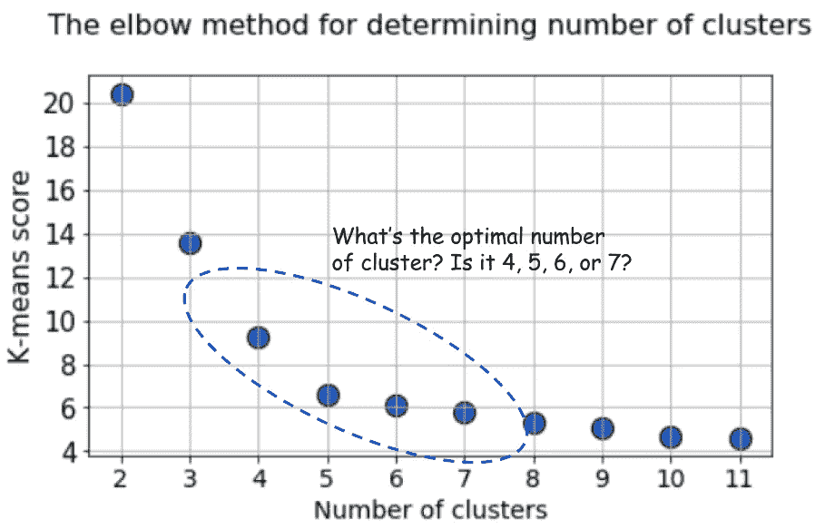
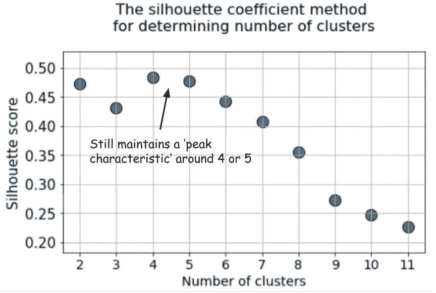
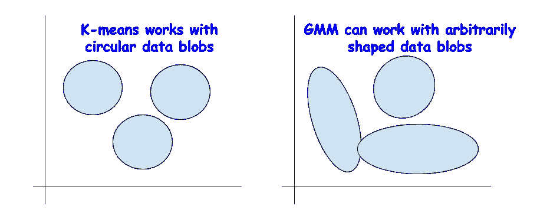
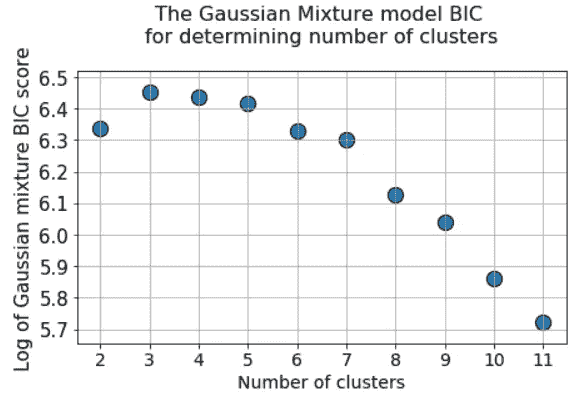

# 比肘法更好的聚类度量

> 原文：<https://towardsdatascience.com/clustering-metrics-better-than-the-elbow-method-6926e1f723a6?source=collection_archive---------3----------------------->

## 我们展示了使用什么样的度量来可视化和确定最佳的集群数量，这比通常的做法好得多——肘方法。

# 介绍

聚类是利用数据科学的商业或科学企业的机器学习管道的重要部分。顾名思义，它有助于识别数据块中密切相关(通过某种距离度量)的数据点的集合，否则很难理解。

然而，大多数情况下，聚类过程属于[无监督机器学习](https://medium.com/machine-learning-for-humans/unsupervised-learning-f45587588294)的领域。无人监管的 ML 是一个混乱的行业。

没有已知的答案或标签来指导优化过程或衡量我们的成功。我们处于未知的领域。

 [## 人类的机器学习，第 3 部分:无监督学习

### 聚类与降维:k-means 聚类，层次聚类，PCA，SVD。

medium.com](https://medium.com/machine-learning-for-humans/unsupervised-learning-f45587588294) 

因此，毫不奇怪，当我们问这个基本问题时，像 [**k 均值聚类**](/understanding-k-means-clustering-in-machine-learning-6a6e67336aa1) 这样的流行方法似乎不能提供完全令人满意的答案:

> "**从**开始，我们如何知道集群的实际数量？"

这个问题非常重要，因为聚类过程通常是进一步处理单个聚类数据的先导，因此计算资源的量可能取决于这种测量。

在业务分析问题的情况下，反响可能会更糟。这种分析通常会进行聚类，目的是细分市场。因此，很容易想象，根据集群的数量，适当的营销人员将被分配到该问题。因此，对集群数量的错误评估会导致宝贵资源的次优分配。

Source: [https://www.singlegrain.com/digital-marketing/strategists-guide-marketing-segmentation/](https://www.singlegrain.com/digital-marketing/strategists-guide-marketing-segmentation/)

# 肘法

对于 k-means 聚类方法，回答这个问题最常见的方法是所谓的[肘方法](https://bl.ocks.org/rpgove/0060ff3b656618e9136b)。它包括在一个循环中多次运行该算法，增加聚类选择的数量，然后绘制聚类分数作为聚类数量的函数。

肘法的得分或衡量标准是什么？为什么叫'*肘*法？

典型图如下所示:

通常，分数是 k-means 目标函数上的输入数据的度量，即**某种形式的类内距离相对于类内距离**。

例如，在 Scikit-learn 的 [k 均值估计器](https://scikit-learn.org/stable/modules/generated/sklearn.cluster.KMeans.html)中，有一种`score`方法可用于此目的。

但是再看剧情。有时候会让人困惑。在这里，我们应该将 4、5 还是 6 作为集群的最佳数量？

> 不总是那么明显，是吗？

# 轮廓系数——一个更好的指标

使用每个样本的平均组内距离(`a`)和平均最近组距离(`b`)计算[轮廓系数](https://en.wikipedia.org/wiki/Silhouette_(clustering))。样本的轮廓系数为`(b - a) / max(a, b)`。澄清一下，`b`是样本和样本不属于的最近聚类之间的距离。我们可以计算所有样本的平均轮廓系数，并将其用作判断聚类数量的度量。

这是 Orange 关于这个话题的一个视频，

举例来说，我们使用 Scikit-learn 的`make_blob`函数在 4 个特征维度和 5 个聚类中心上生成随机数据点。因此，问题的基本事实是**数据是围绕 5 个聚类中心**生成的。然而，k-means 算法没有办法知道这一点。

可以如下绘制聚类(成对特征),

接下来，我们运行 k 均值算法，选择 *k* =2 至 *k* =12，计算每次运行的默认 k 均值得分和平均轮廓系数，并将它们并排绘制。

这种差异再明显不过了。平均轮廓系数增加到当 *k* =5 时的点，然后对于更高的 *k* 值急剧减少，即**它在 *k* =5、**处呈现出清晰的峰值，这是生成原始数据集的聚类数。

> 与弯管法中的平缓弯曲相比，轮廓系数呈现出峰值特征。这更容易想象和推理。

如果我们在数据生成过程中增加高斯噪声，聚类看起来会更加重叠。

在这种情况下，使用 elbow 方法的默认 k-means 得分会产生更不明确的结果。在下面的肘部图中，很难选择一个合适的点来显示真正的弯曲。是 4，5，6，还是 7？

但是轮廓系数图仍然设法在 4 或 5 个聚类中心附近保持峰值特征，并使我们的生活更容易。

事实上，如果你回头看重叠的聚类，你会看到大多数情况下有 4 个聚类可见-虽然数据是使用 5 个聚类中心生成的，但由于高方差，只有 4 个聚类在结构上显示出来。剪影系数很容易发现这种行为，并显示出介于 4 和 5 之间的最佳聚类数。

# 高斯混合模型下的 BIC 分数

还有其他优秀的度量来确定聚类的真实计数，例如[**B**a**I**information**C**riterion](https://en.wikipedia.org/wiki/Bayesian_information_criterion)(**BIC**)但是只有当我们愿意将聚类算法扩展到 k-means 以外的更一般化的版本时，才能应用这些度量

基本上，GMM 将一个数据块视为多个具有独立均值和方差的高斯数据集的叠加。然后应用[**E**expectation-**M**axi mization(**EM**)算法](https://www.geeksforgeeks.org/ml-expectation-maximization-algorithm/)来近似确定这些均值和方差。

 [## 高斯混合模型解释

### 在机器学习领域，我们可以区分两个主要领域:监督学习和非监督学习。主要的…

towardsdatascience.com](/gaussian-mixture-models-explained-6986aaf5a95) 

## BIC 作为正规化的理念

你可能从统计分析或你以前与线性回归的互动中认识到术语 BIC。BIC 和 AIC(赤池信息标准)被用作变量选择过程的线性回归中的正则化技术。

> BIC/AIC 用于线性回归模型的正则化。

这个想法同样适用于 BIC。理论上，极其复杂的数据聚类也可以建模为大量高斯数据集的叠加。对于为此目的使用多少高斯函数没有限制。

但这类似于线性回归中增加模型复杂性，其中大量特征可用于拟合任何任意复杂的数据，但却失去了泛化能力，**因为过于复杂的模型拟合了噪声而不是真实模式。**

**BIC 方法惩罚了大量的高斯分布**，并试图保持模型足够简单，以解释给定的数据模式。

> BIC 方法不利于大量的高斯模型，即过于复杂的模型。

因此，我们可以对一系列聚类中心运行 GMM 算法，BIC 得分将增加到一个点，但之后将随着惩罚项的增加而开始下降。

# 摘要

[**这里是本文的 Jupyter 笔记本**](https://github.com/tirthajyoti/Machine-Learning-with-Python/blob/master/Clustering-Dimensionality-Reduction/Clustering_metrics.ipynb) 。随意叉着玩。

我们讨论了常用的 elbow 方法的几个替代选项，用于在使用 k-means 算法的无监督学习设置中挑选正确数量的聚类。

我们表明，侧影系数和 BIC 评分(来自 k-means 的 GMM 扩展)是视觉识别最佳聚类数的肘方法的更好替代方法。

如果您有任何问题或想法要分享，请通过[**tirthajyoti【AT】Gmail . com**](mailto:tirthajyoti@gmail.com)联系作者。此外，您可以查看作者的 [**GitHub**](https://github.com/tirthajyoti?tab=repositories) **资源库**中 Python、R 和机器学习资源中其他有趣的代码片段。如果你像我一样对机器学习/数据科学充满热情，请随时[在 LinkedIn 上添加我](https://www.linkedin.com/in/tirthajyoti-sarkar-2127aa7/)或[在 Twitter 上关注我。](https://twitter.com/tirthajyotiS)

 [## Tirthajyoti Sarkar - Sr .首席工程师-半导体、人工智能、机器学习- ON…

### 通过写作使数据科学/ML 概念易于理解:https://medium.com/@tirthajyoti 开源和有趣…

www.linkedin.com](https://www.linkedin.com/in/tirthajyoti-sarkar-2127aa7/)