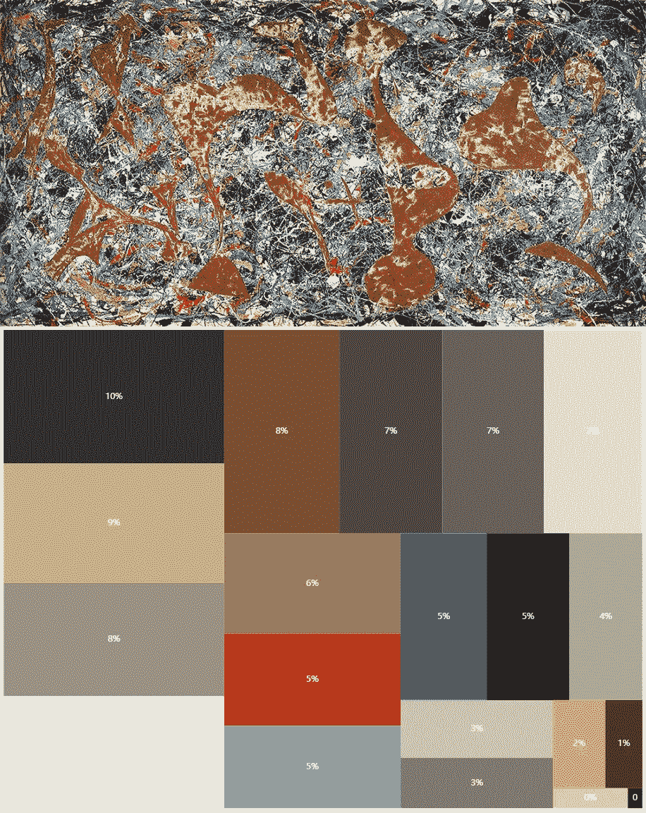

# 聚类波洛克

> 原文：<https://towardsdatascience.com/clustering-pollock-1ec24c9cf447?source=collection_archive---------7----------------------->

## *利用数据科学追踪波洛克多年来的调色板*

我对艺术不是很有热情:当我参观一个博物馆时，我是一个随意的游客，四处走动观察绘画和雕塑，试图尽可能多地学习，不幸的是没有欣赏到艺术作品背后的深度。

几年前，我参加了在威尼斯**佩吉·古根汉姆收藏**博物馆举办的鸡尾酒会，我有幸第一次看到了波洛克的画作:*炼金术*，现场直播。**杰森·布拉克**是一位颇具影响力的美国画家，也是艺术界**抽象表现主义运动**的主导力量。波洛克因使用滴画技术而闻名，这是一种抽象艺术形式，将颜料滴或倒在画布上。

我记得我真的很着迷于这样一个事实，在某种程度上，我的思想完全被一幅画吸引住了，这幅画只是由一些颜色随机滴在画布上制成的。我可能在那一刻意识到(喝着非常昂贵的 Aperol Spritz)，我看到的不是随机，而是被创造出来的美丽。

这个关于我肤浅的艺术知识的介绍，只是为了解释我为什么和什么时候对波洛克产生了好奇，以及为什么我决定花几个小时做下面的分析。

波洛克的颜色用法是如何随着时间的推移而演变的？为了回答这个问题，我决定做一些聚类实验，应用一些算法并绘制一些图表。

# 数据

为了对波洛克的绘画进行聚类，我需要一个可靠的来源，从那里我可以下载绘画并提取其他数据。在谷歌上快速搜索关于这位艺术家的信息，我就来到了这个[网站](https://www.jackson-pollock.org/)(它与波洛克这个人没有正式的联系)。我从网站上刮下这些画，还保存了每幅作品的年份和名称。

波洛克创作了许多大小迥异的杰作；我决定检索每幅画的尺寸:为了理解艺术家对颜色的使用，在混合中包含**画布尺寸**可能会很有趣。不幸的是，jackson-pollock.org 上没有这些信息，所以我需要在谷歌上手动搜索每件作品。我最终得到了一个`csv`文件和一堆`jpg`图像。当然，我的数据集只包含波洛克的部分作品，而不是他的全部作品；对了，接下来的事情就够了。

# 分析

有了所有需要的信息，我们现在可以开始享受 Python 的乐趣了。

首先，我们需要决定是根据图像的原始大小(也就是画布的大小)重新缩放图像。由于油漆尺寸的可变性相当高，这是一个至关重要的决定。我们至少有两种选择:

*   **根据原始尺寸**重新缩放图像:我们将加重较大画布中包含的颜色(例如*秋韵(数字 30)* 是一幅 14 平方米的作品)。这样做，我们将评估波洛克在他的职业生涯中使用的每种颜色“有多少桶”。
*   **将图像重新缩放至固定尺寸，每幅画都一样**:每幅画都有相同的重量。我们要评估的是画中每种颜色的比例。图像越小，算法越快，聚类结果越差。

我认为分析比例更有意思，所以我们将选择第二条路线:我们将图像重新调整为 200x200 像素的正方形。

下面的代码是一个简单的片段，它将图像调整到所需的形状(如果`size`参数是`None`，那么重新缩放将根据`csv`文件中的数据来完成)。常量`SCALE_FACTOR`设置为 1，有助于降低聚类算法的复杂性。实际的重新缩放将使用 OpenCV 来完成。

正如我之前所写的，我们想要做的是**分析波洛克在他的活动中如何改变他对颜色的使用**。当然，我们不能使用我们在数据集中找到的每一种颜色(我们最终可能会有 1600 多万个可能的值)。相反，我们要做的是尝试执行一个**聚类来减少要绘制的颜色**的数量；为此，我们将使用****k-means***。*

**k-means* 的目的是将 *n* 个观测值划分成 *k* 个簇，其中每个观测值属于均值最近的簇，作为簇[【3】](https://en.wikipedia.org/wiki/K-means_clustering)的*原型*。该算法试图最小化聚类中心和聚类中的点之间的欧几里德距离。在我们的例子中，**原型将代表我们将追踪多年的颜色**:这个选择背后的直觉是 k 意味着 will(？)将相似的颜色组合在一起，因此，通过跟踪原型，我们将跟踪许多与它相似的颜色。*

*为了跟随一种颜色跨越几年，我们需要考虑所有的绘画来执行聚类:**如果我们在每一幅图像上运行 *k-means* ，我们将得到 54 个不同的模型和许多不同的原型**。*

*然而，第一步是读取每一张图像，并将它们堆叠成一个数据集。对于聚类任务，我们将使用 RGB(红绿蓝)颜色空间，因此数据集将具有:*

*   *图像中的每个像素占一行。*
*   *3 列，一列用于红色通道，一列用于绿色通道，另一列用于蓝色通道。*

*这不是最有效的堆叠图像的方法，但确实有用。*

*在`stacked_images`变量中，我们有我之前描述的数据集。*

*在拟合模型之前，我们仍然需要一个预处理位:我们正在提升 RGB 格式的图像，每个通道值的范围可以从 0 到 255，我们将重新缩放[0，1]范围内的所有内容。*

*经过这一步，我们应该已经确定了波洛克在他的画作中使用的 **20 种主色**！首先，我们来看看他们。*

*为了创建下面的图像，我将像素转换到 **HSV** 色彩空间([色调-饱和度-值](https://en.wikipedia.org/wiki/HSL_and_HSV))，并根据色调、饱和度和值对颜色进行排序(按此顺序)；分段大小显示该颜色在(所有)绘画中所占的比例。*

**

*Top 20 colors used by Pollock, according to k-means clustering on 54 paintings*

*如果我们看一下一些集群，我们可以看到算法是可行的；仍然存在一些噪点，即颜色看起来与整体原型颜色“不太相似”。这背后的一个原因，是我们用来决定何时将两种颜色放在同一个桶中的距离度量； *k-means* 使用欧几里德距离:选择其他距离度量和其他算法来查看结果如何变化可能是值得的(我试图使用[球形 *k-means*](https://www.jstatsoft.org/article/view/v050i10/v50i10.pdf) ，但是结果很差)。*

*反正产量也没那么差。*

******

*现在我们已经有了合适的模型，我们可以把所有的画一幅接一幅地输入进去，看看每个原型在每个作品中的比例(下面是一些例子)。*

**

*The Flame — Jackson Pollock — 1938*

**

*Eyes in the Heat — Jackson Pollock — 1946*

# *形象化*

*在这一点上，我们已经有了所有我们需要的可视化的东西。我们将使用的数据是:*

*   ***集群-原型及其 RGB 组件**。*
*   *一堆`csv`文件，**每个文件对应一个作品**，其中我们知道一个特定的颜色原型被使用了多少次:*

*The output CSV for the clustering performed on a single painting*

*让我们挑选一些画(我们正在分析的画中我最喜欢的)，让我们看看这些画中有哪些颜色:*

**

*Alchemy — Jackson Pollock — 1947*

**

*Going West — Jackson Pollock — 1934*

**

*Out of the web — Jackson Pollock — 1949*

*不过，这个想法是为了观察波洛克的颜色在多年间的演变。我们能做的，是在时间维度上分析数据。我们已经有了每幅图像的所有比例，所以我们只需要根据相关年份对结果数据帧进行分组。*

*河图可以显示颜色的使用是如何随着时间的推移而演变的*

**

# *结论*

*怎么说呢，从上面的分析来看，杰森·布拉克逐渐去除了饱和色(黄色、红色)，将注意力集中在更褪色的背景色上，以灰色为主。*

*当然，我们只考虑了他画作的一个子集，每当分析整个作品时，看到不同的结果，我不会感到惊讶。请注意，我们在 30 年代绘制的样本较少，因此很明显，最近几年的颜色分布更加均匀。*

*有时候我对 k-means 的结果并不满意，但是我认为通过增加整形图像的尺寸(我们在这些图像上运行聚类)可以提高性能；顺便说一下，考虑到 54 个 200x200 像素的图像，我们已经需要聚类 216 万个点。*

*安德烈亚·伊伦蒂*