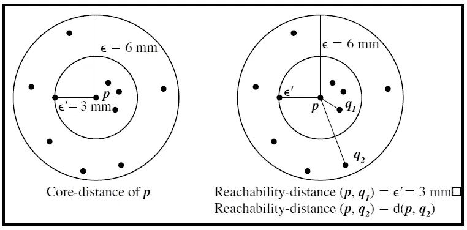
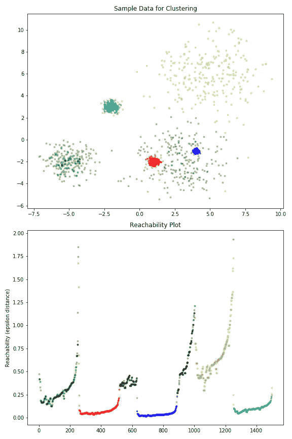
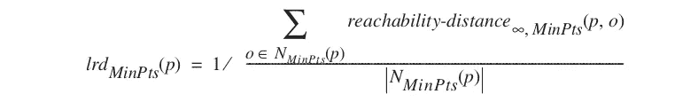
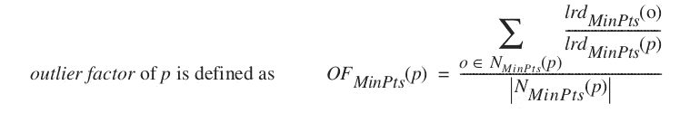
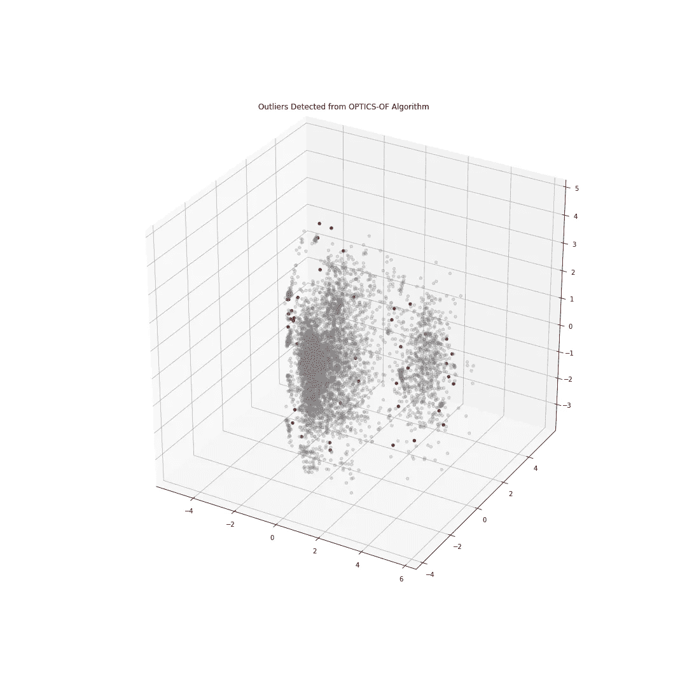

# 使用光学的聚类

> 原文：<https://towardsdatascience.com/clustering-using-optics-cac1d10ed7a7?source=collection_archive---------2----------------------->

## 一个看似无参数的算法

See What I Did There?

聚类是目前使用的一种强大的无监督知识发现工具，旨在将数据点划分为具有相似特征的组。然而，每个算法对参数都非常敏感。基于相似性的技术(K-means 等)的任务是指定存在多少个聚类，而分级通常需要人工干预来决定何时分配完成的聚类。最常见的基于密度的方法是 DBSCAN，它只需要两个关于如何定义其“核心点”的参数，但找到这些参数通常是一项极其困难的任务。它也不能找到不同密度的簇。

DBSCAN 有一个亲戚，称为 OPTICS(排序点以识别簇结构)，它调用一个不同的过程。它将创建一个可达性图，然后用于提取聚类，虽然仍然有一个输入，最大ε，但它主要是在您希望尝试并加快计算时间时引入的。其他参数没有其他聚类算法中的参数有那么大的影响，并且更容易使用默认值。首先，我将解释一下这个算法是如何工作的，它是如何包含在线异常值检测的，然后它是如何在最近的一个应用中对我非常有用的。

# **算法**

为了理解它是如何创造这个情节的，你必须理解几个定义。你必须先了解 DBSCAN 的工作原理，它使用的参数，以及核心点和边界点的区别。我将把它留在本文的范围之外。我们还将增加几个定义

*核心距离-* 在给定有限 MinPts 参数的情况下，使不同点成为核心点的最小ε。

*可达性距离-* 如果 o 是核心对象，则一个对象 p 相对于另一个对象 o 的可达性距离是到 o 的最小距离。它也不能小于核心距离 o。

尽管在这些计算中使用了 MinPts 参数，但这并不会产生太大的影响，因为所有距离的缩放率大致相同。

我们将使用这些定义来创建可达性图，然后用它来提取聚类。首先，我们从计算集合中所有数据点的核心距离开始。然后，我们将遍历整个数据集，更新可达性距离，每个点只处理一次。我们将只更新有待改进且尚未处理的点的可达性距离。这是因为当我们处理一个点时，我们已经确定了它的顺序和到达距离。选择处理的下一个数据点将是具有最近可达性距离的数据点。这就是该算法在输出排序中保持聚类彼此靠近的方式。原始可达性图的示例如下所示。

下一步是从图中提取实际的聚类标签。最常见的方法是使用局部最小值和最大值在图中搜索“谷”。根据所采用的方法，这里还会有一些参数发挥作用。

请参见下文，了解一些生成的样本数据与生成的光学标签和可达性图的对比。彩色点是那些被识别为集群的点，而灰色点代表噪声。

This example was taken directly from the Scikit-Learn development version

请注意，在这个生成的示例中，有大量的点被识别为噪声点。它们的密度与黄色星团相似，但在本次提取中没有被识别出来，因为它侧重于分离密度更大的区域。这就是微调提取参数的好处。在这种情况下，也可以使用提取聚类的其他方法。

# **异常值检测**

OPTICS 算法的另一个有趣的方面是它用于异常值检测的扩展，称为 OPTICS-of(异常值因子的 OF)。这将给出每个点的异常值，即与其最近邻居的比较，而不是整个集合的比较。由于这种“局部”原则，这是一种独特类型的异常值检测。我们也可以在创建它时使用一些以前的计算。

首先，它创建了一个新的度量，“局部可达性密度”，这是 MinPts-neighbors 的平均可达性(相对于正在计算的点)的倒数。

一旦我们对每个点都这样做了，我们将计算离群因子。要做到这一点，您需要对该特定点的 MinPts-neighbors 比率取平均值，如下所示。

OPTICS-OF 的“局部”部分是它区别于其他异常值检测方法的关键，因为它试图考虑特定选项的邻域。它还能够给它一个相对的离群值，而不仅仅是一个二进制值。显示了下面讨论的项目中的一个示例，异常对象显示为红色，异常因子的截止值为 2。

光学检测的一个缺点是不能很好地处理复制品。如果足够多的点占据相同的空间，它们的可达距离可以是 0，这在我们的局部异常值因子计算中引起问题。在这个场景中，我简单地删除了所有重复的内容，

# **用例**

我最近在一个项目中使用了光学，这个项目可能很好地展示了它在哪里可以有效，同时也给出了一个无耻的插头。我想在仓储/物流领域建立一个自动化的知识发现工具。优化仓库的一个关键部分是理解你的 SKU 基地的模式，以及当其他人完全不同时，他们中的一些人是如何行动的。过于一般化一个操作，你会错过标准化和整合过程的机会，所以集群是有帮助的。强迫每个 SKU 归入一个组会降低你要寻找的模式的准确性和有用性，所以我想采用一种基于密度的方法。使用 DBSCAN 会很有用，但是需要对每个数据集进行调优，而且有些模式会有不同的密度，很难找到。光学可以用在它的情况下伴随这两个。

不规则的动作项目也可能导致比它们的体积大得多的劳动量。这些通常是你通常不会注意到的较慢的项目，并且可能与其他类似的 SKU 有不一致的排序模式。这可能来自处理单位、季节性、订单通用性或其他因素的差异。但是它们不一定容易被发现，因为它不是一个单独的值，而是一个奇怪的组合。使用局部异常值因子来尝试并找到这些。

# **结论**

尽管无论如何都不是一种新的聚类算法，但光学是一种非常有趣的技术，我还没有看到大量的讨论。它的优点包括寻找不同的密度，以及很少的参数调整。

# **参考文献**

Ankerst、Mihael、Markus M. Breunig、Hans-Peter Kriegel 和 rg Sander。"光学:排序点以识别集群结构."美国计算机学会西格蒙德记录，第 28 卷，第 2 期，第 49-60 页。美国计算机学会，1999 年。

Ankerst、Mihael、Markus M. Breunig、Hans-Peter Kriegel 和 rg Sander。在 J.M. Zytkow 和 J. Rauch (Eds .):1999 年 PKDD，LNAI，1704 年，第 262-270 页，1999 年