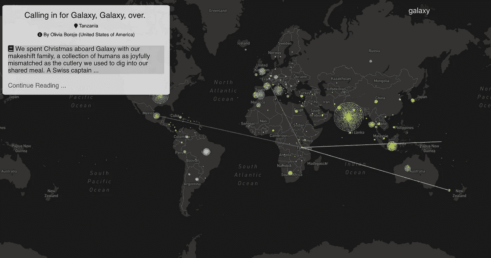
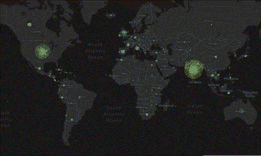
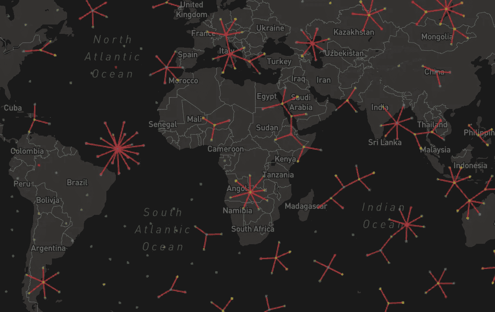

# 使用 Doc2Vec 和 WebGL 对旅行者的故事进行聚类和可视化

> 原文：<https://towardsdatascience.com/clustering-visualizing-travelers-stories-with-doc2vec-and-webgl-7337e30ad19e?source=collection_archive---------23----------------------->

## 深入分析

## 成千上万个旅行故事的互动可视化

这篇文章深入研究了数千个旅行故事的[**互动可视化**](https://zouhairm.github.io/nomadsVue) 的结果及其联系。可视化的目标是使有抱负的作家的提交有趣的发现。它面向广泛的用户群体；无论是有抱负的旅行作家，想探索新目的地的白日做梦的办公室职员，还是对理解人们为什么和如何旅行感兴趣的社会科学家。

在一个感觉国家和人民之间的差异被放大的时代，我希望这能提醒我们，我们许多人通过体验我们的星球和彼此的方式联系在一起。

# 动机

虽然我偶尔会抽出时间写下对生活和宇宙的思考，但它们很少能吸引你的想象力。相比之下，我的妻子奥利维亚是一个天才的故事讲述者和作家。我们休假期间，她的目标之一是写一篇短篇小说。自然，她是这次旅行的官方旅行作家，给朋友和家人发了几封日记电子邮件，他们每次都回信称赞。

因此，当我发现我们的旅游保险提供商(found 游牧民)正在赞助一个旅游写作比赛时，我说服她提交了一份摘录。起初，我确信她会赢；然而，当我们意识到有超过 10，000 份申请时，很明显胜算不大。

果然，结果出来了，她没有入围。虽然令人失望，但整件事让我想到有多少其他精彩的故事被分享，而其中有多少会被阅读。我发现自己在思考不同的问题:

*   评委们是怎么看完这么多故事并打分的？
*   如果他们能公开这些评分来看看她的排名，那不是很好吗？
*   不幸的是，他们没有——那么我怎么知道奥利维亚的故事有多好或独特呢？
*   除了 3 个获奖者和 10 个入围者，我如何才能找到其他伟大的故事？
*   给定所有的数据，我能让计算机生成类似的故事吗？

考虑到这一点，我开始尝试用这个数据集做一些有趣的事情。我知道这将是一个挑战，因为除了每个计算机系学生在某个时候都会做的朴素贝叶斯垃圾邮件过滤作业，我在自然语言处理(NLP)方面没有任何经验。尽管如此，我认为这将是一个学习机器学习工具如何用于文档的好机会。这也与我们在斯里兰卡的最后一周相吻合——就在那时，回归现实生活的前景开始成为现实，我迫切地想在回到全职工作之前做点“有趣”的事情(我一点也不知道，在我最终重新开始工作之前，我又去了 2 个国家，花了 4 个月的时间)

# 探索故事

我做了一些研究，看看我可以用什么工具来提取故事之间的有趣关系。我偶然发现了 Doc2Vec，这是一种越来越流行的神经网络技术，它将集合中的文档转换为高维向量，因此可以使用向量表示之间的距离来比较文档。

但在深入研究技术细节之前，我认为谈论这些结果有多么酷是值得和有趣的(在博客上写很棒——我不能在同行评议的论文上说这些！)您可以向下滚动到*How*部分，了解 scraper、模型构建/调整以及可视化网站的设计/编码。

## 呼叫银河，银河，完毕

这是奥利维亚故事的标题。当我们的朋友想要我们过来吃晚饭或者需要借用备用的小艇马达时，我们就会听到这种无线电广播。故事发生在桑给巴尔海岸的一艘帆船上，桑给巴尔是一个田园诗般的群岛，有荒凉的海滩和热情的人们。介绍是这样的:

> 我们在银河号上和我们的临时家庭一起度过了圣诞节，这是一群快乐地不匹配的人类，就像我们用来分享食物的餐具一样。一名瑞士船长在一种退化性眼疾夺去他的生命之前环游了世界。一对加拿大夫妇哀悼一个婴儿。在空巢中找到探索空间的南非父母。猎犬莫莉。我和祖海尔。我想知道别人会如何描述我们。

在 10，000 多个条目中，第二个与奥利维亚最相似的故事是贾斯汀的**12 天转换**，它的介绍很快吸引你:

> 我们乘着破旧的船旅行，船上沾满了海藻，但它的舵柄、收音机和手摇橘子榨汁机还在工作。一层新鲜的开心果。有三名船员:一名船长，一名领航员，一名厨师。其中一个是鬼；他们知道他们中的一个是鬼，每天晚上都听到咔哒咔哒的铁链声，但另外两个还没弄清楚是哪一个。

光是这一点就感觉像是一个小小的成功:模型确定了另一个以帆船为背景的故事，有一个船长和一些同伴，以及(如果你眯着眼睛)类似的写作风格！相似之处是显而易见的，这并不令人惊讶，因为两个故事使用了相似的词语，因为它们都发生在一艘帆船上。

但让我们来看看与奥利维亚最相似的故事。根据模型，那将是克斯丁的**休息一下**。乍一看，很难找出与这个在墨西哥迷失的澳大利亚人的故事的相似之处。会不会是因为 Kirstin 谈到了到达一个海滩并找到了乐于助人的人，而 Olivia 描述了当我们在 Pemba 的海滩上着陆时孩子们的好奇心和人们的热烈欢迎？也许吧，但我愿意相信这种强烈的相似性来自故事的结尾段落。这是克斯丁的:

> 每次我们在厨房提供帮助时，威利都会拿出他最喜欢的口头禅“休息一下”。他的内心仍然是一个孩子，他敬畏我们年轻的莫邪，将一切抛在身后去旅行，当他梦见过去时，他的眼睛变得呆滞，他希望自己也能这样做。我们仍然不敢相信海伦和威利会如此慷慨地收养我们这些流浪儿。仅仅两个月后，我们得知威利中风了。这是那种发人深省的陈词滥调，“人生苦短，趁年轻做吧”。
> 所以我们休息了一下。

这是奥利维亚的结束语:

> 尽管有奇迹，但也有同样的艰难。浪漫主义者把这种除了天气之外没有主人的生活描绘成自由的顶峰。但我觉得被困在这艘船上了。尽管 b*tch 不停地摇摆，但 Galaxy 还是劝我坐着别动，为此我很讨厌她。[……]银河根本不在乎我想要什么。也许是因为她一直专注于给我我需要的东西。是时候停下来消化一下突然发生的重大生活变化了。一个面对我的恐惧和发现我的优势的机会。地平线的景色，以及地平线后面可能会有什么。

事实就是这样:两个故事都有着复杂情感的结局。尽管一个人突然死亡，另一个人生活艰难，但**都提到了花时间旅行和消化生活的重要性**。

…

好吧，你可能认为我在吹牛，这是一个合理的批评。不过这很难说，因为这说明了神经网络和其他 ML 技术的困难之一:可解释性。该模型表示，根据它被训练的故事，这两个是相似的，但如果不深入研究其细节，很难知道为什么。比如它遇到的词汇很重要，这些故事只是在它目前看到的“语料库”的语境内相似。要对此有一个直觉，看看这篇[(国王-男人)+女人=王后](https://p.migdal.pl/2017/01/06/king-man-woman-queen-why.html)的帖子，它给出了对 Word2Vec 的分析，这是 Doc2Vec 背后的基础。不是 NLP 专家，我不确定是否有类似的方法来分析 Doc2Vec 的输出，以理解*为什么*两个文档相似。

Galaxie

# 地理集群

到目前为止，我一直专注于奥利维亚的故事，但我也花了几个小时阅读其他各种各样的故事来取乐。我很快发现自己手动做了很多这样的故事比较:从语料库中随机选择一个，并运行代码来显示与其最相似的故事。我想要一个更精简的替代方案，我认为这是一个与更广泛的受众分享所有这些旅行者故事的好方法。

起初我想，也许使用计算出的距离来生成一个[树状图](https://en.wikipedia.org/wiki/Dendrogram)会揭示故事中有趣的结构。然而，事实证明，显示有这么多节点的树状图并不能提供很多信息，也不容易使用。相反，我认为从在地图上按地理位置排列故事开始会更容易。

虽然在概念上最容易理解，但它花了最长的时间让这个视图工作，因为它是第一个。我需要找到合适的框架来使用。鉴于我最近在 [**DivetheData**](https://www.divethedata.com) 项目中的经历，我最初倾向于使用 Plotly/Dash。但是在经历了几次失败之后，我最终选择了 VivaGraphJS，它被誉为最快的图形可视化框架；它实现了它的承诺！

我选择将节点放在故事发生地点的中心，并根据作者的出生地给它们涂上颜色。由于元数据缺乏准确的地理位置细节，我创造性地进行了定位，并使搭配的故事构建成一个螺旋。最终的界面丰富多彩、快速流畅；它很快暴露了一些有趣的见解:

*   人口稠密的国家往往有很大比例的“本地”旅行者。美国的大多数圆点是绿色的(北美旅行者写的故事)，同样，印度和印度尼西亚的圆点是黄色的(亚洲旅行者写的故事)，尼日利亚和南非的圆点是橙色的(非洲旅行者写的故事)；紫色圆点代表巴西(南美人的故事)。这与受欢迎的旅游目的地形成了对比，这些目的地有更多的混合:英国、法国、西班牙、葡萄牙、意大利、摩洛哥、土耳其、泰国、越南、尼泊尔和日本都有来自世界各地作家的混合故事。
*   *故事很少通过地点*联系起来。除了印度，如果你把鼠标放在故事上，你会发现这些故事通常不是发生在同一个国家。我特意避免使用任何元数据(作者国家、提交类别等。)在模型中，因为我只想要故事文本来影响关系。
*   *很多故事的地点都被贴错了*。如果你花时间阅读一些条目，你会很快意识到作家有时会错误地把他们的原籍国作为拍摄地。

# 相似星座

除了不变的布局，VivaGraphJS 还实现了[强制定向图形绘制](https://en.wikipedia.org/wiki/Force-directed_graph_drawing)，这是一种超级漂亮的图形布局方式。它基本上是一个 N 体模拟，其中节点之间的链接就像弹簧一样将相关节点拉在一起，因此也是一个聚类算法。

我最初试图对所有的连接都这样做，但是连接太多了，结果是一团糟。然而，当链接仅限于最相似的连接时，结果图是有趣的。我喜欢把它想象成一个星座的集合，每个星座都有一个共同的线索，更容易通过“话题”来探索故事。不幸的是，没有一种优雅的方式来标记主题，正如这篇关于使用 Doc2Vec 的[自动主题聚类的文章中所讨论的，它最终使用新闻文章标题中最频繁出现的单词。](/automatic-topic-clustering-using-doc2vec-e1cea88449c)

尽管如此，当人们探索这些星座时，有趣的是聚集在一起的故事通常会共享相似的背景(徒步旅行、海洋、城市/市区、机场、火车等)。).这并不奇怪，因为即使是一个基本的“单词包”方法也应该能够将它们聚集在一起。然而，冰冷的是当相似之处似乎是由故事的结构或情绪驱动时:开始时迷路并从当地人那里获得帮助，与移民官员的麻烦最终得到解决，等等。以下是一些我认为值得强调的具体例子。

克服恐惧无论是对独自旅行、飞行、跳伞还是跳船的恐惧；这是最大的星座之一，不言自明。以下是集群中故事的示例:

*   **恐惧是暂时的，遗憾是永远的**莎拉·科里甘(美国)讲述她在澳洲留学的故事是最大的集群之一。它包含了几乎所有在其他电影中发现的元素:独自旅行，被恐惧或社会压力所阻碍，对飞行/飞行中的反胃感觉，变得更加冒险，以及跳跃！
*   **独自骑行**迈克尔·休斯顿(英国)讲述了他克服独自去柏林旅行的恐惧。
*   介绍 Kay Cabernet Kyndra Rothermel(美国)描述了她如何克服成为一名外籍人士的困难，并最终成为一名肾上腺素上瘾者，与鲨鱼一起玩滑翔伞和笼子潜水。

这组故事描述了因国籍、身份和/或宗教冲突而产生的挑战

*   **你好 Libertat！在这个故事中，Tsz Kwan Lam(香港)发现了加泰罗尼亚人为保护他们在西班牙的独特文化而进行的斗争与他的香港同胞为从中国获得政治自由而进行的斗争之间的相似之处。**
*   庞雅文·诺维科娃(哈萨克斯坦)描述了“英国退出欧盟脾气”是如何让她亲爱的东道国“听起来像一场充满种族色彩的公共汽车大战”，并指责它差点被赶出她的租房。
*   祖国的微笑讲述了印尼华人成长的困难。
*   **黎巴嫩的光彩**理查德·切马利(南非)思考着梅龙派教徒如何为宗教自由而战，为黎巴嫩的群山带来了一种独特的美。

**与翻译一起迷路**这是一组有点复杂的解释，但我认为它基本上是买票、不说当地语言、迷路和获得当地人帮助的混合:

*   为了逃离游客众多的慕尼黑，詹娜·加内瓦(保加利亚)在买了一张去萨尔斯堡的机票后，意外地发现自己来到了奥地利。
*   俄罗斯眼镜 Giovanni D'Amico(意大利)与西里尔字母斗争，但幸运的是在购买火车票时得到了 Masha 的帮助。
*   **给我一个结束讲话的朋友的门** Nicole Da Silva Fleck(巴西)从讲芬兰语的航空公司工作人员那里得知她的行李丢失了，并得到了讲芬兰语的邻居的帮助。

值得一提的一些其他集群:

*   岛屿海滩的小册子这些故事读起来几乎像广告，描述了果阿、长滩岛、婆罗洲、马尔代夫和普吉岛等标志性岛屿的海滩美景。
*   **旅行纪要**故事以详细的“一小时一小时，一天一天”的时间顺序写成
*   **丛林和它们的噪音**这是一小群关于人们在森林和丛林中发现的不和谐声音的故事。

# 双相似核

通过相似性距离进行聚类是直观的。然而，我有一个假设，某些故事可能如此不同，以至于它们应该出现多次，作为多个其他故事中最不相似的。我决定通过使用相同的强制定向布局方法生成集群来测试这一点，但这一次图形边缘连接不同的故事。由此产生的集群通常在它们的中心有我喜欢称之为二相似核的东西，即模型反复识别为最不相似的故事。

Bea Gilbert(英国)的《发现蒙古的无声秘密》展示了这种方法是如何产生一些独特的条目的。Bea 提交的作品与其他 20 多份作品相比是最不相似的，快速浏览一下她的介绍段落就可以明显看出她的写作风格(和用词)是独一无二的:

> 当我们向北行进时，面包屑般的头骨痕迹布满了森林。每一个都让人回想起前一天晚上，一只山羊死在黑暗中。珍珠般的皮肤被紧紧地拴在一个蒙古包肿胀的顶蓬上，磨损的蹄子还伸着，扎进了砾石里。[……]我的旅程一直被杂乱、喧闹和噪音打断。一位咳嗽声令人不寒而栗的机场出租车司机把我带到了乌兰巴托:这是苏联入侵和无组织的现代化冲刺之间的灰色和汽车堵塞的矛盾。

不幸的是，有许多故事的写作风格不是很好。好的一面是，这些故事通常会围绕着另一个风格明显不同、因而也更好的故事。例如，荣继敏·巴巴罗(澳大利亚)写的《不要停下来》讲述了一次平缓的远足变成陡峭的攀登，以一种愉快的风格写道:

> 当那辆锈迹斑斑、嘎嘎作响的旧货车驶过欣欣向荣的绿色稻田和纯净的乡村时，我的思绪停留在这个田园诗般的背景下可能正在修复的暴行上。当我们驶过一扇天蓝色的大门，驶上一条土路车道时，我没想到会看到像树屋一样充满活力的彩绘木屋。这是阳光之家，一个离金边 90 分钟路程的孤儿院，是 50 多个被剥削和遗弃的孩子的家。它与我先前对孤儿院的想法相去甚远。这是一个避难所；一个避难所。

对比这两个摘录，荣继敏的条目出现最不相似:

> 如果我们谈论葡萄牙，你一定记得葡萄牙的一个著名足球运动员，对吗？没错，他就是 c 罗。葡萄牙和罗纳尔多一样，他是一个出生在那里的足球运动员。如果我们谈论葡萄牙，这个国家以他们的足球历史而闻名。即使在 2016 年，葡萄牙也赢得了 2016 年欧洲冠军杯🏆⚽️和他们从未停止是世界杯的参与者。很神奇吧？但是你知道吗？
> 
> 我一直梦想有一次航行，我的梦想将通过不独自这样做来实现，所以我从未停止梦想。我从来没有指望找到一个海上旅行，而看着我的资源，但冲动和梦想既没有停止，我也没有做任何事情来阻止它，而是我总是在寻找一个机会，站在前甲板上，感觉自己在一个完全不同的平面上。

最后，这些二相似性聚类的另一个特殊性是它们偶尔包含外语故事。这有点耐人寻味，比如亚当·赫弗南(爱尔兰)的《我们的小 T2》与 20 个西班牙作品最不相似。这仅仅是因为语言，还是这个模型学到了一些关于西班牙故事的有意义的语义，使它们与亚当的故事不同？朱莉·斯巴库尔的**鸡肉**也是如此，出于某种原因，它与半打阿拉伯语作品最不相似。

## 数据搜集和模型训练

当我第一次开始做这个项目时，我想我会用 python 来完成大部分工作。毕竟，这是当今事实上的脚本语言，ML 工具数量的增加使它成为一种自然的选择。果然，我使用`BeautifulSoup`编写了 webscraper，这使得下载故事和将它们与相关元数据一起存储变得简单明了。事实上，下载故事比写剧本花费的时间还要长，但这主要是因为斯里兰卡没有最快的宽带连接。

一旦故事被存储到 Yaml 文件中，我花了一些时间来选择我要用它们做什么。有很多 NLP 包，但是 Word2Vec 和 Doc2Vec 反复出现，因为它们易于理解和实现，并且显然产生了良好的结果。我最终遵循了 GenSim 的[教程，果然，在一些 python 脚本和使用 Jupyter 笔记本进行实验的一天内，我有了能够开始比较故事的第一批结果。](https://www.machinelearningplus.com/nlp/gensim-tutorial/)

Doc2Vec 方法的巧妙之处在于它是无人监管的，因此不需要任何标记。然而，不利的一面是，它可能会受到限制。例如，如上所述和这篇使用 Doc2Vec 帖子的[自动主题聚类，虽然 Doc2Vec 生成的向量对于聚类是有用的，但它们不一定有助于自动标记它们。](/automatic-topic-clustering-using-doc2vec-e1cea88449c)

## 图形和地图可视化

可视化数据比我想象的要困难得多。我最初倾向于使用 Dash/Plotly，因为我在以前的 DataViz 项目中有过使用它的经验。它看起来很有前景，特别是因为 Plotly 有一个用于[细胞景观](http://js.cytoscape.org)的包装器。随着我进一步探索这个选项，我意识到在服务器端我不需要做太多事情，因此很难证明使用 Dash 的必要性。我还决定绕过 Plotly，因为我需要使用 Cytoscape 的一些更高级的功能。[的结果](https://zouhairm.github.io/nomadStoriesMap/)是一个很好的概念证明，但是由于节点数量太多，结果证明它太慢了，不太实用。

我最终找到了被誉为最快的图形可视化框架的 VivaGraphJS。虽然没有 Cytoscape 流行，也不容易设计，但 VivaGraph 有一个主要优势:它可以将 WebGL 用作渲染器。WebGL 使用 GPU 来生成可视化，因此显著提高了性能和交互性。

我花了比预期更长的时间在地图上布置节点。我最初认为为网页设置一个可以平移和缩放的背景就可以了，但由于屏幕和 WebGL 画布之间不同的参考框架，这变得有些复杂。当我最终得到它的工作，我不满意的背景质量恶化。相反，我转向了地图框，它提供了一些在两个坐标之间投影和反投影的功能。它仍然需要一些编码和实验来正确处理最小/最大缩放和平移边界，但结果更令人满意。

## Web 框架

VivaGraph 的学习曲线比预期的要陡峭一些，但这主要是因为我不熟悉用 Javascript 开发。请记住，我从期望自己主要用 python 编码，到突然不得不理解 JS 闭包、promises、webpack 和 npm！更糟糕的是，我还在学习如何使用 [Vue.js](https://vuejs.org/) 。Vue 使得轻松地添加组件来与故事交互成为可能，比如搜索框、阅读窗格和布局选项框。

如果我坚持使用 Dash(其组件使用 React.js)，事情可能会简单一些。好处是，在这个过程中，我现在对 Javascript 和反应式框架有了更多的了解。

# 下一步是什么？

到目前为止，我对项目的状态很满意:可以很容易地探索故事，找到它们之间的关系，并识别有趣的故事。但是，还有一些额外的功能我很想花点时间去了解，具体来说就是:

*   实现故事生成。也许使用双向 LSTM，正如在这个[系列文章](https://medium.com/@david.campion/text-generation-using-bidirectional-lstm-and-doc2vec-models-1-3-8979eb65cb3a)中所描述的。事实上，看看一个模型是否能生成一个与提交内容(或一组提交内容)最相似或最不相似的故事将会很有趣。
*   插图故事:为每个故事找到一张“封面图片”会很酷。由于文本太短，无法概括，这种方法将有助于快速浏览故事的内容。或许利用[注意力生成网络](https://github.com/taoxugit/AttnGAN/)？
*   使直接链接到一个故事或特定的布局成为可能。同样，如果能够对故事进行收藏或投票，那就太好了。
*   修复界面错误:虽然我花了很多时间来润色它，但界面仍然有问题，偶尔会有一些角落情况会使显示出现奇怪的行为。
*   让所有的故事都可以搜索。目前，只有元数据是可搜索的。让所有的文本都可以搜索可能需要一个服务器端的实现，或者将故事转移到数据库中。

我本周开始了一项新工作，所以我们将看到我有多少空闲时间来做这些改进。如果有人想尝试一下，所有的代码都在 G [ithub](https://github.com/zouhairm/nomadsVue) 上。请随意派生和提交拉式请求。

*原载于 2019 年 8 月 5 日*[*https://zouhairm . github . io*](https://zouhairm.github.io/nomadStories/)*。*