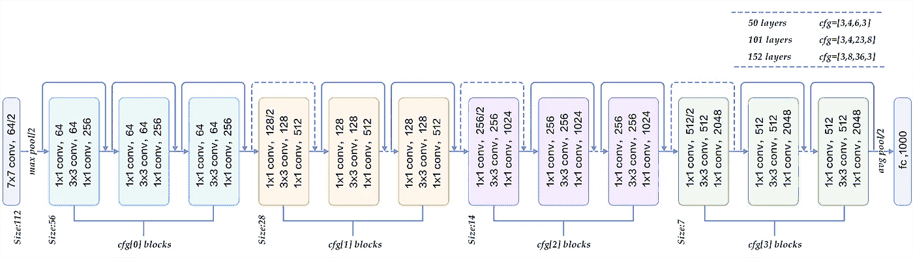
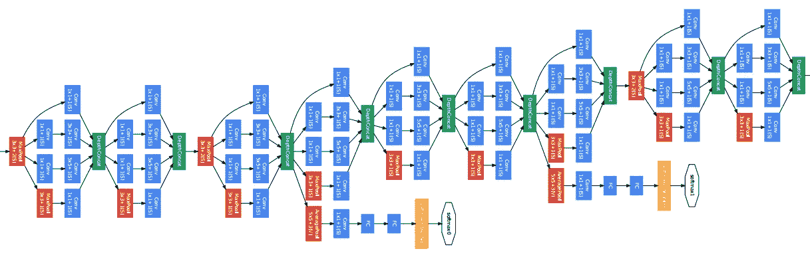

# CNN 架构，深度挖掘

> 原文：<https://towardsdatascience.com/cnn-architectures-a-deep-dive-a99441d18049?source=collection_archive---------2----------------------->

## 实现所有流行的 CNN 架构。


Various CNN Architectures [Image Sources](https://miro.medium.com/max/2800/0*pkrso8DZa0m6IAcJ.png)

在深度学习中，卷积神经网络(CNN)是一类深度神经网络，最常用于分析视觉图像。卷积神经网络是用于图像分类、分割、对象检测和许多其他图像处理任务的最先进的模型。为了开始进入图像处理领域或提高定制 CNN 模型的预测准确性，一些著名的 CNN 架构的知识将使我们在这个竞争激烈的世界中跟上步伐。因此，在这篇文章中，我将介绍一些著名的 CNN 架构。我主要强调如何在 Keras 中实现它们，也就是说，用那些体系结构的思想和结构制作定制模型。

在这篇文章中，我将介绍以下架构:

*   VGG 网
*   雷斯内特
*   密集网
*   初始网络
*   例外网

## VGG 网(视觉几何组)


Image showing various VGGNet Architectures. [Image Source](https://miro.medium.com/max/2244/1*_1DEx3bHlnBApCWWQ0HgcQ.png)

VGG 网络是一个简单明了的 CNN 架构。虽然它看起来很简单，但它确实胜过许多复杂的架构。它是 2014 年 ImageNet 挑战赛的亚军。如上图所示，总共有 6 个 VGGNet 架构。其中，VGG 16 号和 VGG 19 号最受欢迎。

> VGG 建筑的想法很简单。我们必须用越来越大的滤波器尺寸来堆叠卷积层。即，如果层 1 具有 16 个过滤器，那么层 2 必须具有 16 个或更多过滤器。

另一个值得注意的点是，在每个 VGG 架构中，所有的过滤器都是 3*3 的大小。这里的想法是，两个 3*3 滤波器几乎覆盖了 5*5 滤波器将覆盖的区域，并且两个 3*3 滤波器比一个 5*5 滤波器更便宜(在要执行的乘法总数的意义上更便宜)。

让我们在 Keras 中创建一个具有 6 个卷积层的自定义 VGG 网络。

Implementing Custom VGG Architecture in Keras. [Snippet Source](https://gist.github.com/kumararduino/ab4e3ffad6bd5fe9088f1d532b70f985)

上面的代码将创建一个简单的六层卷积 VGG 网络。在每个卷积层之后，我添加了一个 Dropout 层以减少过拟合，并在每对卷积层之后添加了 MaxPooling 层以进行降维。

VGG 的问题在于，这种幼稚的架构不利于**更深层次的网络，**随着网络越深入，就越容易出现**消失梯度**的问题。更多的训练和更多的参数必须在更深层次的 VGG 架构中进行调整。

然而，VGG 网对于迁移学习和小的分类任务是方便的。

## 剩余网络



ResNet Architecture. [Image Source](https://miro.medium.com/max/2800/0*pkrso8DZa0m6IAcJ.png)

残余网络是第一个在 ImageNet 挑战赛中获胜的深层网络。2015 年 ImageNet 使用的 ResNet 有 152 层。在那之前，训练这种更深层次网络的想法只是一个梦想。然而，ResNet 实现了 3.57%的错误率(前 5 名错误率)。

ResNet 训练这种深度(152 层)网络的成功秘诀是，它有剩余连接。在 VGG，每一层都与前一层相连，从前一层获得输入。这确保了在从一层传播到另一层时，越来越多的有用特征被携带，而不太重要的特征被丢弃。这不是最好的方法，因为后面的层看不到前面的层所看到的。ResNet 不仅将前一层连接到当前层，还将前一层后面的一层连接到当前层，从而解决了这个问题。通过合并，现在每一层可以看到的不仅仅是前一层的观察结果。


Identity Shortcut Connection. [Image Source](https://encrypted-tbn0.gstatic.com/images?q=tbn%3AANd9GcRC5NE6iebgG2L1gELx_FMVB1GtHMvDCZD6Z3zX32Fmg3fhZ_qs)

> ResNets 有许多变体。核心思想是，让我们把 **x** 看作某个 Conv2D 层的输出。将几个 Conv2D 层添加到 x，然后**将输出添加到 x** ，并将其作为输入发送到下一层。

通过在每个卷积层之后使用**批处理标准化**层，这种深度残差网络的训练是可能的。批量标准化层将提高权重值，因此在训练时可以使用更高的学习率，这将有助于训练更快，也可以最小化**消失梯度**问题。

让我们将 ResNet 的概念转换成一段代码，这段代码可以是任意的，以实现我们想要的架构。

Snippet to create a custom Residual Layer. [Snippet Source](https://gist.github.com/kumararduino/bed23d471fbb3132959fc6143e43c77a)

上述函数采用如下参数:

```
***x*** : input to the res_layer.
***filters*** : number of filters in each convolutional layer.
***pooling*** : whether to add a pooling layer (default is False).
***dropout*** : whether to add a dropout layer (default is No).
```

过程是，它将输入层连接到 Conv2D 层，Conv2D 层具有我们函数调用中指定的过滤器，然后附加 BatchNormalization 层，在 batch normalization 层上添加 ReLU Activation 层，然后堆叠另一个 Conv2D 层。现在，这个堆叠输出与初始输入相加，但初始输入通过给定滤波器的 Conv2D 层进行转换。完成此步骤是为了匹配将要添加的两个图层的输出大小。然后，如果我们希望有一个 MaxPooling2D 层，我们添加它，如果给定了任何 dropool 值，那么也添加一个 dropool 层，最后再添加一个 BatchNormalization 层和 Activation 层，然后这个最终层由我们的 res_layer 函数返回。


Custom res_layer architecture.

现在我们已经创建了 res_layer，让我们创建一个自定义的 resnet。

Custom ResNet. [Snippet Source](https://gist.github.com/kumararduino/1699d6342926139bd83764124a48367c)

上面的代码创建了一个简单的 ResNet 模型。res_layer 函数用于简化堆叠多个层并多次添加它们的过程，这使得我们的代码具有可读性和可管理性。

ResNet 的优势在于，我们可以用这种架构训练更深层次的网络。

## DenseNet


Dense Layer architecture. [Image Source](https://arxiv.org/pdf/1608.06993v3.pdf).

在 ResNet 中，我们**添加了**堆叠层及其输入层。在 DenseNet 中，对于一个给定的层，在它之前的所有其他层被**连接**并作为当前层的输入。通过这样的安排，我们可以使用更小的滤波器数量，并且这将最小化消失梯度问题，因为所有层都直接连接到输出，梯度可以直接从每个层的输出计算。

类似于 res_layer 函数，让我们为 dense_layer 开发一个函数。

Custom dense_layer function. [Snippet Source](https://gist.github.com/kumararduino/2e2a1c90b7c1fc9989959a8e3f541876)

```
Inputs
***x*** : input layer.
***layer_configs***: a list of dictionaries, where each dictionary is of the below format.
```

Example of dense_layer configuration list. [Snippet Source](https://gist.github.com/kumararduino/2ce1e463c567f07ffe32f93336dd6c02)

```
Inside the layer_configs, the dictionaries have the following keys:"***layer_type***" : which type of layer we are going to create. Currently only Conv2D layer is supported by the above dense_layer function."***filters***" : determining number of filters in that layer. An integer is given as value."***kernel_size***" : size of the kernel. A tuple of kernel size is given as value. like (3, 3)."***strides***" : step size of stride. An integer is given as value."***padding***" : type of padding to be applied to the layer."***activation***" : type of activation to be applied to the layer.
```

现在我们已经定义了我们的函数，让我们创建一些自定义层配置。

custom layer_configs. [Snippet Source](https://gist.github.com/kumararduino/e0a666f2140b723745fd6d3da4f99fd0)

现在，让我们创建一个自定义的 DenseNet。

Custom DenseNet model. [Snippet Source](https://gist.github.com/kumararduino/d3ea68366ec852d55f76d77a5b1495b7)

与 ResNet 相比，DenseNet 有更多的中间连接。此外，我们可以在密集层中使用较小的过滤器数量，这对于较小的模型是有益的。

## 初始网络



Inception Net architecture. [Image Source](https://miro.medium.com/max/2434/1*_rCyzi7fQzc_Q1gCqSLM1g.png).

盗梦空间意味着更深入。在 ResNet 中，我们创建了更深层次的网络。盗梦空间网的理念是让网络**更广**。这可以通过并行连接具有不同过滤器的多个层，然后最终连接所有这些并行路径以传递到下一层来实现。


Inception layer Architecture. [Image Source](https://encrypted-tbn0.gstatic.com/images?q=tbn:ANd9GcQksprDAKDmbIva8RfIyfN3pn2YBF1Y25v9PsvnqzPNaB6awYP2hA).

我们可以通过编写 inception_layer 函数来做到这一点，它可以创建任意配置的 inception_layer。

custom Inception layer function. [Snippet Source](https://gist.github.com/kumararduino/12e0cc146f17e7d40bc8c58aa6767c0d)

```
Inputs
***x*** : input layer.
***layer_configs*** : a list of lists, where each list have dictionaries.
```

让我们看一个演示层配置列表来了解这个想法。

Demo layer_configs format. [Snippet Source](https://gist.github.com/kumararduino/05d218d2cd30acbdd868f18446c7ee50)

```
The keys in the dictionaries are:"***layer_type***" : which type of layer we are going to create. Currently only Conv2D layer is supported by the above dense_layer function."***filters***" : determining number of filters in that layer. An integer is given as value."***kernel_size***" : size of the kernel. A tuple of kernel size is given as value. like (3, 3)."***strides***" : step size of stride. An integer is given as value."***padding***" : type of padding to be applied to the layer."***activation***" : type of activation to be applied to the layer.
```

现在我们已经创建了一个 inception_layer 函数，让我们创建一个定制的 Inception Net。本例中不同层的 layer _ configs 可在本 [***要点***](https://gist.github.com/kumararduino/9d55e7d76a2435784a49114aff4579a8) 中找到。

最后，让我们创建一个定制的初始网络。

Custom Inception Net. [Snippet Source](https://gist.github.com/kumararduino/4b0ae1f0fa0c913fe4aa1a2bbef89bff)

有许多不同的初始网络。它们之间的区别是:

*   不要使用 5*5 的过滤器，使用两个 3*3 的过滤器，因为它们计算效率高(如 VGGNet 中所讨论的)。
*   在执行任何具有较大滤波器尺寸的 Conv2D 层之前，使用具有较小滤波器数量的 1*1 Conv2D 层作为具有较少滤波器数量的 1*1 滤波器，将减少输入的深度，因此计算效率高。
*   不是执行 3*3 滤波，而是先执行 1*3 滤波，然后执行 3*1 滤波。这将大大提高计算效率。

使用我们的 inception_layer 函数，我们可以通过相应地编写我们的 layer _ configs 来定制上述所有类型的 InceptionNet 架构。

概念网更可取，因为它们不仅更深，而且更宽，我们可以堆叠许多这样的层，而且与所有其他架构相比，要训练的输出参数更少。

## 例外网


Xception Net Architecture. [Image Source.](http://zpascal.net/cvpr2017/Chollet_Xception_Deep_Learning_CVPR_2017_paper.pdf)

Xception Net 是在计算效率方面对 InceptionNet 的即兴发挥。**异常意味着极端的开始**。上图中呈现的 Xception 架构更像是一个 ResNet，而不是 InceptionNet。Xception Net 优于 Inception Net v3。

初始网络和例外网络之间的区别在于，在初始网络中执行正常的卷积运算，而在例外网络中执行深度方向可分离的卷积运算。深度方向可分离卷积不同于普通卷积，在普通 Conv2D 层中，对于(32，32，3)图像的输入，我们可以在 Conv 层中使用任意数量的滤波器。这些滤波器中的每一个都将在所有三个通道上工作，并且输出是所有对应值的总和。但是在深度方向可分离卷积中，每个通道只有一个核来做卷积。因此，通过执行深度方向可分离卷积，我们可以降低计算复杂度，因为每个核仅是二维的，并且仅在一个通道上进行卷积。在 Keras 中，我们可以通过使用 DepthwiseConv2D 层来实现这一点。

让我们创建一个简单的异常网络架构。

Custom Xception Net architecture. [Snippet Source](https://gist.github.com/kumararduino/4d71456d3c6960ac8597be416cb41079)

以上是 Xception Net 架构的一个比较简单的实现。我们可以在低功耗器件中使用 XceptionNet，因为 Conv 层的计算量较少，而且与普通卷积层相比，精度相当。

本文背后的主要思想是通过实际创建 CNN 架构来熟悉它们。这将建立和提高我们对 CNN 的直觉和理解，以及如何和何时使用它们。还有许多其他流行的 CNN 架构。它们看起来或多或少类似于上述架构，只是增加了一些功能。

例如，让我们以 MobileNet 为例。它执行深度方向可分离的卷积，而不是正常的卷积。这使得它更适合用于低功耗设备和响应速度更快的型号。

总而言之，我更喜欢在较小的分类任务中使用像这样的定制架构，数据集大小适中，在较小的数据集情况下转移学习。就响应速度而言，我们倾向于较小的型号。此外，通过使用集成方法，我们可以在定制架构中获得相当好的精度。

帮助我做到这一点的文章和论文有:

盗梦空间网[https://arxiv.org/pdf/1409.4842v1.pdf](https://arxiv.org/pdf/1409.4842v1.pdf)

https://arxiv.org/pdf/1608.06993v3.pdf，https://towardsdatascience.com/densenet-2810936aeebb[密网](/densenet-2810936aeebb)

Xception Net[http://zpastal . Net/cvpr 2017/Chollet _ Xception _ Deep _ Learning _ CVPR _ 2017 _ paper . pdf](http://zpascal.net/cvpr2017/Chollet_Xception_Deep_Learning_CVPR_2017_paper.pdf)