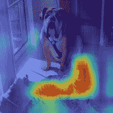
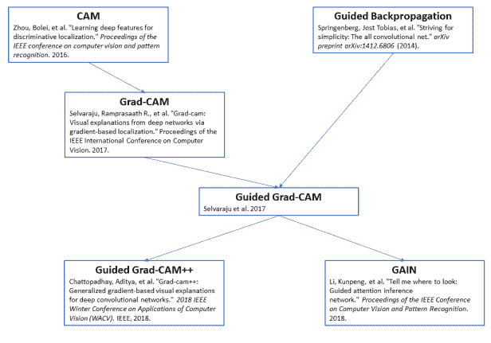
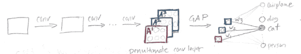
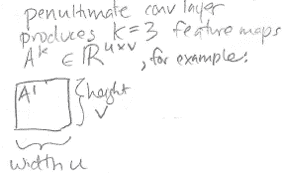
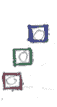
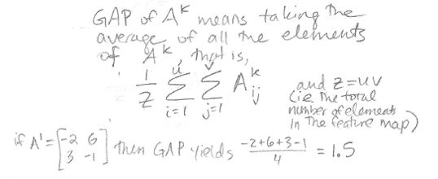
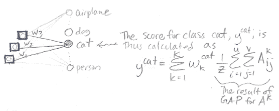
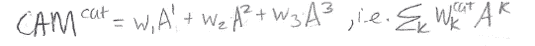
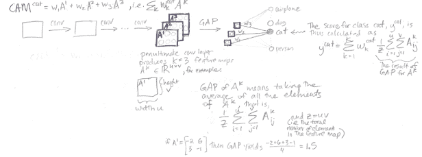

# CNN 热图:类别激活映射(CAM)

> 原文：<https://towardsdatascience.com/cnn-heat-maps-class-activation-mapping-cam-614180e360d5?source=collection_archive---------24----------------------->

这是即将发布的一系列文章中的第一篇，这些文章讲述了不同的可视化技术，这些技术是 CNN 为了做出决定而查看图像的哪一部分。类别激活映射(CAM)是一种生成热图以突出图像的特定类别区域的技术。

# **热图的效用**

下面是一个热图示例:

在这张来自[Jacob Gil/py torch-grad-cam](https://github.com/jacobgil/pytorch-grad-cam)的图片中，一只猫以红色突出显示为“猫”类，这表明网络在做出分类决定时正在寻找正确的地方。

可视化神经网络在看哪里是有用的，因为这有助于我们理解神经网络是否在看图像的适当部分，或者神经网络是否在作弊。以下是一些神经网络在做出分类决策时可能会作弊并查看错误位置的示例:

*   CNN 将一幅图像归类为“火车”，而实际上它正在寻找“火车轨道”(这意味着它将错误地将一幅只有火车轨道的图片归类为“火车”)
*   美国有线电视新闻网(CNN)将胸部 x 光图像归类为“高患病概率”，不是基于疾病的实际表现，而是基于放置在患者左肩上的金属“L”标记。关键是，只有当病人躺下时，这个“L”标记才直接放在病人身上，只有当病人太虚弱而不能站立时，病人才会躺下接受 x 光检查。因此，CNN 知道了“肩膀上的金属 L”和“病得无法站立的病人”之间的关联——但我们希望 CNN 寻找疾病的实际视觉迹象，而不是金属标志。(参见 [Zech 等人 2018“混杂变量会降低放射学深度学习模型的泛化性能。”](https://arxiv.org/pdf/1807.00431.pdf))
*   CNN 学习基于在数据集中五分之一的马图像中存在左下角源标签来将图像分类为“马”。如果这个“马源标签”被放置在汽车的图像上，那么网络将该图像分类为“马”(参见 [Lapuschkin 等人 2019 年揭示了聪明的 Hans 预测器并评估了机器真正学习的内容。](https://arxiv.org/pdf/1902.10178.pdf))

# **一组相关论文**

这里有一个图表，显示了 CNN 热图可视化的几篇论文之间的关系。你可以在左上角看到 CAM，这是这篇文章的重点:

以下是完整 CAM 论文的链接:[周等 2016《学习深度特征进行判别定位》](http://openaccess.thecvf.com/content_cvpr_2016/papers/Zhou_Learning_Deep_Features_CVPR_2016_paper.pdf)我特别推荐看图 1 和图 2。

# **CAM:类激活映射**

## **凸轮架构**

CAM 背后的想法是利用一种特定的卷积神经网络架构来产生热图可视化。(参见[这篇文章对卷积神经网络](https://glassboxmedicine.com/2019/05/05/how-computers-see-intro-to-convolutional-neural-networks/)的回顾。)

架构如下:卷积层，然后是全局平均池，然后是一个输出分类决策的全连接层。

在上面的草图中，我们可以看到一些通用的卷积层，导致了“倒数第二个卷积层”(即网络中的倒数第二层，也是最后一个卷积层)。)在这个“倒数第二个 conv 层”中，我们有 K 个特征地图。在该草图中，对于特征地图 A1、A2 和 A3，K = 3。

但是实际上 K 可以是任何值——例如，你可能有 64 个特征地图，或者 512 个特征地图。

按照本文[的符号](https://pdfs.semanticscholar.org/223a/d42ec73c1a41355c0ca3626fa99c7841f840.pdf)，每个特征图具有高度 v 和宽度 u:

## **全球平均统筹(缺口)**

全局平均池通过对某个特征映射中的数字取平均值，将该特征映射转换为单个数字。因此，如果我们有 K=3 个特征地图，在全局平均汇集之后，我们将最终得到 K=3 个数字。这三个数字在上图中用这三个小方块表示:

下面是用[和](https://pdfs.semanticscholar.org/223a/d42ec73c1a41355c0ca3626fa99c7841f840.pdf)来描述差距的符号:

于是，在 GAP 中，我们把特征图 Aij 的元素相加，从 i = 1 到 u(全宽)，从 j = 1 到 v(全高)，然后除以特征图中的元素总数，Z = uv。

## **全连通层和分类得分**

在我们执行全局平均池后，我们有 K 个数字。我们使用单个全连接层将这些 K 数转化为分类决策:

请注意，在图中，我没有显示完全连接层中的每个权重，以避免混淆绘图。实际上，红色数字(来自 GAP(A1)的输出)通过权重连接到每个输出类，绿色数字(来自 GAP(A2)的输出)通过权重连接到每个输出类，蓝色数字(来自 GAP(A3)的输出)通过权重连接到每个输出类。全连接层回顾见[本帖。](https://glassboxmedicine.com/2019/01/17/introduction-to-neural-networks/)

只关注“cat”输出类，我们有三个权重 w1、w2 和 w3，它们将我们的全局平均池的输出连接到“cat”输出节点。我们使用上图所示的等式为类别“cat”生成一个得分 y^cat，对应于

y^cat = (w1)(红色)+ (w2)(绿色)+ (w3)(蓝色)

## **类激活映射**

现在我们已经浏览了整个架构，从输入图像到分类分数。最后一步是获取我们的 CAM 热图可视化，具体如下:

这看起来与我们计算得分 y^cat 的方式非常相似，但不同之处在于，我们不是将权重 w1、w2 和 w3 乘以由特征地图 Ak 上的全局平均池产生的单独数字，而是将权重直接乘以特征地图。因此，虽然分数的输出是单个数字，但 CAM 的输出实际上是一个数字网格。这个 CAM 数字网格就是我们的热图！

## **总结**

以下是我总结整个 CAM 文档的一页草图:

## **参考文献**

*   [周等 2016“学习深度特征进行判别定位”](http://openaccess.thecvf.com/content_cvpr_2016/papers/Zhou_Learning_Deep_Features_CVPR_2016_paper.pdf)
*   [Selvaraju 等人 2017《Grad-CAM:为什么这么说？”](https://pdfs.semanticscholar.org/223a/d42ec73c1a41355c0ca3626fa99c7841f840.pdf)
*   [用于对象本地化的全局平均池层](https://alexisbcook.github.io/2017/global-average-pooling-layers-for-object-localization/)

*原载于 2019 年 6 月 11 日*[*http://glassboxmedicine.com*](https://glassboxmedicine.com/2019/06/11/cnn-heat-maps-class-activation-mapping-cam/)*。*