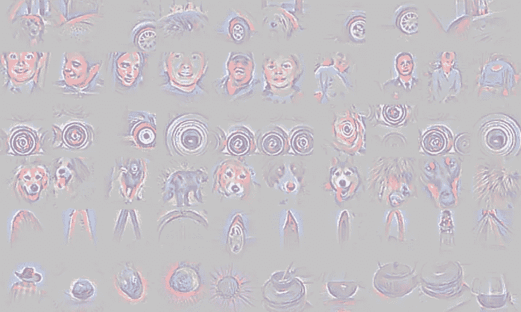
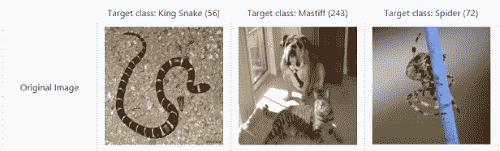
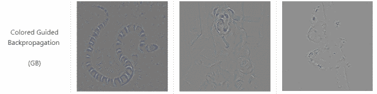
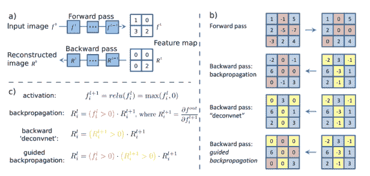
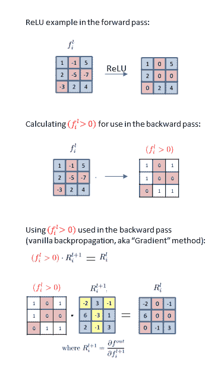
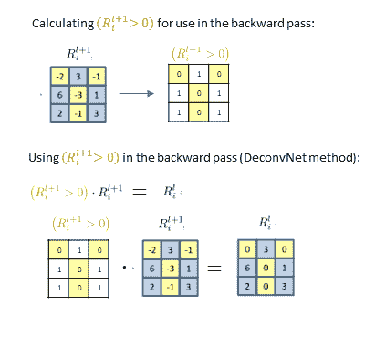
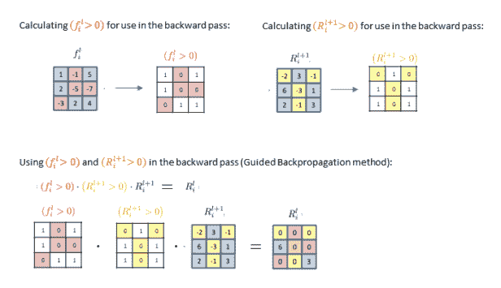

# CNN 热图:梯度对比去耦合对比引导反向传播

> 原文：<https://towardsdatascience.com/cnn-heat-maps-gradients-vs-deconvnets-vs-guided-backpropagation-96d647940f23?source=collection_archive---------16----------------------->

这篇文章总结了创建显著图的三种密切相关的方法:梯度(2013)，去卷积(2014)和引导反向传播(2014)。显著图是热图，旨在提供对卷积神经网络正在使用输入图像的哪些方面进行预测的洞察。这篇文章中讨论的所有三种方法都是[一种事后注意力的形式，不同于可训练的注意力](https://glassboxmedicine.com/2019/08/10/learn-to-pay-attention-trainable-visual-attention-in-cnns/)。虽然在最初的论文中，这些方法以不同的方式描述，但是除了它们通过 ReLU 非线性处理反向传播的方式之外，它们都是相同的。

请继续关注下一篇帖子，“CNN 热图:显著图的健全性检查”，讨论阿德巴约等人在 2018 年发表的论文，该论文提出，在这三种流行的方法中，只有“梯度”是有效的。具体来说，“梯度”通过了 Adebayo 等人的健全性检查，DeconvNets 没有经过测试，而导向反向传播没有通过健全性检查。

尽管导向反向传播的健全性检查结果令人沮丧(推而广之，它也令人沮丧，因为我们将看到，用于去配置的方法与导向反向传播的方法重叠)，我仍然在这篇文章中写关于去配置和导向反向传播的内容，原因如下:

*   历史知名度。DeconvNet 和指导性反向传播论文都被引用了 1000 多次。
*   在同一篇文章中同时考虑梯度、去卷积和引导反向传播方法是一个有趣的案例研究，说明了类似的想法如何以不同的方式在研究社区中相对同时地呈现。
*   考虑这些方法需要理解通过 ReLU 非线性的反向传播是如何工作的。

# **论文**

*   梯度: [Simonyan K，Vedaldi A，Zisserman A .卷积网络深处:可视化图像分类模型和显著图。arXiv 2013](https://arxiv.org/abs/1312.6034) *被 1720*引用
*   泽勒医学博士，弗格斯 r。可视化和理解卷积网络。ECCV 2014 *被 7131*引用
*   导向反向传播:[斯普林根贝格·JT，多索维茨基 A，布罗克斯 T，里德米勒 m。力求简单:全卷积网络。arXiv 2014](https://arxiv.org/abs/1412.6806) *被 1504*引用

术语注释:在本文中被称为“梯度”的方法(在 Adebayo 等人之后)有时也被称为“反向传播”，甚至只是“显著性映射”，尽管其他两种技术(去卷积和引导反向传播)也是实现“显著性映射”的方法

# **概述**

所有这些方法都产生了可视化效果，旨在显示神经网络使用哪些输入来进行特定的预测。它们已被用于弱监督的对象定位(因为对象的近似位置被突出显示)和洞察网络的错误分类。

在 iPython 笔记本中，[“显著图和引导反向传播”，](https://github.com/Lasagne/Recipes/blob/master/examples/Saliency%20Maps%20and%20Guided%20Backpropagation.ipynb) Jan Schluter 解释了这三种相关方法之间的关系:

> *通常的想法是在权重固定的情况下，计算网络预测相对于输入的梯度。这确定了哪些输入元素(例如，在输入图像的情况下是哪些像素)需要改变最少以对预测影响最大。这三种方法之间的唯一区别是它们如何通过线性整流器[(ReLU)]反向传播。只有【Simonyan 等人。al 的“梯度”方法]实际上是计算梯度；其他人修改反向传播步骤，做一些稍微不同的事情。正如我们将会看到的，这对于显著图来说是一个至关重要的区别！*

(注:本 iPython 笔记本创建于 2015 年，远在 Adebayo 等人的健全性检查表明引导式反向传播无效之前。)

# **渐变(普通反向传播)**

关于这种方法的详细讨论，见文章[“CNN 热图:显著性/反向传播。”](https://glassboxmedicine.com/2019/06/21/cnn-heat-maps-saliency-backpropagation/)“梯度”方法利用了通过 ConvNet 的普通反向传播。

# **解除配置**

除了通过 ReLU 非线性的反向传播不同之外，解卷积与“梯度”方法相同。

Adebayo 等人的健全性检查没有专门测试 DeconvNet 方法。

请注意，“反卷积”可能是一个容易混淆的术语。在这种情况下，“去卷积”指的是用转置的相同滤波器执行卷积。这种反卷积也称为“转置卷积”转置卷积是任何 ConvNet 中反向传递的关键部分，即转置卷积也用于普通反向传播。

再次引用 [Jan Schluter](https://github.com/Lasagne/Recipes/blob/master/examples/Saliency%20Maps%20and%20Guided%20Backpropagation.ipynb) 的话(带一些括号插入)，

> *泽勒等人【在 DeconvNet 论文中】的中心思想是通过“DeconvNet”运行一个 convNet 的层激活来可视化它们——一个撤销 ConvNet 的卷积和汇集操作直到它到达输入空间的网络。去卷积定义为使用相同的转置滤波器对图像进行卷积，而去卷积定义为将输入复制到 ConvNet 中最大的(较大)输出中的点(即，去卷积层使用来自其相应池层的开关进行重建)。ConvNet 中的任何线性整流器[(ReLU)]都被简单地复制到 de ConvNet[这是与传统反向传播的关键区别]。[……]*
> 
> *除了线性整流器[:在去卷积网络中，我们只]传播回所有正误差信号之外，去卷积网络的定义完全对应于通过卷积网络的简单反向传播[即标准梯度方法]。注意，这相当于对误差信号应用线性整流器。*

详细地说，下面是从一个训练过的 convNet 构建一个 DeconvNet 可视化的步骤。这些步骤基于 Samarth Brahmbhatt 在 Quora 上发布的一个有用的帖子:

1.  选择要可视化的过滤器激活。例如第二 conv 层的第十滤波器。您希望找到图像空间中导致此过滤器激活较高的模式。你应该选择一个有大量激活的过滤器。

2.通过 ConvNet 向前传递图像，直到并包括您选择的激活所在的层。

3.将所选图层中除了要可视化的滤镜激活之外的所有通道(滤镜)归零。

4.通过一个与 convNet 结构相同的 DeconvNet 返回到图像空间，除了反向操作:

Unpooling:在 ConvNet 中，您必须记住最大下层激活的位置，将该位置存储在“开关变量”中。然后在 DeconvNet 中，将上层的激活复制/粘贴到 switch 变量所指示的位置，其余的下层激活都被设置为零。保存在开关变量中的位置将根据输入图像而改变。(这与您在普通反向传播中所做的相同。)

ReLU:将线性整流器(ReLU)应用于误差信号。(这不是普通反向传播中 ReLUs 的处理方式。因此，这一步是显著性映射的“梯度”方法和显著性映射的 DeconvNet 方法之间的关键区别，前者使用普通的反向传播。)

反卷积:使用与相应的卷积层相同的过滤器，除了水平和垂直翻转。(这与您在普通反向传播中所做的相同。有关翻转卷积滤波器的详细讨论，请参见文章[“卷积与互相关”](https://glassboxmedicine.com/2019/07/26/convolution-vs-cross-correlation/))

5.在图像层中，您将看到一个图案，该图案是所选激活对其敏感的图案。

关于解卷积和去卷积的其他参考资料:

*   [关于反卷积运算的张量流讨论](https://github.com/tensorflow/tensorflow/issues/256)
*   [Tensorflow deconv2d 函数实现](https://github.com/tensorflow/tensorflow/blob/1d76583411038767f673a0c96174c80eaf9ff42f/tensorflow/python/ops/nn_ops.py#L24)
*   [去卷积和棋盘格伪影(提取)](https://distill.pub/2016/deconv-checkerboard/)
*   [去配置去配置层(语义分割)](/review-deconvnet-unpooling-layer-semantic-segmentation-55cf8a6e380e)
*   [什么是去卷积层？](https://datascience.stackexchange.com/questions/6107/what-are-deconvolutional-layers)

# **导向反向传播**

导向反向传播，也称为导向显著性，是我们三种相关技术中的最后一种。导向反向传播产生的可视化看起来像这样(图来自[utkuozbulak/py torch-CNN-visualizations](https://github.com/utkuozbulak/pytorch-cnn-visualizations)):

你可以看到蛇、獒犬和蜘蛛都用细线“突出”了出来。

处理 ReLU 非线性时，导向反向传播基本上结合了普通反向传播和去配置:

*   与解卷积一样，在导向反向传播中，我们仅反向传播正误差信号，即我们将负梯度设置为零([参考](https://www.cs.toronto.edu/~guerzhoy/321/lec/W07/HowConvNetsSee.pdf))。这是在反向传递期间将 ReLU 应用于误差信号本身。
*   像普通的反向传播一样，我们也把自己限制在只有正的输入。

因此，梯度由输入和误差信号“引导”。

如果这三种方法之间的区别还不清楚，不要害怕！下一节将从另一个角度深入探讨梯度、去卷积和引导反向传播，这将使用更多的图形和公式。

# **梯度(普通反向传播)ReLU 图&方程**

正如我们已经多次强调的，所有三种方法都以不同的方式处理通过 ReLU 的反向传播。

[springen Berg 等人的图 1](https://arxiv.org/pdf/1412.6806.pdf)比较了三种方法:

让我们解剖并重新排列这个图形来详细研究它。

首先，这里有一个通过 ReLU(“梯度”)的普通反向传播的总结。在该图中， *f* 代表 CNN 某层产生的特征图， *R* 代表反向传播计算中的中间结果。(当我们再次到达网络的最开始时，在完成反向传播之后， *R* 是我们的重建图像。)

在此图的顶部，我们看到了一个正向传递中的 ReLU 操作示例。概括地说，下面是 ReLU(用于前向传递)和 ReLU 导数(用于后向传递)的方程式(方程式来自[这里是](https://datascience.stackexchange.com/questions/19272/deep-neural-network-backpropogation-with-relu)):

在图的中间，我们看到了用于向后传球的 *(f_i^l > 0)* 的计算。这只是计算出前面的特征图中哪些元素大于零。我们得到了 *(f_i^l > 0)* 的二元映射，其中任何小于或等于零的都是零，任何正的都是 1——因为在 x 为正的任何地方，ReLU 的导数都等于 1。

最后，在图的最后一部分，我们看到如何在向后传递中使用 *(f_i^l > 0)* 。我们只需将 *(f_i^l > 0)* 乘以 *R_i^{l+1}* (我们到目前为止的中间反向传播结果)就可以得到 *R_i^l.*

这就是普通反向传播通过 ReLU 单元工作的方式，这也是在[“梯度”显著图技术](https://glassboxmedicine.com/2019/06/21/cnn-heat-maps-saliency-backpropagation/)中使用的方式。

# **解卷积图&方程**

现在我们来看看 DeconvNet 如何通过 ReLU 处理反向传播。DeconvNet 仅反向传播正误差信号(即，它将所有负误差信号设置为零):

我们首先计算所有 R_i^{l+1}大于 0 的地方——也就是说，所有有正误差信号的地方。然后，我们将这个二进制掩码乘以误差信号本身 *R_i^{l+1}* 。注意这和计算 ReLU( *R_i^{l+1}* )是一样的。

从上面的图和等式中我们可以看出，这种解卷积方法不同于传统的反向传播方法。

# **导向反向传播关系图&方程**

最后，我们将看看引导反向传播如何处理 ReLUs。本质上，引导反向传播结合了传统反向传播方法和去卷积方法:

*   在导向反向传播中，我们只反向传播正误差信号(如解卷积黄方程)
*   在引导反向传播中，我们还限制为仅正输入，即 *f_i^l* 的正部分(像普通反向传播 red 方程一样):

因此，与其他任何一种方法相比，导向反向传播最终会在最终输出中产生更多的零。

# **总结**

我们现在已经完成了对三种创建 CNN 显著图的流行技术的比较:梯度(普通反向传播)、去卷积和引导反向传播。

*   “渐变”使用普通的反向传播，包括在 ReLUs 处。在传统的反向传播中，ReLUs 是通过利用在前面的特征映射中哪些元素是正的来处理的。
*   除了在 ReLUs 处,“解耦网络”使用普通的反向传播*。在 DeconvNets 中，在 ReLU 时，只有正误差信号被反向传播，这相当于对误差信号本身应用 ReLU 操作。*
*   “导向反向传播”使用普通反向传播，*除了在 relu*处。导向反向传播将 ReLUs 处的普通反向传播(利用前面特征图中哪些元素是正的)与 DeconvNets(仅保留正误差信号)相结合。)

在这三个选项中，阿德巴约等人推荐选择“渐变”，我们将在以后的文章中看到。

# **特色图片**

特色图像是 Springenberg 等人的论文图 3 中的一种作物的明亮版本，显示了引导反向传播可视化。

*原载于 2019 年 10 月 6 日*[*http://glassboxmedicine.com*](https://glassboxmedicine.com/2019/10/06/cnn-heat-maps-gradients-vs-deconvnets-vs-guided-backpropagation/)*。*