# CNN 热图:显著性/反向传播

> 原文：<https://towardsdatascience.com/cnn-heat-maps-saliency-backpropagation-4ce521f73f5a?source=collection_archive---------20----------------------->

在这篇文章中，我将描述 CNN 可视化技术，通常称为“显著性映射”，有时也称为“反向传播”(不要与用于训练 CNN 的反向传播混淆。)显著性图帮助我们理解 CNN 在分类过程中在看什么。关于为什么这很有用的总结，请看[这篇文章](https://glassboxmedicine.com/2019/06/11/cnn-heat-maps-class-activation-mapping-cam/)。

# **显著图示例**

下图显示了三幅图像——一条蛇、一只狗和一只蜘蛛——以及每幅图像的显著性图。显著图以彩色和灰度显示。这个数字来自[utkuozbulak/py torch-CNN-visualizations](https://github.com/utkuozbulak/pytorch-cnn-visualizations):

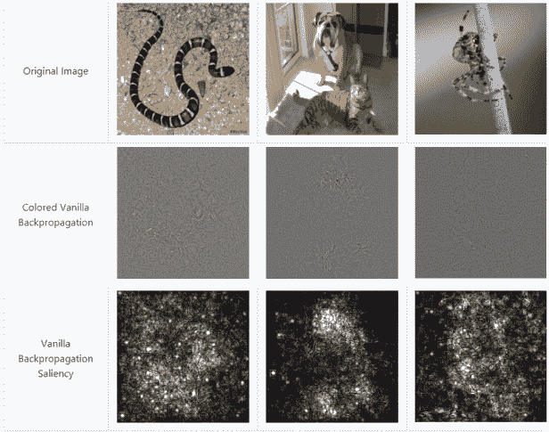

上面，“彩色香草反向传播”是指用 RGB 颜色通道创建的显著图。“香草反向传播显著性”是将“彩色香草反向传播”图像转换成灰度图像的结果。你可以在[py torch-CNN-visualizations/src/vanilla _ back prop . py](https://github.com/utkuozbulak/pytorch-cnn-visualizations/blob/master/src/vanilla_backprop.py)看到用来创建这些显著图的代码。

# **定义**

谷歌将“显著”定义为“最显著或最重要”“显著图”的概念不限于神经网络。显著图是图像的任何可视化，其中最显著/最重要的像素被突出显示。有传统的计算机视觉显著性检测算法(如 [OpenCV 显著性 API](https://docs.opencv.org/3.0-beta/modules/saliency/doc/saliency.html) & [教程](https://www.pyimagesearch.com/2018/07/16/opencv-saliency-detection/))。然而，这篇文章的重点将是从训练过的 CNN 创建的显著图。

# **论文参考**

如果你想阅读为 CNN 引入显著性图的论文，请参见 [Simonyan K，Vedaldi A，Zisserman A,《卷积网络深处:可视化图像分类模型和显著性图》。arXiv 预印本 arXiv:1312.6034。2013 年 12 月 20 日。](https://arxiv.org/abs/1312.6034) *被 1479*引用

显著图的讨论从第 3 页第 3 节“特定图像类别显著可视化”开始(本文还包括一种为每个类创建“规范”映像的单独技术。)

# **回顾反向传播算法**

反向传播算法允许神经网络学习。基于训练示例，反向传播算法确定神经网络中的每个权重增加或减少多少，以便减少损失(即，为了使神经网络“更少出错”)。)它通过求导来做到这一点。经过足够的神经网络迭代，当它看到许多训练示例时变得“错误更少”，网络已经变得“基本正确”，即对于解决你要求它解决的问题是有用的。关于反向传播算法的清晰解释，见[这篇文章](https://mattmazur.com/2015/03/17/a-step-by-step-backpropagation-example/)。

显著图有时被称为“反向传播”，因为它们是使用反向传播计算的导数的可视化。然而，显著图不用于训练网络。显著图是在网络完成训练之后计算的。

# **显著图的用途**

显著图方法的目的是向已经训练好的分类 CNN 查询特定图像中特定类别的空间支持度，*，即*“在没有任何显式位置标签的情况下，找出猫在猫照片中的位置。”

# **简单线性例子**

Simonyan 等人从一个简单的线性例子开始，这个例子激发了显著图。首先，一些符号:

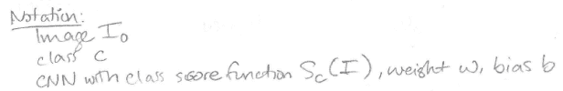

使用这种符号，我们可以将显著性图的目的重新表述如下:

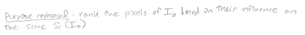

最后，这里是 Simonyan 等人的简单线性示例的总结，其中线性分类模型的每个权重表示相应图像像素在分类任务中的重要性:

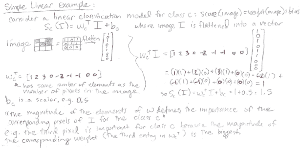

本质上，具有较大幅度的权重对最终分类分数具有更大的影响，并且如果模型表现合理，则我们期望大幅度的重要权重对应于图像的相关部分，*例如*对应于猫图像中的猫。

# **CNN 举例**

不幸的是，CNN 是一个高度非线性的得分函数，所以上面简单的线性例子并不直接适用。然而，我们仍然可以通过进行以下操作来利用类似的推理:让我们使用图像邻域中的线性函数来近似 CNN 的非线性评分函数。作者将这种线性近似框架为一阶泰勒展开式:

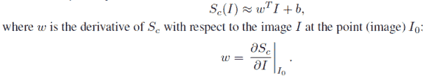

## **泰勒级数兔子洞**

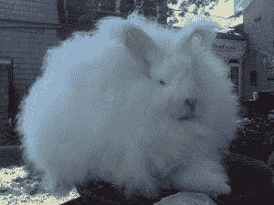

一只巨大的安哥拉兔

根据[维基百科](https://en.wikipedia.org/wiki/Taylor_series)，

> *泰勒级数是将函数表示为无穷多个项的和，这些项是根据函数在单个点的导数的值计算的。[……]在实数或复数处无限可微的实值或复值函数* f(x) *的泰勒级数* a *是幂级数*

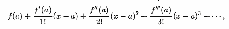

*   分子的解释:回想一下, *f* 后面的撇表示导数。 *f* 是函数本身， *f'* 是一阶导数， *f"'* 是三阶导数， *f""""'* 是九阶导数。
*   分母的解释:回想一下数字后面的感叹号，比如 5！，表示一个[阶乘](https://en.wikipedia.org/wiki/Factorial)，计算方式为*例如* 5！= 5 x 4 x 3 x 2 x 1。
*   与 CNN 的连接:在 CNN 的情况下，函数 *f()* 是训练好的 CNN 本身， *a* 是感兴趣的特定图像， *x* 是代表 CNN 输入的变量，即任意图像。

泰勒级数很酷，因为它意味着如果你知道一个函数的值和该函数在某一点的导数，那么你可以使用泰勒级数近似来估计该函数在任何其他点的值。例如，您可能知道函数及其导数在 a = 6 处的值，因此您可以使用泰勒级数近似来估计函数在 x = 10，369 处的值。

在考虑了本文上下文中的泰勒级数之后，我不认为理解显著图的最佳方式是考虑泰勒级数。为了帮助其他人，我把我的想法写在这里:

这篇论文说他们正在使用“一阶泰勒展开”，从技术上讲[应该是这个](http://www.math.smith.edu/~rhaas/m114-00/chp4taylor.pdf):

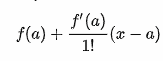

即包括 *f(a)* ，在这种情况下，这将是应用于我们感兴趣的特定图像的 CNN。然而，在显著图的实际实现中，似乎根本没有使用 CNN 的计算输出 *f(a)* 。相反，只使用一阶导数:

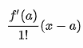

即使在那里，在他们的解释中也只关注了片段*f’(a)(x)*:

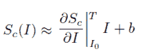

其中 *a* = *I_zero，*f’(a)为导数

并且 *x* 是 *I.*

此外，在实践中，实际上只有导数片用于制作显著图！衍生部分是显著图:

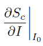

即，显著性图是分数相对于图像变量的导数的视觉表示，在点(特定图像)I_zero 处评估。

## **思考显著图**

为什么我们要计算分数相对于图像的导数？作者解释说，

> *使用类得分导数计算特定于图像的类显著性的另一种解释是，导数的大小指示哪些像素需要改变最少以影响类得分最多。人们可以预期这些像素对应于图像中的物体位置。*

因此，如果我们有一张猫的图像，它在类别“猫”中得分很高，我们想知道猫图像中的哪些像素对于计算类别“猫”的高分很重要我们对类别“猫”的分数相对于我们特定的猫图像进行求导。具有大幅度导数的像素是对类别“猫”的分数具有大影响的像素，因此，除非神经网络“欺骗”并查看图像中的非猫线索来分类“猫”，否则这些重要像素对应于猫的位置。因此，显著图实现了一种弱监督的对象定位形式:我们可以从只在类别标签上训练的模型中获得对象的近似位置。

## **计算显著图的步骤**

(参考:论文第 4 页顶部)

(1)找到分数相对于图像的导数。

(2)对于由 m×n 个像素组成的图像，导数是一个 m×n 矩阵。取导数矩阵每个元素的绝对值。

(3)如果您有一个三通道彩色图像(RGB ),则取每个像素处三个颜色通道导数值的最大值。

(3)绘制绝对值导数矩阵，就像它是一幅图像一样，这就是你的显著图。

这里是用于计算显著图的 Pytorch 代码。它缺少一个显式的“绝对值”步骤，但结果看起来应该有些相似。

下面是 [Tensorflow 代码](https://github.com/tensorpack/tensorpack/blob/master/examples/Saliency/saliency-maps.py)(下面猫图来源)；在代码的第 83 行，你可以看到步骤(2)中导数矩阵的绝对值。

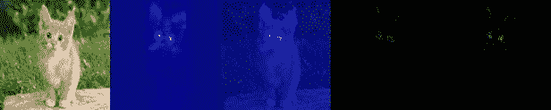

你可以在论文的第 5 页和第 6 页看到更多显著性图的可视化(图 2 和图 3)。

# **结论**

显著图可用于突出显示图像中对象的大致位置。显著图是类别分数相对于输入图像的导数。

显著性图是导向显著性/导向反向传播的前身，而导向反向传播又用于导向 Grad-CAM 中。这两种技术都将是未来文章的主题。

## **关于特色图片**

特色形象是一只兔子，*。[“下兔子洞”这个短语来源于 Lewis Carrol 的儿童读物*爱丽丝漫游奇境记*](https://grammarist.com/idiom/down-the-rabbit-hole/) 。*

**原载于 2019 年 6 月 21 日*[*http://glassboxmedicine.com*](https://glassboxmedicine.com/2019/06/21/cnn-heat-maps-saliency-backpropagation/)*。**